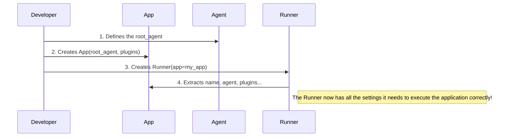

# Chapter 1: App

Welcome to the Agent Development Kit (ADK)! We're excited to help you build your first intelligent, agentic application. In this first chapter, we'll start at the very top with the most fundamental concept: the `App`.

### What's the Big Idea?

Imagine you're building a company of AI workers (we call them "agents"). You have specialized agents for different tasks: one for customer service, one for data analysis, and another for scheduling.

You quickly run into a problem: How do you set company-wide rules?
*   How do you log every agent's activity in a consistent way?
*   How do you give every agent access to a shared company database?
*   How do you manage a shared memory cache so agents don't have to re-learn the same things?

Doing this for each agent individually would be repetitive and messy. This is where the `App` comes in.

The `App` is the top-level blueprint for your entire agentic application. Think of it as the **main headquarters building** that houses all your agents and defines company-wide policies. While an [Agent](03_agent__baseagent___llmagent__.md) is a single worker, the `App` defines the entire operational environment they work in.

### Building Your First App

Let's build a simple `App`. Our application will have one main agent that can roll dice. We also want a "company policy" to count every time this agent is used.

#### Step 1: Define Your Main Agent

First, we need our primary worker. We'll define a `root_agent` that knows how to roll dice. Don't worry about the details of creating an agent just yet; we'll cover that in [Chapter 3](03_agent__baseagent___llmagent__.md). For now, just think of this as defining our first employee.

```python
# We'll import the Agent class
from google.adk import Agent

# Define our main agent
root_agent = Agent(
    model='gemini-2.0-flash',
    name='hello_world_agent',
    description='An agent that can roll dice.',
    # ... other configuration details ...
)
```
This code creates an instance of an `Agent` named `hello_world_agent`. This is the main entry point for our application.

#### Step 2: Define a Company-Wide "Plugin"

Next, we want a "policy" that applies to everyone in our headquarters. In ADK, these are called **Plugins**. Let's create a simple plugin that prints a message every time an agent is about to run.

```python
from google.adk.plugins.base_plugin import BasePlugin

class CountInvocationPlugin(BasePlugin):
  """A custom plugin that counts agent invocations."""
  def __init__(self):
    self.agent_count = 0

  async def before_agent_callback(self, **kwargs):
    """This runs right before any agent starts working."""
    self.agent_count += 1
    print(f'[Plugin] An agent is about to run! Total runs: {self.agent_count}')
```
This `CountInvocationPlugin` has a special method, `before_agent_callback`, that the ADK framework will automatically call before any agent in our `App` does its work.

#### Step 3: Assemble Everything with `App`

Now, let's bring it all together in our main headquarters building: the `App`. We create an `App` instance, give it a name, assign our `root_agent` as the primary worker, and install our `CountInvocationPlugin` as a company-wide policy.

```python
from google.adk.apps import App

# Create the App instance
app = App(
    name='hello_world_app',
    root_agent=root_agent,
    plugins=[
        CountInvocationPlugin(),
    ],
)
```
And that's it! We've defined our application. We have:
1.  A **name** (`hello_world_app`) to identify it.
2.  A **`root_agent`** to handle incoming tasks.
3.  A list of **`plugins`** that apply globally to all agents within the app.

By putting the `CountInvocationPlugin` in the `App`, we ensure that even if we add hundreds of other agents later, the counting policy will automatically apply to all of them. This centralized control is the superpower of the `App`.

### Under the Hood: How Does It Work?

You might be wondering, "Okay, I've defined this `App` blueprint. How does it actually *do* anything?"

The `App` itself is just a configuration object—a container for your settings. To bring it to life, you hand it over to a [Runner](02_runner_.md), which is the engine that executes your application.

Here's a simple step-by-step of what happens:



When you initialize a `Runner` (which we'll explore in the next chapter), it looks inside the `App` object you gave it and pulls out all the necessary components: the `root_agent` to run, the list of `plugins` to activate, and other global settings like caching rules.

Let's peek at the source code. The `App` class is a straightforward data structure defined in `src/google/adk/apps/app.py`.

```python
# From src/google/adk/apps/app.py

class App(BaseModel):
  """Represents an LLM-backed agentic application."""
  name: str
  root_agent: BaseAgent
  plugins: list[BasePlugin] = Field(default_factory=list)
  # ... other optional configurations ...
```
As you can see, it's designed to hold the `name`, `root_agent`, and `plugins` we just configured.

Then, inside the [Runner](02_runner_.md) class (from `src/google/adk/runners.py`), the initialization logic simply unpacks your `App` object.

```python
# Simplified logic from src/google/adk/runners.py

class Runner:
    def __init__(self, *, app: App):
        # The Runner pulls configuration directly from the App object
        self.app_name = app.name
        self.agent = app.root_agent
        self.plugins = app.plugins
        self.context_cache_config = app.context_cache_config
        # ... and so on
```
This separation is key: the `App` defines **what** your application is, and the `Runner` defines **how** it runs.

### Conclusion

You've just learned the most important organizing principle in ADK: the `App`. It's the central headquarters for your entire agentic system, allowing you to define a primary `root_agent` and set global policies through `plugins`. This structure keeps your project organized, scalable, and easy to manage.

Now that we have a blueprint for our application, the next logical question is: how do we turn on the lights and get our agents working? For that, we need the engine that powers the app.

Let's move on to [Chapter 2: Runner](02_runner_.md).

---

Generated by [AI Codebase Knowledge Builder](https://github.com/The-Pocket/Tutorial-Codebase-Knowledge)