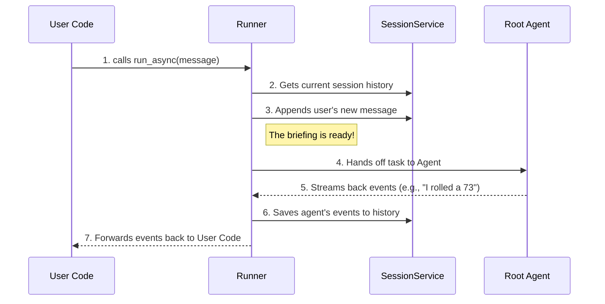

# Chapter 2: Runner

In the [previous chapter](01_app_.md), we designed the blueprint for our agentic application using `App`. We created our company's headquarters, defined the main `root_agent`, and even set a company-wide policy with a `Plugin`. But a blueprint is just a plan. An office building is empty without a manager to turn on the lights, direct employees, and manage day-to-day operations.

How do we bring our `App` blueprint to life? We need an engine. In ADK, that engine is the `Runner`.

### What's the Big Idea?

The `Runner` is the project manager for your team of agents. It's the operational engine that takes a user's request, kicks off the entire workflow, and manages everything until a response is delivered.

Imagine you've given your project manager (the `Runner`) the company blueprint (the `App`). Your job is to simply give the manager a new task. The manager then takes care of everything else:
*   They find the right employee (`root_agent`) to start the task.
*   They keep a detailed log of the entire conversation ([Session](08_session_.md)).
*   They provide shared resources (like a database or file storage) to the agents.
*   They ensure all messages ([Events](09_event_.md)) between you and the agents are delivered correctly.

Whenever you want to interact with your agent application, you'll always go through a `Runner`. It’s the single point of contact that makes everything happen.

### Bringing Your App to Life

Let's continue with our dice-rolling application from Chapter 1. We have our `app` object defined, which contains our `root_agent` and `CountInvocationPlugin`. Now, let's create a `Runner` to make it work.

#### Step 1: Create a Runner

ADK provides a simple, built-in runner for getting started called `InMemoryRunner`. It handles all the state and history in your computer's memory, so you don't need to set up any databases.

We'll import `InMemoryRunner` and give it the `app` we created in the last chapter.

```python
from google.adk.runners import InMemoryRunner

# Assuming 'app' is the App object we built in Chapter 1
runner = InMemoryRunner(app=app)
```

That's it! By passing our `app` object to the `Runner`, we've handed the project manager the company blueprint. The `runner` now knows everything it needs: the app's name, the `root_agent` to use, and any `plugins` to activate.

#### Step 2: Start a Conversation

Before we can chat with our agent, we need a way to track the conversation. The `Runner` helps us do this by creating a [Session](08_session_.md). Think of a session as a unique chat window or a conversation thread.

```python
# A session needs a user identifier, let's just use 'test_user'
user_id = 'test_user'

# Create a new session for our app and user
session = await runner.session_service.create_session(
    app_name=app.name, user_id=user_id
)
```
This code asks the `runner`'s built-in `session_service` to create a new, empty conversation log for `'test_user'`. We get back a `session` object that contains a unique ID.

#### Step 3: Send a Message

Now for the fun part! Let's send a message to our agent. We do this using the `runner.run_async()` method. This is the main function you'll use to interact with your application.

```python
from google.genai import types

# The message we want to send
user_message = types.Content(role='user', parts=[
    types.Part.from_text(text='Roll a die with 100 sides')
])

# Ask the runner to process the message
async for event in runner.run_async(
    user_id=user_id,
    session_id=session.id,
    new_message=user_message,
):
    # Print out what the agent says
    if event.content.parts:
        print(f'Agent says: {event.content.parts[0].text}')

```

When we run this, we'll see our `CountInvocationPlugin` from Chapter 1 fire, and then we'll get a response from the agent.

**Example Input and Output:**

*   **Input:** "Roll a die with 100 sides"
*   **Output:**
    ```text
    [Plugin] An agent is about to run! Total runs: 1
    Agent says: Okay, rolling a D100... you got 73!
    ```

The `runner.run_async` method takes the `user_id`, the specific `session_id` for our conversation, and our `new_message`. It streams back [Events](09_event_.md), which could be text responses, tool calls, or status updates. Here, we just print the text part.

### Under the Hood: The Runner's Playbook

What actually happens when you call `run_async`? The `Runner` follows a clear set of steps, like a project manager following a playbook.



1.  **Receive Task:** Your code calls `runner.run_async()` with the user's message.
2.  **Get Context:** The `Runner` contacts its `SessionService` to load the history of the current conversation.
3.  **Update History:** It adds the new user message to the history.
4.  **Delegate to Agent:** The `Runner` passes the entire conversation history and other necessary resources to the `root_agent` and tells it to start working.
5.  **Receive Updates:** The `Agent` processes the request and sends back a stream of [Event](09_event_.md) objects. This could be a simple text response or a request to use a tool.
6.  **Log Progress:** As the `Runner` receives these events, it saves them to the session history via the `SessionService`.
7.  **Report Back:** The `Runner` passes those same events back to your code so you can display the results to the user.

Let's look at the code that makes this happen. In `src/google/adk/runners.py`, the `Runner`'s `__init__` method simply unpacks the `App` object you give it.

```python
# Simplified logic from src/google/adk/runners.py

class Runner:
    def __init__(self, *, app: App):
        # The Runner pulls configuration directly from the App object
        self.app_name = app.name
        self.agent = app.root_agent
        self.plugins = app.plugins
        # ... and so on
```
This confirms the relationship: `App` is the *what*, and `Runner` is the *how*.

Then, the `run_async` method orchestrates the workflow we described above.

```python
# Highly simplified logic from src/google/adk/runners.py

class Runner:
    async def run_async(self, user_id, session_id, new_message):
        # 1. Get the session (conversation history)
        session = await self.session_service.get_session(...)

        # 2. Set up the "briefing packet" for the agent
        invocation_context = self._setup_context_for_new_invocation(...)

        # 3. Hand off to the agent and get events back
        async for event in self.agent.run_async(invocation_context):
            # 4. Save the event to the session
            await self.session_service.append_event(session, event)
            # 5. Yield the event back to the user's code
            yield event
```
The `invocation_context` is like a complete briefing packet that the `Runner` prepares for the [Agent](03_agent__baseagent___llmagent__.md). It contains the session history, access to shared services, and the user's latest message—everything the agent needs to do its job.

### Conclusion

You've now learned how to power up your application with a `Runner`. The `Runner` is the essential engine that executes the `App` blueprint. It acts as your project manager, handling user requests, managing conversation history via the [Session](08_session_.md), and directing the workflow of your agents.

We have the application blueprint (`App`) and the engine to run it (`Runner`). Now it's time to dive into the heart of our system: the workers themselves.

Let's learn how to build our first intelligent worker in [Chapter 3: Agent (BaseAgent / LlmAgent)](03_agent__baseagent___llmagent__.md).

---

Generated by [AI Codebase Knowledge Builder](https://github.com/The-Pocket/Tutorial-Codebase-Knowledge)