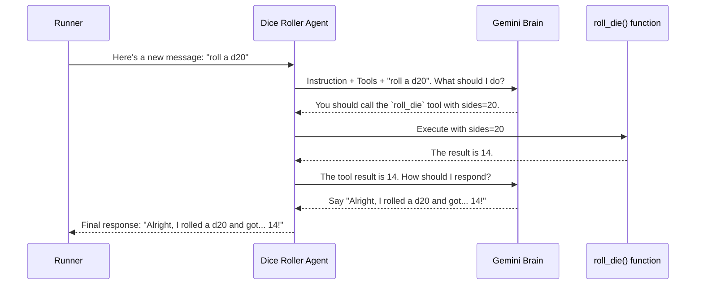

# Chapter 3: Agent (BaseAgent / LlmAgent)

In the [previous chapter](02_runner_.md), we learned how to use a `Runner` to power up our `App` and handle conversations. We have the company headquarters (`App`) and a project manager (`Runner`). Now, it's time to hire our first intelligent employee. This employee is the core worker of our entire system: the `Agent`.

### What's the Big Idea?

Think of an `Agent` as a specialized worker in a company. It's the most fundamental building block in the ADK. Just like a real-world employee, each agent has:

*   A **job description** (`instruction`): A clear set of directions on what to do and how to behave.
*   A set of **skills** (`tools`): Specific abilities, like looking up information, calculating numbers, or sending emails.
*   The ability to **collaborate** (`sub_agents`): They can work with other agents to solve more complex problems.

The most common and powerful type of agent is the `LlmAgent`. This agent is powered by a Large Language Model (like Gemini), which acts as its "brain." This brain allows the `LlmAgent` to reason, understand natural language, and intelligently decide which of its tools to use to accomplish a task given by a user.

### Building Your First Agent

Let's build an agent whose only job is to roll dice. This is a simple but perfect example to see all the core components in action.

#### Step 1: Define the Agent's Skill (A "Tool")

First, our agent needs the *ability* to roll a die. In ADK, we give agents skills by providing them with `tools`. A tool can be as simple as a Python function.

Let's write a function that simulates rolling a die.

```python
import random

def roll_die(sides: int) -> int:
  """Rolls a die with a given number of sides."""
  return random.randint(1, sides)
```
This simple `roll_die` function is the one and only "skill" our agent will have. Don't worry too much about the details of tools yet; we'll cover them fully in [Chapter 5](05_tool__basetool___functiontool__.md).

#### Step 2: Create the `LlmAgent` Instance

Now we'll create our `LlmAgent`. We'll give it a brain (a Gemini model), a name, a job description (`instruction`), and the `roll_die` skill we just defined.

In ADK, `Agent` is a convenient shortcut for the `LlmAgent` class.

```python
from google.adk import Agent

dice_roller_agent = Agent(
    # The "brain" for our agent
    model='gemini-2.0-flash',

    # A unique name for our worker
    name='dice_roller_agent',

    # The job description for the LLM
    instruction='You are a friendly dice roller. When a user asks you to roll a die, you MUST use the roll_die tool.',

    # The list of skills the agent possesses
    tools=[roll_die],
)
```
Let's break this down:
*   `model`: We're telling our agent to use the `gemini-2.0-flash` model as its reasoning engine.
*   `name`: Just like an employee's name tag, this helps us identify the agent.
*   `instruction`: This is the crucial job description. We're telling the LLM exactly how it should behave. The word "MUST" is important; it strongly guides the model to use the tool instead of making up a number.
*   `tools`: We pass a list containing our `roll_die` function. The agent now knows it has this skill available.

#### Step 3: Put Your Agent to Work

Now, let's connect this agent to the `App` and `Runner` concepts from the previous chapters. Our `dice_roller_agent` will be the `root_agent` for our application.

```python
from google.adk.apps import App
from google.adk.runners import InMemoryRunner
# Assume dice_roller_agent is defined as above

# 1. Create the App blueprint with our agent as the main worker
app = App(name='dice_roller_app', root_agent=dice_roller_agent)

# 2. Create the Runner engine to bring the app to life
runner = InMemoryRunner(app=app)

# 3. Send a message to the agent!
# ... (code to create session and send message) ...
```
When a user sends the message "please roll a 20-sided die", the `LlmAgent` will follow its instructions, use its `roll_die` tool, and produce a result.

**Example Input and Output:**

*   **Input:** "please roll a 20-sided die"
*   **Output:** "Alright, I rolled a d20 and got... 14!" (The number will be random)

### Under the Hood: The Agent's Thought Process

So, what actually happens when our `dice_roller_agent` gets a request? It's not just magic; the `LlmAgent` follows a logical, multi-step process.

1.  **Briefing:** The [Runner](02_runner_.md) gives the agent the user's message ("roll a d20") and any previous conversation history.
2.  **Reasoning:** The agent's LLM brain wakes up. It reads its `instruction` ("I am a dice roller... I MUST use the tool") and looks at the list of available `tools` (it sees the `roll_die` function and its description).
3.  **Planning:** The LLM compares the user's request to its instructions and tools. It thinks, "The user wants to roll a die. My instructions say I *must* use the `roll_die` tool for this. The tool needs a number of `sides`. The user said '20-sided'. Therefore, I should call the `roll_die` tool with `sides=20`."
4.  **Tool Use:** The ADK framework sees the LLM's decision and executes the actual Python function: `roll_die(sides=20)`. Let's say the function returns `14`.
5.  **Observation:** This result (`14`) is sent back to the LLM. The LLM is now informed, "The `roll_die` tool was called and the result was 14."
6.  **Response Generation:** The LLM, now knowing the outcome, formulates a friendly, human-readable response based on its "friendly dice roller" personality.
7.  **Final Answer:** The agent sends the final message ("Alright, I rolled a d20 and got... 14!") back to the [Runner](02_runner_.md), who delivers it to the user.

This entire interaction can be visualized like this:



### `BaseAgent` vs. `LlmAgent`

You might see two types of agents mentioned in the code: `BaseAgent` and `LlmAgent`. What's the difference?

*   **`BaseAgent`**: This is the abstract "blueprint" for any agent. Think of it as a generic job title like "Employee". It defines the basic things any agent must have, like a `name` and a `run_async` method. It doesn't know *how* to do the job. You can find its definition in `src/google/adk/agents/base_agent.py`.

    ```python
    # From src/google/adk/agents/base_agent.py
    class BaseAgent(BaseModel):
      """Base class for all agents in Agent Development Kit."""
      name: str
      description: str = ''
      sub_agents: list[BaseAgent] = Field(default_factory=list)
      # ... other common properties and methods ...
    ```

*   **`LlmAgent`**: This is the concrete, intelligent worker. It's a specific *type* of `BaseAgent` that has an LLM "brain". Think of it as the specific job role "Data Scientist with AI skills". It inherits everything from `BaseAgent` and adds the properties we used, like `model`, `instruction`, and `tools`. This is the agent you will use almost all the time. Its code is in `src/google/adk/agents/llm_agent.py`.

    ```python
    # From src/google/adk/agents/llm_agent.py
    class LlmAgent(BaseAgent):
      """LLM-based Agent."""
      model: Union[str, BaseLlm] = ''
      instruction: Union[str, InstructionProvider] = ''
      tools: list[ToolUnion] = Field(default_factory=list)
      # ... and many other LLM-specific features ...
    ```

### Conclusion

You've just built your first intelligent worker! The `Agent` is the heart of the ADK, responsible for carrying out tasks. The `LlmAgent`, with its powerful LLM brain, can understand instructions, reason about problems, and use tools to get the job done.

We've seen that the agent's brain is an LLM, like Gemini. But how does the ADK handle different models? What if you wanted to use a different version of Gemini or another model entirely? That's where the next concept comes in.

Let's explore how ADK provides a consistent way to work with any language model in [Chapter 4: LLM Model Abstraction (BaseLlm)](04_llm_model_abstraction__basellm__.md).

---

Generated by [AI Codebase Knowledge Builder](https://github.com/The-Pocket/Tutorial-Codebase-Knowledge)