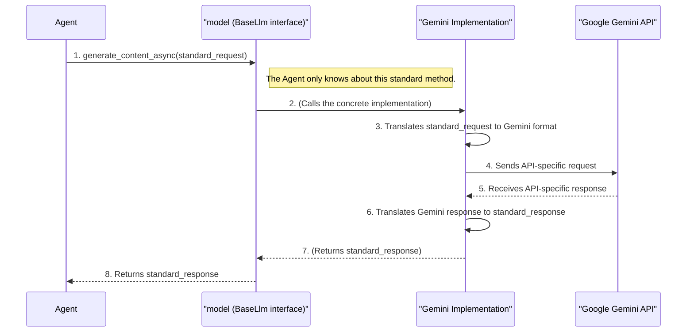

# Chapter 4: LLM Model Abstraction (BaseLlm)

In the [previous chapter](03_agent__baseagent___llmagent__.md), we built our first `LlmAgent`. We gave it a brain by simply setting `model='gemini-2.0-flash'`. But what if you wanted to try a different brain? What if a new, amazing model from another company is released, and you want your agent to use that instead?

Rewriting your agent every time you switch models would be a nightmare. This is the problem that ADK's LLM model abstraction solves.

### What's the Big Idea?

Imagine you have a manager (your `Agent`) who needs to give instructions to different specialists (the LLMs).
*   One specialist, Gemini, speaks English.
*   Another, Claude, speaks French.
*   A third, from OpenAI, speaks German.

If your manager only speaks English, they can't work with the French or German specialists. This is inefficient.

The `BaseLlm` class is like hiring a **universal translator**. The manager gives instructions in a single, standard company language. The translator then takes those instructions and translates them perfectly for whichever specialist is on duty.

The `BaseLlm` class is the "standard language" (the interface), and concrete classes like `Gemini`, `Claude`, and `LiteLlm` are the specific "translators" that know how to talk to each model's API. This means your `Agent` code stays the same, no matter which AI brain you plug in.

### Switching Brains: A Practical Example

Let's see how easy it is to switch our agent from using Google's Gemini to Anthropic's Claude, and then to an OpenAI model.

#### Step 1: The Default (Gemini)

As we saw in the last chapter, using Gemini is as simple as providing a model name string.

```python
from google.adk import Agent

agent_gemini = Agent(
    model='gemini-2.0-flash',
    instruction='You are a helpful assistant.',
    # ... other agent parameters ...
)
```
Behind the scenes, ADK sees the `'gemini-...'` string and automatically creates a `Gemini` "translator" object for you.

#### Step 2: Switching to Claude

Now, let's say we want to try Anthropic's Claude model. All we need to do is import the `Claude` translator and pass an instance of it to our agent.

```python
from google.adk import Agent
from google.adk.models import Claude

agent_claude = Agent(
    model=Claude(model='claude-3-5-sonnet-v2@20241022'),
    instruction='You are a helpful assistant.',
    # ... other agent parameters ...
)
```
Look closely! The only thing that changed is the `model` parameter. We swapped a string for a `Claude` object. The `Agent`'s logic doesn't change at all. It knows how to work with the `Claude` object because it follows the same "universal translator" rules defined by `BaseLlm`.

#### Step 3: Switching to OpenAI via LiteLLM

What about models from other providers, like OpenAI's GPT-4? ADK includes a powerful `LiteLlm` translator, which can communicate with over 100 different models.

```python
from google.adk import Agent
from google.adk.models import LiteLlm

# NOTE: You must have OPENAI_API_KEY set in your environment
agent_openai = Agent(
    model=LiteLlm(model='gpt-4o'),
    instruction='You are a helpful assistant.',
    # ... other agent parameters ...
)
```
Again, the `Agent` code remains the same. We just plugged in a different translator. This flexibility is the core benefit of the `BaseLlm` abstraction.

### Under the Hood: The Translator at Work

How does this "translation" actually happen? Let's follow a request from the `Agent` to the final model API.

1.  **Standard Request:** The [Agent](03_agent__baseagent___llmagent__.md) has a task. It bundles up the conversation history, its instructions, and its tools into a standard ADK request object. It then calls the `generate_content_async()` method on whatever `model` object it was given. It doesn't know or care if it's a `Gemini` or `Claude` object; it only knows it has this standard method.
2.  **Translation to Specifics:** The specific model implementation (e.g., the `Gemini` class) receives this standard request. Now, its special job begins. It converts the standard request into the exact JSON format that the Google Gemini API requires. If it were the `Claude` class, it would translate it into the format the Anthropic API requires.
3.  **API Call:** The implementation makes the actual network call to the model's API endpoint.
4.  **Translation Back:** The model provider (e.g., Google) sends back a response in its own unique format.
5.  **Standard Response:** The `Gemini` class takes this unique response and translates it *back* into a standard ADK `LlmResponse` object.
6.  **Return to Agent:** This standard `LlmResponse` is returned to the `Agent`. The `Agent` can now understand the result perfectly, because it's in the standard "company language" it expects.

This entire process ensures the `Agent` is completely isolated from the messy details of different model APIs.



#### Diving into the Code

The "contract" that all translators must follow is defined in `src/google/adk/models/base_llm.py`.

```python
# From src/google/adk/models/base_llm.py

class BaseLlm(BaseModel):
  """The BaseLLM class."""
  model: str

  @abstractmethod
  async def generate_content_async(
      self, llm_request: LlmRequest, stream: bool = False
  ) -> AsyncGenerator[LlmResponse, None]:
    """The universal 'talk' method all model classes must have."""
    raise NotImplementedError(...)
```
This `BaseLlm` class is an abstract blueprint. It states that any class wanting to be a "model translator" MUST provide an `async` method called `generate_content_async`.

Now, let's peek at a real implementation in `src/google/adk/models/google_llm.py`.

```python
# Simplified from src/google/adk/models/google_llm.py

from .base_llm import BaseLlm

class Gemini(BaseLlm):
  """Integration for Gemini models."""

  async def generate_content_async(
      self, llm_request: LlmRequest, stream: bool = False
  ) -> AsyncGenerator[LlmResponse, None]:
    # 1. This is where the translation to the Gemini API format happens.
    # ...
    # 2. This is the actual call to the Gemini API.
    response = await self.api_client.aio.models.generate_content(...)
    # 3. This is where the translation back to the standard ADK format happens.
    yield LlmResponse.create(response)
```
The `Gemini` class inherits from `BaseLlm` and provides the required `generate_content_async` method. Inside this method is all the logic specific to talking to Google's Gemini models. The `Claude` and `LiteLlm` classes look similar but contain the specific logic for their respective APIs.

Finally, the magic that converts a string like `'gemini-2.0-flash'` into a `Gemini` object is handled by the `LLMRegistry` in `src/google/adk/models/registry.py`. It keeps a list of known model patterns and the classes that handle them.

### Conclusion

You've now learned about one of the most powerful architectural concepts in the ADK: the `BaseLlm` abstraction. It acts as a universal translator, decoupling your agent's logic from the specifics of any single Large Language Model. This makes your agent code incredibly flexible, portable, and ready for the future, allowing you to swap out AI brains with minimal effort.

Our agent now has a flexible brain. But a brain is not enough—it needs hands to interact with the world. How do we give our agent practical skills and the ability to perform actions?

Let's learn how to equip our agent with abilities in [Chapter 5: Tool (BaseTool / FunctionTool)](05_tool__basetool___functiontool__.md).

---

Generated by [AI Codebase Knowledge Builder](https://github.com/The-Pocket/Tutorial-Codebase-Knowledge)