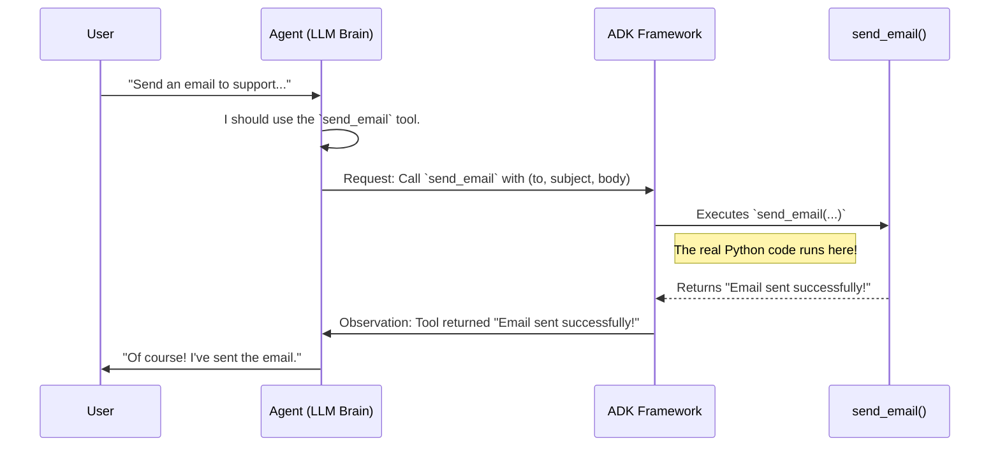

# Chapter 5: Tool (BaseTool / FunctionTool)

In the [previous chapter](04_llm_model_abstraction__basellm__.md), we learned how to give our agent a flexible "brain" with the `BaseLlm` abstraction. A brain is great for thinking, but to get real work done, our agent needs "hands" to interact with the world.

How do we give our agent the ability to do things beyond just generating text? How can it look up live information, send an email, or query a database? We give it **Tools**.

### What's the Big Idea?

A `Tool` is a specific skill or capability you give to an agent. Think of it like a hammer for a carpenter or a calculator for an accountant. It's a specialized piece of equipment that allows the agent to perform actions.

Without tools, an [Agent](03_agent__baseagent___llmagent__.md) is just a chatbot, limited to the knowledge it was trained on. By equipping an agent with tools, you transform it into a powerful assistant that can:
*   Search the web for live weather updates (`GoogleSearchTool`).
*   Query a corporate database (`BigQueryToolset`).
*   Run custom Python code to perform any action you can imagine.

This chapter will teach you how to create your very own custom tool from a simple Python function.

### Building Your First Tool: An Email Sender

Let's build a tool that allows our agent to "send" an email. For this beginner's example, our tool won't *actually* send an email; it will just print the details to the console. This lets us focus on how tools work without worrying about email server configurations.

#### Step 1: Define the Skill as a Python Function

At its core, a tool is just a piece of code that does something. The simplest way to define a tool in ADK is by writing a standard Python function. Let's create a function that takes an email's recipient, subject, and body.

```python
def send_email(to: str, subject: str, body: str) -> str:
  """Sends an email to a recipient.

  Args:
    to: The email address of the recipient.
    subject: The subject line of the email.
    body: The content of the email.
  """
  print(f"--> Sending email to {to}...")
  print(f"--> Subject: {subject}")
  print(f"--> Body: {body}")
  return "Email sent successfully!"
```
This is a regular Python function. Notice two important things:
1.  **Type Hints:** We use type hints like `to: str` and `-> str`. These help the agent's LLM brain understand what kind of data the function expects and what it returns.
2.  **Docstring:** The docstring is crucial! The LLM reads this description to understand *what the tool does*. A good description helps the agent know when to use this tool.

#### Step 2: Wrap the Function with `FunctionTool`

Now we need to package this Python function into a format the agent can understand. ADK provides a handy wrapper called `FunctionTool` for exactly this purpose.

```python
from google.adk.tools import FunctionTool

# Wrap our Python function to turn it into an ADK Tool
email_tool = FunctionTool(func=send_email)
```
That's it! `FunctionTool` automatically inspects our `send_email` function. It uses the function's name (`send_email`), its docstring ("Sends an email..."), and its parameters (`to`, `subject`, `body`) to create a complete tool definition that the agent's brain can use.

#### Step 3: Give the Tool to Your Agent

Finally, we equip an [Agent](03_agent__baseagent___llmagent__.md) with our new tool by passing it into the `tools` list during creation.

```python
from google.adk import Agent

email_agent = Agent(
    model='gemini-2.0-flash',
    instruction='You are a helpful assistant that can send emails.',
    tools=[
        email_tool,  # <-- We add our new tool here!
    ]
)
```
Our `email_agent` is now fully equipped with the `send_email` skill. When a user asks it to send an email, it will know exactly what to do.

**Example Input and Output:**

Let's imagine running this agent with the [Runner](02_runner_.md) from Chapter 2.
*   **User Input:** "Hey, can you send an email to support@example.com? The subject is 'Login Issue' and the body should say 'I cannot log into my account.'"
*   **Console Output (from our function):**
    ```text
    --> Sending email to support@example.com...
    --> Subject: Login Issue
    --> Body: I cannot log into my account.
    ```
*   **Agent's Final Response:** "Of course! I've sent the email about the login issue to support@example.com."

The agent successfully understood the request, used the tool, and confirmed the action to the user.

### Under the Hood: The Tool-Using Process

How did the agent know to call our specific Python function? It's a multi-step "thought process" orchestrated by the `LlmAgent` and the ADK framework.

1.  **Understanding the Goal:** The agent's LLM brain receives the user's request ("send an email...").
2.  **Tool Selection:** The LLM looks at its list of available tools. It reads the name (`send_email`) and description ("Sends an email to a recipient.") of our `email_tool`. It realizes this tool is a perfect match for the user's request.
3.  **Argument Extraction:** The LLM's brain carefully reads the user's message and extracts the necessary arguments for the function: `to='support@example.com'`, `subject='Login Issue'`, and `body='I cannot log into my account.'`.
4.  **Tool Call Request:** The LLM doesn't run the code itself. Instead, it outputs a special, structured message saying, "I want to call the `send_email` tool with these specific arguments."
5.  **Execution:** The ADK framework intercepts this special message. It finds the `email_tool` in its list, and calls the actual `send_email` Python function with the arguments provided by the LLM.
6.  **Observation:** Our Python function runs and returns the string `"Email sent successfully!"`.
7.  **Final Response:** The ADK framework sends this return value back to the LLM as an "observation." The LLM, now knowing the tool ran successfully, generates its final, friendly response to the user.

This entire flow ensures a safe and structured way for the LLM to use tools without executing arbitrary code directly.



#### Diving into the Code: `BaseTool` and `FunctionTool`

You might be wondering what makes a `FunctionTool` a "Tool". It's because it follows a contract defined by the `BaseTool` class.

*   **`BaseTool`**: This is the abstract blueprint for all tools in ADK, found in `src/google/adk/tools/base_tool.py`. It's like a job description for being a tool. It declares that any tool must have properties like a `name` and `description`, and methods like `run_async` to execute the tool's logic.

    ```python
    # Simplified from src/google/adk/tools/base_tool.py
    class BaseTool(ABC):
      """The base class for all tools."""
      name: str
      description: str

      async def run_async(
          self, *, args: dict[str, Any], tool_context: ToolContext
      ) -> Any:
        """Runs the tool with the given arguments."""
        raise NotImplementedError(...)
    ```

*   **`FunctionTool`**: This class, found in `src/google/adk/tools/function_tool.py`, is a concrete implementation of `BaseTool`. It's specifically designed to wrap a Python function.

    ```python
    # Simplified from src/google/adk/tools/function_tool.py
    class FunctionTool(BaseTool):
      """A tool that wraps a user-defined Python function."""
      def __init__(self, func: Callable[..., Any]):
        # It automatically gets the name and description from the function
        name = func.__name__
        doc = inspect.cleandoc(func.__doc__)
        super().__init__(name=name, description=doc)
        self.func = func

      async def run_async(self, *, args: dict[str, Any], ...) -> Any:
        # When told to run, it calls the original Python function!
        return self.func(**args)
    ```
    As you can see, `FunctionTool` does the hard work of connecting a simple function to the more complex `BaseTool` structure that the agent system requires.

### Conclusion

You've now learned the most important concept for making agents useful: the `Tool`. You've seen how a `Tool` is a skill that lets an agent interact with the world, and how the `FunctionTool` class makes it incredibly easy to turn any Python function into a skill your agent can use.

Our agent can now have powerful tools, but what if a tool needs to access a secure service, like a private API or a company database? We can't just put passwords and API keys directly in our code. We need a secure way to manage them.

Let's learn how to handle credentials safely in [Chapter 6: Authentication (AuthConfig / CredentialManager)](06_authentication__authconfig___credentialmanager__.md).

---

Generated by [AI Codebase Knowledge Builder](https://github.com/The-Pocket/Tutorial-Codebase-Knowledge)