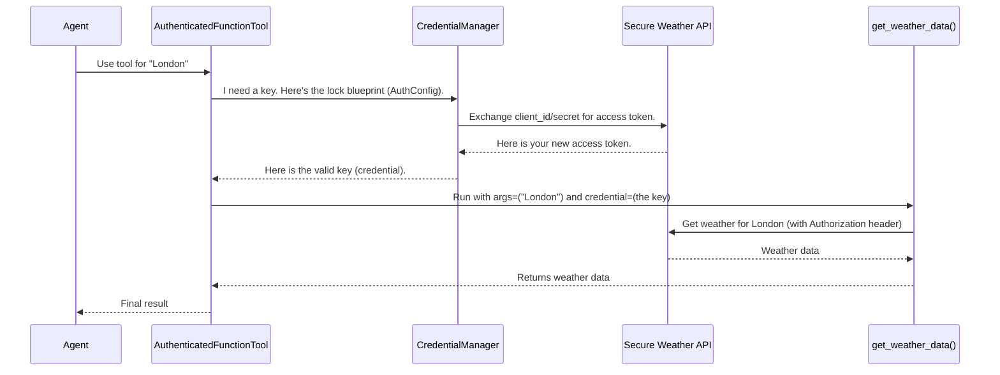

# Chapter 6: Authentication (AuthConfig / CredentialManager)

In the [previous chapter](05_tool__basetool___functiontool__.md), we learned how to give our agent powerful skills using `Tools`. We built a tool to "send" an email. But what if that tool needed to connect to a real, secure service like Google Calendar or a private company database? We can't just write our passwords and API keys directly into our code—that would be incredibly insecure!

So, how do we manage these secrets safely? How does our agent get the right "key" to unlock a secure service when it needs it, without exposing the key in our code? This is where ADK's authentication system comes in.

### What's the Big Idea?

Think of your agent's tools as doors to different buildings (services). Some doors are unlocked, but others, like the one to the "Google Calendar" building, are locked and require a special key.

ADK's authentication system works like a master locksmith and a high-tech keychain for your agent:

1.  **`AuthConfig` (The Lock's Blueprint):** For every locked door, you need to describe the lock. Is it a simple key lock? A keycard scanner? `AuthConfig` is the blueprint that describes what kind of key is needed. For example: "This door requires an OAuth2 keycard for the Google Calendar service."
2.  **`CredentialManager` (The Locksmith):** This is the smart, automated locksmith that lives inside the ADK. When a tool needs a key, the `CredentialManager` takes the `AuthConfig` blueprint and does all the hard work. It securely fetches the key, renews it before it expires, and hands it to the tool just in time. You never have to manage the keys yourself.

This system keeps your agent's sensitive credentials safe and handles complex authentication flows automatically, so you can focus on building your tool's logic.

### Building an Authenticated Tool: A Secure Weather API

Let's build a tool that gets the weather from a secure, fictional API. This API requires an OAuth2 key to access it.

#### Step 1: The Tool's Logic (With a Spot for the Key)

First, let's write the Python function that will call the weather API. Notice a special new parameter: `credential`. The ADK's locksmith (`CredentialManager`) will automatically pass the key into this parameter when it runs the function.

```python
import requests

def get_weather_data(city: str, credential=None) -> str:
  """Gets current weather from the secure weather API."""
  headers = {}
  # The locksmith provides the key (credential) right here!
  if credential and credential.oauth2:
    access_token = credential.oauth2.access_token
    headers["Authorization"] = f"Bearer {access_token}"

  # Make the secure API call with the token in the header
  response = requests.get(
      "http://example-weather-api.com/api/weather",
      headers=headers,
      params={"city": city}
  )
  return response.text
```
Our function is simple: it prepares a request and, if a `credential` is provided, it adds the access token to the headers. The function doesn't know *how* it got the token; it just knows where to expect it.

#### Step 2: Describing the Lock (`AuthConfig`)

Next, we need to create the blueprint that describes the lock on our weather API door. We'll tell the ADK that this API uses the OAuth2 "Client Credentials" flow, which is a common way for applications to talk to each other securely.

```python
from google.adk.auth.auth_tool import AuthConfig
from google.adk.auth.auth_credential import AuthCredential, OAuth2Auth
# ... other imports for OAuth2 flow definition ...

def create_weather_api_auth_config() -> AuthConfig:
  """Defines the authentication needed for the weather API."""
  # 1. Describe the raw credentials we have (our app's ID and secret)
  raw_credential = AuthCredential(
      auth_type="oauth2",
      oauth2=OAuth2Auth(
          client_id="my_weather_app_client_id",
          client_secret="my_super_secret_client_secret",
      ),
  )

  # ... code to define the OAuth2 flow details ...

  # 2. Return the complete blueprint
  return AuthConfig(
      auth_scheme=...,  # The full OAuth2 scheme definition
      raw_auth_credential=raw_credential,
      credential_key="weather_api_credentials",
  )
```
This looks complicated, but the idea is simple. We are creating an `AuthConfig` object that holds two key pieces of information:
1.  **`auth_scheme`**: A detailed description of the authentication protocol (e.g., "This is OAuth2, and you get the token from `http://example-weather-api.com/token`").
2.  **`raw_auth_credential`**: The initial secrets our app has, like its `client_id` and `client_secret`. The locksmith will use these to get the final access token.

#### Step 3: Creating the Secure Tool

Now we need a special kind of tool that knows it has a lock. Instead of `FunctionTool`, we use `AuthenticatedFunctionTool`. It works just the same, but it takes our `auth_config` blueprint as an argument.

```python
from google.adk.tools import AuthenticatedFunctionTool

# Get our lock blueprint
weather_auth_config = create_weather_api_auth_config()

# Create a secure tool that knows how to use the locksmith
weather_tool = AuthenticatedFunctionTool(
    func=get_weather_data,
    auth_config=weather_auth_config,
)
```
By giving the `auth_config` to the `AuthenticatedFunctionTool`, we've attached the "lock blueprint" to our tool's door.

#### Step 4: Give the Secure Tool to an Agent

Finally, we give this secure tool to our agent, just like any other tool.

```python
from google.adk import Agent

weather_agent = Agent(
    model='gemini-2.0-flash',
    instruction='You are a helpful weather assistant.',
    tools=[
        weather_tool,
    ],
)
```
And that's it! When a user asks for the weather, the `weather_agent` will try to use the `weather_tool`. The tool will automatically trigger the locksmith (`CredentialManager`) to get a valid token before running our `get_weather_data` function.

### Under the Hood: The Locksmith at Work

What happens when the user asks, "What's the weather in London?"

1.  **Tool Selection:** The [Agent's](03_agent__baseagent___llmagent__.md) brain decides to use the `weather_tool`.
2.  **Locksmith Awakens:** The `AuthenticatedFunctionTool` doesn't run the code immediately. Instead, it wakes up its internal `CredentialManager` (the locksmith) and hands it the `AuthConfig` blueprint.
3.  **Check the Keychain:** The `CredentialManager` first checks if it already has a valid, non-expired key (access token) for "weather\_api\_credentials".
4.  **Fetch a New Key:** If there's no key or the key is expired, the locksmith uses the information in `AuthConfig`. It takes the `client_id` and `client_secret` and makes a secure, behind-the-scenes call to the API's token URL to get a brand new access token.
5.  **Inject the Key:** The `CredentialManager` returns the valid access token to the `AuthenticatedFunctionTool`.
6.  **Run the Code:** The tool now calls your original `get_weather_data` function, passing the freshly obtained credential into the `credential` parameter.
7.  **Success!** Your function runs with the valid token and gets the weather data.

This entire process is seamless and secure.



#### Diving into the Code

*   **The Secure Tool:** The magic starts in `src/google/adk/tools/authenticated_function_tool.py`. Its `run_async` method is what triggers the whole process.

    ```python
    # Simplified from src/google/adk/tools/authenticated_function_tool.py
    class AuthenticatedFunctionTool(FunctionTool):
      # ... initialization ...

      async def run_async(self, *, args: dict[str, Any], ...):
        # 1. Before running the real function, get the credential.
        credential = await self._credentials_manager.get_auth_credential(...)

        if not credential:
          # If no credential, ask the user and wait.
          await self._credentials_manager.request_credential(...)
          return "Pending User Authorization."

        # 2. If we got the credential, run the real function with it.
        return await self._run_async_impl(..., credential=credential)
    ```

*   **The Locksmith:** The `CredentialManager` in `src/google/adk/auth/credential_manager.py` contains the core logic. Its main job is to execute the steps of loading, exchanging, and refreshing credentials.

    ```python
    # Simplified from src/google/adk/auth/credential_manager.py
    class CredentialManager:
      # ... initialization ...

      async def get_auth_credential(self, ...):
        # Step 1: Try to load an existing, saved credential.
        credential = await self._load_existing_credential(...)

        # Step 2: If we don't have one, maybe the user just provided it.
        if not credential:
          credential = await self._load_from_auth_response(...)

        # Step 3: Exchange the credential if needed (e.g., id -> token).
        credential, was_exchanged = await self._exchange_credential(credential)

        # Step 4: Refresh the credential if it's expired.
        if not was_exchanged:
          credential, was_refreshed = await self._refresh_credential(credential)

        # Step 5: Save the new/refreshed credential for next time.
        if was_exchanged or was_refreshed:
          await self._save_credential(...)

        return credential
    ```

This class acts as the central brain for all authentication logic, ensuring the tool always gets a valid credential.

### Conclusion

You've just learned how to build agents that can securely interact with protected services. The ADK's authentication system, built around `AuthConfig` and the `CredentialManager`, provides a powerful and secure abstraction. It keeps your secrets out of your code and automates complex flows like OAuth2, turning you into a master locksmith for your agents.

So far, our agents have been skilled individuals. But what if a task is too big for one agent? How can we get them to collaborate and work together on a complex project?

Let's learn how to build teams of agents in [Chapter 7: Workflow Agents (SequentialAgent / ParallelAgent)](07_workflow_agents__sequentialagent___parallelagent__.md).

---

Generated by [AI Codebase Knowledge Builder](https://github.com/The-Pocket/Tutorial-Codebase-Knowledge)