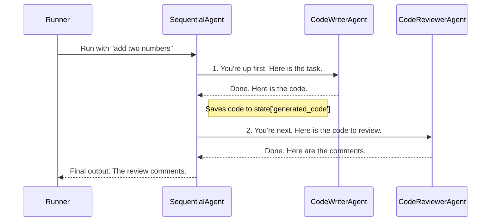
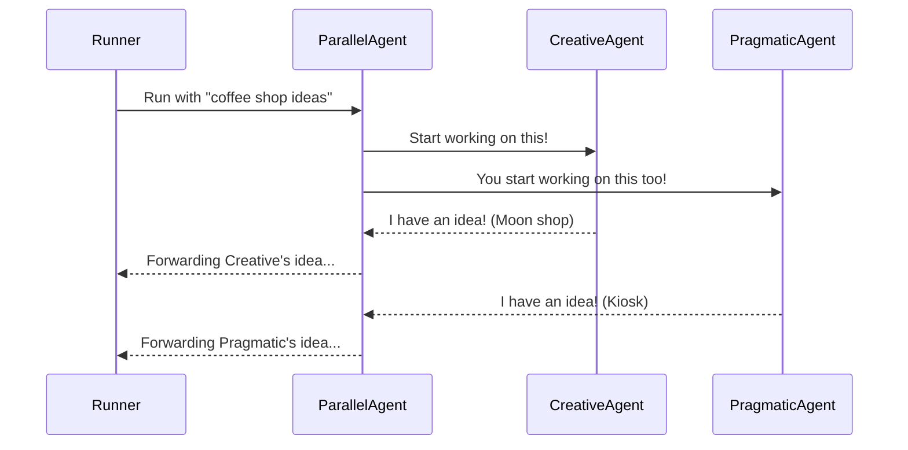

# Chapter 7: Workflow Agents (SequentialAgent / ParallelAgent)

In the [previous chapter](06_authentication__authconfig___credentialmanager__.md), we learned how to build secure agents that can access protected services. Our agents are now skilled individuals. But what happens when a task is too big or complex for a single agent to handle alone? We need to build a team.

How do you get a team of specialized agents to work together? How do you define a process where one agent's work is handed off to the next? You hire a manager. In ADK, these managers are called **Workflow Agents**.

### What's the Big Idea?

Workflow Agents like `SequentialAgent` and `ParallelAgent` don't do the actual work themselves. Instead, they are team managers that orchestrate other "worker" agents (called `sub_agents`). They are essential for building complex, multi-agent systems by defining how different agents collaborate.

There are two main types of managers:

1.  **`SequentialAgent` (The Assembly Line Supervisor):** This manager ensures its sub-agents perform their tasks one after another, in a specific order. The output of the first agent becomes the input for the second, and so on. It's perfect for building step-by-step pipelines.

2.  **`ParallelAgent` (The Brainstorming Manager):** This manager gives the *exact same task* to multiple agents at the same time. This is great for getting different perspectives or solutions to a single problem simultaneously.

Let's build a team for each type of manager.

### Building a Sequential Workflow: A Code Generation Pipeline

Imagine you want an AI system that writes, reviews, and then refactors code. This is a perfect job for an assembly line.

#### Step 1: Hire Your Specialist Workers

First, we need to define our individual worker agents. Each one is a standard [LlmAgent](03_agent__baseagent___llmagent__.md) with a very specific job description.

```python
from google.adk.agents import LlmAgent

# Worker 1: The Coder
code_writer_agent = LlmAgent(
    name="CodeWriter",
    model="gemini-2.0-flash",
    instruction="Write Python code based on the user's request. Output only the code.",
    output_key="generated_code", # Save output here
)
```
This agent's only job is to write code. We also add an `output_key`, which tells the ADK to save this agent's final output into a shared dictionary under the key `"generated_code"`.

```python
# Worker 2: The Reviewer
code_reviewer_agent = LlmAgent(
    name="CodeReviewer",
    model="gemini-2.0-flash",
    instruction="Review the code provided in {generated_code} and give feedback.",
    output_key="review_comments", # Save output here
)
```
This agent reviews code. Its instruction uses `{generated_code}` to automatically pull the output from the first agent into its prompt. It then saves its own feedback under the key `"review_comments"`.

#### Step 2: Hire the Assembly Line Supervisor

Now, we assemble these workers under the management of a `SequentialAgent`. The order in the `sub_agents` list is crucial—it defines the order of the assembly line.

```python
from google.adk.agents import SequentialAgent

# The Manager: Runs agents in order
code_pipeline_agent = SequentialAgent(
    name="CodePipeline",
    sub_agents=[
        code_writer_agent,
        code_reviewer_agent,
        # ... we could add a refactoring agent here ...
    ],
)
```
We've now created a `code_pipeline_agent` that will first run the `code_writer_agent` and then the `code_reviewer_agent`.

**Example Input and Output:**

If you give this `code_pipeline_agent` to a [Runner](02_runner_.md) and send a message:
*   **User Input:** "write a function that adds two numbers"
*   **What Happens:**
    1.  `code_writer_agent` runs and produces Python code.
    2.  `code_reviewer_agent` receives that code, runs, and produces feedback like "The code is good, but it's missing a docstring."
*   **Agent's Final Response:** The final output would be the review comments, as it's the last step in our current pipeline.

### Building a Parallel Workflow: A Brainstorming Team

Now, what if you want to generate creative ideas for a new product? You don't want a step-by-step process; you want multiple diverse ideas at once. This is a job for a brainstorming manager.

#### Step 1: Hire Your Creative Thinkers

Let's define two agents with different personalities to tackle the same problem.

```python
from google.adk.agents import LlmAgent

# Thinker 1: The Creative Visionary
creative_agent = LlmAgent(
    name="CreativeAgent",
    model="gemini-2.0-flash",
    instruction="You are a creative genius. Brainstorm bold, innovative ideas.",
)
```

```python
# Thinker 2: The Pragmatic Analyst
pragmatic_agent = LlmAgent(
    name="PragmaticAgent",
    model="gemini-2.0-flash",
    instruction="You are a practical analyst. Suggest safe, achievable ideas.",
)
```

#### Step 2: Hire the Brainstorming Manager

Now, we'll put both thinkers under the management of a `ParallelAgent`.

```python
from google.adk.agents import ParallelAgent

# The Manager: Runs all agents at the same time
brainstorm_team_agent = ParallelAgent(
    name="BrainstormTeam",
    sub_agents=[
        creative_agent,
        pragmatic_agent,
    ],
)
```
When this agent runs, it will give the user's request to *both* the `creative_agent` and the `pragmatic_agent` simultaneously.

**Example Input and Output:**

*   **User Input:** "give me ideas for a new coffee shop"
*   **What Happens:** The `creative_agent` and `pragmatic_agent` both start working at the same time.
*   **Agent's Final Response:** The `ParallelAgent` will stream back the responses from both agents as they are generated. You'll see two distinct sets of ideas:
    *   From `CreativeAgent`: "Let's open an anti-gravity coffee shop on the moon!"
    *   From `PragmaticAgent`: "We could open a small kiosk near a busy train station focusing on speed and quality."

### Under the Hood: How the Managers Work

#### The `SequentialAgent` Playbook

The `SequentialAgent` is like a project manager with a checklist. It simply goes down its list of `sub_agents` and runs them one by one.



The code in `src/google/adk/agents/sequential_agent.py` reflects this simple logic. It contains a loop that iterates through its agents.

```python
# Simplified from src/google/adk/agents/sequential_agent.py

class SequentialAgent(BaseAgent):
  async def _run_async_impl(self, ctx: InvocationContext):
    # Loop through each sub-agent in the defined order
    for sub_agent in self.sub_agents:
        # Run the current sub-agent and wait for it to finish
        async for event in sub_agent.run_async(ctx):
            yield event
        # The output is now in the shared state for the next agent
```

#### The `ParallelAgent` Playbook

The `ParallelAgent` is like a manager who shouts a task to a room full of people. It creates a separate, independent task for each `sub_agent` and uses Python's `asyncio` to run them all at once.



The implementation in `src/google/adk/agents/parallel_agent.py` uses asynchronous programming to achieve this concurrency.

```python
# Simplified from src/google/adk/agents/parallel_agent.py

class ParallelAgent(BaseAgent):
  async def _run_async_impl(self, ctx: InvocationContext):
    agent_runs = []
    # 1. Create a separate task for each sub-agent
    for sub_agent in self.sub_agents:
        agent_runs.append(sub_agent.run_async(ctx))

    # 2. Run all the tasks concurrently and merge their outputs
    async with Aclosing(merge_func(agent_runs)) as agen:
        async for event in agen:
            yield event
```

### Conclusion

You've just unlocked the ability to build sophisticated, multi-agent systems! Workflow Agents like `SequentialAgent` and `ParallelAgent` act as managers, allowing you to orchestrate teams of specialized agents to solve complex problems. You can now build assembly-line pipelines, brainstorming teams, and much more.

As these workflows get more complex, it becomes incredibly important to keep track of the entire conversation—what each agent said, what tools they used, and what the final outcomes were. How does the ADK manage this history?

Let's dive into the system that logs every step of an agent's journey in [Chapter 8: Session](08_session_.md).

---

Generated by [AI Codebase Knowledge Builder](https://github.com/The-Pocket/Tutorial-Codebase-Knowledge)