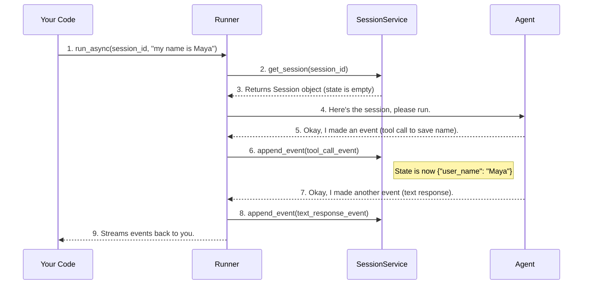

# Chapter 8: Session

In the [previous chapter](07_workflow_agents__sequentialagent___parallelagent__.md), we learned how to build powerful teams of agents that can work together in pipelines or in parallel. As these conversations become more complex, with multiple agents contributing, a critical question arises: how does the system remember anything?

An agent that can't remember what was said just a moment ago is not very intelligent. To have a real conversation, you need a memory. In ADK, that memory is called a `Session`.

### What's the Big Idea?

Imagine a conversation is like a detailed meeting. The `Session` is the official meeting minutes notebook. This notebook is special because it has two parts:

1.  **The Transcript (`events`):** This is a complete, chronological log of everything that happened. Every message from the user, every response from an agent, and every tool an agent used is recorded here. This is the conversation's history.
2.  **The Whiteboard (`state`):** This is a shared scratchpad that all agents in the meeting can see, write on, and erase. If one agent discovers a key piece of information (like the user's name), they can write it on the whiteboard for all other agents (and their future selves) to see. This is the conversation's shared memory.

Every single conversation you have with an ADK application is managed within its own unique `Session`. The `SessionService` acts as the master librarian, responsible for creating, retrieving, and storing these notebooks, ensuring each conversation's context is perfectly preserved over time.

### A Practical Example: The Agent That Remembers Your Name

Let's build a simple agent whose only job is to remember the user's name across multiple messages. This is a classic example of why session `state` is so powerful.

#### Step 1: Create an Agent That Can Use Memory

First, we'll create an agent. Its instructions will tell it to greet the user by name if it knows it, and to remember the name if the user provides it.

```python
from google.adk import Agent

memory_agent = Agent(
    model="gemini-2.0-flash",
    instruction=(
        "You are a friendly assistant. "
        "If you know the user's name from the state, greet them by name. "
        "If the user tells you their name, use the provided tool to save it."
    ),
    # We will add a tool here in the next step
)
```
This agent is primed to use memory, but it doesn't yet have the "hands" to write on the whiteboard (`state`). For that, it needs a special tool.

#### Step 2: Build a Tool to Write to the Whiteboard (`state`)

Agents cannot modify the `state` directly. They must use a tool. This is a security feature that creates a clear record of when and why the memory was changed. Let's build a simple tool that saves a key-value pair to the session's state.

```python
from google.adk.tools import FunctionTool

def save_name_to_state(name: str, tool_context) -> str:
    """Saves the user's name to the session state."""
    tool_context.invocation_context.session.state["user_name"] = name
    return f"Saved name '{name}' to state."
```
This function takes a `tool_context` object, which is automatically provided by the ADK. This context is a treasure chest of information about the current conversation, including a direct handle to the `session` object, which lets us access and modify its `.state` dictionary.

#### Step 3: Put It All Together

Now, let's equip our agent with this new tool and set up our application.

```python
# Add the tool to our agent's list of skills
memory_agent.tools = [
    FunctionTool(func=save_name_to_state)
]

# Set up the App and Runner as we learned in Chapters 1 and 2
from google.adk.apps import App
from google.adk.runners import InMemoryRunner

app = App(name="memory_app", root_agent=memory_agent)
runner = InMemoryRunner(app=app)
```
Our application is now ready. The `runner` will automatically manage the `Session` for us.

#### Step 4: Have a Stateful Conversation

Let's see what happens when we talk to our agent.

**Turn 1: The Introduction**
*   **User says:** "Hi there, my name is Maya."
*   **What happens:**
    1.  The agent's LLM brain sees the name "Maya".
    2.  Following its instructions, it decides to use the `save_name_to_state` tool with `name="Maya"`.
    3.  Our tool function runs, writing `{"user_name": "Maya"}` onto the session's "whiteboard" (`state`).
*   **Agent replies:** "It's nice to meet you, Maya!"

**Turn 2: The Test**
Now, we send a *new* message in the *same* conversation.
*   **User says:** "What did I tell you my name was?"
*   **What happens:**
    1.  The [Runner](02_runner_.md) loads the same `Session` notebook for this conversation.
    2.  It passes both the conversation history (`events`) and the shared memory (`state`, which contains `{"user_name": "Maya"}`) to the agent.
    3.  The agent's brain sees the user's question and also sees the name "Maya" on the whiteboard.
*   **Agent replies:** "You told me your name is Maya."

Success! The `Session` allowed our agent to have a continuous, stateful conversation.

### Under the Hood: The Librarian (`SessionService`) at Work

How does the [Runner](02_runner_.md) manage all these notebooks? It has a built-in `SessionService`, which acts as a librarian. When you call `runner.run_async`, a precise sequence of events occurs.

1.  **Request a Notebook:** The `Runner` tells the `SessionService`, "I need the notebook for conversation `session_id`."
2.  **Retrieve History:** The `SessionService` goes to its storage (for `InMemoryRunner`, this is just a Python dictionary) and pulls out the entire `Session` object, including all past `events` and the current `state`.
3.  **Brief the Agent:** The `Runner` hands this complete notebook to the agent, giving it all the context it needs.
4.  **Agent Works:** The agent does its thing, producing new [Events](09_event_.md) (like a text response or a tool call).
5.  **Log New Entries:** For each new final event the agent produces, the `Runner` hands it back to the `SessionService` and says, "Append this to the notebook."
6.  **Update the Whiteboard:** The `SessionService`'s `append_event` method is smart. It not only adds the event to the transcript but also checks if the event contains any changes to the state. If it does (like our tool call did), it updates the `state` dictionary.
7.  **Return to User:** The `Runner` streams the new events back to your code.

This loop ensures that the session notebook is always up-to-date.



### Diving into the Code

The concepts of `Session` and `SessionService` are defined in a few key files.

*   **`Session` (`src/google/adk/sessions/session.py`):** This is the data model for the notebook itself. It's a simple Pydantic class that just holds the data.

    ```python
    # Simplified from src/google/adk/sessions/session.py
    class Session(BaseModel):
      """Represents a series of interactions between a user and agents."""
      id: str
      app_name: str
      user_id: str
      state: dict[str, Any] = Field(default_factory=dict)
      events: list[Event] = Field(default_factory=list)
    ```

*   **`BaseSessionService` (`src/google/adk/sessions/base_session_service.py`):** This is the "librarian's rulebook"—an abstract class defining what any session manager must be able to do.

    ```python
    # Simplified from src/google/adk/sessions/base_session_service.py
    class BaseSessionService(abc.ABC):
      """Base class for session services."""
      @abc.abstractmethod
      async def create_session(self, ...) -> Session: ...

      @abc.abstractmethod
      async def get_session(self, ...) -> Optional[Session]: ...

      async def append_event(self, session: Session, event: Event) -> Event:
        # This method is where the magic happens!
        self._update_session_state(session, event) # Updates the whiteboard
        session.events.append(event) # Adds to the transcript
        return event
    ```
    The `InMemorySessionService` used by our `InMemoryRunner` is just a concrete implementation of this rulebook that uses a simple Python dictionary for storage.

### Conclusion

You've now mastered the concept of `Session`, the memory core of any ADK application. You learned that a `Session` is a logbook containing a transcript of `events` and a shared whiteboard of `state`. You also saw how the `SessionService` acts as the librarian, managing these logbooks to enable stateful, multi-turn conversations. Without this concept, agents would have the memory of a goldfish; with it, they can build relationships and solve complex, multi-step problems.

Throughout this chapter, we've repeatedly mentioned that the session's transcript is made up of `events`. These are the fundamental atoms of communication in the ADK. But what exactly is an `Event`, and what can it represent?

Let's break down the single most important data structure for agent communication in [Chapter 9: Event](09_event_.md).

---

Generated by [AI Codebase Knowledge Builder](https://github.com/The-Pocket/Tutorial-Codebase-Knowledge)