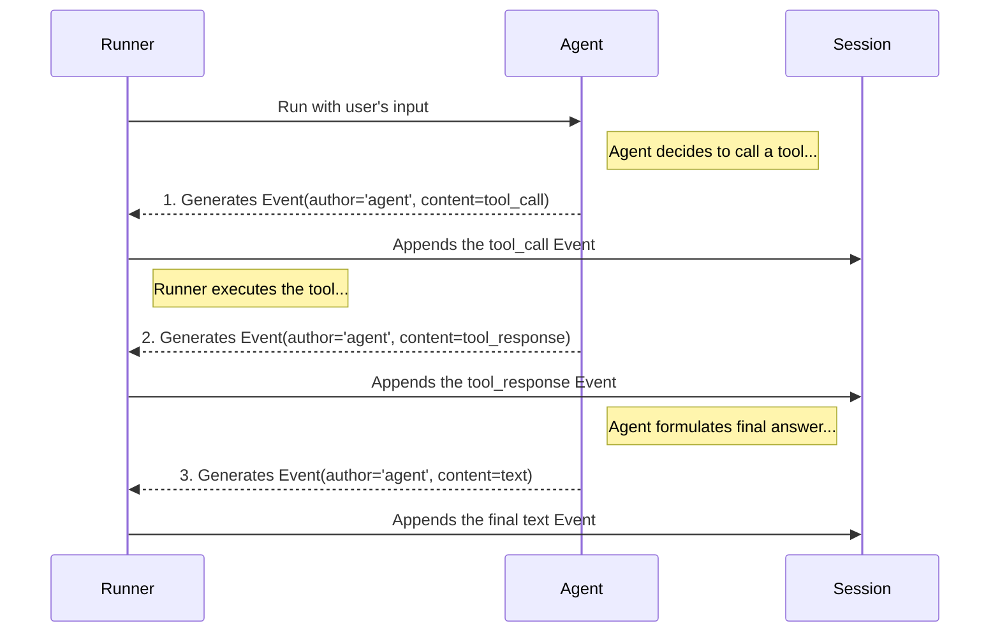

# Chapter 9: Event

In the [previous chapter](08_session_.md), we learned that a `Session` is the complete logbook for a conversation, holding both the transcript and the shared memory. But what is that transcript made of? How do we represent a single message from the user, or a single thought from an agent?

The answer is the most fundamental unit of communication in the entire ADK: the `Event`.

### What's the Big Idea?

Think of a conversation with an agent as a movie script. The `Session` is the entire script. An `Event` is a single line of dialogue or a single stage direction.

Each `Event` is a tiny, self-contained record that captures one specific moment in the conversation. It answers three simple questions:
*   **Who did something?** (`author`: 'user' or 'dice_roller_agent')
*   **What did they do?** (`content`: send a message, call a tool)
*   **Did it cause any side effects?** (`actions`: update the session's memory)

When you run an agent, it doesn't just give you a single final answer. The [Runner](02_runner_.md) gives you a *stream* of these `Event` objects. By watching this stream, you can see the agent's entire thought process unfold step-by-step, making it an essential tool for understanding and debugging your application.

### A Practical Example: Watching an Agent Think

Let's revisit our dice-rolling agent from [Chapter 3](03_agent__baseagent___llmagent__.md). When we ask it to "roll a d20", several things happen behind the scenes. By printing out the stream of events, we can see each step clearly.

Imagine we have our dice-rolling agent set up in an `app` and a `runner`. Here's how we'd process the events:

```python
async for event in runner.run_async(...):
    print(f"--- New Event ---")
    print(f"Author: {event.author}")

    # Check what's inside the event's content
    if event.get_function_calls():
        tool_call = event.get_function_calls()[0]
        print(f"Content: Thought - I should call the '{tool_call.name}' tool.")
    elif event.get_function_responses():
        tool_response = event.get_function_responses()[0]
        print(f"Content: Observation - The tool returned '{tool_response.response}'.")
    elif event.content.parts:
        text = event.content.parts[0].text
        print(f"Content: Said - '{text}'")

```
This code loops through the events as they are generated by the agent and prints a human-readable summary of what's happening.

**Example Input and Output:**

If our user input is "roll a 20-sided die", this code would print the agent's entire chain of thought:

```text
--- New Event ---
Author: dice_roller_agent
Content: Thought - I should call the 'roll_die' tool.

--- New Event ---
Author: dice_roller_agent
Content: Observation - The tool returned '{'result': 14}'.

--- New Event ---
Author: dice_roller_agent
Content: Said - 'I rolled a d20 and got 14!'
```

Look at that! We can clearly see the agent's reasoning:
1.  First, it thinks and decides to call the `roll_die` tool.
2.  Next, it observes the result of that tool call (it got `14`).
3.  Finally, based on that observation, it formulates its friendly response to the user.

This step-by-step visibility is the superpower that `Event` gives you. It's the ultimate tool for debugging why an agent is behaving a certain way.

### Under the Hood: The Anatomy of an Event

So, how does an `Event` object store all this information? It's a structured data class with a few key fields. Let's break down the most important ones.

1.  **`author` (string):** The simplest field. This just tells you who created the event. It's either the special name `'user'` or the name of the [Agent](03_agent__baseagent___llmagent__.md) that was running, like `'dice_roller_agent'`.

2.  **`content` (Content object):** This is the "what." It holds the actual payload of the event. The `content` is made of one or more "parts," which can be:
    *   `text`: A simple text message.
    *   `function_call`: The agent's request to use a tool.
    *   `function_response`: The result that came back from running a tool.

3.  **`actions` (EventActions object):** This is for "stage directions" or side effects. This is where an event can signal that something else needs to happen. For example, if a tool needs to save the user's name to the session memory, its event would contain an `actions` object with a `state_delta` field.

This diagram shows how these components come together as an agent processes a request.



### Diving into the Code

Let's peek at the code to see how these concepts are defined.

*   **`Event` (`src/google/adk/events/event.py`):** This is the main data class. It inherits from `LlmResponse` (which provides the `content` field) and adds the other critical pieces of information.

    ```python
    # Simplified from src/google/adk/events/event.py
    class Event(LlmResponse):
      """Represents an event in a conversation."""
      id: str  # A unique ID for this specific event
      author: str  # 'user' or the name of the agent
      actions: EventActions = Field(default_factory=EventActions)
      timestamp: float
      # ... and other metadata fields ...

      def get_function_calls(self) -> list[types.FunctionCall]:
        # Helper method to find tool calls in the content
        ...
    ```
    This class is the container for a single moment in time, holding the `author`, the `content` (from `LlmResponse`), and any associated `actions`.

*   **`EventActions` (`src/google/adk/events/event_actions.py`):** This class holds all the possible "stage directions" an event can have. We saw it in action in the [Session](08_session_.md) chapter.

    ```python
    # Simplified from src/google/adk/events/event_actions.py
    class EventActions(BaseModel):
      """Represents the actions attached to an event."""
      # When this is set, the Session will update its state
      state_delta: dict[str, object] = Field(default_factory=dict)

      # When this is set, the Runner might transfer control
      transfer_to_agent: Optional[str] = None

      # ... and many other possible actions ...
    ```
    This powerful little object is how an `Event` can do more than just carry a message; it can carry an *instruction* for the rest of the system to follow.

### Conclusion

Congratulations! You've just learned about the `Event`, the atomic unit of communication in ADK. It's the single entry in the session logbook, the line of dialogue in the script, and your most powerful tool for debugging. By understanding how to read the stream of events, you can gain deep insight into how your agent thinks and makes decisions.

You have now completed the beginner's tour of the Agent Development Kit! Let's quickly recap what you've learned:
*   You started with the `App`, the main headquarters for your entire application.
*   You brought it to life with a `Runner`, the engine that manages conversations.
*   You hired an `Agent`, the intelligent worker with an LLM brain and a set of `Tools`.
*   You made your agent's brain swappable with the `BaseLlm` abstraction.
*   You made your agent secure with the `Authentication` system.
*   You built powerful teams of agents with `Workflow Agents`.
*   You gave your agents memory with the `Session`.
*   And finally, you learned to read their minds by inspecting the stream of `Events`.

With these core concepts, you have everything you need to start building sophisticated, powerful, and observable agentic applications. Happy building

---

Generated by [AI Codebase Knowledge Builder](https://github.com/The-Pocket/Tutorial-Codebase-Knowledge)