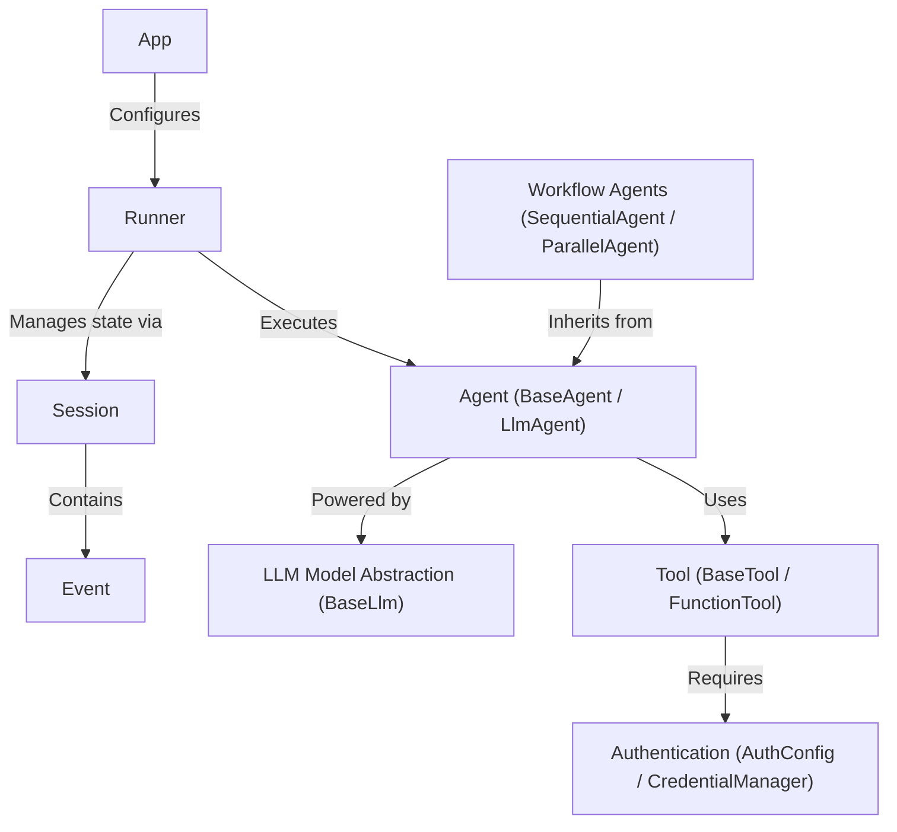

# Tutorial: adk-python

This project is a framework for building applications powered by *artificial intelligence*, known as the Agent Development Kit (ADK). Think of it like creating a team of specialized AI workers, called **Agents**. You can give these agents *instructions*, equip them with **Tools** (like searching the web or accessing a database), and have them collaborate in complex **Workflows**. The entire operation is managed by a **Runner**, which orchestrates the agents to fulfill a user's request, keeping track of the entire conversation in a **Session**. This allows you to build anything from a simple chatbot to a sophisticated, multi-agent system that can solve real-world problems.

**Source Repository:** [https://github.com/google/adk-python](https://github.com/google/adk-python)

## Chapters

1. [App
](01_app_.md)
2. [Runner
](02_runner_.md)
3. [Agent (BaseAgent / LlmAgent)
](03_agent__baseagent___llmagent__.md)
4. [LLM Model Abstraction (BaseLlm)
](04_llm_model_abstraction__basellm__.md)
5. [Tool (BaseTool / FunctionTool)
](05_tool__basetool___functiontool__.md)
6. [Authentication (AuthConfig / CredentialManager)
](06_authentication__authconfig___credentialmanager__.md)
7. [Workflow Agents (SequentialAgent / ParallelAgent)
](07_workflow_agents__sequentialagent___parallelagent__.md)
8. [Session
](08_session_.md)
9. [Event
](09_event_.md)

---

Generated by [AI Codebase Knowledge Builder](https://github.com/The-Pocket/Tutorial-Codebase-Knowledge)