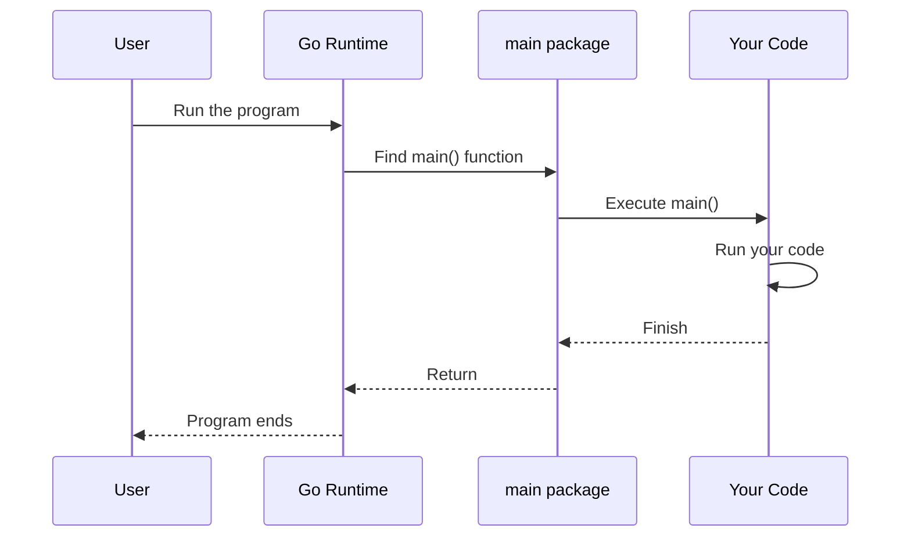

# Chapter 1: Package System

## What Problem Does This Solve?

Imagine you're writing a Go program. You create multiple files for different features—one for handling user input, one for math calculations, one for saving data to a file. As your project grows, things get messy. Where does the program start? How do different files talk to each other? How do you prevent naming conflicts if two files both have a function called `calculate()`?

**Go's package system solves this** by organizing your code into logical groups. A package is like a folder that contains related code. The special `main` package is where your program begins. This chapter teaches you the basics so you understand how Go organizes code.

## Key Concepts

### What is a Package?

A **package** is Go's way of organizing code. Think of it like a box that holds related functions and data. Every Go file must belong to a package.

Here's the most basic package declaration:

```go
package main
```

This line (always at the very top of your file) says: "This file is part of the `main` package."

### The Special `main` Package

The `main` package is **special**. It's required if you want to create an executable program (a program you can actually run).

Here's why:
- Go looks for a function called `main()` inside the `main` package
- When you run your program, Go automatically calls `main()` first
- This is your program's **entry point**—where execution starts

Think of it like a restaurant: the `main` package is the front door, and `main()` is the host who greets you when you walk in.

### Organizing Code with Packages

Once you understand `main`, you can create other packages to organize code:

```go
package math
```

This creates a package called `math` (just an example name). You'd put math-related functions here.

Different packages help you:
- Keep related code together
- Avoid confusing code clutter
- Reuse code easily

## How to Use the Package System

Let's start with the simplest example—the one we'll work with throughout this chapter:

```go
package main

import "fmt"

func main() {
	fmt.Println("Hello, World!")
}
```

**What's happening here?**
- Line 1: We declare this file is part of the `main` package
- Line 3: We import a package called `fmt` (we'll learn about imports in [Chapter 2: Standard Library Imports](02_standard_library_imports_.md))
- Lines 5–7: We define the `main()` function—this is where our program starts

**When you run this program:**
```
Output: Hello, World!
```

Go automatically finds and executes `main()`, which prints "Hello, World!" to your screen.

## Under the Hood: How Packages Work

Let's walk through what happens step-by-step when you run a Go program:

### Step-by-Step Process

1. **Go finds your `main` package**
   - Go scans your project for files with `package main`
   
2. **Go looks for the `main()` function**
   - Inside those files, Go finds the function named `main()`
   
3. **Go calls `main()`**
   - Execution starts here—like pressing the "play" button on a program
   
4. **Code inside `main()` runs**
   - All the code inside those curly braces `{}` executes in order
   
5. **Program ends**
   - When `main()` finishes, your program stops

### Visual Flow

Here's a simple diagram showing this flow:



### Inside a Package: File Structure

When Go compiles your program, here's roughly what happens:

```go
// File: main.go
package main

func greet() {
	// This function exists in main package
}

func main() {
	greet()  // Can call other functions in same package
}
```

**The key point:** All files with `package main` are grouped together. Functions in one file can call functions in another file—as long as they're in the same package!

## A Practical Example: Understanding File Organization

Imagine we have two files, both in the `main` package:

```go
// File: main.go
package main

func main() {
	sayHello()  // Calls a function from another file!
}
```

```go
// File: helpers.go
package main

func sayHello() {
	// This function is also in main package
}
```

**Why does this work?** Both files declare `package main`, so they're part of the same package. Functions can see each other across files within the same package.

## What This Means for Your Programs

Right now, you'll mostly write code in the `main` package. Here's what you need to remember:

1. **Every file needs `package` at the top**
   - For now, always write `package main`

2. **The `main()` function is your starting point**
   - Everything in `main()` runs first

3. **Files in the same package work together**
   - They can share functions and data

4. **The `main` package is special**
   - Only this package can have an executable entry point

## Conclusion

You've learned that Go organizes code into **packages**, and the special `main` package is where your executable program starts. Every Go file declares its package at the top, and a function called `main()` inside the `main` package is where execution begins.

This foundation is essential because every Go program relies on packages. In the [next chapter](02_standard_library_imports_.md), we'll learn how to use packages from Go's standard library—tools that are already written and waiting for you to use them!

---

Generated by [AI Codebase Knowledge Builder](https://github.com/The-Pocket/Tutorial-Codebase-Knowledge)