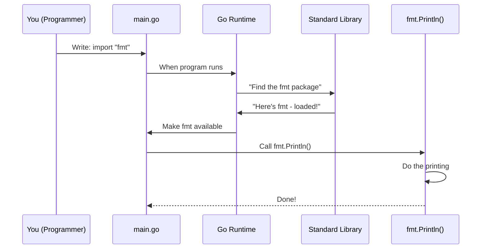

# Chapter 2: Standard Library Imports

In the [previous chapter](01_package_system_.md), you learned that Go organizes code into packages, and `main` is the special package where your program starts. Now it's time to unlock a superpower: **using code that's already been written for you**.

## What Problem Does This Solve?

Imagine you want to print "Hello, World!" to your screen. You *could* write all the code from scratch—handling text encoding, figuring out how to send data to your screen, and more. But that's exhausting and unnecessary.

**The solution?** Go comes with a **standard library**—a collection of pre-written packages that solve common problems. One of these packages is `fmt`, which handles printing and formatting. By using the `import` statement, you can bring these tools into your code and use them immediately.

Instead of reinventing the wheel, you borrow it from Go's toolbox!

## Key Concepts

### What is the Standard Library?

The **standard library** is like a giant toolbox that comes with Go. Inside this toolbox are packages—pre-written collections of code—that solve common tasks:

- **`fmt`** → Printing and formatting text
- **`math`** → Mathematical calculations
- **`strings`** → Working with text
- **`time`** → Handling dates and times
- ...and many more!

You don't need to install these—they come built-in with Go. You just need to ask for them using the `import` statement.

### What is an Import Statement?

An **import** statement is a line of code that says: "Hey Go, please load this package and make it available in my code."

Think of it like a librarian. You walk up and say: "I need the `fmt` package." The librarian retrieves it and hands it to you. Now you can use everything inside.

Here's the syntax:

```go
import "fmt"
```

This line tells Go: "Please load the `fmt` package so I can use it in my code."

### How Do You Use an Imported Package?

Once you import a package, you access its functions using dot notation:

```go
fmt.Println("Hello!")
```

Here:
- `fmt` is the package name
- `Println` is a function inside that package
- The dot `.` connects them

It's like saying: "Call the `Println` function from the `fmt` package."

## How to Use Imports: A Complete Example

Let's solve our use case: printing "Hello, World!" to your screen.

Here's the code:

```go
package main

import "fmt"

func main() {
	fmt.Println("Hello, World!")
}
```

**What's happening here?**

| Line | What it does |
|------|-------------|
| Line 1 | Declares this is the `main` package |
| Line 3 | Imports the `fmt` package from the standard library |
| Lines 5–7 | The `main()` function—our entry point |
| Line 6 | Calls `Println()` from `fmt` to print text |

**When you run this:**

```
Output: Hello, World!
```

The `fmt.Println()` function does the hard work of printing for you. You just told it what to print!

## Importing Multiple Packages

Sometimes you need more than one package. Instead of writing multiple `import` lines, you can group them:

```go
import (
	"fmt"
	"math"
)
```

This imports both `fmt` and `math`. Now you can use functions from both packages.

For example:

```go
fmt.Println(math.Pi)  // Prints: 3.141592653589793
```

Here:
- `fmt.Println()` prints text
- `math.Pi` is a value (the number π) from the `math` package
- Together, they print the value of π

**Output:**
```
3.141592653589793
```

## Under the Hood: How Imports Work

When you write an `import` statement, what actually happens behind the scenes?

### Step-by-Step Process

Here's the journey your code takes:



**In plain English:**

1. **You write `import "fmt"`** in your code
2. **When your program starts**, Go's runtime reads your file
3. **Go searches for the `fmt` package** in the standard library
4. **Go loads `fmt` into memory** and makes its functions available
5. **When your code calls `fmt.Println()`**, it's now ready to use
6. **The `Println()` function runs** and prints to your screen

### A Closer Look at Standard Library Organization

The Go standard library is organized in your computer's file system. When you import `fmt`, Go knows exactly where to find it:

```
Go Installation Directory
├── src
│   └── fmt
│       ├── print.go
│       ├── scan.go
│       └── ... more files
```

When you write:

```go
import "fmt"
```

Go essentially says: "Go to my standard library, find the folder called `fmt`, load all those files, and make their functions available."

### What About Packages Not in the Standard Library?

Go's standard library is extensive, but not everything is included. If you want packages from other developers (like a database driver or a web framework), you need to:

1. Download them
2. Install them

But for common tasks like printing, math, and text handling, the standard library has you covered!

## A Practical Comparison: With and Without Imports

**Without an import (Imagine this was possible):**

```go
// This is impossible - you can't print without fmt!
// This code doesn't work
fmt.Println("Hello!")  // Error: fmt is not defined
```

**With an import (How it actually works):**

```go
import "fmt"

func main() {
	fmt.Println("Hello!")  // Works perfectly!
}
```

**Output:**
```
Hello!
```

See the difference? The import unlocks the functionality. Without it, Go doesn't know what `fmt` is.

## Key Things to Remember

1. **Imports go at the top of your file**
   - After `package`, before your functions

2. **The standard library is always available**
   - No special installation needed

3. **Import statement syntax matters**
   - Use quotes: `import "fmt"` ✓
   - Not: `import fmt` ✗

4. **Access imported functions with a dot**
   - `fmt.Println()` calls `Println` from `fmt`

5. **You can import multiple packages**
   - Use parentheses to group them

## Conclusion

You've learned that the **import statement** is your key to using Go's standard library—a collection of pre-written code that solves common problems. Instead of writing everything yourself, you import packages like `fmt` and use their powerful functions immediately.

In [Chapter 3: Output Printing](03_output_printing_.md), we'll dive deeper into the `fmt` package and explore different ways to print and format output. You'll see that `Println()` is just one of many printing tools available!

---

Generated by [AI Codebase Knowledge Builder](https://github.com/The-Pocket/Tutorial-Codebase-Knowledge)