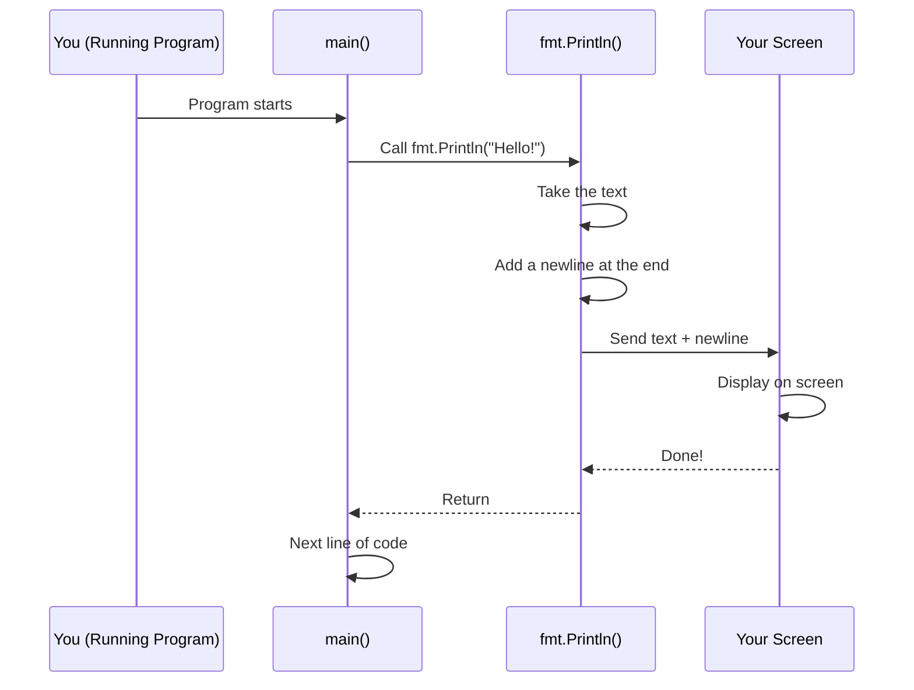

# Chapter 3: Output Printing

In the [previous chapter](02_standard_library_imports_.md), you learned how to bring packages from Go's standard library into your code using the `import` statement. You discovered that `fmt` is a package full of printing tools. Now it's time to actually **use** that package to communicate with the world!

## What Problem Does This Solve?

Imagine you've written a program that calculates something—maybe it adds two numbers together, or checks if a password is strong. But there's a problem: your program does the work silently. The person running it has no idea what happened. Did the program work? What was the answer?

**You need a way to show results to the user.** That's where output printing comes in.

Think of your program like a helpful assistant:
- The assistant does work behind the scenes (like calculating)
- But then the assistant needs to **speak up** and tell you the results
- Without speaking, the work is useless to you!

The `fmt.Println()` function is your program's voice. It's how your program speaks to the person running it.

## Key Concepts

### What is `fmt.Println()`?

`fmt.Println()` is a **function** from the `fmt` package that does one simple thing: it prints text to your screen and then moves to a new line.

Here's the pattern:

```go
fmt.Println("Your message here")
```

Breaking this down:
- **`fmt`** — the package (the toolbox)
- **`Println`** — the function (the tool)
- **`"Your message here"`** — what you want to print (the task)

When Go runs this line, your message appears on the screen.

### What is a Function Argument?

Notice the text is inside parentheses `()`. That text is called an **argument**. An argument is information you give to a function to tell it what to do.

Think of it like ordering food:
- The restaurant is the function
- Your order is the argument
- The meal is what you get back

For `fmt.Println()`, the argument is the text you want to print.

```go
fmt.Println("Hello, World!")
```

Here, `"Hello, World!"` is the argument. It tells `Println` what to print.

### The Automatic Newline

Here's something special about `Println`: it automatically adds a **newline** at the end of your text. A newline is an invisible character that moves the cursor to the next line.

Think of it like pressing the "Enter" key after speaking:

```go
fmt.Println("First line")
fmt.Println("Second line")
```

**Output:**
```
First line
Second line
```

Notice how the text appears on separate lines? That's the automatic newline at work. Each `Println()` puts its text on its own line.

## How to Use It: Solving Our Use Case

Let's take the simple example of printing a message to your screen.

Here's the complete code:

```go
package main

import "fmt"

func main() {
	fmt.Println("Hello, World!")
}
```

**What each line does:**
- Lines 1–3: Set up your program (package and import—you learned this already!)
- Line 5: The `main()` function starts (where your program begins)
- Line 6: Print the message to the screen
- Line 7: End the `main()` function

**When you run this program:**

```
Output:
Hello, World!
```

That's it! The text appears on your screen.

## Printing Different Types of Information

You can print more than just simple text. You can print numbers, calculations, and combinations:

```go
fmt.Println(42)
```

**Output:**
```
42
```

You printed a number!

```go
fmt.Println("The answer is", 42)
```

**Output:**
```
The answer is 42
```

You printed multiple things separated by spaces. `fmt.Println()` automatically adds spaces between arguments.

## A Practical Example: Your First Real Program

Let's make a program that actually *does* something and then announces the result:

```go
package main

import "fmt"

func main() {
	result := 5 + 3
	fmt.Println(result)
}
```

**What this does:**
- Line 6: Calculate `5 + 3` (result is `8`) and store it in a variable
- Line 7: Print that result to the screen

**Output:**
```
8
```

Now your program is communicating! It did math and told you the answer.

## Under the Hood: What Happens When You Print?

When you call `fmt.Println()`, a lot is happening behind the scenes. Let's break it down:

### Step-by-Step Process

Here's what happens from the moment you write `fmt.Println("Hello!")`:



**In plain English:**

1. **Your program reaches `fmt.Println("Hello!")`**
2. **Go looks up the `Println` function** inside the `fmt` package
3. **`Println` receives your text** as an argument (`"Hello!"`)
4. **`Println` adds a newline character** at the end (invisible but important)
5. **The text + newline gets sent to your screen**
6. **Your screen displays it** for you to see
7. **Control returns to your code**, and the next line runs

### Inside the `fmt` Package

The `fmt` package is a collection of functions for printing and formatting. Here's what `Println` does internally:

```go
// Simplified version of what Println does:
func Println(text string) {
	// Write the text to the screen
	// Automatically add a newline at the end
	// Return
}
```

It's surprisingly simple! It:
1. Takes the text you give it
2. Sends it to your screen
3. Adds a newline so the next print starts on a new line

**Key insight:** Different functions in `fmt` do similar things but with variations:
- **`Println`** — prints text + adds newline
- **`Print`** — prints text without adding newline
- **`Printf`** — prints text with special formatting

For now, `Println` is the easiest and most useful.

## Comparing `Print` vs `Println`

Here's an important distinction:

**Using `fmt.Println()`:**

```go
fmt.Println("A")
fmt.Println("B")
```

**Output:**
```
A
B
```

Each one on its own line because `Println` adds a newline.

**Using `fmt.Print()` (without the "ln"):**

```go
fmt.Print("A")
fmt.Print("B")
```

**Output:**
```
AB
```

They appear on the same line! `Print()` doesn't add a newline.

**Which should you use?** For now, use `Println()`. It's more predictable because each print goes on its own line.

## Common Beginner Mistakes

### Mistake 1: Forgetting to Import

```go
// ❌ This doesn't work
func main() {
	fmt.Println("Hello!")  // Error: fmt is not defined
}
```

**Fix:** Always `import "fmt"` at the top!

### Mistake 2: Forgetting the Parentheses

```go
// ❌ This doesn't work
fmt.Println "Hello!"  // Error: syntax error
```

**Fix:** Parentheses are required: `fmt.Println("Hello!")`

### Mistake 3: Forgetting the Quotes

```go
// ❌ This doesn't work
fmt.Println(Hello)  // Error: Hello is not defined
```

**Fix:** Text must be in quotes: `fmt.Println("Hello")`

## A Complete Program Example

Let's build a small program that does something meaningful and announces it:

```go
package main

import "fmt"

func main() {
	name := "Alice"
	fmt.Println("Welcome,", name)
}
```

**Output:**
```
Welcome, Alice
```

This program:
1. Creates a variable with someone's name
2. Prints a greeting using that name
3. The `fmt.Println()` function combines and displays both pieces

**Output breakdown:**
- `fmt.Println()` receives two arguments: `"Welcome,"` and `name`
- It prints them with a space between
- It automatically adds a newline at the end

## Key Things to Remember

1. **`fmt.Println()` prints text to your screen**
   - It's your program's way of speaking to the user

2. **Always import `"fmt"` first**
   - Without the import, `fmt` doesn't exist in your code

3. **Arguments go inside parentheses**
   - They tell the function what to do

4. **`Println` automatically adds a newline**
   - Each print appears on its own line

5. **You can print text, numbers, and combinations**
   - Separate multiple arguments with commas

## Conclusion

You've learned that `fmt.Println()` is your program's voice—the way it communicates results and messages to whoever runs it. This function takes text as an argument, prints it to the screen, and automatically moves to the next line. It's a simple but powerful tool that makes your programs interactive and useful.

Without output printing, your program would work silently in the background. With it, your program can explain what it's doing, announce results, and guide the user. This is the bridge between your code and the real world.

Now that you understand packages, imports, and printing, you're ready to put it all together. In [Chapter 4: Main Entry Point](04_main_entry_point_.md), we'll bring everything you've learned together and build your first complete Go program!

---

Generated by [AI Codebase Knowledge Builder](https://github.com/The-Pocket/Tutorial-Codebase-Knowledge)