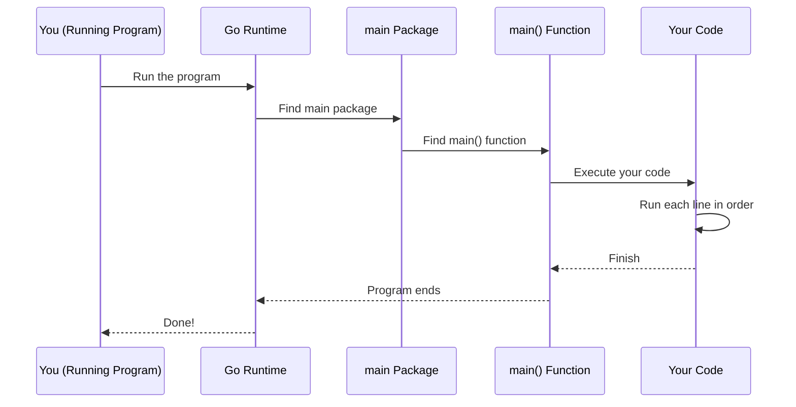
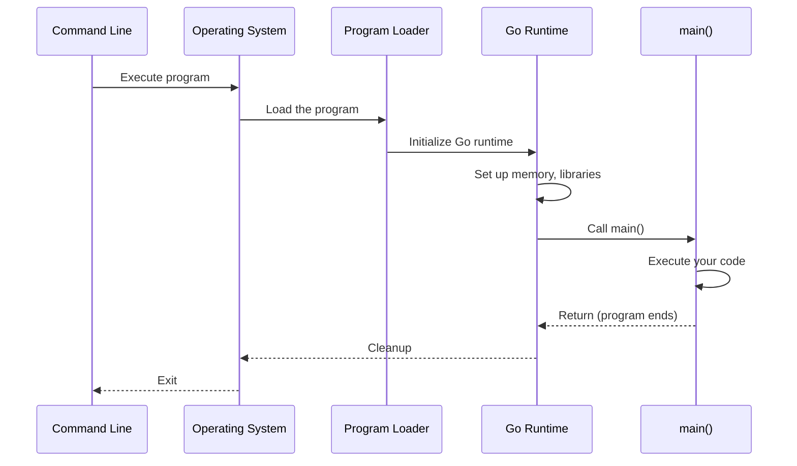

# Chapter 4: Main Entry Point

In the [previous chapter](03_output_printing_.md), you learned how to use `fmt.Println()` to make your program speak to the world and announce results. You discovered that this function takes information and prints it to the screen. Now it's time to answer a fundamental question: **Where does your program actually begin?**

## What Problem Does This Solve?

Imagine you're watching a movie. The film has thousands of scenes, but they don't all play at once in random order. There's a **beginning**—an opening scene that starts the story. Everything that happens afterward flows from that first moment.

Your Go program works the same way. You might write many functions and import many packages, but your program needs to know: **Where should I start? What code runs first?**

Without a clear starting point, your program would be like a movie that plays all its scenes simultaneously in chaos. Nothing would make sense.

**The solution?** Go has a special function called `main()`. This is your program's **opening scene**—the first code that runs when someone executes your program. Everything you've learned so far (packages, imports, printing) comes together inside `main()`.

Think of `main()` as the director's "Action!" moment. It's where the show begins.

## Key Concepts

### What is the `main()` Function?

A **function** is a named block of code that does a specific task. You can call it by name whenever you need it. 

The `main()` function is special: it's not one you call manually. Instead, **Go automatically calls `main()` when your program starts**.

Here's the pattern:

```go
func main() {
	// Your code goes here
}
```

Breaking it down:
- **`func`** — keyword meaning "I'm defining a function"
- **`main`** — the function's name (this is the special one!)
- **`()`** — parentheses (always there, even if empty)
- **`{}`** — curly braces that hold the code

### Why Must `main()` Be in the `main` Package?

You learned earlier that every Go file belongs to a **package**. The `main` package is special because it's the only package that can have an executable entry point.

Here's the rule:
- **To make an executable program**, you must have a `main` package
- **Inside the `main` package**, you must have a `main()` function
- **When you run the program**, Go calls `main()` automatically

Without these two things, Go won't know how to start your program. It's like trying to start a car without an ignition—it won't work!

### The Flow: From Start to Finish

Here's what happens when you run a Go program:



**In simple terms:**

1. You run your program
2. Go's runtime wakes up and looks for the `main` package
3. Inside that package, it finds the `main()` function
4. Go calls `main()` automatically
5. All your code inside `main()` runs from top to bottom
6. When `main()` finishes, the program stops

## How to Use It: Building Your First Complete Program

Let's build the program that brings everything together:

```go
package main

import "fmt"

func main() {
	fmt.Println("Hello, World!")
}
```

**What each line does:**

| Line | Purpose |
|------|---------|
| Line 1 | Declare this is the `main` package |
| Line 3 | Import the `fmt` package for printing |
| Line 5 | Define the `main()` function (where the program starts) |
| Line 6 | Print a message to the screen |
| Line 7 | End the function |

**When you run this program:**

```
Output:
Hello, World!
```

Magic happened! Here's what went on behind the scenes:

1. Go found your `main` package
2. Go found your `main()` function
3. Go executed line 6: `fmt.Println("Hello, World!")`
4. Your message appeared on the screen
5. The function ended, and the program stopped

Everything you've learned from the previous chapters came together in this single program!

### A More Practical Example: Doing Real Work

Let's make a program that does something useful—it calculates and announces a result:

```go
package main

import "fmt"

func main() {
	price := 15
	tax := 3
	total := price + tax
	fmt.Println("Total:", total)
}
```

**What this program does:**

- Lines 6–8: Do some math (calculate a total with tax)
- Line 9: Print the result

**Output:**
```
Total: 18
```

Notice how everything happens inside `main()`. Your code runs in order, top to bottom. When `main()` reaches the end, the program stops.

## Understanding Code Execution Order

Here's something crucial: **the code inside `main()` runs in order, from top to bottom**.

```go
func main() {
	fmt.Println("This runs first")
	fmt.Println("This runs second")
	fmt.Println("This runs third")
}
```

**Output:**
```
This runs first
This runs second
This runs third
```

It's not random. It's not shuffled. From top to bottom, always. This predictability is a superpower—you know exactly what will happen when.

## Under the Hood: What `main()` Really Does

When you write a Go program, `main()` isn't just any function. It has special properties. Let's explore what happens internally.

### The Program Lifecycle

When your computer runs your Go program, here's the complete journey:



**Breaking this down:**

1. **You type a command** in your terminal to run the program
2. **The operating system** loads your program into memory
3. **Go's runtime** wakes up and prepares everything (loads packages, allocates memory)
4. **The runtime looks for `main()`** in the `main` package
5. **It calls `main()`** automatically
6. **Your code runs** line by line
7. **When `main()` finishes**, the runtime cleans up and the program ends

### Why `main()` Must Return Void

You might notice `main()` doesn't have a return type like some functions do. Here's why:

```go
// This is how main() is defined
func main() {
	// No return type!
}
```

**Why?** The `main()` function is special. It doesn't return a value to you—it returns a value to the operating system (usually 0 for success, other numbers for errors). Go handles this automatically. You don't need to worry about it as a beginner.

### What If `main()` Doesn't Exist?

If you try to create an executable program without a `main()` function, Go will refuse to run it:

```go
package main

import "fmt"

// Oops! No main() function here!
func sayHello() {
	fmt.Println("Hello!")
}
```

**What happens?**
```
Error: function main not declared in main package
```

Go is telling you: "I don't see a `main()` function. I don't know where to start your program!" You *must* have `main()` for your program to be executable.

## A Practical Pattern: The Basic Program Structure

Most beginner Go programs follow this pattern:

```go
package main

import "fmt"

func main() {
	// Step 1: Set up (get data, prepare variables)
	name := "Alice"
	
	// Step 2: Do work (calculate, process, etc.)
	greeting := "Hello, " + name
	
	// Step 3: Show results (print output)
	fmt.Println(greeting)
}
```

**Output:**
```
Hello, Alice
```

This structure—**setup, work, show results**—is common in programs. Everything happens inside `main()`, in order.

## Common Beginner Mistakes

### Mistake 1: Forgetting `main()` Entirely

```go
// ❌ This won't work as an executable program
package main

import "fmt"

func sayHi() {
	fmt.Println("Hi!")
}
```

**Problem:** There's no `main()` function, so Go doesn't know where to start.

**Fix:** Add a `main()` function!

### Mistake 2: Putting Code Outside `main()`

```go
// ❌ This doesn't work as expected
package main

import "fmt"

fmt.Println("This runs when?")  // Error! Can't be here

func main() {
	fmt.Println("This is in main")
}
```

**Problem:** Code must be inside a function. You can't just float it at the top level.

**Fix:** Put all executable code inside `main()`!

### Mistake 3: Misspelling `main`

```go
// ❌ This won't work
func Main() {  // Capital M!
	fmt.Println("Hello")
}
```

**Problem:** Go looks for `main` (lowercase). If you write `Main` (uppercase), Go won't find it.

**Fix:** Always spell it `main` (lowercase)!

## What Happens After `main()` Ends?

Here's an important detail: **once `main()` finishes, your program stops**. Period.

```go
package main

import "fmt"

func main() {
	fmt.Println("Line 1")
	fmt.Println("Line 2")
	// main() ends here - program stops!
}

// This code NEVER runs because main() already ended
func neverRuns() {
	fmt.Println("You'll never see this!")
}
```

**Output:**
```
Line 1
Line 2
```

Notice that `neverRuns()` never gets called. Why? Because `main()` ended, and the program stopped. Go doesn't automatically run other functions. You have to call them explicitly from inside `main()`.

## Conclusion

You've learned that the **`main()` function is your program's entry point**—the place where execution begins. When you run a Go program, Go automatically looks for the `main` package, finds the `main()` function inside it, and runs it. Everything you write inside `main()` executes from top to bottom.

This chapter brings together everything you've learned:
- **[Chapter 1: Package System](01_package_system_.md)** gave you `package main`
- **[Chapter 2: Standard Library Imports](02_standard_library_imports_.md)** gave you `import "fmt"`
- **[Chapter 3: Output Printing](03_output_printing_.md)** gave you `fmt.Println()`
- **Chapter 4: Main Entry Point** shows you where it all comes together!

You now understand the complete journey of a Go program: from the first line (package declaration) through the imports, the function definitions, and finally the entry point where execution begins. You're ready to write real Go programs!

The program you've built—`package main` with `import "fmt"` and a `main()` function—is the foundation for everything you'll build in Go. Every Go executable program follows this same basic structure. Master it, and you've mastered the skeleton of all Go programs.

---

Generated by [AI Codebase Knowledge Builder](https://github.com/The-Pocket/Tutorial-Codebase-Knowledge)