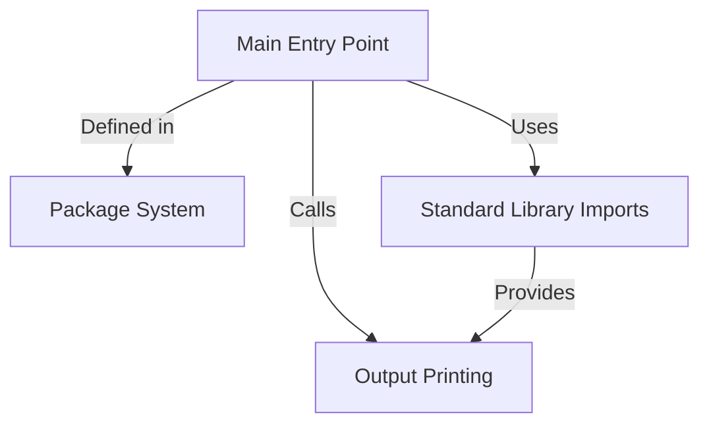

# Tutorial: test

This is a **basic "Hello, World!" program** written in Go, demonstrating the fundamental structure of a Go application. The program showcases how Go organizes code through *packages*, brings in external functionality via *imports*, and communicates with the user through **console output**. It's an excellent starting point for understanding how Go programs are structured and executed.

**Source Repository:** [None](None)

## Chapters

1. [Package System
](01_package_system_.md)
2. [Standard Library Imports
](02_standard_library_imports_.md)
3. [Output Printing
](03_output_printing_.md)
4. [Main Entry Point
](04_main_entry_point_.md)

---

Generated by [AI Codebase Knowledge Builder](https://github.com/The-Pocket/Tutorial-Codebase-Knowledge)