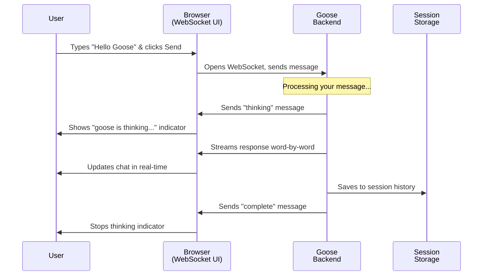

# Chapter 1: Goose Chat WebSocket Interface

## What Problem Does This Solve?

Imagine you're chatting with a friend over text message. When your friend is typing a long response, you want to see their message appear word-by-word in real-time, right? And if your internet connection drops, you want to automatically reconnect and pick up where you left off—not lose the whole conversation.

This is exactly what the **Goose Chat WebSocket Interface** does, but for your browser chatting with Goose (the AI agent). It handles:

- **Real-time messaging** - Messages appear instantly as they're generated
- **Live updates** - Thinking indicators, tool execution progress, streaming responses
- **Auto-reconnection** - If your connection drops, it reconnects automatically
- **Session persistence** - Your chat history is saved, so you can resume later

Think of it as the "messaging app" layer that sits between your browser and Goose's brain. It's what makes Goose feel interactive and responsive instead of slow and clunky.

## Key Concepts

### 1. WebSocket: A Two-Way Conversation Channel

A regular HTTP request is like sending a postcard—you send it, and wait for a reply. A **WebSocket** is like a phone call—you establish a connection, and both sides can talk anytime they want.

```javascript
// Open a WebSocket connection to Goose's backend
socket = new WebSocket('ws://localhost:8000/ws');
```

Once connected, the browser and Goose's server can send messages to each other instantly, without constantly asking "are you there yet?"

### 2. Session ID: Your Conversation's Identity

Every time you start chatting, you get a **session ID**—a unique identifier like `20250115_143022` (date_time format). This is like your conversation's passport. It lets Goose remember:
- All the messages you've sent
- Context from previous exchanges
- Your preferences and settings

```javascript
// Generate a session ID: 20250115_143022
const sessionId = generateSessionId();
```

### 3. Message Types: Different Kinds of Communication

Just like real conversations have different modes (questions, thinking out loud, showing work), Goose sends different types of messages:

- **`response`** - Goose's text reply (often streamed word-by-word)
- **`thinking`** - Goose's internal reasoning (shown as "goose is thinking...")
- **`tool_request`** - Goose wants to run a tool (like executing shell commands)
- **`tool_response`** - The result of running a tool
- **`complete`** - The entire response is finished

## How to Use It: A Simple Example

Let's say you want to send a message to Goose and see the response in your chat UI.

### Step 1: Connect to WebSocket

```javascript
function connectWebSocket() {
    const protocol = window.location.protocol === 'https:' ? 'wss:' : 'ws:';
    socket = new WebSocket(`${protocol}//${window.location.host}/ws`);
    socket.onopen = () => console.log('Connected!');
}
```

This establishes the connection. Think of it like picking up the phone and hearing a dial tone.

### Step 2: Send a Message

```javascript
socket.send(JSON.stringify({
    type: 'message',
    content: 'What is the capital of France?',
    session_id: sessionId
}));
```

You're sending a JSON package that says: "Hey Goose, this is a message. Here's what I want to ask."

### Step 3: Listen for Responses

```javascript
socket.onmessage = (event) => {
    const data = JSON.parse(event.data);
    if (data.type === 'response') {
        addMessage(data.content, 'assistant');  // Show in chat
    }
};
```

When Goose replies, this function runs. It receives the message, parses it, and displays it.

### Step 4: Handle Disconnection & Reconnect

```javascript
socket.onclose = () => {
    console.log('Disconnected. Reconnecting in 3 seconds...');
    setTimeout(connectWebSocket, 3000);
};
```

If your connection drops, this automatically tries to reconnect. It's like a phone that keeps trying to redial if the connection cuts out.

## How It Works: Step-by-Step

Here's what happens when you send "Hello Goose" through the chat UI:



Here's what's happening:

1. **You type and click Send** - The browser captures your message
2. **Browser connects to Goose** - Sends it through WebSocket (the two-way channel)
3. **Goose processes it** - Thinks about your question
4. **Goose streams the response** - Sends it in small chunks, word-by-word
5. **Your browser shows it live** - Each chunk appears instantly in the chat
6. **Session gets saved** - Your entire conversation is stored for later
7. **Done!** - Message marked as complete

## Internal Implementation: The Plumbing

### The JavaScript Message Handler

When Goose sends a message, the browser needs to decide what to do with it. Let's look at the core handler:

```javascript
function handleServerMessage(data) {
    switch (data.type) {
        case 'response':
            handleStreamingResponse(data);
            break;
        case 'thinking':
            addThinkingIndicator();
            break;
        case 'complete':
            removeThinkingIndicator();
            break;
    }
}
```

This is like a receptionist who looks at the type of message and routes it to the right place. A "response" goes to the response handler, "thinking" shows a spinner, and "complete" stops the spinner.

### Streaming Responses: Pieces of Text

When Goose sends a long response, it doesn't send it all at once. It streams it—like downloading a video that plays as it arrives:

```javascript
function handleStreamingResponse(data) {
    if (!currentStreamingMessage) {
        // First chunk: create new message element
        currentStreamingMessage = createMessageElement(data.content);
    } else {
        // Next chunk: append to the message
        currentStreamingMessage.content += data.content;
        updateDisplay(currentStreamingMessage);
    }
}
```

So if Goose is saying "The capital of France is Paris", you might receive:
- `"The capital "`
- `"of France "`
- `"is Paris"`

Each chunk appears instantly, making it feel natural and responsive.

### Session Management: Remember Me

When you first connect, Goose checks if you're resuming an old session:

```javascript
async function loadSessionIfExists() {
    const response = await fetch(`/api/sessions/${sessionId}`);
    if (response.ok) {
        const sessionData = await response.json();
        // Reload all your previous messages
        displayMessages(sessionData.messages);
    }
}
```

This is called when you connect. It's like Goose saying "Oh, I remember you! Let me reload our conversation history."

### Auto-Reconnect: Never Lose Connection

If your WiFi drops or your internet hiccups:

```javascript
socket.onclose = () => {
    isConnected = false;
    // Wait 3 seconds, then try again
    setTimeout(connectWebSocket, 3000);
};
```

The browser waits 3 seconds (to avoid hammering the server), then tries to reconnect. This is resilient—you can close your laptop, move to another room, and when you come back, it automatically reconnects.

## Putting It All Together

The Goose Chat WebSocket Interface is the **bridge** between what you see (a chat UI) and what Goose does (processes requests, runs tools, generates responses). 

Here's what makes it special:

- **Real-time**: Messages stream as they're generated, not all at once
- **Resilient**: Auto-reconnects if connection drops
- **Stateful**: Remembers your entire conversation history
- **Multi-mode**: Handles responses, thinking, tool execution, and more

The next concept you'll learn about is the [Goose Workflow Engine](02_goose_workflow_engine_.md), which is the *heart* of Goose—the system that decides *what* to do when you send a message. The WebSocket Interface is just the doorbell; the Workflow Engine is the brain that answers.

---

**Key Takeaways:**
- WebSocket is a two-way communication channel (like a phone call, not a postcard)
- Session IDs track your conversation and let you resume later
- Different message types (response, thinking, tool_request) guide the UI
- Streaming responses appear word-by-word in real-time
- Auto-reconnection ensures resilience if connection drops

You now understand how Goose Chat stays connected and responsive! 🪿

---

Generated by [AI Codebase Knowledge Builder](https://github.com/The-Pocket/Tutorial-Codebase-Knowledge)