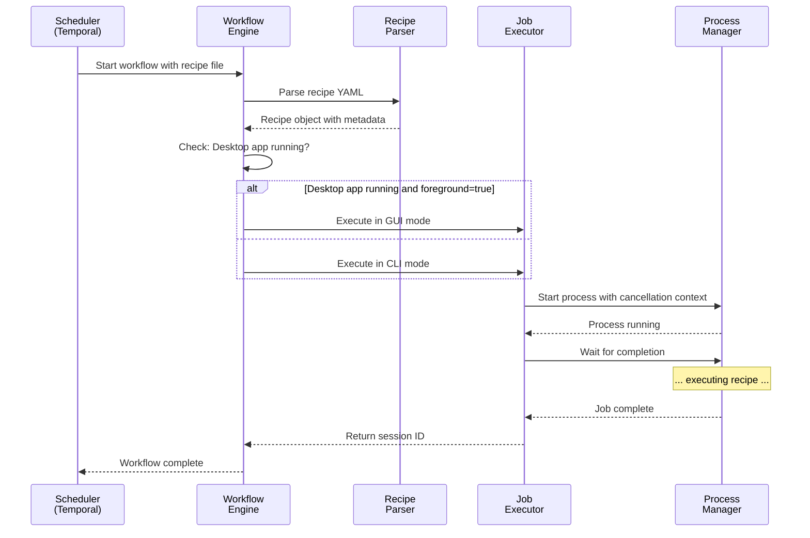

# Chapter 2: Goose Workflow Engine

In [Chapter 1: Goose Chat WebSocket Interface](01_goose_chat_websocket_interface_.md), you learned how Goose stays connected and responsive through WebSocket. That's the *doorbell*—it lets you send messages to Goose.

But what happens *after* you send a message? How does Goose decide what to actually *do*? That's where the **Goose Workflow Engine** comes in. It's the *brain* that reads your instructions, figures out the steps to execute them, and makes sure everything runs smoothly—even if something goes wrong mid-execution.

## What Problem Does This Solve?

Imagine you have a recipe card for baking a cake:

```
1. Preheat oven to 350°F
2. Mix flour and sugar
3. Add eggs and milk
4. Pour into pan
5. Bake for 30 minutes
6. Cool and serve
```

Now imagine you need to convert this recipe into an automated process that:
- Can run unattended (no human clicking buttons)
- Can be paused or cancelled mid-way
- Can handle failures gracefully (if the oven breaks, what then?)
- Remembers where it was if something interrupts it
- Knows whether to show a GUI window or run in the background

The **Goose Workflow Engine** does exactly this—but instead of cake recipes, it converts AI task recipes (YAML/JSON files) into executable workflows.

Here's the real-world use case:

You want to schedule a Goose task to run every morning at 9 AM: "Summarize my emails from yesterday." The recipe is just a text file describing what to do. The Workflow Engine takes that recipe and converts it into something Temporal (a workflow engine) can execute reliably. It figures out whether to:
- Show the task in the Goose desktop app (GUI mode), or
- Run it silently in the background (CLI mode)

Then it executes it, tracks progress, and ensures it completes even if your computer restarts.

## Key Concepts

### 1. Recipe: The Instruction Blueprint

A **recipe** is just a YAML or JSON file describing what to do. Think of it like a cooking recipe written down:

```yaml
title: "Summarize Daily Emails"
description: "Read and summarize emails from yesterday"
prompt: "Here are my emails from yesterday. Please summarize them."
```

This is just *data*—instructions written in a standard format. It doesn't run anything yet; it's just a blueprint.

### 2. Workflow: The Execution Plan

A **workflow** is what you get when you take a recipe and make it *executable*. It's like taking that recipe card and actually going into the kitchen with a checklist.

Workflows in Goose run on **Temporal**, which is a special system that:
- Runs your tasks reliably
- Can pause and resume them
- Survives computer restarts
- Tracks what's been done and what's left to do

Think of Temporal as a very reliable task manager, like a project manager who never forgets what step you're on.

### 3. Metadata: Extra Instructions

Just like a real recipe card might say "serves 6 people" or "takes 30 minutes," recipes also have **metadata**—extra information about how to execute them:

```yaml
title: "Summarize Daily Emails"
schedule:
  cron: "0 9 * * *"  # Run at 9 AM daily
  foreground: true   # Show in GUI, not background
```

This metadata tells the Workflow Engine: "Run this every morning, and please show it in the Goose desktop app."

### 4. GUI vs CLI Mode: Where Does It Run?

Some tasks should be visible to the user (GUI mode—showing in the Goose app window). Others should run silently in the background (CLI mode—command line, no window).

The Workflow Engine checks:
- Is the desktop app running right now?
- Does the recipe request foreground/GUI execution?

Based on this, it decides: GUI mode (open a window) or CLI mode (run silently).

### 5. Context Cancellation: Stopping Mid-Task

Imagine you started baking but need to leave—you'd turn off the oven and cancel the process.

**Context cancellation** is how the Workflow Engine handles interruptions. If:
- The user clicks "cancel" on a task
- The system needs to shut down
- The time limit expires

The Workflow Engine can gracefully stop everything that's running and clean up properly.

## How to Use It: A Simple Example

Let's trace through what happens when you schedule a task to run every morning.

### Step 1: Write a Recipe

You create a recipe file (`summarize_emails.yaml`):

```yaml
title: "Daily Email Summary"
description: "Summarize yesterday's emails"
prompt: "Please summarize my recent emails"
schedule:
  cron: "0 9 * * *"
  foreground: false
```

### Step 2: Trigger the Workflow

At 9 AM, Temporal automatically calls the Workflow Engine with:

```go
// Pseudo-code: Temporal calls this automatically
GooseJobWorkflow(
  ctx,
  jobID: "email-summary-12345",
  recipePath: "/recipes/summarize_emails.yaml"
)
```

### Step 3: Workflow Engine Does Its Magic

Inside the Workflow Engine:

```go
func GooseJobWorkflow(ctx context.Context, jobID string, recipePath string) (string, error) {
  // 1. Parse the recipe file
  recipe := parseRecipe(recipePath)
  
  // 2. Decide: GUI or CLI?
  if isDesktopAppRunning() && recipe.IsForeground {
    // GUI mode - open window
  } else {
    // CLI mode - run in background
  }
  
  // 3. Execute the recipe
  sessionID := executeRecipe(ctx, jobID, recipe)
  return sessionID, nil
}
```

The Workflow Engine:
1. **Parses** the recipe file (YAML → Go struct)
2. **Decides** where to run (GUI window or background)
3. **Executes** the recipe as a Temporal activity
4. **Returns** a session ID that tracks the execution

### Step 4: Track Completion

The Workflow Engine waits for completion and returns a session ID:

```
sessionID: "scheduled-email-summary-12345"
```

This session ID is like a receipt. You can use it later to check the status or see the results.

## Internal Implementation: What Happens Inside?

Let's look at what happens step-by-step when the Workflow Engine executes a recipe.

### The Step-by-Step Flow

Here's a visual walk-through:



Here's what's happening:

1. **Trigger**: Temporal scheduler says "run this job"
2. **Parse**: Read the YAML/JSON recipe file into memory
3. **Decide**: Check metadata and system state (is desktop app running?)
4. **Execute**: Run the recipe in GUI or CLI mode
5. **Track**: Wait for completion and return a session ID
6. **Cleanup**: If cancelled mid-way, the Process Manager kills everything cleanly

### Parsing the Recipe

The first step is reading the recipe file and converting it to something code can use:

```go
type Recipe struct {
    Title       string `yaml:"title"`
    Description string `yaml:"description"`
    Prompt      string `yaml:"prompt"`
}

// Read the recipe file
content, _ := os.ReadFile("summarize_emails.yaml")

// Convert YAML to Go struct
var recipe Recipe
yaml.Unmarshal(content, &recipe)
// Now recipe.Title = "Daily Email Summary"
```

This is like scanning a photo of a recipe card into your phone—it converts the handwritten instructions into digital data your app can understand.

### Deciding GUI vs CLI Mode

The Workflow Engine checks two things:

```go
// Check 1: Is the desktop app running?
desktopRunning := isDesktopAppRunning()

// Check 2: What does the recipe want?
isForeground := recipe.Schedule.Foreground

// Decision
if desktopRunning && isForeground {
    // Open the task in the desktop app window
    executeGUIMode(recipe)
} else {
    // Run silently in the background via CLI
    executeCLIMode(recipe)
}
```

If the user has the Goose desktop app open AND the recipe says "please show this to me," it opens a window. Otherwise, it runs silently in the background.

### Executing with Cancellation Support

Here's where it gets interesting. When the Workflow Engine executes a job, it needs to handle cancellation:

```go
// Create a cancellable context
ctx, cancel := context.WithCancel(context.Background())
defer cancel()

// Start the job
cmd := exec.CommandContext(ctx, "goose", "run", "--recipe", recipePath)
cmd.Start()

// If context is cancelled (user clicked "stop"), 
// the job will be killed automatically
```

A **context** is like a control handle. If the context gets cancelled, it's like yanking the power cord—the job stops immediately.

### Tracking Completion

The Workflow Engine polls to check if the job is done:

```go
// Keep checking every 10 seconds
ticker := time.NewTicker(10 * time.Second)

for {
    select {
    case <-ticker.C:
        // Check: Is the session done?
        if isSessionComplete(sessionName) {
            return sessionName, nil  // Done!
        }
    case <-ctx.Done():
        return nil, errors.New("cancelled")  // Cancelled
    }
}
```

It's like checking a progress bar: "Is the download done? No? Check again in 10 seconds. Still no? Check again..."

## How Recipe Metadata Determines Execution

Let's look at some real examples from the code to see how metadata shapes execution:

### Example 1: Background Recipe

```yaml
title: "Nightly Data Sync"
description: "Sync data at midnight"
schedule:
  cron: "0 0 * * *"     # Midnight
  foreground: false     # Run in background
```

**Execution path**:
- `foreground: false` → CLI mode
- Even if desktop app is running, this runs silently
- User won't see it (unless they check logs)

### Example 2: Foreground Recipe

```yaml
title: "Interactive Report"
description: "Let me help you write a report"
schedule:
  cron: "0 9 * * *"     # 9 AM
  foreground: true      # Show in GUI
```

**Execution path**:
- `foreground: true` AND desktop app is running → GUI mode
- Opens a window in the Goose desktop app
- User sees it and can interact
- If desktop app isn't running → falls back to CLI mode

## Handling Errors and Edge Cases

The Workflow Engine is resilient. Let's see what happens in tricky situations:

### Edge Case 1: Recipe File Doesn't Exist

```go
if _, err := os.Stat(recipePath); os.IsNotExist(err) {
    return "", errors.New("recipe file not found")
}
```

Instead of crashing, it returns an error message. Temporal will mark this job as failed and log it.

### Edge Case 2: Desktop App Crashes Mid-Execution

```go
// Recipe requested GUI, but desktop app crashes
if desktopAppCrashes() {
    // Fall back to CLI automatically
    return executeCLIMode(recipe, recipePath)
}
```

The Workflow Engine detects the crash and seamlessly switches to CLI mode, ensuring the job still completes.

### Edge Case 3: Job Takes Too Long

```go
ctx, cancel := context.WithTimeout(
    context.Background(),
    2 * time.Hour,  // Max 2 hours
)
defer cancel()

// If job is still running after 2 hours, it gets cancelled
```

Workflows have a timeout. If a job runs longer than expected, it's automatically stopped to prevent runaway processes.

## Putting It All Together: The Full Picture

Here's the complete journey of a scheduled task:

1. **Scheduling**: Temporal says "Run this job now"
2. **Input**: Receives job ID and recipe file path
3. **Parsing**: Reads and parses the recipe (YAML/JSON)
4. **Decision**: Checks if desktop app is running and recipe preferences
5. **Execution**: Launches the recipe in GUI or CLI mode
6. **Monitoring**: Watches for completion or cancellation
7. **Output**: Returns session ID to track the run
8. **Cleanup**: Stops any running processes if cancelled

The beauty of this design is that it's **flexible**:
- Same recipe format (YAML/JSON) used everywhere
- Auto-detection of execution mode
- Graceful cancellation
- Automatic fallbacks if something breaks

## Connection to the Next Layer

Now that you understand how recipes become executable workflows, the next step is understanding how these workflows actually *schedule* and *execute* reliably over time. That's where the [Temporal Service & Job Scheduling](03_temporal_service___job_scheduling_.md) comes in—it's the backbone that makes sure jobs run on time, survive restarts, and track everything.

---

**Key Takeaways:**

- A **recipe** is a blueprint (YAML/JSON file) describing what to do
- The **Workflow Engine** converts recipes into executable tasks
- It **parses** metadata to understand how to run (GUI vs CLI)
- It **executes** tasks reliably with cancellation support
- It **tracks** completion and returns a session ID
- It **handles errors gracefully**, falling back if something breaks

You now understand how Goose turns recipe instructions into automated workflows! 🪿

---

Generated by [AI Codebase Knowledge Builder](https://github.com/The-Pocket/Tutorial-Codebase-Knowledge)