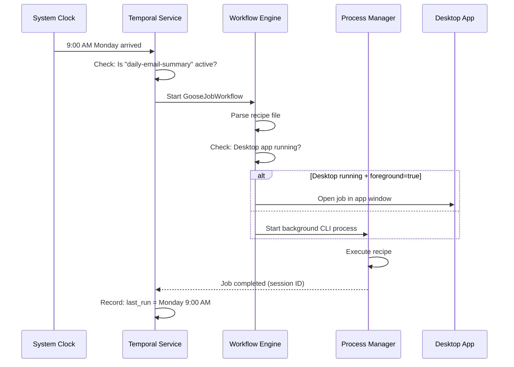

# Chapter 3: Temporal Service & Job Scheduling

In [Chapter 2: Goose Workflow Engine](02_goose_workflow_engine_.md), you learned how Goose converts recipe instructions into executable workflows. That's like having a chef who can follow a recipe once you hand it to them.

But what if you want that chef to automatically cook dinner *every day at 6 PM*? Or what if the chef gets interrupted mid-recipe—you want them to pick up exactly where they left off, even if the power goes out?

That's what the **Temporal Service & Job Scheduling** does. It's like a sophisticated calendar system that:
- Runs tasks on a schedule (e.g., "every morning at 9 AM")
- Never forgets—survives computer restarts
- Can pause, resume, or cancel jobs at any time
- Tracks execution history so you know what ran and when

## What Problem Does This Solve?

Imagine your boss asks you: *"I want a report emailed to me every Monday at 8 AM, summarizing the weekend's activity. And if something goes wrong, I want to know about it—but the system should keep trying."*

Without a scheduling system, you'd need to:
- Manually run the task every Monday (error-prone)
- Hope your computer doesn't crash (it will)
- Have no way to see what happened if it fails
- Manually stop it if the boss cancels the request

The **Temporal Service & Job Scheduling** handles all of this. Think of it as hiring a super-reliable assistant who:
- Has a calendar and never misses a scheduled task
- Writes everything down (full audit trail)
- Can pause/resume tasks without losing progress
- Survives power outages and restarts
- Can be told "stop this task" at any time

## Key Concepts

### 1. Temporal: Your Reliable Execution Engine

**Temporal** (from Temporal.io) is software that runs workflows reliably. Think of it like a Swiss watchmaker—extremely precise and never forgets what it was doing.

Instead of just running your code once and hoping it works, Temporal:
- Stores the state of every running task
- Can resume from exactly where it stopped
- Tracks every step, creating a full history

```
Without Temporal: Run task → Crash → Task lost forever
With Temporal: Run task → Crash → Resume from exact step where it stopped
```

### 2. Cron Expressions: The Calendar Format

A **cron expression** is like writing down a schedule. It's a standard way to say "run this at these times."

For example:
- `"0 9 * * *"` = Every day at 9 AM
- `"0 0 * * 1"` = Every Monday at midnight
- `"*/15 * * * *"` = Every 15 minutes

It looks like secret code, but it just means "at what time should this run?"

```
Cron format: [Minute] [Hour] [Day] [Month] [Weekday]
             0       9      *     *       *
             ↓       ↓      ↓     ↓       ↓
         At 0 mins  at 9   every day,
                  of hour  month, weekday
```

### 3. Job: A Scheduled Task with a Lifetime

A **job** is a task you want to run on a schedule. It has:
- An ID (so you can refer to it: "my-email-report")
- A cron expression (when to run: "0 9 * * *")
- A recipe (what to do: the recipe file)
- A lifecycle (created → paused/active → deleted)

Think of a job like an appointment: "Doctor visit on Tuesdays at 2 PM" is saved in your calendar. You don't need to book it every week—it's saved.

### 4. Foreground vs Background: Where Does It Run?

When a job runs, it can run two ways:

**GUI Mode (Foreground)**: Opens a window in the Goose desktop app
- User can see progress in real-time
- Good for interactive tasks
- Example: "Help me write a report" (user wants to see the process)

**CLI Mode (Background)**: Runs silently in the background
- No window opens
- Good for automatic tasks
- Example: "Summarize emails silently every morning"

The system automatically picks the right mode based on:
1. Is the desktop app running?
2. Does the recipe request GUI mode?

### 5. Job Lifecycle: Birth, Life, and Death

Every job goes through stages:

```
Created → Active → (Paused) → Running → Completed
   ↓
 (Delete)
   ↓
Deleted
```

Here's what each means:

- **Created**: Job is registered with Temporal (exists in the calendar)
- **Active**: Job is waiting for its scheduled time
- **Paused**: Job exists but won't run (like marking an appointment as "do not schedule")
- **Running**: The task is currently executing
- **Completed**: Task finished successfully
- **Deleted**: Job is removed entirely

At any point, you can pause, unpause, or delete a job.

## How to Use It: A Simple Example

Let's say you want to schedule a task: "Every weekday at 9 AM, summarize my emails."

### Step 1: Create a Recipe File

First, write what you want to do (we covered this in Chapter 2):

```yaml
title: "Daily Email Summary"
prompt: "Summarize my emails from yesterday"
schedule:
  cron: "0 9 * * 1-5"  # Weekdays (Mon-Fri)
  foreground: false     # Run in background
```

The `schedule` section tells the system *when* and *how* to run.

### Step 2: Create a Job

Send an HTTP request to the Temporal Service to register this task:

```json
{
  "action": "create",
  "job_id": "daily-email-summary",
  "cron": "0 9 * * 1-5",
  "recipe_path": "/path/to/summarize_emails.yaml",
  "execution_mode": "background"
}
```

This tells Temporal: "Create a job named 'daily-email-summary' that runs the recipe every weekday at 9 AM in the background."

### Step 3: Temporal Takes Over

Once created, Temporal:
1. Stores the job in its database (survives restarts)
2. Monitors the clock waiting for 9 AM
3. At 9 AM on Monday, automatically starts the job
4. Runs it (either in GUI or background mode)
5. Records what happened (success, error, output)
6. Waits for Tuesday 9 AM... repeat

You don't need to do anything else. It's automatic from now on.

### Step 4: Manage the Job

At any time, you can:

```json
{
  "action": "pause",
  "job_id": "daily-email-summary"
}
```

This pauses the job. It still exists, but it won't run at the next scheduled time.

Or kill a running job:

```json
{
  "action": "kill_job",
  "job_id": "daily-email-summary"
}
```

This stops the job if it's currently running.

## How It Works: Step-by-Step

Here's what happens behind the scenes when your job's scheduled time arrives:



What's happening:

1. **Clock ticks**: System clock reaches the scheduled time (9 AM Monday)
2. **Check**: Temporal checks if the job is active (not paused)
3. **Trigger**: Temporal starts the Workflow Engine with the job details
4. **Parse**: Workflow Engine reads the recipe file
5. **Decide**: Check if desktop app is running and what execution mode is requested
6. **Execute**: Either open a GUI window or run in CLI background mode
7. **Record**: Track that the job ran, success/failure, and session ID for history

## Internal Implementation: The Plumbing

Let's look at how the Temporal Service actually creates and manages jobs.

### Creating a Job

When you send the "create" request, here's what happens inside:

```go
func (ts *TemporalService) createSchedule(req JobRequest) {
  // 1. Validate input
  if req.JobID == "" || req.CronExpr == "" {
    return error("Missing fields")
  }
  
  // 2. Copy recipe file to managed storage
  managedPath := copyRecipeToManagedDir(req.JobID, req.RecipePath)
  
  // 3. Create Temporal schedule
  ts.client.ScheduleClient().Create(
    scheduleID,
    cronExpression: req.CronExpr,
    action: GooseJobWorkflow,
  )
}
```

**What's happening**:
1. Validate that you provided all required info (job ID, cron, recipe)
2. Copy the recipe file to a managed directory (ensures it survives even if you move the original)
3. Register the schedule with Temporal using the cron expression

The cron expression tells Temporal: "Wake me up at this time, run this workflow."

### Storing the Recipe

Recipes are stored in a special directory so they don't get lost:

```go
func storeRecipeForSchedule(jobID, originalPath string) string {
  // Read the original recipe
  content := readFile(originalPath)
  
  // Save it to managed storage
  managedPath := filepath.Join(recipesDir, jobID + ".yaml")
  writeFile(managedPath, content)
  
  return managedPath
}
```

Why? If you delete the original recipe file later, the scheduled job can still find it. It's like making a photocopy of a recipe so you always have it.

### Checking Job Status

When you ask "is my job running?", the system checks:

```go
func isJobCurrentlyRunning(jobID string) bool {
  // Check our tracking of running jobs
  if runningJobs[jobID] == true {
    return true  // Currently running
  }
  return false   // Not running
}
```

It's a simple in-memory map: "Is this job ID in the list of currently running jobs?"

### Executing the Job

When Temporal says "it's time to run the job," here's what the Workflow Engine does:

```go
func GooseJobWorkflow(jobID, recipePath string) {
  // Parse the recipe
  recipe := parseRecipe(recipePath)
  
  // Decide where to run
  if isDesktopAppRunning() && recipe.Foreground {
    executeForegroundJobGUI(recipe)  // Open window
  } else {
    executeBackgroundJobCLI(recipe)  // Run silently
  }
}
```

This is like asking: "Is the app available? Does the user want to see this? Okay, decide how to run it."

## Connection to Previous Chapters

You now have the full picture:

1. **[Chapter 1: Goose Chat WebSocket Interface](01_goose_chat_websocket_interface_.md)** - How you chat with Goose in real-time
2. **[Chapter 2: Goose Workflow Engine](02_goose_workflow_engine_.md)** - How recipes become workflows
3. **This Chapter: Temporal Service & Job Scheduling** - How recipes run automatically on a schedule

These three layers work together:
- The **WebSocket Interface** is how you talk to Goose (the doorbell)
- The **Workflow Engine** is what decides what to do (the brain)
- The **Temporal Service** is what runs tasks on schedule (the calendar + reliability system)

## Why Temporal Matters: Reliability

Why not just use a cron job on your computer? Because:

| Feature | Simple Cron | Temporal |
|---------|-------------|----------|
| Survives restart | ❌ Loses state | ✅ Resumes from where it stopped |
| Audit trail | ❌ "Did it run?" Unknown | ✅ Full history of every run |
| Easy to manage | ✅ One command | ✅ HTTP API + dashboard |
| Handle failures | ❌ Just fails | ✅ Retry with backoff |
| GUI/CLI support | ❌ CLI only | ✅ Both modes |

Temporal makes sure your jobs are **reliable**, **trackable**, and **resumable**.

## Putting It All Together

Here's the complete flow for scheduling a task:

1. **You write a recipe** (YAML file describing what to do)
2. **You call the Temporal Service API** ("Create a job")
3. **Temporal stores the recipe** and registers the schedule
4. **System clock ticks** to the scheduled time
5. **Temporal automatically starts the Workflow** (you don't need to do anything)
6. **Workflow Engine decides** how to run (GUI or background)
7. **Task executes** and completes
8. **Temporal records** the result (success, error, output)
9. **Next scheduled time**: Repeat from step 4

All of this happens without you lifting a finger after step 2.

---

**Key Takeaways:**

- **Temporal** is a reliable execution engine that never forgets tasks
- **Cron expressions** are a standard way to write schedules (e.g., "0 9 * * *" = 9 AM daily)
- **Jobs** are tasks registered in Temporal with an ID, schedule, and recipe
- **Foreground vs Background** modes let you choose if a task shows a window or runs silently
- **Job Lifecycle** has states: Created → Active → (Paused) → Running → Completed → (Deleted)
- **Recipes are stored** in managed directories so they survive even if you move the original file
- **Temporal is reliable** because it stores state, survives restarts, and tracks everything

You now understand how Goose schedules and reliably executes tasks! 🪿

Next, you'll learn about [ACP (Agent Control Protocol)](04_acp__agent_control_protocol__.md), which is how different parts of Goose communicate and coordinate with each other. While Temporal handles the *when* and *what*, ACP handles the *how* different agents work together.

---

Generated by [AI Codebase Knowledge Builder](https://github.com/The-Pocket/Tutorial-Codebase-Knowledge)