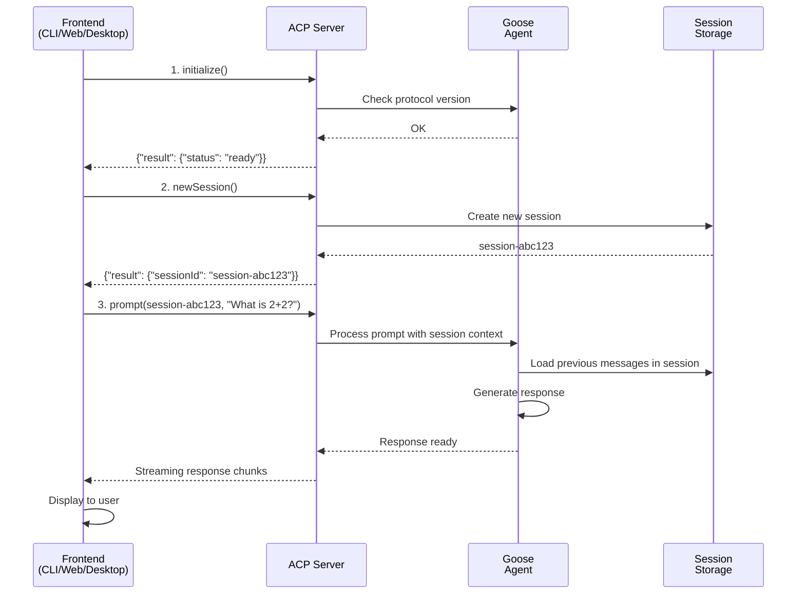

# Chapter 4: ACP (Agent Control Protocol)

In [Chapter 3: Temporal Service & Job Scheduling](03_temporal_service___job_scheduling_.md), you learned how Goose reliably executes tasks on a schedule. But there's a critical question we haven't answered yet: **How do different parts of Goose actually talk to each other?**

Imagine you're building a smart home. You have lights, thermostats, and speakers. You could make a unique remote control for each device—but that's annoying. Instead, you'd want a **universal remote** that speaks the same language to all devices.

That's what the **ACP (Agent Control Protocol)** is for Goose. It's a standardized language that lets different frontends (like the CLI, web app, desktop app) all talk to the same Goose agent backend. Instead of building separate code for each interface, they all use ACP to communicate consistently.

## What Problem Does This Solve?

Let's say you want to use Goose in three different ways:

1. **Desktop App**: A nice GUI window on your computer
2. **Web Browser**: Chat with Goose at `goose.example.com`
3. **Command Line**: Use `goose prompt "What's the weather?"` in your terminal

Without ACP, you'd need to write three completely different systems:
- One that handles the desktop GUI
- One that handles the web interface
- One that handles CLI commands

Each would have its own way of talking to the agent. That's a nightmare to maintain.

With ACP, all three just use the same protocol. It's like teaching the agent one universal language instead of three different ones.

**The use case**: You're a developer building a new frontend (maybe a mobile app). Instead of learning Goose's internals, you just need to learn ACP—the standardized protocol. You send requests, get responses, and you're done.

## Key Concepts

### 1. JSON-RPC: A Standardized Message Format

**JSON-RPC** (Remote Procedure Call over JSON) is a protocol that says: "Here's how we format requests and responses."

Think of it like an envelope format for mail:
- **To address** (who you're asking)
- **What you want** (the request)
- **A stamp** (an ID to match responses with requests)

Here's a JSON-RPC request:

```json
{
  "jsonrpc": "2.0",
  "method": "initialize",
  "params": { "protocolVersion": "v1" },
  "id": 1
}
```

**What each part means**:
- `"jsonrpc": "2.0"` — We're using JSON-RPC version 2.0
- `"method": "initialize"` — We're asking to initialize
- `"params"` — Extra info needed for this request
- `"id": 1` — Request ID (so we know which response matches this request)

The response follows the same format:

```json
{
  "jsonrpc": "2.0",
  "result": { "protocolVersion": "v1", "status": "ready" },
  "id": 1
}
```

Same `id` (1) so you know it's the response to your request.

### 2. ACP Methods: The Things You Can Ask For

ACP supports three main operations:

**`initialize`** — Say hello and set up
- Like calling a phone number and saying "Hi, it's me"
- Happens once at the start
- Tells the agent what protocol version you're using

**`newSession`** — Start a new conversation
- Like opening a new chat window
- Each session gets a unique ID
- Lets you have multiple independent conversations

**`prompt`** — Send a message to the agent
- Like typing a question and hitting send
- The agent processes it and responds
- Uses the session ID to keep context

### 3. Session ID: Your Conversation's Identifier

A **session ID** is like your conversation's passport. It identifies which chat thread you're in.

Think of it like texting:
- Without a session ID, every message is disconnected
- With a session ID, the agent remembers all previous context
- You can have multiple sessions open simultaneously

```
Session A: "What's the weather?"      ← Goose remembers this
           "How about tomorrow?"       ← Context from Session A
           
Session B: "Write me a poem"          ← Completely different chat
           "Make it about cats"        ← Context from Session B
```

### 4. Request-Response Pattern: Simple Back-and-Forth

ACP uses a simple pattern:

1. **You send a request** (a JSON object with method and params)
2. **Goose processes it** (does the work)
3. **Goose sends a response** (result or error, with matching ID)
4. **You receive it** (and know it's the response to your request)

It's like:
- You: "What time is it?"
- Goose: "It's 3 PM"
- Done!

## How to Use It: A Simple Example

Let's walk through how to use ACP to have a conversation with Goose.

### Step 1: Initialize

First, say hello to the agent:

```json
{
  "jsonrpc": "2.0",
  "method": "initialize",
  "params": {
    "protocolVersion": "v1",
    "clientInfo": { "name": "my-app", "version": "1.0" }
  },
  "id": 1
}
```

**What happens**: Goose checks that you're using a compatible protocol and responds with readiness.

### Step 2: Create a Session

Now start a conversation:

```json
{
  "jsonrpc": "2.0",
  "method": "newSession",
  "params": { "context": {} },
  "id": 2
}
```

**Response**:
```json
{
  "jsonrpc": "2.0",
  "result": { "sessionId": "session-abc123" },
  "id": 2
}
```

You now have a session ID: `"session-abc123"`. Use this for all future messages in this conversation.

### Step 3: Send a Prompt

Ask Goose a question:

```json
{
  "jsonrpc": "2.0",
  "method": "prompt",
  "params": {
    "sessionId": "session-abc123",
    "prompt": [
      { "type": "text", "text": "What is 2 + 2?" }
    ]
  },
  "id": 3
}
```

**What happens**: Goose processes your question and streams back the response. The session ID ensures Goose knows which conversation this is part of.

## How It Works: Step-by-Step

Here's what happens behind the scenes when you use ACP:



**What's happening**:

1. **Client sends initialize** → ACP checks compatibility
2. **Client creates session** → ACP stores a new, empty conversation
3. **Client sends prompt** → ACP loads session context and passes it to agent
4. **Agent generates response** → Uses the session ID to maintain context
5. **Client displays response** → Frontend shows Goose's answer

## Internal Implementation: The Plumbing

Now let's look at how ACP actually works under the hood.

### ACP Server Structure

The ACP server is a JSON-RPC endpoint that listens for requests. Here's how it handles incoming messages:

```go
func handleAcpRequest(request json.RawMessage) {
  // 1. Parse the JSON-RPC request
  var req JsonRpcRequest
  json.Unmarshal(request, &req)
  
  // 2. Route to the right method
  switch req.Method {
  case "initialize":
    handleInitialize(req)
  case "newSession":
    handleNewSession(req)
  case "prompt":
    handlePrompt(req)
  }
}
```

**What's happening**: The server acts like a receptionist—it reads what you're asking for and routes you to the right department.

### Handling the `initialize` Method

When a frontend first connects:

```go
func handleInitialize(req JsonRpcRequest) {
  // Extract protocol version
  version := req.Params["protocolVersion"]
  
  // Check if we support it
  if isCompatible(version) {
    sendJsonRpcResponse(req.Id, map[string]interface{}{
      "status": "ready",
      "version": "v1",
    })
  }
}
```

**What's happening**: 
- Client sends protocol version
- Server checks: "Do I speak this version?"
- Server responds: "Yes, I'm ready"

### Handling the `newSession` Method

When a frontend wants to start a conversation:

```go
func handleNewSession(req JsonRpcRequest) {
  // Generate unique session ID
  sessionId := generateSessionId()
  
  // Create empty session storage
  sessions[sessionId] = &SessionData{
    messages: []Message{},
    created: time.Now(),
  }
  
  sendJsonRpcResponse(req.Id, map[string]interface{}{
    "sessionId": sessionId,
  })
}
```

**What's happening**:
- Generate a unique ID like "session-abc123"
- Create an empty storage for this session's messages
- Send the ID back to the client
- The client uses this ID for all future messages in this chat

### Handling the `prompt` Method

When a frontend sends a message:

```go
func handlePrompt(req JsonRpcRequest) {
  sessionId := req.Params["sessionId"]
  prompt := req.Params["prompt"]
  
  // Find the session
  session := sessions[sessionId]
  if session == nil {
    sendJsonRpcError(req.Id, "Session not found")
    return
  }
  
  // Add message to session history
  session.messages = append(session.messages, Message{
    role: "user",
    content: prompt,
  })
  
  // Send to Goose agent for processing
  agentResponse := agent.Process(session)
  sendJsonRpcResponse(req.Id, agentResponse)
}
```

**What's happening**:
1. Find which conversation (session) this belongs to
2. Add the user's message to the conversation history
3. Send the entire session context to the Goose agent
4. The agent generates a response using the full context
5. Send response back to the client

### Why Use Session IDs?

Sessions enable context. Here's why it matters:

```
Without sessions:
  User: "Who wrote Harry Potter?"
  Goose: "J.K. Rowling"
  User: "How many books?"
  Goose: "What? Who wrote what?" ← Lost context!

With sessions:
  User: "Who wrote Harry Potter?"
  Goose: "J.K. Rowling"  [Session stores: user asked about Harry Potter author]
  User: "How many books?"
  Goose: "7 books. J.K. Rowling wrote them all." ← Has context!
```

The session ID keeps the conversation thread alive across multiple requests.

## Connecting to Previous Chapters

Now you see how ACP fits into the bigger picture:

1. **[Chapter 1: Goose Chat WebSocket Interface](01_goose_chat_websocket_interface_.md)** — How you *chat* with Goose over WebSocket (real-time)
2. **[Chapter 2: Goose Workflow Engine](02_goose_workflow_engine_.md)** — How recipes become *executable workflows*
3. **[Chapter 3: Temporal Service & Job Scheduling](03_temporal_service___job_scheduling_.md)** — How workflows *run on a schedule*
4. **This Chapter: ACP** — The *standardized protocol* that lets any frontend talk to Goose consistently

ACP is the **protocol layer**. It doesn't do the work itself—it just defines how to ask Goose to do work. Whether you're using the desktop app, web app, or CLI, they all speak ACP.

## Why ACP Matters: Multiple Frontends, One Backend

Imagine building three separate interfaces without ACP:

| Without ACP | With ACP |
|-------------|----------|
| 3 × custom protocols | 1 × standard protocol |
| Hard to maintain | Easy to maintain |
| Desktop dev learns one way | Desktop dev learns ACP |
| Web dev learns another way | Web dev learns ACP |
| CLI dev learns a third way | CLI dev learns ACP |
| Bug fix in agent → Update 3 frontends | Bug fix in agent → No frontend changes |

With ACP, all frontends are **decoupled** from the agent. You can:
- Build new frontends without touching the agent
- Update the agent without breaking frontends
- Test frontends independently
- Run multiple frontends simultaneously

## Putting It All Together

Here's how ACP enables the full Goose experience:

1. **Desktop app opens** → Connects to ACP server
2. **App calls `initialize()`** → Handshake with agent
3. **User clicks "New Chat"** → App calls `newSession()`
4. **User types "Hello"** → App calls `prompt()` with message
5. **Goose processes** → Uses session context from previous messages
6. **Response streams back** → ACP sends chunks as they're generated
7. **App displays** → User sees Goose's answer in real-time
8. **Later, user opens web app** → Creates a *different* session
9. **Both conversations co-exist** → Separate session IDs keep them isolated

ACP makes this seamless. The agent doesn't care if requests come from desktop, web, or CLI—they're all the same protocol.

## The Bigger Picture: What ACP Enables

Because ACP is standardized, new tools can be built easily:

```
↓ ACP Protocol ↓
┌────────────────────────────────┐
│  Goose Agent (Backend)         │
│  - Process requests            │
│  - Maintain sessions           │
│  - Generate responses          │
└────────────────────────────────┘
↑ ACP Protocol ↑
┌─────────────────────────────────────────────────────┐
│  Multiple Frontends (All speak ACP)                 │
├─────────────┬──────────────┬──────────────┬─────────┤
│ Desktop App │ Web App      │ CLI Tool     │ Mobile? │
│ (GUI)       │ (Browser)    │ (Terminal)   │ (Future)│
└─────────────┴──────────────┴──────────────┴─────────┘
```

Each frontend is independent but they all control the same agent.

---

**Key Takeaways:**

- **ACP** is a standardized protocol (JSON-RPC) for talking to Goose agents
- **Three main methods**: `initialize` (hello), `newSession` (new chat), `prompt` (send message)
- **Sessions** keep conversations separate with unique IDs
- **Context is maintained** — Goose remembers previous messages in a session
- **Multiple frontends** (desktop, web, CLI) can all use the same agent backend
- **Decoupling** — New frontends don't need to change the agent code
- **Standardization** — All frontends learn one protocol, not custom implementations

You now understand how different interfaces communicate reliably with Goose! 🪿

Next, you'll learn about the [MCP (Model Context Protocol) Server](05_mcp__model_context_protocol__server_.md), which enables Goose to use external tools and resources (like connecting to databases, APIs, or knowledge bases) through a standardized interface.

---

Generated by [AI Codebase Knowledge Builder](https://github.com/The-Pocket/Tutorial-Codebase-Knowledge)