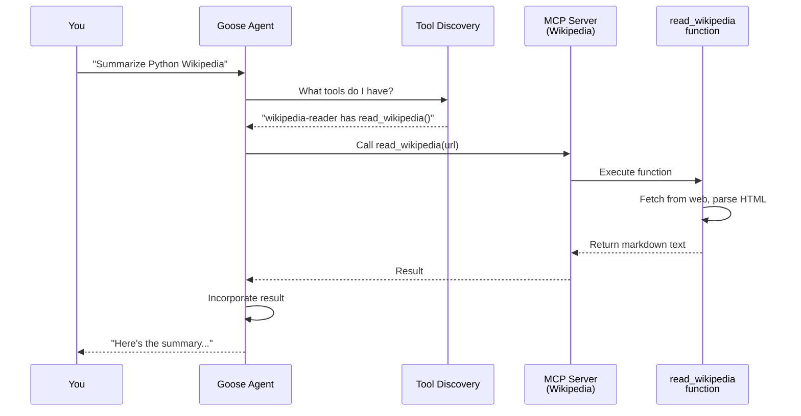

# Chapter 5: MCP (Model Context Protocol) Server

In [Chapter 4: ACP (Agent Control Protocol)](04_acp__agent_control_protocol__.md), you learned how different frontends (desktop, web, CLI) all talk to Goose through a standardized protocol. That protocol lets Goose *receive* requests and *send* responses.

But here's a new challenge: **What if Goose needs help?** What if you ask Goose to "find a Wikipedia article about Python" but Goose doesn't have the ability to browse the web? Or what if you want Goose to calculate something complex, fetch data from an API, or look up information in a database?

This is where the **MCP (Model Context Protocol) Server** comes in. It's an extensibility framework that lets you add **custom tools** to Goose. Like a plugin system where external services can register specialized abilities that Goose can use.

## What Problem Does This Solve?

Imagine you're an AI assistant, and someone asks you: *"Can you fetch the Wikipedia article about the history of chocolate and summarize it for me?"*

Without external tools, you'd have to say: *"I can't browse the web. I'm just text. Sorry!"*

But with MCP servers, Goose can say: *"Let me use my Wikipedia tool to fetch that article, then I'll read it and summarize it for you."*

**The real use case**: You want to extend Goose with specialized capabilities without modifying Goose's core code. For example:
- A **Wikipedia tool** that reads articles and converts them to text
- A **Calculator tool** that solves complex math problems
- A **Database tool** that queries your company's data
- A **Weather API tool** that fetches current conditions
- A **Custom business logic tool** specific to your organization

Instead of asking Goose to do everything, you let it *delegate* specialized tasks to external tools. MCP is the standardized way to build and connect these tools.

## Key Concepts

### 1. Tool: A Reusable Capability

A **tool** is a function that does one thing really well. Like a specialized screwdriver or hammer.

Examples:
- `read_wikipedia_article(url)` — Fetches and parses Wikipedia articles
- `calculate(expression)` — Solves math problems
- `query_database(sql)` — Runs SQL queries

A tool has three parts:
- **Name**: What you call it (`read_wikipedia_article`)
- **Parameters**: What input it needs (`url: string`)
- **Return value**: What it gives back (markdown text)

```python
def read_wikipedia_article(url: str) -> str:
    """Fetch and convert Wikipedia article to Markdown."""
    # ... fetch and convert ...
    return markdown_text
```

This is just a normal function. But when exposed through MCP, Goose can *call* it.

### 2. MCP Server: Your Tool's Home

An **MCP Server** is a program that exposes tools to Goose. Think of it like a toolbox—it holds multiple tools and says "here's what I can do."

An MCP server:
- Listens for requests from Goose
- Exposes a set of tools
- Executes tools when called
- Returns results back to Goose

It's like a vending machine: Goose inserts a coin (a request), selects a tool (a button), and gets the result (the item).

### 3. FastMCP: The Easy Way to Build Servers

Building an MCP server from scratch is complex. **FastMCP** is a framework that simplifies it. Instead of writing 200 lines of boilerplate code, you write this:

```python
from mcp.server.fastmcp import FastMCP

mcp = FastMCP("my-tools")

@mcp.tool()
def calculate(expression: str) -> str:
    return str(eval(expression))
```

The `@mcp.tool()` decorator automatically registers your function as a tool. FastMCP handles all the networking, serialization, and protocol details. You just write the function.

### 4. Tool Registration: Making Tools Available

When you decorate a function with `@mcp.tool()`, FastMCP **registers** it. This means:
- The tool is added to a registry
- Goose can discover it by name
- Goose can see what parameters it needs
- When called, FastMCP routes the request to your function

It's like registering your name with a directory service so people can find you.

### 5. Tool Consumption: Goose Using Tools

When you ask Goose something it can't do alone:

```
You: "Summarize the Wikipedia article on Python"

Goose: "I need to fetch that article. Let me call the Wikipedia tool..."
Goose calls: read_wikipedia_article("https://wikipedia.org/wiki/Python")

Wikipedia MCP Server: "Here's the article content as Markdown"

Goose: "Got it! Here's the summary: Python is a programming language..."
```

Goose sees the tool is available, calls it, gets the result, and incorporates it into its response.

## How to Use It: A Simple Example

Let's say you want to extend Goose with a Wikipedia tool so it can read articles. Here's how:

### Step 1: Create an MCP Server with One Tool

Create a new file `wikipedia_server.py`:

```python
from mcp.server.fastmcp import FastMCP
import requests
from bs4 import BeautifulSoup

mcp = FastMCP("wikipedia-reader")

@mcp.tool()
def read_wikipedia(url: str) -> str:
    """Fetch and return a Wikipedia article as text."""
    response = requests.get(url, timeout=10)
    return response.text  # Simplified
```

**What's happening**: 
- Create an MCP server named "wikipedia-reader"
- Register one tool: `read_wikipedia`
- The tool takes a Wikipedia URL and returns the content

### Step 2: Start the Server

In your terminal:

```bash
python wikipedia_server.py
```

The server now listens for requests. It's running locally on `localhost:3000` (or wherever you configure it).

### Step 3: Tell Goose About It

In Goose's configuration:

```yaml
mcp_servers:
  - name: "wikipedia"
    url: "localhost:3000"
```

This tells Goose: "Hey, there's an MCP server at this address. Load its tools."

### Step 4: Goose Uses Your Tool

Now when you ask Goose:

```
You: "What's on the Wikipedia page about Python?"

Goose: "Let me use the Wikipedia tool..."
(Calls: read_wikipedia("https://en.wikipedia.org/wiki/Python"))
"Here's what I found: Python is a programming language..."
```

That's it! Goose automatically discovered your tool and used it.

## How It Works: Step-by-Step

Here's what happens behind the scenes when Goose uses a tool:



**What's happening**:

1. **User asks Goose** something that requires external data
2. **Goose checks discovery** to see what tools are available
3. **Goose calls the tool** through the MCP server
4. **MCP server routes it** to the actual function
5. **Function executes** and returns a result
6. **Result goes back** through MCP to Goose
7. **Goose incorporates** the result into its response
8. **User sees** the final answer with real data

## Internal Implementation: The Plumbing

Now let's look at how MCP servers actually work under the hood.

### The Full Wikipedia Example

Let's look at the actual code provided to understand a real MCP server:

```python
from mcp.server.fastmcp import FastMCP
from mcp.types import ErrorData

mcp = FastMCP("wiki")

@mcp.tool()
def read_wikipedia_article(url: str) -> str:
    """
    Fetch a Wikipedia article and convert it to Markdown.
    """
    # Fetch the page
    response = requests.get(url, timeout=10)
    if response.status_code != 200:
        raise McpError(ErrorData(INTERNAL_ERROR, "Failed to fetch"))
    
    # Extract and convert
    soup = BeautifulSoup(response.text, "html.parser")
    # ... parsing logic ...
    return markdown_text
```

**What each part does**:
- `@mcp.tool()` — Registers this function as a tool Goose can call
- `url: str` — The tool expects one parameter: a URL
- `-> str` — The tool returns a string (the article content)
- Error handling — Returns proper error messages if something goes wrong

### Starting the Server

The `__init__.py` file has a `main()` function that starts the server:

```python
def main():
    """MCP Wiki server startup."""
    parser = argparse.ArgumentParser(
        description="Wikipedia article reader"
    )
    args = parser.parse_args()
    mcp.run()  # Start listening for requests
```

**What's happening**: When you run `python -m mcp_wiki`, this `main()` function runs `mcp.run()`, which:
1. Starts an HTTP/WebSocket server
2. Listens for requests from Goose
3. Routes requests to registered tools
4. Returns responses

It's like opening a shop and waiting for customers.

### How FastMCP Routes Requests

Behind the scenes, FastMCP does this routing:

```python
# When Goose calls read_wikipedia_article("some_url"):

# 1. Request arrives at MCP server
request = {"tool": "read_wikipedia_article", "params": {"url": "..."}}

# 2. FastMCP looks up the tool
function = mcp.tools["read_wikipedia_article"]

# 3. Call it with the parameters
result = function(url=request.params.url)

# 4. Return result to Goose
response = {"result": result}
```

It's simple: look up the tool, call it, return the result.

### Error Handling: When Tools Fail

Notice the code handles errors gracefully:

```python
try:
    # Try to fetch
    response = requests.get(url, timeout=10)
except RequestException as e:
    # Network error
    raise McpError(ErrorData(INTERNAL_ERROR, f"Request error: {str(e)}"))
except Exception as e:
    # Any other error
    raise McpError(ErrorData(INTERNAL_ERROR, f"Unexpected error: {str(e)}"))
```

**Why this matters**: If the tool fails, Goose gets a proper error message instead of a crash. Goose can then:
- Tell the user "Sorry, I couldn't fetch that Wikipedia page"
- Try an alternative approach
- Ask the user for help

## Multiple Tools: Building a Richer Server

You don't need just one tool per server. You can add multiple tools:

```python
mcp = FastMCP("my-tools")

@mcp.tool()
def read_wikipedia(url: str) -> str:
    """Read Wikipedia articles."""
    # ...

@mcp.tool()
def search_google(query: str) -> str:
    """Search Google."""
    # ...

@mcp.tool()
def calculate(expression: str) -> str:
    """Calculate math."""
    # ...
```

Now Goose has three tools from one server. Each tool is independent but all are grouped together.

## Connecting to Previous Chapters

Now you see how MCP fits into the bigger Goose architecture:

1. **[Chapter 1: Goose Chat WebSocket Interface](01_goose_chat_websocket_interface_.md)** — How you chat with Goose in real-time
2. **[Chapter 2: Goose Workflow Engine](02_goose_workflow_engine_.md)** — How recipes become executable workflows
3. **[Chapter 3: Temporal Service & Job Scheduling](03_temporal_service___job_scheduling_.md)** — How workflows run on a schedule
4. **[Chapter 4: ACP (Agent Control Protocol)](04_acp__agent_control_protocol__.md)** — How frontends talk to Goose
5. **This Chapter: MCP Server** — How Goose extends itself with external tools

The flow is:
- You ask Goose a question → ACP receives it
- Goose needs more information → MCP tools provide it
- Goose generates an answer → ACP sends it back to you

## Why MCP Matters: The Plugin System Benefit

Without MCP, Goose would be a closed system. With MCP, it's extensible:

| Without MCP | With MCP |
|------------|----------|
| Goose can't fetch web data | Build a web scraper MCP server ✓ |
| Goose can't do math | Build a calculator MCP server ✓ |
| Goose can't access databases | Build a database MCP server ✓ |
| Every new capability requires changing Goose | New tools work immediately ✓ |
| One company controls all features | Anyone can build MCP servers ✓ |

MCP makes Goose an **open platform** instead of a closed system.

## Real-World Analogy

Think of Goose as a librarian:

**Without MCP**: The librarian memorized everything. Can't know new information unless you retrain them.

**With MCP**: The librarian has access to:
- Wikipedia tool (for research)
- Calculator tool (for math)
- Database tool (for records)
- Expert consultants (custom tools)

The librarian asks the right tool for help, synthesizes the information, and gives you a complete answer.

## Putting It All Together

Here's the complete flow for a practical example:

1. **You ask Goose**: "Tell me about Python on Wikipedia and what it's used for"
2. **Goose thinks**: "I need to fetch that Wikipedia article"
3. **Goose calls tool**: Invokes `read_wikipedia_article("https://en.wikipedia.org/wiki/Python")`
4. **MCP server receives**: The request arrives at the Wikipedia MCP server
5. **Tool executes**: `read_wikipedia_article()` fetches and parses the page
6. **Tool returns**: The article content comes back to Goose
7. **Goose synthesizes**: Uses the article + its own knowledge to write a summary
8. **You see result**: "Python is a programming language created in 1989, known for its readability..."

All of this happens seamlessly because MCP standardizes how tools are built and called.

---

## Summary: What You've Learned

**MCP (Model Context Protocol) Server** is Goose's extension system:

- **Tools** are reusable functions that do specialized tasks
- **MCP Server** is a program that exposes tools to Goose
- **FastMCP** is a framework that makes building servers easy (just decorate functions!)
- **Tool registration** happens automatically with `@mcp.tool()`
- **Tool consumption** is automatic—Goose discovers and calls tools as needed
- **Extensibility** means you can add capabilities without modifying Goose
- **Error handling** ensures failed tools don't crash Goose
- **Multiple tools** can live in one server, grouped by domain

The beauty of MCP is that it's **standardized**. Any developer can build an MCP server and Goose will automatically use it. It's truly a plugin architecture.

---

You now understand how Goose extends itself with external tools through MCP! 🪿

Next, you'll learn about the [Process Manager](06_process_manager_.md), which is responsible for launching and managing processes safely—like the actual `goose` CLI commands that run your recipes and tools.

---

Generated by [AI Codebase Knowledge Builder](https://github.com/The-Pocket/Tutorial-Codebase-Knowledge)