# Chapter 6: Process Manager

In [Chapter 5: MCP (Model Context Protocol) Server](05_mcp__model_context_protocol__server_.md), you learned how Goose extends itself with external tools through MCP servers. These tools fetch data, calculate things, and query databases.

But here's a critical problem we haven't solved yet: **What happens when Goose actually *runs* those tools? When the system needs to launch a program (like running `goose execute-recipe` in the background), who makes sure it doesn't escape and run wild?**

When you start a program on your computer, it becomes a **process**—a running instance of code. Without careful management, things go wrong:
- Processes hang and never stop
- They keep consuming memory even after you cancel them
- Child processes keep running in the background, invisible to you
- When you close your app, orphan processes remain
- One rogue process can crash your entire system

This is where the **Process Manager** comes in. It's like a babysitter for processes—it tracks which processes belong to which jobs, handles graceful shutdowns, and forcefully kills unresponsive ones when needed. Think of it as the **grim reaper** that ensures no process escapes.

## What Problem Does This Solve?

Imagine you schedule a Goose task: "Analyze this 10GB file and email me the results."

The task starts running. But then:
- The user clicks "Cancel Task"
- Or the system needs to shut down
- Or the task takes too long and times out

Without a Process Manager, the analysis process **keeps running in the background**, consuming CPU and memory even though you cancelled it. Your system slows down. Days later, you're still wondering why the file is still being analyzed.

With the Process Manager:
1. When you click "Cancel," it immediately sends a polite stop signal
2. If the process doesn't stop after 1 second, it sends a force-kill signal
3. The process **actually stops** and releases all resources
4. Your system is clean again

**The real use case**: When a user cancels a job, or when a scheduled job times out, or when the system shuts down, the Process Manager ensures that:
- All spawned processes stop cleanly
- No orphan processes linger in the background
- Resources (memory, file handles, CPU) are released immediately
- The system is left in a clean state

## Key Concepts

### 1. Process: A Running Program

A **process** is a running instance of code. When you launch a program, the operating system creates a process to run it.

Each process has:
- **PID (Process ID)**: A unique number to identify it (like "12345")
- **Parent-Child relationship**: A process can spawn child processes
- **Resource usage**: CPU time, memory, file handles
- **State**: Running, stopped, zombie, etc.

Think of it like starting a movie: the process is the movie playing; the PID is your ticket number; the resources are the electricity and theater equipment being used.

### 2. Process Group: Related Processes

On Unix systems, processes form **groups**. One main process and all its children belong to the same group. This lets you control them as a unit.

Think of it like a family: if you tell the parent to go home, you might need to gather all the children too. You don't want to leave kids behind!

### 3. Graceful Shutdown vs Force Kill: The Two Strategies

The Process Manager uses a **two-stage shutdown strategy**:

**Stage 1: Graceful Shutdown (SIGTERM)**
- Send a polite signal: "Hey, please stop"
- The process can clean up, save files, close connections
- Wait 1 second for it to stop

**Stage 2: Force Kill (SIGKILL)**
- If it still hasn't stopped, send a forced kill signal
- The process **must stop immediately**
- No cleanup possible; it's just dead
- Think of it like yanking the power cord

Most well-behaved programs respond to SIGTERM. Stuck processes need SIGKILL.

### 4. Platform Awareness: Windows vs Unix

Different operating systems kill processes differently:

**Unix/Linux**: Uses signals (`SIGTERM`, `SIGKILL`) and process groups
**Windows**: Uses `taskkill` command and process trees

The Process Manager automatically detects your OS and uses the right method.

### 5. Job Tracking: Who Owns Which Process?

The Process Manager tracks a mapping:
```
Job ID → Process ID → Actual Running Process
```

When you want to cancel "my-email-summary" job, the Process Manager looks it up: "Oh, that's process 12345. Let me kill it."

## How to Use It: A Simple Example

Let's say you're running a Goose task and need to cancel it cleanly. Here's how the Process Manager handles it:

### Step 1: Job Starts and Spawns a Process

When a job starts, the Workflow Engine spawns a new process. The Process Manager records it:

```go
// When a job starts:
processManager.AddProcess(
  jobID: "email-summary-123",
  process: &Process{PID: 12345},
  cancel: cancelFunc,
)
```

**What's happening**: "I'm now tracking process 12345 which belongs to job 'email-summary-123'."

### Step 2: User Cancels the Job

The user clicks "Cancel" in the Goose app:

```go
// User requests cancellation
ProcessManager.KillProcess("email-summary-123")
```

**What's happening**: "Kill the process that belongs to this job."

### Step 3: Process Manager Stops It Cleanly

The Process Manager executes the two-stage shutdown:

```go
// Stage 1: Try graceful shutdown
sendSignal(process, SIGTERM)
wait(1 * time.Second)

// Stage 2: If still running, force kill
sendSignal(process, SIGKILL)
```

**What's happening**: "First ask nicely. If no response in 1 second, force kill it."

### Step 4: Process Is Removed

Once the process is actually dead, the Process Manager forgets about it:

```go
ProcessManager.RemoveProcess("email-summary-123")
```

**What's happening**: "Process is gone. Stop tracking it."

## How It Works: Step-by-Step

Here's the complete journey of process lifecycle management:

```mermaid
sequenceDiagram
    participant User as User
    participant WE as Workflow<br/>Engine
    participant PM as Process<br/>Manager
    participant OS as Operating<br/>System
    participant Process as Child<br/>Process

    User->>WE: Start job
    WE->>OS: Spawn new process
    OS->>Process: Create process (PID 12345)
    WE->>PM: AddProcess(jobID, process)
    PM->>PM: Track: jobID → PID 12345
    
    Process->>Process: Running... doing work...
    
    User->>PM: Cancel job
    PM->>OS: Send SIGTERM to PID 12345
    OS->>Process: Receive SIGTERM
    Process->>Process: Clean up gracefully
    
    alt Process stops quickly
        Process->>OS: Exit normally
        OS-->>PM: Process ended
    else Process ignores signal
        PM->>OS: Send SIGKILL to PID 12345
        OS->>Process: Force terminate!
        Process->>OS: Forced exit
    end
    
    PM->>PM: RemoveProcess(jobID)
    PM-->>User: Cancelled ✓
```



**What's happening**:

1. **Job starts**: Workflow Engine spawns a process
2. **Process tracked**: Process Manager records the mapping
3. **Process runs**: Does its work
4. **Cancel request**: User clicks "stop"
5. **Graceful attempt**: SIGTERM signal sent (polite stop)
6. **Wait period**: 1 second to see if it stops
7. **Force kill if needed**: SIGKILL signal sent (mandatory stop)
8. **Cleanup**: Process Manager removes the tracking
9. **User sees**: "Cancelled ✓"

## Internal Implementation: The Plumbing

Let's look at how the Process Manager actually works under the hood.

### The Process Manager Data Structure

The Process Manager stores information about running processes:

```go
type ProcessManager struct {
  processes map[string]*ManagedProcess
  mutex     sync.RWMutex  // Thread safety
}

type ManagedProcess struct {
  JobID     string
  Process   *os.Process
  Cancel    context.CancelFunc
  StartTime time.Time
}
```

**What each part means**:
- `processes` — Map from Job ID to process details
- `mutex` — Lock to prevent race conditions (multiple threads accessing at once)
- `ManagedProcess` — Records for one running process
- `Cancel` — Function to cancel the context (stops the process)

### Adding a Process to Management

When a job starts and spawns a process, the Workflow Engine tells the Process Manager:

```go
func (pm *ProcessManager) AddProcess(
  jobID string,
  process *os.Process,
  cancel context.CancelFunc,
) {
  pm.mutex.Lock()
  defer pm.mutex.Unlock()
  
  pm.processes[jobID] = &ManagedProcess{
    JobID: jobID,
    Process: process,
    Cancel: cancel,
  }
}
```

**What's happening**:
1. Lock the mutex (exclusive access—no other thread can modify)
2. Add to the map: `processes[jobID] = ManagedProcess`
3. Unlock the mutex (other threads can access again)

### Killing a Process (The Two-Stage Strategy)

Here's where the real work happens—the graceful-then-forced shutdown:

```go
func (pm *ProcessManager) KillProcess(jobID string) error {
  pm.mutex.Lock()
  defer pm.mutex.Unlock()

  mp := pm.processes[jobID]
  
  // Stage 1: Cancel context (graceful)
  mp.Cancel()
  
  // Stage 2: Kill process group with signals
  killProcessGroup(mp.Process)
  
  delete(pm.processes, jobID)  // Forget about it
  return nil
}
```

**What's happening**:
1. Find the process for this job ID
2. Call `Cancel()` to gracefully stop
3. Send kill signals to the process
4. Remove from tracking

### Platform-Specific Killing: Unix vs Windows

Unix and Windows have different process management models. The Process Manager handles both.

**For Unix (Linux, macOS)**:

```go
// Unix: Kill the entire process group
func killProcessGroupByPID(pid int, signal syscall.Signal) error {
  return syscall.Kill(-pid, signal)
  // Negative PID means "kill entire process group"
}
```

**What's happening**: The minus sign (`-pid`) tells Unix "kill the process AND all its children."

**For Windows**:

```go
// Windows: Use taskkill command
func killProcessGroupByPID(pid int, signal syscall.Signal) error {
  cmd := exec.Command(
    "taskkill",
    "/F",      // Force kill
    "/T",      // Kill process tree (children too)
    "/PID", fmt.Sprintf("%d", pid),
  )
  return cmd.Run()
}
```

**What's happening**: Windows doesn't have process groups, so we use `taskkill` with `/T` (kill tree) to kill children.

### The Graceful-Then-Forced Shutdown Flow

Here's the complete shutdown logic:

```go
func killProcessGroup(process *os.Process) error {
  pid := process.Pid
  
  // Stage 1: Try graceful shutdown with SIGTERM
  killProcessByPID(pid, syscall.SIGTERM)
  time.Sleep(1 * time.Second)  // Wait 1 second
  
  // Stage 2: Force kill with SIGKILL
  killProcessByPID(pid, syscall.SIGKILL)
  
  return nil
}
```

**What's happening**:
1. Send SIGTERM (graceful stop request)
2. Wait 1 second
3. If still running, send SIGKILL (forced stop)

This is like: "Stop what you're doing" (SIGTERM) → wait a moment → "I said STOP!" (SIGKILL).

### Finding Orphan Processes

Sometimes processes escape or become orphaned. The Process Manager can find them:

```go
func FindAndKillProcessesByPattern(jobID string) int {
  // Search for processes matching this job
  pattern := fmt.Sprintf("scheduled-%s", jobID)
  
  // On Unix: use pgrep to find matching processes
  cmd := exec.Command("pgrep", "-f", pattern)
  output, _ := cmd.Output()
  
  // Kill each found process
  // ...
}
```

**What's happening**: Search for any running process that mentions this job ID, then kill them all.

## Connection to Previous Chapters

The Process Manager is the **execution layer** beneath everything else:

1. **[Chapter 1: Goose Chat WebSocket Interface](01_goose_chat_websocket_interface_.md)** — How you talk to Goose
2. **[Chapter 2: Goose Workflow Engine](02_goose_workflow_engine_.md)** — How recipes become workflows
3. **[Chapter 3: Temporal Service & Job Scheduling](03_temporal_service___job_scheduling_.md)** — How workflows run on schedule
4. **[Chapter 4: ACP (Agent Control Protocol)](04_acp__agent_control_protocol__.md)** — How interfaces talk to Goose
5. **[Chapter 5: MCP (Model Context Protocol) Server](05_mcp__model_context_protocol__server_.md)** — How Goose uses external tools
6. **This Chapter: Process Manager** — How processes are spawned and safely managed

The Process Manager is the **safety net**. Without it, canceled jobs would keep running forever. With it, every spawned process is guaranteed to stop when needed.

## Why Process Manager Matters: Resource Cleanup

Without proper process management, your system becomes polluted:

| Without Process Manager | With Process Manager |
|-------------------------|----------------------|
| Cancel job → process keeps running | Cancel job → process stops immediately |
| System shutdown → orphan processes remain | System shutdown → all processes killed cleanly |
| Memory keeps growing | Memory properly released |
| Hard to debug what's running | Full visibility and control |
| Jobs interfere with each other | Jobs are isolated |

The Process Manager ensures your system **stays clean** no matter what happens.

## Real-World Analogy

Think of the Process Manager as a **event venue staff member**:

- **AddProcess**: Guest arrives, you give them a wristband (PID) and note which event they're at (jobID)
- **Job running**: Guest is enjoying the event
- **User cancels**: Event ends, guests must leave
- **Graceful shutdown**: You ask nicely: "Event's over, please leave" (SIGTERM)
- **Wait 1 second**: Give guests time to gather their stuff
- **Force kill**: Still here? Security escorts you out immediately (SIGKILL)
- **RemoveProcess**: Guest is gone, remove their wristband

The Process Manager is the staff member ensuring everyone actually leaves when the event ends.

## Putting It All Together

Here's the complete process lifecycle in Goose:

1. **User schedules a task**: "Summarize my emails every morning"
2. **Scheduled time arrives**: Temporal triggers the job
3. **Workflow Engine starts**: Spawns a child process
4. **Process Manager records**: "Job 'email-123' is process PID 5678"
5. **Process runs**: Analyzes emails, generates summary
6. **Completes successfully**: Process exits normally
7. **Process Manager notices**: PID 5678 is gone, removes tracking
8. **Next day**: Same thing happens

But if something goes wrong:

1. **Process hangs**: Takes too long or hits an error
2. **Job times out**: Temporal says "this is taking too long"
3. **Cancellation signal**: Process Manager gets the kill order
4. **Graceful attempt**: SIGTERM sent (1 second wait)
5. **Force kill**: SIGKILL sent if needed
6. **Cleanup complete**: Resources released, job marked as cancelled
7. **System is clean**: Ready for next job

---

## Summary: What You've Learned

**Process Manager** is Goose's process lifecycle controller:

- **Processes** are running instances of code with unique PIDs
- **Process groups** on Unix let you control parent + children as a unit
- **Graceful shutdown** (SIGTERM) asks nicely; **force kill** (SIGKILL) stops forcibly
- **Two-stage strategy**: Try graceful first (1 second), then force kill if needed
- **Platform awareness**: Handles Windows and Unix differently
- **Job tracking**: Maps job IDs to processes for easy cancellation
- **Resource cleanup**: Ensures no orphan processes linger
- **Orphan detection**: Can search for and kill escaped processes

The Process Manager ensures that every spawned process is tracked, controllable, and ultimately killable—no runaway processes, no resource leaks, no system pollution.

---

You now understand how Goose safely manages child processes! 🪿

Next, you'll learn about the [Desktop Build & Deployment System](07_desktop_build___deployment_system_.md), which packages Goose into a usable desktop application that you can install on your computer.

---

Generated by [AI Codebase Knowledge Builder](https://github.com/The-Pocket/Tutorial-Codebase-Knowledge)