# Chapter 7: Desktop Build & Deployment System

In [Chapter 6: Process Manager](06_process_manager_.md), you learned how Goose safely manages spawned processes—ensuring they start, run, and stop cleanly without leaving orphans behind.

But here's the final puzzle piece: **How do you turn Goose into a real desktop application that normal users can install on their computer?** How do you package everything (the agent backend, the UI, all the bundled tools like `temporal`, `jbang`, `uvx`) into a single installer that works on Windows, macOS, and Linux?

That's what the **Desktop Build & Deployment System** does. It's like a factory that takes all the Goose components, packages them together, and creates platform-specific installers (`.exe` for Windows, `.dmg` for macOS, `.AppImage` for Linux). It also registers special `goose://` links so you can click a link in your browser and have it open Goose automatically.

## What Problem Does This Solve?

Imagine you want to give Goose to a friend who's not a developer. You can't just say "clone the repo, install Node.js, run npm install, compile the Go backend...". They'd give up in 5 minutes!

Instead, you want to:
1. **Create installers**: One-click installers for each platform (`.exe`, `.dmg`, `.deb`)
2. **Package binaries**: Include all the bundled tools (temporal, jbang, etc.) inside
3. **Register protocols**: Make `goose://` links clickable in browsers
4. **Handle code signing**: Sign the app so users trust it (not just random executable)
5. **Make it cross-platform**: Same app works on Windows, macOS, Linux

Without this system, you'd manually compile for each platform, manage file paths, handle code signing separately, and pray it works. **The Desktop Build & Deployment System automates all of this.**

**The real use case**: A user gets a download link, clicks it, runs the installer, and 2 minutes later they're using Goose with a nice desktop GUI. No terminal commands. No compilation. No confusion.

## Key Concepts

### 1. Electron: The Framework

**Electron** is a framework that lets you build desktop apps using web technologies (HTML, CSS, JavaScript). Think of it as "a browser that looks like an app."

Goose's desktop UI uses Electron because:
- Write once, run everywhere (Windows, macOS, Linux)
- Use React/Vue for the interface (fast development)
- Package it into a standalone executable

Instead of building separate Windows, macOS, and Linux apps, you build one Electron app and Electron handles the differences.

### 2. Platform-Specific Binaries: Windows vs Unix

Goose bundles tools like `temporal`, `goose` CLI, and `jbang`. But these tools are compiled for specific platforms:

- **Windows**: `.exe` files (executables for Windows)
- **macOS/Linux**: Unix executables (no extension)

The build system needs to:
- Keep platform-specific binaries in different folders
- When building for Windows, include Windows binaries
- When building for macOS, include macOS binaries
- Clean up binaries that don't belong on the current platform

Think of it like packing a suitcase: you don't pack winter coats when vacationing in Hawaii. Similarly, don't include Windows EXEs in a macOS app.

### 3. Deep-Link Protocols: `goose://` URLs

Deep-link protocols let you click a special link and launch an app. Like `mailto:` opens your email, `goose://` opens Goose.

For example, a user visits a website and clicks:
```
<a href="goose://install?recipe=weather">Install Weather Recipe</a>
```

The browser sees `goose://` and automatically:
1. Opens the Goose app
2. Passes the parameters (`recipe=weather`)
3. Goose processes it (installs the recipe, etc.)

This requires **registering the protocol** with your operating system so the OS knows "goose:// should open this app."

### 4. Code Signing: Trust & Security

Code signing is like putting your fingerprint on a letter. It proves:
- "This app really came from the developer who says it did"
- "The app hasn't been tampered with"
- Users can trust it

Without code signing, macOS shows scary warnings: "This app is from an unknown developer. Do you really want to run it?" With signing, users see your name and trust the app.

### 5. Bundling: Everything in One Package

The build system bundles:
- Electron runtime (the browser-like container)
- Goose React UI (the interface)
- Goose agent backend (compiled Go binary)
- Platform tools (temporal, jbang, uvx)
- All dependencies

Result: One `.exe` / `.dmg` / `.AppImage` file that contains everything. Users don't need to install anything else.

## How to Use It: A Simple Example

Let's say you want to build Goose for Windows. Here's what you do:

### Step 1: Configure Build Settings

Create a configuration that says "I'm building for Windows":

```javascript
// build.config.js
{
  targetPlatform: 'win32',
  bundleId: 'com.block.goose',
  version: '1.0.0'
}
```

This tells the build system: "Create a Windows app, version 1.0.0, with this identifier."

### Step 2: Run the Build Script

Run the platform-specific build:

```bash
npm run build:win
```

**What happens internally**: The system:
- Compiles the React UI
- Compiles the Go backend
- Copies Windows binaries to the app
- Removes macOS/Linux binaries (clean up cross-platform files)
- Packages everything with Electron
- Creates a `.exe` installer

### Step 3: Sign the Application

On a macOS/Windows machine, sign the app with your certificate:

```bash
npm run sign
```

This adds your digital signature so users know it's from you, not an impostor.

### Step 4: Distribute

Upload the installer to your website. Users download and run it—one click and Goose is installed.

## How It Works: Step-by-Step

Here's what happens when the build system prepares platform-specific binaries:

```mermaid
sequenceDiagram
    participant Dev as Developer
    participant BuildSys as Build System
    participant BinMgr as Binary Manager
    participant Packager as Packager
    participant User as User

    Dev->>BuildSys: npm run build:win
    BuildSys->>BinMgr: Prepare binaries for Windows
    BinMgr->>BinMgr: Copy Windows .exe files
    BinMgr->>BinMgr: Remove macOS/Linux binaries
    BinMgr-->>BuildSys: ✓ Binaries ready
    BuildSys->>Packager: Bundle UI, backend, binaries
    Packager->>Packager: Run Electron packaging
    Packager-->>BuildSys: ✓ Installer created
    BuildSys-->>Dev: goose-1.0.0-setup.exe
    Dev->>User: Share installer link
    User->>User: Download & run installer
    User-->>User: Goose app appears! 🎉
```



**What's happening**:

1. **Developer runs build**: Asks system to build for Windows
2. **Binary preparation**: Copy Windows EXEs, remove macOS binaries
3. **UI compilation**: React UI gets compiled to optimized JavaScript
4. **Backend compilation**: Go backend compiled to Windows executable
5. **Packaging**: Electron bundles everything together
6. **Installer created**: Windows `.exe` installer is ready
7. **User downloads**: Gets the installer
8. **User runs**: One click, Goose is installed and running

## Internal Implementation: The Plumbing

Now let's look at how the build system actually works.

### Preparing Platform Binaries

The first step is separating platform-specific files. The provided script `prepare-platform-binaries.js` does this:

```javascript
function preparePlatformBinaries() {
  const targetPlatform = process.env.ELECTRON_PLATFORM;
  
  copyPlatformFiles(targetPlatform);     // Copy correct files
  cleanBinDirectory(targetPlatform);     // Remove wrong platform files
}
```

**What this does**: Decides which platform you're building for, copies the right binaries, and deletes the wrong ones.

### Platform Detection and File Matching

For each platform, different files are kept:

```javascript
const windowsFiles = ['*.exe', '*.dll', '*.cmd', 'goose-npm/**/*'];
const macosFiles = ['goosed', 'goose', 'temporal', 'jbang', 'npx'];

function matchesPattern(filename, patterns) {
  // Check if filename matches any pattern
  // *.exe → matches "temporal.exe" (Windows)
  // temporal → matches "temporal" (macOS)
}
```

**What this does**: Defines patterns for each platform. On Windows, keep `.exe` files. On macOS, keep executables without extensions.

### Copying Platform-Specific Files

For Windows, copy from the Windows-specific directory:

```javascript
function copyPlatformFiles(targetPlatform) {
  if (targetPlatform === 'win32') {
    const files = fs.readdirSync(platformWinDir);
    files.forEach(file => {
      fs.copyFileSync(srcPath, destPath);
    });
  }
}
```

**What this does**: If building for Windows, copy all `.exe` and `.dll` files from the Windows directory. For macOS/Linux, just use what's already there.

### Cleaning Cross-Platform Files

Remove files that don't belong on this platform:

```javascript
function cleanBinDirectory(targetPlatform) {
  const files = fs.readdirSync(srcBinDir);
  
  files.forEach(file => {
    if (targetPlatform === 'win32') {
      // Remove macOS/Linux files
      if (!matchesPattern(file, windowsFiles)) {
        fs.unlinkSync(filePath);  // Delete it
      }
    }
  });
}
```

**What this does**: Iterate through all files. If a file doesn't match the target platform, delete it. No Windows EXEs in a macOS app!

### Building the Main Process

The Electron app has two parts: renderer (UI) and main (system interactions). The build script compiles the main process:

```javascript
async function buildMain() {
  await build({
    configFile: 'vite.main.config.mts',
    build: {
      ssr: true,  // Server-side rendering
      rollupOptions: {
        external: ['electron', 'path', 'fs']  // Don't bundle these
      }
    }
  });
}
```

**What this does**: Compile the main process (written in TypeScript) using Vite. Mark certain libraries as "external" (don't bundle them—they come with Electron).

### Deep-Link Protocol Registration

When the app installs, it registers the `goose://` protocol. On macOS, this happens in the Info.plist (configuration file):

```xml
<key>CFBundleURLTypes</key>
<array>
  <dict>
    <key>CFBundleURLName</key>
    <string>Goose Deep Link</string>
    <key>CFBundleURLSchemes</key>
    <array>
      <string>goose</string>  <!-- Register goose:// -->
    </array>
  </dict>
</array>
```

**What this does**: Tell macOS "this app handles goose:// URLs." Now when a user clicks `goose://recipe=weather`, macOS opens Goose automatically.

### Unregistering Protocols (Cleanup)

The provided `unregister-deeplink-protocols.js` script cleans up old registrations:

```javascript
function unregisterAllProtocolHandlers() {
  const lsregisterOutput = execSync(
    '/System/Library/Frameworks/CoreServices.framework/...' +
    'lsregister -dump | grep ${PROTOCOL}'
  );
  // Find all registered Goose apps and unregister them
}
```

**What this does**: Find all Goose applications registered with the OS and unregister them. This prevents old versions from conflicting with new ones.

## Connecting to Previous Chapters

The Desktop Build & Deployment System sits at the **top level** of Goose's architecture:

1. **[Chapter 1: Goose Chat WebSocket Interface](01_goose_chat_websocket_interface_.md)** — Real-time chat
2. **[Chapter 2: Goose Workflow Engine](02_goose_workflow_engine_.md)** — Execute recipes
3. **[Chapter 3: Temporal Service & Job Scheduling](03_temporal_service___job_scheduling_.md)** — Schedule tasks
4. **[Chapter 4: ACP (Agent Control Protocol)](04_acp__agent_control_protocol__.md)** — Frontend communication
5. **[Chapter 5: MCP (Model Context Protocol) Server](05_mcp__model_context_protocol__server_.md)** — External tools
6. **[Chapter 6: Process Manager](06_process_manager_.md)** — Safe process execution
7. **This Chapter: Desktop Build & Deployment System** — Package it all into a desktop app

All these components are bundled together by the Desktop Build & Deployment System and delivered as a single installer to users.

## Why This Matters: From Development to Users

Without a proper build & deployment system:

| Without System | With System |
|---|---|
| Users need Node.js, Python, Go installed | One click to install |
| Manual compilation for each platform | Automatic cross-platform builds |
| Hard to keep binaries in sync | All binaries bundled and versioned |
| Deep-link protocols don't work | `goose://` links work automatically |
| Insecure unsigned apps | Code-signed apps users trust |
| File path chaos | Organized, predictable structure |

The system ensures that **from development to user installation is seamless and reliable**.

## Real-World Analogy

Think of the build system as a **manufacturing factory**:

- **Input**: Raw materials (source code, binaries, dependencies)
- **Platform-specific lines**: Separate assembly lines for Windows, macOS, Linux
- **Quality control**: Remove parts that don't belong
- **Packaging**: Put everything in a box (the installer)
- **Signing**: Stamp your name on the box (code signing)
- **Shipping**: Send to stores (users' computers)

Each platform gets the **right product for their platform**. No mixing.

## Putting It All Together

Here's the complete journey from source code to user's desktop:

1. **Developer commits code**: Push changes to repository
2. **CI/CD pipeline triggers**: Automated build system starts
3. **Platform detection**: System knows we're building for Windows
4. **Binary preparation**: Copy Windows .exe files, remove macOS files
5. **UI compilation**: React code becomes optimized JavaScript
6. **Backend compilation**: Go code becomes Windows executable
7. **Bundling**: Electron packages everything together
8. **Code signing**: Sign with developer certificate
9. **Installer creation**: Windows `.exe` installer created
10. **Distribution**: Upload to GitHub Releases / website
11. **User downloads**: Clicks download link
12. **One-click install**: User runs installer
13. **App launches**: Goose desktop app opens with all features
14. **Deep-link registration**: `goose://` protocol now works in browser
15. **First use**: User can now chat with Goose, schedule tasks, use tools

All automated. Zero manual steps (except running `npm run build:win`).

---

## Summary: What You've Learned

**Desktop Build & Deployment System** turns Goose's components into a user-ready app:

- **Electron** packages the UI and backend as a desktop app
- **Cross-platform support** means one codebase builds for Windows, macOS, Linux
- **Binary management** ensures platform-correct files are bundled
- **Platform detection** automatically uses the right binaries
- **Deep-link protocols** register `goose://` so browser links work
- **Code signing** proves the app is legitimate and trustworthy
- **Bundling** includes all dependencies (temporal, jbang, uvx, etc.)
- **One-click installation** makes it easy for non-technical users

The system automates the entire process from source code → installer → user's computer, ensuring a smooth, professional experience.

---

**Key Takeaways:**

✅ Electron lets you build cross-platform desktop apps with web tech  
✅ Platform-specific binaries are separated and selectively bundled  
✅ The build system cleans up files that don't belong on each platform  
✅ Deep-link protocols make special URLs (goose://) work  
✅ Code signing proves app authenticity  
✅ Everything is automated—developers run one command, users get a polished installer  

You now understand how Goose goes from source code to a professional desktop application! 🪿

Next, you'll learn about the [Install Link Generator](08_install_link_generator_.md), which creates special shareable links that users can click to automatically download and install Goose with pre-configured settings!

---

Generated by [AI Codebase Knowledge Builder](https://github.com/The-Pocket/Tutorial-Codebase-Knowledge)