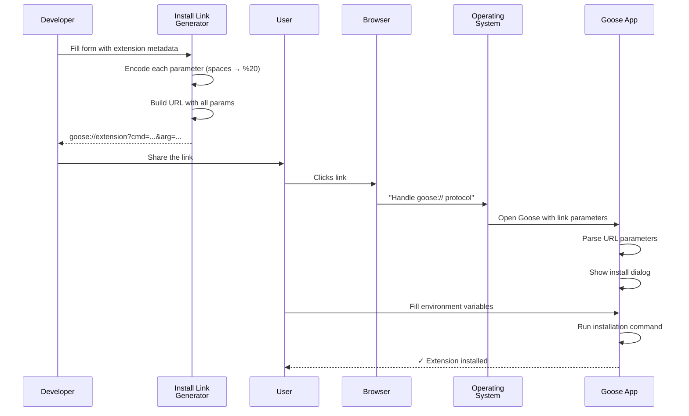

# Chapter 8: Install Link Generator

In [Chapter 7: Desktop Build & Deployment System](07_desktop_build___deployment_system_.md), you learned how Goose gets packaged into a desktop application and how users can install it with one click. That solves the problem of getting Goose on users' computers.

But here's the next challenge: **After Goose is installed, how do users easily install and configure extensions?** Imagine you built a super useful Wikipedia tool (like in [Chapter 5: MCP (Model Context Protocol) Server](05_mcp__model_context_protocol__server_.md)). You want to share it with friends. What do you send them?

Without an install link system, you'd have to tell them:
> "Run these commands: `goose extension install`, enter this ID: `wiki-reader`, set these env vars: `API_KEY=xxx`, etc."

That's terrible! Most people would give up.

With the **Install Link Generator**, you just send them one link:
```
goose://extension?cmd=npx&arg=%40myorg%2Fwiki-reader&id=wiki-reader&name=Wikipedia%20Reader
```

They click it, and the extension is installed automatically. That's the magic of this chapter.

## What Problem Does This Solve?

Imagine you're a developer who built an MCP server (a Goose extension). You want to share it with the world. You want users to:
1. Click a link
2. The Goose app opens automatically
3. The extension installs
4. Goose prompts for any required environment variables (API keys, etc.)
5. Done!

Without the Install Link Generator, sharing extensions is painful. With it, it's a single click. The Install Link Generator is essentially a **URL factory**—it takes extension metadata (name, command, environment variables) and compresses it into a shareable `goose://` deep link.

**The real use case**: You build an extension and tweet: "Try my new weather tool!" with a link. Users click the link in the browser, and instantly the extension starts installing. No setup, no documentation, no "run this command in terminal."

## Key Concepts

### 1. Deep-Link: A Special URL That Opens an App

A **deep-link** is a URL that opens an app directly to a specific place or action. Examples you know:

- `mailto:hello@example.com` → Opens your email app
- `sms:+1234567890` → Opens messaging app
- `http://example.com` → Opens browser

**`goose://extension`** is a deep-link that opens Goose and says "install an extension with these parameters."

When you click a `goose://` link, the browser tells the operating system: "Hey, this link is for the Goose app!" The OS then opens Goose with the link's parameters.

### 2. URL Encoding: Making Unsafe Characters Safe

URLs can only contain certain characters. For example, spaces aren't allowed. So we need to **encode** special characters.

Common encodings:
- Space ` ` → `%20`
- Forward slash `/` → `%2F`
- Equals `=` → `%3D`
- Ampersand `&` → `%26`

So "My Tool" becomes `"My%20Tool"`. It's called **percent encoding** because each unsafe character becomes `%` followed by two hexadecimal digits.

**Why?** URLs are just text, and some characters have special meanings in URLs. We encode them to preserve their literal meaning.

### 3. Query Parameters: Passing Information in URLs

The part after the `?` in a URL is called **query parameters**. They're key-value pairs separated by `&`:

```
goose://extension?cmd=npx&arg=my-tool&id=tool-123&name=My%20Tool
                  └────────────┬────────────────────────────────┘
                         Query Parameters
```

Reading it:
- `cmd` = `npx` (the command to run)
- `arg` = `my-tool` (an argument to that command)
- `id` = `tool-123` (the extension ID)
- `name` = `My%20Tool` (the extension name, with space encoded)

Each parameter carries information that Goose needs to install the extension.

### 4. Extension Types: Built-In vs Custom

There are two types of extensions:

**Built-In Extensions**: Official Goose extensions, managed by the core team. Example: `goose://extension?cmd=goosed&arg=mcp&arg=temporal`

These are simple because they're pre-packaged with Goose.

**Custom Extensions**: User-built or third-party tools. They might be NPM packages, Python packages, or shell scripts. Example: `goose://extension?cmd=npx&arg=@myorg/weather-tool&id=weather`

These are more complex because they can come from anywhere and might need configuration.

### 5. Environment Variables: Configuration Parameters

Many extensions need configuration. For example, a weather tool needs an API key. **Environment variables** let users provide these.

The link can encode environment variables:
```
goose://extension?...&env=API_KEY%3D%3C%20Enter%20your%20API%20key%20%3E
```

This tells Goose: "Ask the user for an environment variable called API_KEY with the description 'Enter your API key'."

When users click the link, Goose shows a form asking them to fill in these values.

## How to Use It: A Simple Example

Let's say you built an NPM-based extension called `@myorg/weather-tool` that shows weather forecasts. You want to create a shareable install link.

### Step 1: Gather Your Extension Information

You have:
- **Command**: `npx` (run via NPM)
- **Command arguments**: `@myorg/weather-tool` (the package name)
- **Extension ID**: `weather-tool` (internal identifier)
- **Name**: `Weather Tool` (display name)
- **Description**: `Shows weather forecasts`
- **Required config**: `API_KEY` (the user needs to provide their OpenWeather API key)

### Step 2: Use the Install Link Generator UI

Go to the Install Link Generator tool (a web UI in Goose):

1. Click the "Custom Extension" tab (not built-in)
2. Fill in the form:
   - Command: `npx`
   - Arguments: `@myorg/weather-tool`
   - Extension ID: `weather-tool`
   - Name: `Weather Tool`
3. Click "Add Environment Variable"
   - Variable Name: `API_KEY`
   - Description: `Your OpenWeather API key`
4. Click "Generate Link"

The tool outputs:
```
goose://extension?cmd=npx&arg=%40myorg%2Fweather-tool&id=weather-tool&name=Weather%20Tool&env=API_KEY%3DYour%20OpenWeather%20API%20key
```

### Step 3: Share the Link

Post it on social media, put it on your website, or send it to friends:

```html
<a href="goose://extension?cmd=npx&arg=%40myorg%2Fweather-tool...">
  Install Weather Tool
</a>
```

Or just send the raw URL.

### Step 4: User Clicks the Link

A user clicks the link in their browser. Three things happen:

1. **Browser recognizes `goose://`**: "This is for the Goose app"
2. **Opens Goose**: The Goose desktop app launches
3. **Passes parameters**: Goose receives the extension metadata and environment variable requirements
4. **Shows install dialog**: "Install Weather Tool? You'll need to provide: API_KEY"
5. **User fills in**: Enters their API key
6. **Extension installs**: Goose runs the command and configures everything
7. **Done!**: User can now ask Goose about the weather

No terminal commands. No manual installation. One click.

## How It Works: Step-by-Step

Here's what happens internally when the Install Link Generator creates a link and the user clicks it:



**What's happening**:

1. **Developer inputs metadata**: Extension name, command, required config
2. **Generator encodes**: Converts unsafe characters to percent-encoding
3. **Generator builds URL**: Combines all parameters into one link
4. **User clicks link**: In browser or app
5. **Browser routes to Goose**: OS sees `goose://` and opens Goose app
6. **Goose parses parameters**: Extracts all the metadata from the URL
7. **Goose shows dialog**: "Install this? Need these config values"
8. **User provides config**: Enters API key or other environment variables
9. **Goose installs**: Runs the command with the variables set
10. **Done**: Extension is ready to use

## Internal Implementation: The Plumbing

Now let's look at how the Install Link Generator actually works under the hood.

### Generating the Link: The Core Logic

Looking at the provided code, the link generation happens in the `generateInstallLink` function:

```javascript
function generateInstallLink(server) {
  if (server.is_builtin) {
    // Built-in extension: simpler format
    const params = [
      'cmd=goosed',
      'arg=mcp',
      `arg=${encodeURIComponent(server.id)}`
    ].join('&');
    return `goose://extension?${params}`;
  }
  // ... custom extension logic ...
}
```

**What's happening**:
- Check if extension is built-in
- If yes: use simplified format with `goosed` command
- If no: use custom extension format (next step)

For built-in extensions, it's straightforward because they're pre-packaged.

### Custom Extensions: The Complex Case

For custom extensions (like your weather tool), the logic is longer:

```javascript
const parts = server.command.split(" ");  // Split "npx @myorg/tool"
const baseCmd = parts[0];                 // → "npx"
const args = parts.slice(1);              // → ["@myorg/tool"]

const params = [
  `cmd=${encodeURIComponent(baseCmd)}`,   // cmd=npx
  ...args.map(arg => `arg=${encodeURIComponent(arg)}`) // arg=%40myorg%2Ftool
].join("&");
```

**What's happening**:
1. Split the command into parts (command + arguments)
2. The first part is the command (`npx`)
3. The remaining parts are arguments (the package name)
4. URL-encode each part using `encodeURIComponent()` (converts unsafe chars)
5. Join with `&` to create the query string

### URL Encoding: Making It Safe

The JavaScript function `encodeURIComponent()` does the encoding:

```javascript
encodeURIComponent("@myorg/weather-tool")
// → "%40myorg%2Fweather-tool"
```

Breaking it down:
- `@` → `%40` (unsafe in URLs)
- `/` → `%2F` (unsafe in URLs)

The function automatically handles all special characters.

### Adding Environment Variables

Environment variables are added to the URL as additional parameters:

```javascript
server.environmentVariables
  .filter(env => env.required)  // Only required vars
  .map(env => 
    `env=${encodeURIComponent(`${env.name}=${env.description}`)}`
  )
```

For a variable like:
```
name: "API_KEY"
description: "Your OpenWeather API key"
```

This creates:
```
env=API_KEY%3DYour%20OpenWeather%20API%20key
```

The `=` between name and description gets encoded as `%3D`.

### The Full URL Assembly

All the pieces come together:

```javascript
const fullUrl = `goose://extension?${[
  queryParams1,           // cmd, args, id, name
  queryParams2,           // env vars
].join('&')}`;            // Join with &
```

Final URL might look like:
```
goose://extension?cmd=npx&arg=%40myorg%2Fweather&id=weather&name=Weather%20Tool&env=API_KEY%3DEnter%20key
```

### Parsing the Link on Goose's Side

When a user clicks the link, Goose receives it and parses the parameters. In the Goose app:

```javascript
// Extract query parameters from goose://extension?...
const params = new URLSearchParams(linkUrl);
const command = params.get('cmd');        // "npx"
const args = params.getAll('arg');        // ["@myorg/weather"]
const envVars = params.getAll('env');     // ["API_KEY=..."]
```

**What's happening**:
- Parse the URL to extract all query parameters
- `get()` retrieves one value
- `getAll()` retrieves multiple values with the same key (useful for repeated `arg=` params)

### Executing the Installation

Once parsed, Goose runs the actual installation:

```javascript
// Build the command
const cmd = `${command} ${args.join(' ')}`;  // "npx @myorg/weather-tool"

// Set environment variables
Object.assign(process.env, parsedEnvVars);

// Execute
exec(cmd, (error, output) => {
  if (error) {
    showError("Installation failed");
  } else {
    showSuccess("Extension installed!");
  }
});
```

**What's happening**:
- Reconstruct the full command from parsed parameters
- Set environment variables from the URL
- Execute the command
- Show success or error message

## Connection to Previous Chapters

The Install Link Generator sits at the **user-facing integration layer**:

1. **[Chapter 6: Process Manager](06_process_manager_.md)** — When a user clicks an install link, the Process Manager will manage the installation process
2. **[Chapter 5: MCP (Model Context Protocol) Server](05_mcp__model_context_protocol__server_.md)** — The link installs MCP servers (extensions)
3. **[Chapter 7: Desktop Build & Deployment System](07_desktop_build___deployment_system_.md)** — The deep-link protocol is registered when Goose is installed
4. **This Chapter: Install Link Generator** — Encodes extension metadata into shareable links

The flow is:
- Developer creates extension (following [Chapter 5 MCP patterns](05_mcp__model_context_protocol__server_.md))
- Developer uses Install Link Generator to create a link
- Users click the link (deep-link protocol registered in [Chapter 7](07_desktop_build___deployment_system_.md))
- Goose receives the link and uses [Process Manager](06_process_manager_.md) to run the installation
- Extension is installed and available through [MCP Server](05_mcp__model_context_protocol__server_.md)

## Why This Matters: From Developer to User

Without an Install Link Generator:

| Without | With |
|---------|------|
| User gets: `npx @myorg/weather-tool && set API_KEY=...` | User gets: One click link |
| Manual installation steps | Automatic installation |
| Error-prone setup | Foolproof experience |
| High friction sharing | Easy sharing (social media) |
| Complex documentation | No documentation needed |

The Install Link Generator democratizes extension sharing. Anyone can build an extension and share it easily.

## Real-World Analogy

Think of the Install Link Generator as a **digital barcode**:

- **Barcode contains**: All product information (name, code, metadata)
- **Scanner reads it**: Extracts all the data automatically
- **Store processes it**: Uses the data to complete a transaction
- **No manual entry**: You don't type the barcode—the scanner does

Similarly:
- **URL contains**: All extension information (command, args, config)
- **Browser/OS reads it**: Opens Goose with the link
- **Goose processes it**: Uses the data to install automatically
- **No manual entry**: Users don't type commands—they click

## Putting It All Together

Here's the complete journey for a user installing your extension:

1. **You build an extension**: An MCP server that does something cool
2. **You use Install Link Generator**: Fill in the form with extension details
3. **You get a shareable link**: `goose://extension?cmd=...&arg=...`
4. **You share the link**: Tweet, blog post, README, Discord
5. **User clicks the link**: In their browser
6. **Browser opens Goose**: OS routes `goose://` to Goose app
7. **Goose shows dialog**: "Install Weather Tool? Need your API key"
8. **User enters config**: Types their OpenWeather API key
9. **Installation runs**: Goose executes the command with environment variables
10. **Success message**: "Extension installed! Ready to use"
11. **User asks Goose**: "What's the weather in Paris?"
12. **Goose uses extension**: Calls the weather tool via [MCP protocol](05_mcp__model_context_protocol__server_.md)
13. **Result**: "It's 15°C and sunny in Paris"

All from one click.

---

## Summary: What You've Learned

**Install Link Generator** makes extension sharing effortless:

- **Deep-links** are special URLs (`goose://`) that open apps directly
- **URL encoding** converts unsafe characters to safe percent-encoded format (`%20`, `%2F`)
- **Query parameters** pass extension metadata through the URL
- **Built-in vs custom** extensions have different link formats
- **Environment variables** are encoded in the URL and prompt users for configuration
- **Link generation** combines metadata, encoding, and parameter assembly
- **Link parsing** happens when Goose receives the link from the browser
- **Installation** runs the command with decoded parameters and user-provided config

The beauty is **simplicity for users**: one link, no commands, automatic installation. The complexity (encoding, parameter assembly) is hidden from end users.

---

**Key Takeaways:**

✅ Deep-links (`goose://`) open Goose app directly from links  
✅ URL encoding makes special characters safe in URLs  
✅ Query parameters pass all extension metadata  
✅ Environment variables prompt users for required configuration  
✅ One link encodes everything needed for installation  
✅ Users click link → extension installs automatically  
✅ Developers share links → users get instant access  

You now understand how Goose makes extension installation as simple as clicking a link! 🪿

Next, you'll learn about the [Documentation Component Library](09_documentation_component_library_.md), which provides reusable UI components for building Goose's documentation and help system!

---

Generated by [AI Codebase Knowledge Builder](https://github.com/The-Pocket/Tutorial-Codebase-Knowledge)