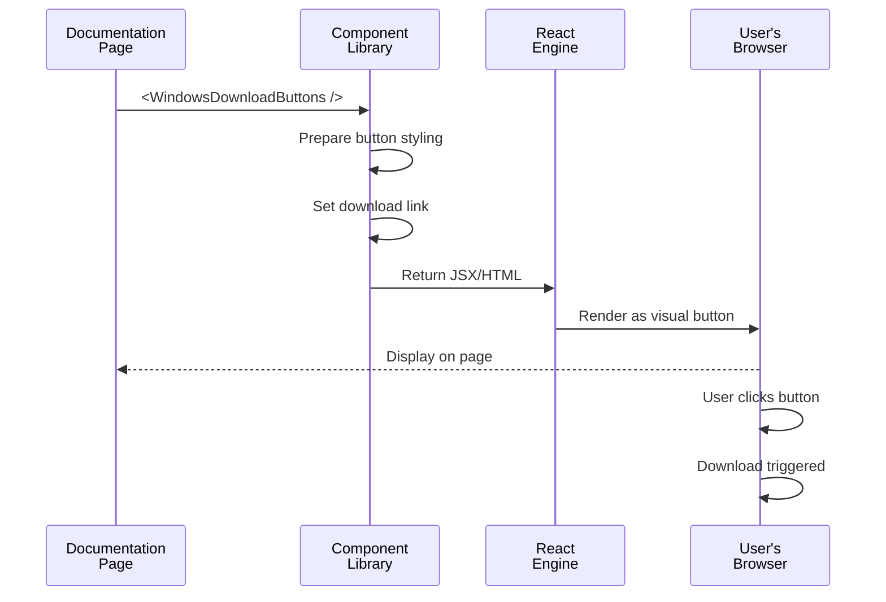

# Chapter 9: Documentation Component Library

In [Chapter 8: Install Link Generator](08_install_link_generator_.md), you learned how to create shareable links that automatically install Goose extensions. Users click a link and get what they need instantly—no confusion, no manual steps.

But here's a new problem: **How do you write documentation that feels polished and professional?** Imagine you're writing docs for Goose and you need to include:
- Download buttons for Windows, macOS, and Linux (each button needs to look slightly different)
- A carousel showing screenshots of features
- Warning boxes highlighting important information
- A guide for setting up different providers (OpenAI, Claude, etc.)

Without a component library, you'd manually style everything. The download button on one page looks slightly different on another. Carousels work differently in different docs. It's a mess. **With a Documentation Component Library, you write reusable components once, use them everywhere, and everything looks consistent.**

Think of it like furniture standardization: instead of each room having its own custom-built table (different sizes, colors, materials), you have standard IKEA tables that you can place anywhere. They all match, they all work the same way, and you can swap them easily.

## What Problem Does This Solve?

Let's say you're documenting Goose installation for three operating systems:

**Without a component library**:
- Page 1 (Windows): Hand-coded download button
- Page 2 (macOS): Different code for a similar button
- Page 3 (Linux): Yet another version
- Result: Three separate implementations, three potential bugs, nightmare to maintain

**With a component library**:
- Create `WindowsDesktopInstallButtons` component once
- Create `MacDesktopInstallButtons` component once
- Create `LinuxDesktopInstallButtons` component once
- Use them everywhere: `<WindowsDesktopInstallButtons />` on any page
- Result: Consistency, easier to fix bugs (fix once, applies everywhere), easier to update

**The real use case**: Your documentation site grows. You add new pages, new features, new guides. Without standardized components, each contributor reinvents the wheel. With a component library, everyone uses the same building blocks. Documentation stays consistent, maintainable, and professional-looking.

## Key Concepts

### 1. Component: A Reusable UI Piece

A **component** is a self-contained piece of user interface that you can reuse. Like a LEGO brick—build it once, use it many times.

Examples from Goose docs:
- `WindowsDesktopInstallButtons` — A button for downloading Goose for Windows
- `ImageCarousel` — A carousel that slides through images
- `VideoCarousel` — A carousel that slides through videos
- `InstallButton` — A generic button for installations

Each component is built, styled, and tested once. Then you use it anywhere.

### 2. Props: Customization Parameters

**Props** (short for "properties") are parameters you pass to a component to customize it. Like adjusting knobs on a machine.

Example: The `InstallButton` component has props:
```javascript
<InstallButton 
  size="lg"           // Prop: make it large
  variant="primary"   // Prop: use primary color
  label="Download"    // Prop: what text to show
  link="..."          // Prop: where to link to
/>
```

Props let you reuse the same component with different configurations. One component, many variations.

### 3. Carousel: Sliding Container for Media

A **carousel** is a container that holds multiple images or videos and lets you slide through them. Like a slide deck, but interactive—users click arrows to see the next image.

Key features:
- **Navigation arrows** — Click to go previous/next
- **Pagination dots** — Show which slide you're on
- **Slide counter** — Optional display of current image name
- **Responsive** — Works on mobile and desktop

The ImageCarousel and VideoCarousel components handle all this complexity for you.

### 4. Download Buttons: Platform-Specific Shortcuts

**Download buttons** are buttons that link to downloads. But they're platform-specific:
- Windows users get a Windows download button
- macOS users get a macOS download button (with Intel/Silicon options)
- Linux users get DEB and RPM options

Separate components (`WindowsDesktopInstallButtons`, `MacDesktopInstallButtons`, `LinuxDesktopInstallButtons`) make this clean.

### 5. Admonitions: Important Information Boxes

**Admonitions** are highlighted boxes that call out important information. Types include:
- **Note**: General information (blue)
- **Warning**: Be careful (orange/yellow)
- **Danger**: Critical warning (red)
- **Tip**: Helpful advice (green)

Think of them like traffic signs. A yellow warning sign gets your attention differently than a green info sign.

### 6. Design System: The Rules

A **design system** is a set of rules: "All buttons should look like this," "All spacing should follow this," "All colors are from this palette."

The Documentation Component Library enforces a design system so everything in Goose docs looks professional and consistent.

## How to Use It: A Simple Example

Let's say you're writing a documentation page about installing Goose. Here's how you'd use the component library.

### Step 1: Import the Component

At the top of your markdown file (or React/JSX file), import:

```javascript
import WindowsDesktopInstallButtons from 
  "@site/src/components/WindowsDesktopInstallButtons";
```

This loads the component into your page. Now you can use it.

### Step 2: Use the Component

Just drop it into your page:

```jsx
## Download Goose

<WindowsDesktopInstallButtons />
```

That's it! The component renders itself with proper styling, buttons, links—everything.

### Step 3: Result

The reader sees:
- A nice heading "Download Goose"
- A blue button labeled "⬇️ Windows"
- When clicked, it downloads the Windows version
- Everything styled consistently with the rest of the docs

You wrote 2 lines. The component handled the rest.

## How It Works: Step-by-Step

Here's what happens when you use a component:



**What's happening**:

1. **Documentation page uses component**: `<WindowsDesktopInstallButtons />`
2. **Component library prepares**: Gathers styling, links, layout
3. **React converts to HTML**: Transforms component into browser-readable code
4. **Browser renders**: User sees a clickable button on the page
5. **User clicks**: Browser initiates download
6. **Done**: File downloads

The beauty is: you don't see any of this complexity. You just write `<WindowsDesktopInstallButtons />` and it magically appears.

## Internal Implementation: The Plumbing

Now let's look at how these components are actually built.

### Example 1: The Download Buttons Component

Looking at the Windows button component:

```javascript
import Link from "@docusaurus/Link";
import { IconDownload } from "@site/src/components/icons/download";

const WindowsDesktopInstallButtons = () => {
  return (
    <div>
      <p>To download Goose Desktop for Windows, click the button below:</p>
      <Link to="https://github.com/block/goose/releases/download/stable/Goose-win32-x64.zip">
        <IconDownload /> Windows
      </Link>
    </div>
  );
};
```

**What's happening**:
1. **Import dependencies**: Load the `Link` component (creates links) and `IconDownload` icon
2. **Define component function**: This is a React component (a JavaScript function)
3. **Return JSX**: Return HTML-like code that describes what to display
4. **Link to file**: The download URL is hardcoded
5. **Display icon**: Show a download icon next to "Windows" text

Simple! The complexity (styling, responsive behavior) is handled by `Link` component and CSS styling elsewhere.

### Example 2: The Carousel Component

The ImageCarousel component is more complex. Here's the key part:

```javascript
import { Swiper, SwiperSlide } from 'swiper/react';

const ImageCarousel = ({ images, id, width = '100%', names = [] }) => {
  const [activeIndex, setActiveIndex] = React.useState(0);

  return (
    <Swiper
      navigation
      pagination={{ clickable: true }}
      onSlideChange={(swiper) => setActiveIndex(swiper.activeIndex)}
    >
      {images.map((src, index) => (
        <SwiperSlide key={index}>
          
        </SwiperSlide>
      ))}
    </Swiper>
  );
};
```

**What's happening**:
1. **Props**: Component receives `images` (array of image URLs), `id`, `width`, `names`
2. **State tracking**: Use `useState(0)` to track which slide is currently showing
3. **Swiper library**: Use an external library called Swiper that handles carousel logic
4. **Map images**: Loop through each image and create a slide for it
5. **Track changes**: When user clicks arrow, `onSlideChange` updates the state

The Swiper library does the hard work (animations, clicks, etc.). Our component just provides the data.

### Example 3: The Linux Download Buttons (Dynamic)

The Linux component is interesting because it **fetches the latest download URL dynamically**:

```javascript
useEffect(() => {
  const fetchLatestRelease = async () => {
    const response = await fetch(
      'https://api.github.com/repos/block/goose/releases/latest'
    );
    const release = await response.json();
    setDownloadUrls(release.assets.map(a => a.browser_download_url));
  };
  fetchLatestRelease();
}, []);
```

**What's happening**:
1. **On page load**: Call `useEffect` hook (React feature that runs on component load)
2. **Fetch from GitHub**: Get the latest release info from GitHub API
3. **Parse response**: Extract download URLs from the response
4. **Store in state**: Save URLs so the component can display them
5. **Auto-update**: Next time someone loads the page, they get the latest download links

This is powerful! You don't hardcode download links. They update automatically when you release new versions.

### Building a Button Component

Here's how the generic `InstallButton` component works:

```javascript
const InstallButton = ({ 
  size, variant, link, label 
}) => {
  const buttonClass = `button button--${variant} button--${size}`;
  
  return (
    <Link to={link}>
      <button className={buttonClass}>
        {label}
      </button>
    </Link>
  );
};
```

**What's happening**:
1. **Accept props**: Get customization options (`size`, `variant`, `link`, `label`)
2. **Build class name**: Combine CSS classes based on props
3. **Return button**: Create a link that wraps a button
4. **Use props**: Display the label text that was passed in

Usage: `<InstallButton size="lg" variant="primary" link="/download" label="Download" />`

This one component can be used for all kinds of buttons by changing the props.

## Connection to Previous Chapters

The Documentation Component Library is the **documentation layer** that sits on top of everything:

1. **[Chapter 7: Desktop Build & Deployment System](07_desktop_build___deployment_system_.md)** — Builds and packages Goose
2. **[Chapter 8: Install Link Generator](08_install_link_generator_.md)** — Creates shareable installation links
3. **This Chapter: Documentation Component Library** — Presents features beautifully in docs

The flow:
- Users read the documentation (built with these components)
- They see download buttons (from `WindowsDesktopInstallButtons`, etc.)
- They see carousels with features (from `ImageCarousel`, `VideoCarousel`)
- Everything looks consistent and professional
- Users get a great first impression of Goose

## Why Components Matter: Benefits

Without component library:

| Without | With |
|---------|------|
| Each page has its own button styling | All buttons look identical |
| Bug in carousel? Fix it on 10 pages | Bug in carousel? Fix it once, applies everywhere |
| New contributor recreates components | New contributor reuses existing components |
| Inconsistent appearance | Professional, polished look |
| Hard to maintain | Easy to maintain |

With a component library, documentation becomes:
- **Consistent**: Everything follows the same design rules
- **Maintainable**: Fix once, apply everywhere
- **Scalable**: Add new pages without reinventing UI
- **Professional**: Polished appearance builds trust

## Real-World Analogy

Think of a documentation component library as a **restaurant menu design system**:

**Without system**:
- Each restaurant designs their own menu
- Different fonts, colors, spacing
- Some menus beautiful, some ugly
- Customers confused

**With system**:
- All restaurants use the same menu template
- Same font, colors, layout rules
- All menus look professional
- Customers know what to expect

The Documentation Component Library is like the menu template—everyone uses it, everything looks great.

## Putting It All Together

Here's how to write documentation using components:

### Scenario: Documenting Desktop Installation

**Without components**:
```markdown
# Installation

## Windows
Click this link to download: [download](...)
[manually style button CSS]

## macOS  
Click this link to download: [download](...)
[different button CSS]

## Linux
Click this link to download: [download](...)
[yet another button CSS]
```

**With components**:
```jsx
# Installation

<WindowsDesktopInstallButtons />
<MacDesktopInstallButtons />
<LinuxDesktopInstallButtons />
```

Three lines instead of fifty! And it all looks consistent.

### Scenario: Showing Feature Screenshots

**Without components**:
```markdown
# Gallery
[manually create carousel HTML]
[add styling]
[add navigation code]
[debug on mobile]
```

**With components**:
```jsx
# Gallery
<ImageCarousel 
  images={[img1, img2, img3]}
  names={["Dashboard", "Chat", "Settings"]}
  id="features"
/>
```

Done! The carousel is mobile-friendly, styled, and works perfectly.

## Summary: What You've Learned

**Documentation Component Library** is a collection of reusable, styled UI components for building docs:

- **Components** are reusable pieces of UI (buttons, carousels, admonitions)
- **Props** are parameters you pass to customize components
- **Consistency** means all docs look and feel the same
- **Carousels** handle image/video sliding automatically
- **Download buttons** are platform-specific for Windows/macOS/Linux
- **Design system** enforces rules (colors, spacing, fonts)
- **Maintainability** means fixing one component fixes it everywhere
- **Examples**: `WindowsDesktopInstallButtons`, `ImageCarousel`, `InstallButton`

The beauty of a component library is that **documentation writers focus on content, not styling**. They write `<ImageCarousel />` and get a professional carousel. They write `<WindowsDesktopInstallButtons />` and get proper download buttons. No need to understand HTML, CSS, or JavaScript—just compose components.

---

**Key Takeaways:**

✅ Components are reusable UI building blocks  
✅ Props let you customize components for different situations  
✅ One component, many uses = easier maintenance  
✅ Consistency across all docs = professional appearance  
✅ Documentation writers write less code, focus on content  
✅ Carousels, buttons, alerts are all reusable components  
✅ Design system ensures all UI elements match  

You now understand how Goose's documentation stays consistent and professional using reusable components! 🪿

Next, you'll learn about the [Recipe Security Training System](10_recipe_security_training_system_.md), which teaches users and developers how to create safe, secure recipes that won't harm their systems.

---

Generated by [AI Codebase Knowledge Builder](https://github.com/The-Pocket/Tutorial-Codebase-Knowledge)