# Chapter 11: Benchmark Evaluation System

In [Chapter 10: Recipe Security Training System](10_recipe_security_training_system_.md), you learned how Goose identifies malicious recipes before executing them—protecting users from dangerous code. That's about *preventing* problems.

But here's a new challenge: **How do you know if Goose is actually *good* at what it does?** How do you measure whether it's getting better or worse over time? How do you compare it fairly against other AI agents? How do you catch when something breaks?

That's what the **Benchmark Evaluation System** does. It's like a standardized testing lab for Goose. Instead of asking users "Is Goose good?", we run controlled experiments:
- Give Goose specific tasks (summarize a blog, research a restaurant)
- Measure objective metrics (how many API calls? how long? how many tokens?)
- Have AI judges evaluate quality (using GPT-4 to score responses)
- Detect failures (did a server error occur?)
- Generate leaderboards showing how different models rank

Think of it like a sports league—you want to know if Team A is better than Team B, so you play them against each other under controlled rules and keep score. The Benchmark Evaluation System does this for Goose.

## What Problem Does This Solve?

Imagine you're running a service and you update Goose's brain. You want to know: *"Did this update make things better or worse?"* Without benchmarking, you're guessing. You ship it and hope users don't complain.

With benchmarking:

1. **Before the update**: Run the test suite. Get baseline scores.
2. **After the update**: Run the same tests. Compare scores.
3. **If scores improved**: Ship it! Users get a better Goose.
4. **If scores got worse**: Don't ship. Debug what broke.

**The real use case**: You have a dashboard showing:
- **Model A** (old version): blog_summary score 0.75, execution time 12 seconds
- **Model B** (new version): blog_summary score 0.82, execution time 8 seconds
- **Decision**: Model B wins! Ship it.

Without this system, you'd have no data to make that decision.

## Key Concepts

### 1. Evaluation: A Controlled Task

An **evaluation** is a specific task that Goose tries to complete. Examples:

- **Blog Summary**: "Read this blog post and write a summary"
- **Restaurant Research**: "Find 3 great Italian restaurants in Paris"

Each evaluation has:
- **Input**: The task description or question
- **Expected output**: What a good answer looks like
- **Metrics**: What we measure (accuracy, time, tokens)

### 2. Metrics: Measuring Success

**Metrics** are numbers that measure how well Goose did. Examples:

- **Execution time**: How long did the task take? (Lower is better)
- **Token usage**: How many tokens did it use? (Lower is better)
- **Tool calls**: How many API calls? (Context-dependent)
- **LLM judge score**: Did a human agree it was good? (Higher is better, 0-2 scale)
- **Server errors**: Did anything break? (Lower is better)

Each metric answers: "In what way did Goose succeed or fail?"

### 3. LLM Judge: AI Scoring Quality

An **LLM judge** is an AI (like GPT-4) that acts as a referee. Instead of trying to write code that "scores" a response (which is hard), we ask a smart AI:

```
LLM Judge: "Here's Goose's blog summary. Rate it 0-2 based on:
- Is it accurate?
- Is it complete?
- Is it well-written?"
```

The LLM judge returns a score. Humans trust AI judges more than hardcoded scoring.

### 4. Leaderboard: Ranking Models

A **leaderboard** is a table that ranks different versions of Goose (or different AI models). Like a sports leaderboard:

| Rank | Model | Score | Time | Tokens |
|------|-------|-------|------|--------|
| 1 | GPT-4 | 0.92 | 8s | 1500 |
| 2 | Claude | 0.88 | 10s | 1800 |
| 3 | Goose v1 | 0.75 | 15s | 2200 |

Higher scores are better. Lower time/tokens are better.

### 5. Server Errors: Detecting Failures

**Server errors** are when something breaks during evaluation. Examples:
- API rate limits (OpenAI is too busy)
- Network timeouts (server unreachable)
- Invalid responses (malformed JSON)

If 10 out of 100 evaluations had server errors, we mark: `server_error_rate = 0.10`. This alerts us: "Something's wrong—re-run these tests."

### 6. Evaluation Suite: A Collection of Tests

An **evaluation suite** is a group of related evaluations. Example:

```
suite: "information_research"
├── blog_summary        (task 1)
├── restaurant_research (task 2)
└── recipe_finding      (task 3)
```

Running the full suite gives a complete picture of Goose's ability.

## How to Use It: A Simple Example

Let's say you want to benchmark Goose on a simple task: summarizing blog posts.

### Step 1: Run the Evaluation

Execute the benchmark script:

```bash
goose-benchmark run --suite blog_summary --model gpt-4o
```

**What happens internally**:
- Loads 10 blog posts from a test set
- For each post, asks Goose: "Summarize this blog"
- Collects results (output, time, tokens used, any errors)

### Step 2: LLM Judge Scores Outputs

For each summary, GPT-4 judges the quality:

```python
judge_score = llm_judge.evaluate(
  prompt="Rate this blog summary 0-2",
  text=goose_summary
)
```

**What happens**:
- Sends to OpenAI: "Here's a summary. Rate it."
- Gets back: `{"reasoning": "...", "score": 1.5}`
- Records the score

### Step 3: Aggregate Results

Combine all the individual scores into one report:

```python
results = aggregate_metrics(
  model="gpt-4o",
  suite="blog_summary"
)
# Results: {
#   avg_score: 0.82,
#   avg_time: 8.2 seconds,
#   avg_tokens: 1540,
#   server_error_rate: 0.0
# }
```

### Step 4: Generate Leaderboard

Compare this model against others:

```bash
goose-benchmark leaderboard --output leaderboard.csv
```

**Output** (CSV file):
```
provider,model,blog_summary_score,restaurant_research_score,avg_time
openai,gpt-4o,0.82,0.89,8.2
anthropic,claude-opus,0.79,0.85,10.1
```

### Step 5: Review & Decide

Look at the leaderboard:
- Is the new model better than the old one?
- Are there any server errors suggesting infrastructure issues?
- Is it fast enough for production?

Based on this data, decide: ship it or debug it?

## How It Works: Step-by-Step

Here's what happens when the Benchmark Evaluation System runs:

```mermaid
sequenceDiagram
    participant User as Developer
    participant Benchmark as Benchmark<br/>System
    participant Goose as Goose<br/>Model
    participant Judge as LLM Judge<br/>(GPT-4)
    participant Results as Results<br/>Database

    User->>Benchmark: run --suite blog_summary
    Benchmark->>Benchmark: Load test blog posts
    
    loop For each blog post
        Benchmark->>Goose: "Summarize this blog"
        Goose->>Goose: Process, generate summary
        Goose-->>Benchmark: Summary + metrics
        Benchmark->>Judge: Score this summary
        Judge->>Judge: Evaluate quality 0-2
        Judge-->>Benchmark: Score (1.5)
        Benchmark->>Results: Store: blog1 → score=1.5, time=8s
    end
    
    Benchmark->>Results: Aggregate all results
    Results-->>Benchmark: Average score=0.82
    Benchmark-->>User: Leaderboard generated ✓
```



**What's happening**:

1. **Setup**: Load test data (blogs, questions, etc.)
2. **Loop**: For each test item:
   - Send to Goose
   - Collect output, metrics (time, tokens)
   - Send to LLM judge for scoring
   - Store results
3. **Aggregate**: Average all the metrics
4. **Output**: Create leaderboard comparing models

## Internal Implementation: The Plumbing

Let's look at how the Benchmark Evaluation System actually works under the hood.

### Step 1: Preparing Aggregate Metrics

The first step is collecting raw evaluation results and calculating averages. Looking at `prepare_aggregate_metrics.py`:

```python
# Find all eval-results.json files for a model
eval_files = find_eval_results_files(model_dir)

# Extract metrics from each file
for eval_file in eval_files:
    row = extract_metrics_from_eval_file(eval_file)
    rows.append(row)
```

**What's happening**: Scan all evaluation result files and extract the metrics from each one. Each row represents one evaluation run.

### Step 2: Checking for Server Errors

Before aggregating, the system checks if any evaluations failed with server errors:

```python
# Check each session file for error patterns
for session_file in session_files:
    error_found, messages = check_for_errors_in_session(session_file)
    if error_found:
        row['server_error'] = 1
```

**What's happening**: Read the session log (a file recording all messages). Look for telltale signs of failures:
- "Server error" in the text
- API errors
- Timeout messages

Mark evaluations that had issues.

### Step 3: Aggregating Metrics

Group results by evaluation type and calculate averages:

```python
# Group by eval_suite and eval_name, then average metrics
aggregate_df = combined_df.groupby([
    'provider', 'model_name', 'eval_suite', 'eval_name'
]).agg({'total_tokens_mean': 'mean', 'score_mean': 'mean'})
```

**What's happening**: If Goose ran 10 blog summaries, calculate:
- Average score: (1.0 + 1.5 + 0.8 + ... + 1.2) / 10 = 0.82
- Average tokens: (1200 + 1540 + ... + 1300) / 10 = 1350
- Similar for other metrics

### Step 4: LLM Judge Evaluation

The LLM judge is where quality scoring happens:

```python
# Send evaluation prompt + response to OpenAI
response = client.chat.completions.create(
  model="gpt-4o",
  messages=[{"role": "user", "content": prompt}]
)

# Parse the score from the response
score = parse_json(response.choices[0].message.content)
```

**What's happening**:
1. Format a prompt: "Evaluate this summary on a 0-2 scale"
2. Send to OpenAI's API
3. Get back JSON like `{"score": 1.5, "reasoning": "..."`
4. Extract the score number

### Step 5: Handling Disagreement (Multiple Judging Runs)

Here's an interesting part: the system runs the judge **3 times** because AI judges aren't always consistent:

```python
# Run judgment 3 times, take the most common score
for i in range(3):
    score = llm_judge.evaluate(text)
    scores.append(score)

# Use majority vote
most_common = Counter(scores).most_common(1)[0][0]
```

**What's happening**: If the judge returns [1, 1, 2], use 1 (appears twice). If it's [1, 2, 2], use 2. This gives a more reliable score than trusting one run.

### Step 6: Generating the Leaderboard

Finally, combine everything into a rankings table:

```python
# Read all aggregate_metrics.csv files from model directories
for model_dir in benchmark_dir:
  df = read_csv(model_dir / "aggregate_metrics.csv")
  all_data.append(df)

# Combine and sort by score
leaderboard = combine_all(all_data)
leaderboard = leaderboard.sort_by('score', descending=True)
```

**What's happening**: Collect metrics from all models, merge them into one table, sort by score (highest first), and output as CSV. This is your leaderboard!

## Connection to Previous Chapters

The Benchmark Evaluation System is the **quality assurance layer** on top of everything:

1. **[Chapter 2: Goose Workflow Engine](02_goose_workflow_engine_.md)** — Executes recipes (the workflows being tested)
2. **[Chapter 6: Process Manager](06_process_manager_.md)** — Safely runs evaluation tasks
3. **[Chapter 5: MCP (Model Context Protocol) Server](05_mcp__model_context_protocol__server_.md)** — Provides tools Goose uses during evaluations
4. **[Chapter 10: Recipe Security Training System](10_recipe_security_training_system_.md)** — Ensures recipes in evaluations are safe
5. **This Chapter: Benchmark Evaluation System** — Measures how well Goose performs on those recipes

The flow is:
- Create safe test recipes ([Chapter 10](10_recipe_security_training_system_.md))
- Run them with Goose ([Chapter 2](02_goose_workflow_engine_.md))
- Safely manage the processes ([Chapter 6](06_process_manager_.md))
- Use external tools ([Chapter 5](05_mcp__model_context_protocol__server_.md))
- Measure and score results ([This chapter](#))

## Why This Matters: Continuous Quality

Without a benchmark system:

| Without | With |
|---------|------|
| Don't know if updates improve things | Concrete data showing improvement |
| Regressions (breaks) go unnoticed | Automatic detection of problems |
| Can't compare models fairly | Leaderboard shows fair rankings |
| Trust "feels good" instead of data | Data-driven decisions |
| Users discover bugs first | Catch issues before shipping |

The Benchmark Evaluation System enables **continuous improvement**. You measure, you iterate, you improve.

## Real-World Analogy

Think of the Benchmark Evaluation System as **clinical drug trials**:

**Without trials**:
- "Does this medicine work?" → "I feel better" → Ship it
- No way to know if it actually works or just placebo

**With trials**:
- **Controlled test**: Give 1000 people the drug, 1000 a placebo
- **Measure outcomes**: Did the drug group improve more?
- **Statistical analysis**: "The drug shows 73% efficacy with 95% confidence"
- **Peer review**: Other scientists verify the results
- **Decision**: FDA approves based on data

Similarly, Benchmark System:
- **Controlled tests**: Run same tasks multiple times
- **Measure outcomes**: Time, tokens, quality
- **Statistical analysis**: Average and aggregate
- **Peer review**: LLM judges score quality
- **Decision**: Deploy based on data

## Putting It All Together

Here's the complete journey of benchmarking a new Goose version:

1. **New version released**: Updated Goose code checked in
2. **CI/CD triggers**: Benchmark system automatically kicks off
3. **Load test suite**: Blog summaries, research tasks, etc.
4. **Run evaluations**: Goose processes each task
5. **Collect metrics**: Time, tokens, outputs recorded
6. **Detect errors**: Check for server failures
7. **LLM judges score**: GPT-4 evaluates quality (3 runs, majority vote)
8. **Aggregate results**: Average metrics across all tests
9. **Generate leaderboard**: Compare against previous versions
10. **Analysis**: "New version: 0.82 score (+0.07 vs old). Faster by 2s."
11. **Decision**: Dashboard shows improvement → team approves for production
12. **Users benefit**: Faster, better Goose in production

All automated. Data-driven. Objective.

---

## Summary: What You've Learned

**Benchmark Evaluation System** measures Goose's performance scientifically:

- **Evaluations** are controlled tasks (blog summaries, research)
- **Metrics** measure success (time, tokens, accuracy, errors)
- **LLM judges** use AI to score output quality
- **Server errors** detect infrastructure failures
- **Aggregation** combines individual results into averages
- **Leaderboards** rank different models fairly
- **Majority voting** makes LLM judging more reliable
- **Automation** runs all benchmarks in CI/CD pipeline

The system transforms quality from subjective ("feels good") to objective ("data says it's 0.82 on blog summaries"). This enables confident deployment decisions.

---

**Key Takeaways:**

✅ Evaluations are standardized tasks that test specific capabilities  
✅ Metrics measure multiple dimensions (speed, quality, resource usage)  
✅ LLM judges provide fair, consistent scoring using AI  
✅ Server errors are detected and flagged for re-runs  
✅ Aggregation turns individual results into reliable averages  
✅ Leaderboards enable fair model comparison  
✅ Automation ensures benchmarks run consistently  
✅ Data-driven decisions replace guessing  

You now understand how Goose's performance is measured, tracked, and continuously improved! 🪿

---

**Congratulations!** You've completed all 11 chapters of the Goose tutorial. You now understand:

- ✅ Real-time chat ([Chapter 1](01_goose_chat_websocket_interface_.md))
- ✅ Workflow execution ([Chapter 2](02_goose_workflow_engine_.md))
- ✅ Job scheduling ([Chapter 3](03_temporal_service___job_scheduling_.md))
- ✅ Protocol communication ([Chapter 4](04_acp__agent_control_protocol__.md))
- ✅ External tools ([Chapter 5](05_mcp__model_context_protocol__server_.md))
- ✅ Process safety ([Chapter 6](06_process_manager_.md))
- ✅ Desktop packaging ([Chapter 7](07_desktop_build___deployment_system_.md))
- ✅ Install links ([Chapter 8](08_install_link_generator_.md))
- ✅ Documentation ([Chapter 9](09_documentation_component_library_.md))
- ✅ Security training ([Chapter 10](10_recipe_security_training_system_.md))
- ✅ Performance measurement ([Chapter 11](#))

From first message to production deployment, you've seen every layer. Welcome to Goose! 🪿

---

Generated by [AI Codebase Knowledge Builder](https://github.com/The-Pocket/Tutorial-Codebase-Knowledge)