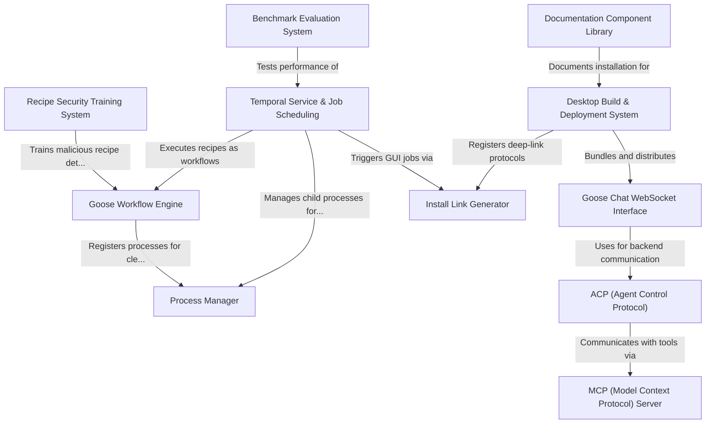

# Tutorial: goose

**Goose** is an **AI agent platform** that enables users to automate complex workflows through a conversational interface. It combines a **real-time chat UI**, a **job scheduling engine** (powered by Temporal.io), and **recipe-based automation** to allow AI agents to execute multi-step tasks, access external tools via **MCP servers**, and manage long-running background jobs. The system includes a **desktop application**, **web interface**, **benchmark evaluation pipeline**, and security training for detecting malicious recipes.

**Source Repository:** [None](None)

## Chapters

1. [Goose Chat WebSocket Interface
](01_goose_chat_websocket_interface_.md)
2. [Goose Workflow Engine
](02_goose_workflow_engine_.md)
3. [Temporal Service & Job Scheduling
](03_temporal_service___job_scheduling_.md)
4. [ACP (Agent Control Protocol)
](04_acp__agent_control_protocol__.md)
5. [MCP (Model Context Protocol) Server
](05_mcp__model_context_protocol__server_.md)
6. [Process Manager
](06_process_manager_.md)
7. [Desktop Build & Deployment System
](07_desktop_build___deployment_system_.md)
8. [Install Link Generator
](08_install_link_generator_.md)
9. [Documentation Component Library
](09_documentation_component_library_.md)
10. [Recipe Security Training System
](10_recipe_security_training_system_.md)
11. [Benchmark Evaluation System
](11_benchmark_evaluation_system_.md)

---

Generated by [AI Codebase Knowledge Builder](https://github.com/The-Pocket/Tutorial-Codebase-Knowledge)