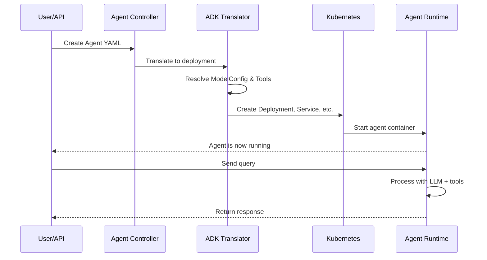

# Chapter 1: Agent

## Introduction

Welcome to the **kagent** tutorial! This chapter introduces you to the **Agent** — the core concept that powers everything in kagent. Think of an Agent as a smart, autonomous worker that can listen to requests, make decisions using AI models, and take actions using tools. Let's start with a concrete example to understand why Agents matter.

## The Problem: Building Intelligent Services

Imagine you're building a **customer support chatbot** for an e-commerce company. Users ask questions like:
- "What's the status of my order?"
- "Can you recommend products similar to what I bought?"
- "Process my refund request"

To handle these requests, you need:
1. An AI model that understands natural language
2. Access to tools (database queries, APIs)
3. A way to orchestrate everything together
4. A way to deploy and manage this system

Building this from scratch is complex! This is where **Agents** come in. An Agent bundles all of this into a single, deployable entity that the system manages for you.

## What is an Agent?

An **Agent** is a Kubernetes-based autonomous service that:
- **Processes requests**: Receives queries from users or other systems
- **Uses AI models**: Powers its reasoning with language models (OpenAI, Anthropic, etc.)
- **Wields tools**: Can call external services, databases, or other agents
- **Maintains state**: Remembers context across conversations
- **Is managed**: Automatically deployed and scaled by the system

Think of it like hiring a specialized consultant. Instead of managing infrastructure yourself, you describe what the consultant should do, and the system handles everything else.

## Key Concepts: Declarative vs. Bring-Your-Own (BYO)

Kagent offers two ways to create Agents:

### 1. **Declarative Agents** (Configuration-Driven)
You describe *what* the agent should do via YAML configuration. Kagent handles the *how*.

**Example use case**: A simple agent that answers FAQ questions.

```yaml
apiVersion: kagent.dev/v1alpha2
kind: Agent
metadata:
  name: faq-bot
spec:
  type: Declarative
  description: "Answers frequently asked questions"
```

### 2. **Bring-Your-Own (BYO) Agents** (Container-Based)
You bring your own Docker container. Kagent runs and manages it.

**Example use case**: An agent with custom business logic you've built yourself.

```yaml
apiVersion: kagent.dev/v1alpha2
kind: Agent
metadata:
  name: custom-agent
spec:
  type: BYO
  byo:
    deployment:
      image: myregistry.com/my-agent:v1.0
```

## Understanding Declarative Agents in Detail

Let's focus on **Declarative Agents** first, as they're the most common starting point. Here's what you can configure:

### 1. **System Message** — The Agent's Personality
Tell your agent how to behave. For example:

```yaml
declarative:
  systemMessage: |
    You are a helpful customer support agent.
    Always be polite and empathetic.
```

This is like giving your agent a set of instructions on how to interact with users.

### 2. **Model Configuration** — The Brain
Specify which AI model to use. For example:

```yaml
declarative:
  modelConfig: openai-gpt4
```

This references a **ModelConfig resource** (we'll learn about this in [Chapter 2: ModelConfig Resource](02_modelconfig_resource_.md)), which defines things like:
- Which model provider (OpenAI, Anthropic, etc.)
- Which specific model (GPT-4, Claude 3, etc.)
- API credentials

### 3. **Tools** — The Agent's Capabilities
Give your agent access to tools it can use. For example:

```yaml
declarative:
  tools:
    - type: McpServer
      mcpServer:
        name: database-tools
        toolNames:
          - query_orders
          - update_inventory
```

Tools allow your agent to interact with external systems. Learn more in [Chapter 7: MCP Server Management](07_mcp_server_management_.md).

### 4. **Deployment Configuration** — How It Runs
Specify resource requirements:

```yaml
declarative:
  deployment:
    replicas: 3
    resources:
      requests:
        memory: "512Mi"
        cpu: "250m"
```

## A Complete Example: Building the FAQ Bot

Let's build a complete Declarative Agent. Here's a realistic example:

```yaml
apiVersion: kagent.dev/v1alpha2
kind: Agent
metadata:
  name: faq-agent
  namespace: production
spec:
  type: Declarative
  description: "Answers customer frequently asked questions"
  declarative:
    systemMessage: "You help customers with common questions. Be concise and helpful."
    modelConfig: openai-gpt4
```

When you create this Agent:
1. ✅ Kagent validates your configuration
2. ✅ Kubernetes deploys your agent as a containerized service
3. ✅ The agent becomes accessible as `http://faq-agent.production:8080`
4. ✅ You can send it requests and it responds intelligently

## Internal Implementation: What Happens Behind the Scenes

When you create an Agent, Kagent performs several steps automatically. Let's walk through the journey:



### Step-by-Step Walkthrough

**Step 1: Agent Definition**
You provide an Agent resource (YAML file) describing what you want.

```yaml
# What you write
apiVersion: kagent.dev/v1alpha2
kind: Agent
metadata:
  name: my-agent
spec:
  type: Declarative
  declarative:
    systemMessage: "Help users"
    modelConfig: my-model
```

**Step 2: Controller Receives It**
The Kubernetes controller watches for new Agent resources. When it detects yours, it springs into action.

File reference: `go/internal/controller/agent_controller.go` — The `AgentController.Reconcile()` method is triggered.

**Step 3: Translation**
The controller translates your declarative Agent into Kubernetes resources (Deployments, Services, Secrets, etc.).

File reference: `go/internal/controller/translator/agent/adk_api_translator.go` — The `TranslateAgent()` method handles this.

Here's a simplified view of what gets translated:

```go
// Simplified: Translating an Agent to Kubernetes resources
agentOutputs, err := translator.TranslateAgent(ctx, agent)
// Returns: Deployment, Service, Secret, ServiceAccount, ConfigMap
```

**Step 4: Creating Kubernetes Resources**
The controller creates the necessary Kubernetes objects:

```go
// The translator outputs include:
// - Deployment (runs the agent container)
// - Service (exposes the agent)
// - Secret (stores config & credentials)
// - ServiceAccount (for permissions)
```

**Step 5: Agent Runs**
Kubernetes schedules and starts your agent. It's now ready to handle requests!

```
Pod is running → Ready to accept HTTP requests → Responses generated using AI model + tools
```

## Diving Into the Code

Let's look at key parts of the implementation:

### The Agent Resource Definition

```go
// File: go/api/v1alpha2/agent_types.go
type AgentSpec struct {
	Type AgentType  // "Declarative" or "BYO"
	Declarative *DeclarativeAgentSpec
	BYO *BYOAgentSpec
	Description string
}
```

This is the Kubernetes schema — it defines what fields an Agent can have.

### The Declarative Specification

```go
type DeclarativeAgentSpec struct {
	SystemMessage string
	ModelConfig string
	Tools []*Tool
	Deployment *DeclarativeDeploymentSpec
}
```

Notice how it's very declarative — you describe *what*, not *how*.

### Translation in Action

The translator converts a declarative Agent into Kubernetes resources:

```go
// File: go/internal/controller/translator/agent/adk_api_translator.go
func (a *adkApiTranslator) TranslateAgent(ctx context.Context, agent *v1alpha2.Agent) (*AgentOutputs, error) {
	switch agent.Spec.Type {
	case v1alpha2.AgentType_Declarative:
		// Translate declarative to deployment
		cfg, card, mdd, err := a.translateInlineAgent(ctx, agent)
		// ... more logic
	}
}
```

This is where the magic happens — raw configuration becomes actual infrastructure!

### Reconciliation

The controller continuously monitors your Agent and ensures the running system matches your desired state (this is Kubernetes' **reconciliation** pattern).

File reference: `go/internal/controller/reconciler/reconciler.go` — The `reconcileAgent()` method ensures your agent stays in the desired state.

## How to Use Agents: Practical Workflow

Here's how you'd work with Agents in practice:

**Step 1: Create an Agent**

```bash
kubectl apply -f my-agent.yaml
```

**Step 2: Check Status**

```bash
kubectl get agents
# Output shows: Name, Type, Ready status, Accepted status
```

**Step 3: Use Your Agent**

```bash
curl http://my-agent.default:8080/query \
  -X POST \
  -H "Content-Type: application/json" \
  -d '{"message": "Hello, how can you help me?"}'
```

Behind the scenes:
- Request hits the agent's HTTP server
- Agent's AI model processes the message
- Any needed tools are invoked
- Response is returned to you

## Key Takeaways

An **Agent** is:
- ✅ A containerized AI service managed by Kubernetes
- ✅ Either **Declarative** (configuration-based) or **BYO** (custom container)
- ✅ Automatically deployed and scaled by kagent
- ✅ Composed of: AI model + tools + system message + deployment config
- ✅ Accessible via HTTP and ready to handle requests

Think of it like the difference between:
- **Declarative**: "I want a web service that answers FAQs" → kagent handles everything
- **BYO**: "Here's my custom Docker image" → kagent just runs and manages it

## What's Next?

Now that you understand Agents, you need to know how they choose their AI models. The next chapter covers **[Chapter 2: ModelConfig Resource](02_modelconfig_resource_.md)** — which teaches you how to configure which AI model (and which provider) your agent should use.

---

**Summary**: Agents are the heart of kagent. They're intelligent, autonomous services that process requests using AI models and tools. Whether you choose Declarative Agents for simplicity or BYO Agents for customization, kagent handles the deployment, management, and scaling automatically!

---

Generated by [AI Codebase Knowledge Builder](https://github.com/The-Pocket/Tutorial-Codebase-Knowledge)