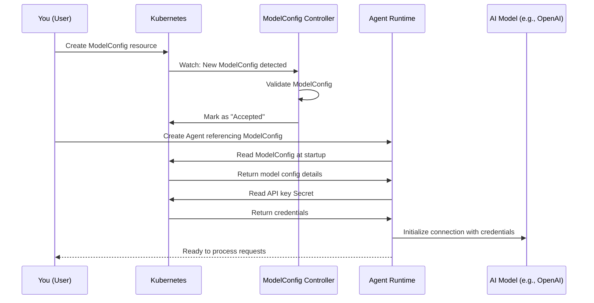

# Chapter 2: ModelConfig Resource

## Coming from Chapter 1

In [Chapter 1: Agent](01_agent_.md), you learned that Agents are autonomous services that use AI models to make decisions. We briefly mentioned that an Agent references a **ModelConfig** to know which AI model to use. Now it's time to understand **ModelConfig** in detail!

## The Problem: Managing AI Model Connections

Imagine you're building multiple Agents for your company:
- An FAQ Bot that answers customer questions
- A Document Analyzer that processes uploaded files
- A Recommendation Engine that suggests products

Each Agent needs to use an AI model to power its reasoning. But here's the challenge:

**Without ModelConfig:**
- You'd hardcode model credentials (API keys, endpoints) inside each Agent
- Changing the model would require redeploying the Agent
- You couldn't share model configurations between Agents
- Updating credentials would be a nightmare

**With ModelConfig:**
- You define your model configuration once
- Multiple Agents can reference and reuse it
- Update credentials in one place, all Agents see the change immediately
- Easy to switch between different AI providers or models

Think of ModelConfig like a **shared configuration contract**. It's the central place where you say: "When you need an AI model, use *this* provider, with *these* credentials, and *these* settings."

## What is a ModelConfig Resource?

A **ModelConfig** is a Kubernetes resource that describes:
- **Which AI provider** to use (OpenAI, Anthropic, Google Gemini, etc.)
- **Which specific model** from that provider (e.g., GPT-4, Claude 3, etc.)
- **API credentials** to access that model
- **Model-specific settings** (like temperature, max tokens, etc.)

Here's a simple example:

```yaml
apiVersion: kagent.dev/v1alpha2
kind: ModelConfig
metadata:
  name: my-gpt4-model
spec:
  provider: OpenAI
  model: gpt-4
  apiKeySecret: openai-secret
  apiKeySecretKey: OPENAI_API_KEY
```

This says: "I have a ModelConfig called `my-gpt4-model` that uses OpenAI's GPT-4 model, and the API key is stored in a Kubernetes Secret."

## Key Concepts

Let's break down what each part means:

### 1. **Provider** — Which AI Company?

The provider is the AI company whose model you want to use. kagent supports:

| Provider | Example Models | Use Case |
|----------|---|---|
| **OpenAI** | GPT-4, GPT-4o, GPT-3.5 | General-purpose reasoning, most popular |
| **Anthropic** | Claude 3 (Opus, Sonnet, Haiku) | High-quality reasoning, safety-focused |
| **Google Gemini** | Gemini Pro | Fast reasoning, multimodal capabilities |
| **Azure OpenAI** | GPT-4 (hosted on Azure) | Enterprise deployments, compliance needs |
| **Ollama** | Llama 2, Mistral | Local models, on-premise deployments |

Example:

```yaml
spec:
  provider: OpenAI
  model: gpt-4
```

This means: "Use OpenAI's GPT-4 model."

### 2. **Model Name** — Which Specific Model?

Different providers have different models. You specify which one:

```yaml
spec:
  provider: OpenAI
  model: gpt-4-turbo
```

This is like saying: "From OpenAI, I want the GPT-4-Turbo variant."

### 3. **API Credentials** — How to Access It?

Most providers require API keys to authenticate. Instead of hardcoding them, you store them in a **Kubernetes Secret** and reference them:

```yaml
spec:
  apiKeySecret: openai-secret
  apiKeySecretKey: API_KEY
```

This means: "Look in the Kubernetes Secret named `openai-secret`, and find the key `API_KEY` inside it."

The actual API key is stored securely:

```bash
kubectl create secret generic openai-secret \
  --from-literal=API_KEY=sk-...
```

### 4. **Model-Specific Parameters** — Fine-Tuning Behavior

Different models have different settings. For example, OpenAI models support:

```yaml
spec:
  provider: OpenAI
  openAI:
    temperature: "0.7"
    maxTokens: 2000
    topP: "0.9"
```

These parameters control how the model behaves:
- **Temperature**: How creative/random (0=deterministic, 1=creative)
- **MaxTokens**: Maximum response length
- **TopP**: Diversity of responses

## How to Create and Use a ModelConfig

Let's walk through a complete example: creating an OpenAI ModelConfig and using it in an Agent.

### Step 1: Create a Secret with Your API Key

First, store your API key securely in Kubernetes:

```bash
kubectl create secret generic openai-credentials \
  --from-literal=OPENAI_API_KEY=sk-your-api-key-here
```

Your API key is now stored securely! ✅

### Step 2: Create a ModelConfig

Now create the ModelConfig resource:

```yaml
apiVersion: kagent.dev/v1alpha2
kind: ModelConfig
metadata:
  name: production-gpt4
spec:
  provider: OpenAI
  model: gpt-4
  apiKeySecret: openai-credentials
  apiKeySecretKey: OPENAI_API_KEY
  openAI:
    temperature: "0.5"
    maxTokens: 4000
```

Apply it:

```bash
kubectl apply -f modelconfig.yaml
```

Your ModelConfig is now created! ✅

### Step 3: Use It in an Agent

Now your Agent can reference this ModelConfig:

```yaml
apiVersion: kagent.dev/v1alpha2
kind: Agent
metadata:
  name: smart-faq-bot
spec:
  type: Declarative
  declarative:
    modelConfig: production-gpt4
    systemMessage: "You are a helpful FAQ assistant"
```

The Agent now knows: "When you need an AI model, use the `production-gpt4` ModelConfig." ✅

## A Practical Scenario

Let's see this in action with a real scenario:

**Scenario**: Your company uses GPT-4 in production for all Agents. Later, you want to switch to Claude 3 (Anthropic) to save costs.

**Without ModelConfig** (the bad way):
- Update 50 Agent definitions manually
- Restart 50 Agents
- High chance of mistakes

**With ModelConfig** (the good way):
1. Create a new ModelConfig for Claude 3:

```yaml
apiVersion: kagent.dev/v1alpha2
kind: ModelConfig
metadata:
  name: cost-optimized-claude3
spec:
  provider: Anthropic
  model: claude-3-sonnet
  apiKeySecret: anthropic-credentials
  apiKeySecretKey: ANTHROPIC_API_KEY
  anthropic:
    maxTokens: 4000
```

2. Update your Agent to reference it:

```yaml
spec:
  declarative:
    modelConfig: cost-optimized-claude3  # Just change this line
```

Done! All Agents using this reference now use Claude 3. ✅

## Understanding the Internal Implementation

Let's look at what happens behind the scenes when you create a ModelConfig and use it in an Agent.

### The Journey: ModelConfig Creation and Agent Usage

Here's a simplified view of how everything connects:



### Step-by-Step Walkthrough

**Step 1: You Create a ModelConfig**

You provide a YAML file with provider, model, and credentials reference:

```yaml
apiVersion: kagent.dev/v1alpha2
kind: ModelConfig
metadata:
  name: my-model
spec:
  provider: OpenAI
  model: gpt-4
  apiKeySecret: my-secret
```

**Step 2: Kubernetes Accepts It**

The API server validates your ModelConfig against the schema and stores it.

File reference: `go/api/v1alpha2/modelconfig_types.go` — This defines the ModelConfig structure.

**Step 3: Controller Validates It**

The ModelConfig controller (a background process) watches for new ModelConfigs and validates them:

```go
// File: go/internal/controller/modelconfig_controller.go
func (r *ModelConfigController) Reconcile(ctx context.Context, req ctrl.Request) (ctrl.Result, error) {
    return r.Reconciler.ReconcileKagentModelConfig(ctx, req)
}
```

It checks:
- Is the provider valid? ✅
- Does the secret exist? ✅
- Are all required fields present? ✅

**Step 4: Validation Results**

The controller marks the ModelConfig with a status:

```yaml
status:
  conditions:
  - type: Accepted
    status: "True"
    message: "ModelConfig is valid and ready"
```

**Step 5: Agent Uses the ModelConfig**

When an Agent starts, it:
1. Reads the referenced ModelConfig from Kubernetes
2. Reads the API credentials from the Secret
3. Initializes the AI model connection

```go
// Pseudo-code: What happens in the Agent runtime
modelConfig := getModelConfig(namespace, name)
secret := getSecret(modelConfig.Spec.APIKeySecret)
apiKey := secret.Data[modelConfig.Spec.APIKeySecretKey]
aiModel := initializeModel(modelConfig.Spec.Provider, apiKey)
```

## Looking at the Code

Let's see how ModelConfig is defined and used:

### The ModelConfig Structure

```go
// File: go/api/v1alpha2/modelconfig_types.go
type ModelConfigSpec struct {
    Model string              // e.g., "gpt-4"
    Provider ModelProvider    // e.g., "OpenAI"
    APIKeySecret string       // Kubernetes Secret name
    APIKeySecretKey string    // Key inside the Secret
    OpenAI *OpenAIConfig      // Provider-specific settings
    // ... other providers ...
}
```

This structure defines what a ModelConfig can contain. Notice how it's flexible — you only set the fields for your provider.

### Creating a ModelConfig via API

When you create a ModelConfig through the HTTP API:

```go
// File: go/internal/httpserver/handlers/modelconfig.go
func (h *ModelConfigHandler) HandleCreateModelConfig(w ErrorResponseWriter, r *http.Request) {
    // 1. Parse the request
    var req api.CreateModelConfigRequest
    json.NewDecoder(r.Body).Decode(&req)
    
    // 2. Create the Kubernetes resource
    modelConfig := &v1alpha2.ModelConfig{...}
    h.KubeClient.Create(ctx, modelConfig)
    
    // 3. Create the Secret for the API key
    createSecretWithOwnerReference(ctx, modelConfig)
}
```

Key insight: When you create a ModelConfig, it automatically creates a Kubernetes Secret to store your API key safely!

### Watching for Secret Changes

The controller is smart — it watches Secrets too. If you update your API key:

```go
// File: go/internal/controller/modelconfig_controller.go
Watches(&v1.Secret{}, ...) // Watch for Secret changes
```

The controller automatically triggers a re-validation. If the Secret was updated, the ModelConfig controller knows about it and marks it as valid again.

## Supported Providers: A Quick Reference

Here's a quick guide to which providers kagent supports:

**Cloud Providers (require API keys):**
- OpenAI (GPT-4, GPT-4o)
- Anthropic (Claude 3)
- Google Gemini
- Azure OpenAI

**Self-Hosted:**
- Ollama (run locally)

**Vertex AI (Google Cloud):**
- Gemini Vertex AI
- Anthropic Vertex AI

Each has slightly different configuration requirements. For example, Azure OpenAI requires an endpoint and deployment name:

```yaml
spec:
  provider: AzureOpenAI
  model: gpt-4
  azureOpenAI:
    azureEndpoint: https://your-resource.openai.azure.com/
    apiVersion: "2024-02"
    azureDeployment: my-gpt4-deployment
```

## Key Takeaways

A **ModelConfig** is:
- ✅ A reusable configuration for an AI model
- ✅ Stores provider, model name, and credentials
- ✅ Decoupled from Agents — one ModelConfig can be used by many Agents
- ✅ Supports multiple providers (OpenAI, Anthropic, Ollama, etc.)
- ✅ Validated by the controller for correctness
- ✅ Easily updatable without redeploying Agents

Think of it like a **database connection string**. Just as database tools reference a connection string, Agents reference a ModelConfig. Change the connection string once, and everything using it sees the change.

## What's Next?

Now that you understand how to configure which AI model your Agent uses, the next question is: **How do you control who has access to your Agents and ModelConfigs?** 

The next chapter covers **[Chapter 3: Authentication & Authorization](03_authentication___authorization_.md)** — which teaches you how to secure your resources and control who can use them.

---

**Summary**: ModelConfig Resources decouple model configuration from Agent definition. Instead of hardcoding credentials and model choices into each Agent, you define them once in a ModelConfig and reuse it across many Agents. This makes your system flexible, secure, and easy to maintain!

---

Generated by [AI Codebase Knowledge Builder](https://github.com/The-Pocket/Tutorial-Codebase-Knowledge)