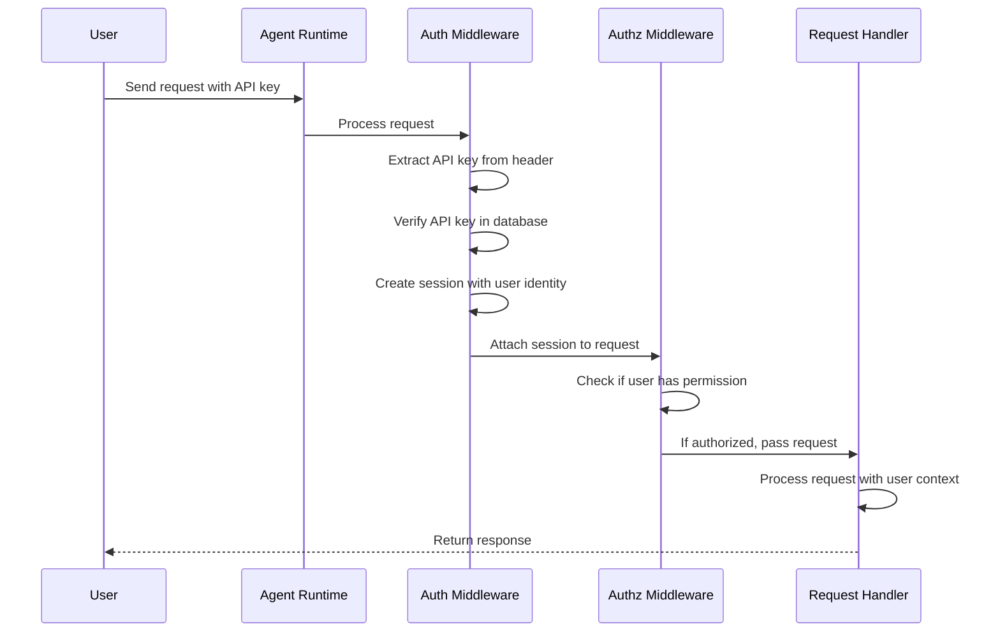

# Chapter 3: Authentication & Authorization

## Coming from Chapter 2

In [Chapter 2: ModelConfig Resource](02_modelconfig_resource_.md), you learned how to configure which AI model your Agents should use. Now we have a new challenge: **How do you control who gets to use your Agents?**

You don't want just anyone on the internet sending requests to your Agents. You need a **security layer** to verify that users are who they claim to be, and that they're allowed to do what they're trying to do. That's what this chapter is about!

## The Problem: Securing Your Agents

Imagine you're running multiple Agents in your company:
- **Support Bot**: Should only be used by customer support staff
- **Finance Agent**: Should only be used by employees in finance, not everyone
- **Internal FAQ Bot**: Should be accessible by all employees, but not external users

Without authentication and authorization:
- ❌ Anyone with network access could use your Agents
- ❌ You can't audit who used what
- ❌ You can't enforce who has access to sensitive Agents
- ❌ Internal and external users can't be distinguished

With authentication and authorization:
- ✅ Only verified users can access Agents
- ✅ Different users have different permissions
- ✅ You know who accessed what and when
- ✅ You can easily change permissions without redeploying

## Key Concepts: Authentication vs. Authorization

These two concepts are often confused, but they're different:

### Authentication (Authn): "Who are you?"

**Authentication** verifies that a user is who they claim to be. It's like checking someone's ID at the airport.

Think of it as a **lock-and-key system**:
- User has a key (like an API key, password, or token)
- System checks: "Does this key match a registered user?"
- If yes → User is authenticated ✅
- If no → Access denied ❌

Example:

```yaml
# User provides an API key in their request
curl -H "Authorization: Bearer sk-my-api-key" \
  http://my-agent/query
```

The system verifies: "Is this a valid API key? Does it belong to a real user?"

### Authorization (Authz): "What are you allowed to do?"

**Authorization** determines what an authenticated user is allowed to access. It's like checking if your ID allows you to enter a restricted area.

Think of it as a **permission system**:
- User is authenticated (identity confirmed)
- System checks: "Does this user have permission to access this resource?"
- If yes → Action allowed ✅
- If no → Access denied ❌

Example:

```yaml
# User is authenticated, but are they allowed to use this Agent?
User: alice@company.com (authenticated ✅)
Agent: finance-bot
Permission check: Does alice have access to finance-bot?
Result: Yes, alice is in the finance team → Access allowed ✅
```

## Authentication Methods in Kagent

Kagent supports multiple ways to authenticate users. Let's look at the main ones:

### 1. **API Keys**

Users get a unique API key (like `sk-abc123...`) to identify themselves.

```
User sends request with API key:
Header: Authorization: Bearer sk-abc123...
↓
System looks up: "Who owns sk-abc123?"
↓
System finds: "This key belongs to user@company.com"
↓
User is authenticated ✅
```

**Use case**: Machine-to-machine communication (one service calling another).

### 2. **Headers**

Users can provide their identity via HTTP headers.

```
User sends request with identity header:
Header: X-User-Id: alice@company.com
↓
System checks: "Is X-User-Id a valid user?"
↓
If valid → User is authenticated ✅
```

**Use case**: Internal services that know and trust the source.

### 3. **Custom Auth Providers**

You can extend Kagent with your own authentication logic (e.g., OAuth2, JWT tokens, etc.).

**Use case**: Integrating with your company's identity system.

## How to Set Up Authentication

Let's walk through a practical example: Setting up API key authentication for your Agents.

### Step 1: Create User Identities (API Keys)

First, you create API keys for your users:

```bash
# Create an API key for alice
kubectl create secret generic alice-api-key \
  --from-literal=key=sk-alice-12345

# Create an API key for bob
kubectl create secret generic bob-api-key \
  --from-literal=key=sk-bob-67890
```

Each user now has a unique API key stored securely. ✅

### Step 2: Make a Request with Authentication

When a user sends a request, they include their API key:

```bash
curl -H "Authorization: Bearer sk-alice-12345" \
  -X POST http://my-agent/query \
  -d '{"message": "Hello!"}'
```

The system receives this request and needs to verify: "Is sk-alice-12345 a valid key?"

### Step 3: The System Authenticates the Request

Behind the scenes:
1. System extracts the API key from the header
2. System looks it up in its database
3. System identifies the user (e.g., alice@company.com)
4. User is now authenticated and their identity is attached to the request

## How to Set Up Authorization

Once users are authenticated, you need to control what they can access.

### Example: Role-Based Access Control

Let's say you want to control who can use which Agents:

| User | Role | Can use |
|------|------|---------|
| alice@company.com | Finance | finance-bot, analytics-bot |
| bob@company.com | Support | support-bot |
| charlie@company.com | Admin | all agents |

You'd configure this like:

```yaml
apiVersion: kagent.dev/v1alpha2
kind: Agent
metadata:
  name: finance-bot
spec:
  authorization:
    roles:
      - finance-team
      - admin
```

This means: "Only users with the `finance-team` or `admin` role can use this Agent."

When alice@company.com (who has the finance-team role) sends a request:

```
Request arrives
↓
Authentication: "Who is this?" → alice@company.com ✅
↓
Authorization: "Can alice use finance-bot?"
↓
System checks alice's role: finance-team
↓
System checks if finance-team is allowed: YES
↓
Access granted ✅
```

When bob@company.com (who has the support role) tries to use the same Agent:

```
Request arrives
↓
Authentication: "Who is this?" → bob@company.com ✅
↓
Authorization: "Can bob use finance-bot?"
↓
System checks bob's role: support
↓
System checks if support is allowed: NO
↓
Access denied ❌
```

## Understanding the Internal Implementation

Let's look at how authentication and authorization work behind the scenes.

### The Journey: Request with Auth

When a user sends a request, here's what happens:



### Step-by-Step: What Happens

**Step 1: Request Arrives**

User sends a request with authentication credentials:

```bash
GET /query
Header: Authorization: Bearer sk-alice-12345
```

**Step 2: Authentication Middleware Intercepts**

The authentication middleware (a piece of code that runs before your actual handler) extracts the API key:

```go
// File: go/internal/httpserver/auth/authn.go
func (a *UnsecureAuthenticator) Authenticate(ctx context.Context, 
    reqHeaders http.Header, query url.Values) (auth.Session, error) {
    // Extract API key from header
    apiKey := reqHeaders.Get("Authorization")
    // ... verify it's valid ...
    return &SimpleSession{
        P: auth.Principal{User: auth.User{ID: "alice@company.com"}},
    }, nil
}
```

This code:
1. Looks at the request headers
2. Finds the API key
3. Returns a "session" object that represents alice@company.com

**Step 3: Session Attached to Request**

The session is now attached to the request context. Any code that handles this request can ask: "Who is the current user?"

```go
// In a handler function
session, _ := auth.AuthSessionFrom(ctx)
userID := session.Principal().User.ID  // Returns: alice@company.com
```

**Step 4: Authorization Check**

Before allowing the user to access a resource (like an Agent), the system checks permissions:

```go
// File: go/internal/httpserver/auth/authz.go
func (a *NoopAuthorizer) Check(ctx context.Context, 
    principal auth.Principal, verb auth.Verb, resource auth.Resource) error {
    // Example check: Is this user allowed to use this Agent?
    // Return nil if allowed, error if denied
    return nil  // This is a "no operation" example - allows everything
}
```

This is where you'd implement your actual permission logic.

**Step 5: Request Handler Executes**

If authentication and authorization pass, the actual request handler runs. It can access the user's identity:

```go
// In your request handler
func HandleQuery(w http.ResponseWriter, r *http.Request) {
    session, _ := auth.AuthSessionFrom(r.Context())
    log.Info("Processing query for user", 
        "user", session.Principal().User.ID)
    // ... handle the query ...
}
```

### Authentication Middleware Chain

Kagent uses a **middleware chain** pattern. Think of it like a security checkpoint:

```
Request arrives
    ↓
[1. Logging Middleware] - Records who made the request
    ↓
[2. Content-Type Middleware] - Ensures proper format
    ↓
[3. Error Handling Middleware] - Catches errors
    ↓
[4. Authentication Middleware] ⭐ - Who are you?
    ↓
[5. Authorization Middleware] ⭐ - What can you do?
    ↓
[6. Your Request Handler] - Process the actual request
```

Each middleware either:
- Passes the request on to the next middleware ✅
- Blocks the request and returns an error ❌

Let's look at the middleware code:

```go
// File: go/internal/httpserver/middleware.go
func loggingMiddleware(next http.Handler) http.Handler {
    return http.HandlerFunc(func(w http.ResponseWriter, r *http.Request) {
        // Log the request
        log.Info("Request", "method", r.Method, "path", r.URL.Path)
        // Pass to next middleware
        next.ServeHTTP(w, r)
    })
}
```

This middleware:
1. Receives the request
2. Logs information about it
3. Passes it to the next middleware in the chain

### Error Handling in Auth

What happens if authentication or authorization fails? The error handling middleware catches it:

```go
// File: go/internal/httpserver/middleware_error.go
func (w *errorResponseWriter) RespondWithError(err error) {
    statusCode := http.StatusInternalServerError
    // ... check error type ...
    w.WriteHeader(statusCode)
    json.Encode(w).Encode(map[string]string{"error": "Access denied"})
}
```

The user gets a response like:

```json
{
  "error": "Unauthorized: API key not found"
}
```

## Practical Examples: Using Auth in Kagent

Let's look at real examples of authentication in action.

### Example 1: Unsecure Development Mode

For local development, you might not want to require authentication. Kagent has an "unsecure" mode:

```go
// File: go/internal/httpserver/auth/authn.go
type UnsecureAuthenticator struct{}

func (a *UnsecureAuthenticator) Authenticate(ctx context.Context, 
    reqHeaders http.Header, query url.Values) (auth.Session, error) {
    userID := query.Get("user_id")
    if userID == "" {
        userID = "admin@kagent.dev"  // Default user
    }
    return &SimpleSession{P: auth.Principal{User: auth.User{ID: userID}}}, nil
}
```

This authenticator:
- Checks if a `user_id` query parameter was provided
- If not, defaults to `admin@kagent.dev`
- Returns a session (everyone is authenticated)

**Use case**: Development, testing, prototyping.

### Example 2: Agent-to-Agent Authentication (A2A)

When one Agent needs to call another Agent, they also use authentication:

```go
// File: go/internal/httpserver/auth/authn.go
func A2ARequestHandler(authProvider auth.AuthProvider, 
    agentNns types.NamespacedName) handler {
    return func(ctx context.Context, client *http.Client, 
        req *http.Request) (*http.Response, error) {
        // Define the upstream Agent's identity
        upstreamPrincipal := auth.Principal{
            Agent: auth.Agent{ID: agentNns.String()},
        }
        // Authenticate as this Agent when calling upstream
        authProvider.UpstreamAuth(req, session, upstreamPrincipal)
        // Make the request
        return client.Do(req)
    }
}
```

This is used when Agent A needs to call Agent B securely. It:
1. Creates a "principal" for Agent A
2. Uses authentication to prove Agent A's identity to Agent B
3. Agent B checks if Agent A is allowed to use it

Learn more in [Chapter 10: A2A Protocol & Communication](10_a2a_protocol___communication_.md).

## Key Takeaways

**Authentication & Authorization** in Kagent:
- ✅ **Authentication** verifies user identity (like checking an ID)
- ✅ **Authorization** controls what users can access (like checking permissions)
- ✅ Works via a **middleware chain** that processes every request
- ✅ Supports multiple auth methods (API keys, headers, custom providers)
- ✅ Integrates seamlessly with Agents and Agent-to-Agent communication
- ✅ Extensible for custom security requirements

Think of it like a security system:
- **Authentication** = Door lock (only right key gets in)
- **Authorization** = Room access levels (authenticated staff gets different room access)

## What's Next?

Now that you understand how to secure access to your Agents with authentication and authorization, the next question is: **How do Agents receive and process HTTP requests?**

The next chapter covers **[Chapter 4: HTTP Handlers & API Layer](04_http_handlers___api_layer_.md)** — which teaches you how requests flow through your Agent system and how to build HTTP endpoints.

---

**Summary**: Authentication & Authorization form the security layer of Kagent. Authentication verifies that users are who they claim to be, while Authorization controls what they're allowed to do. Together, they ensure that your Agents are secure, auditable, and accessible only to the right users with the right permissions. The system uses a middleware chain to transparently handle security checks for every incoming request!

---

Generated by [AI Codebase Knowledge Builder](https://github.com/The-Pocket/Tutorial-Codebase-Knowledge)