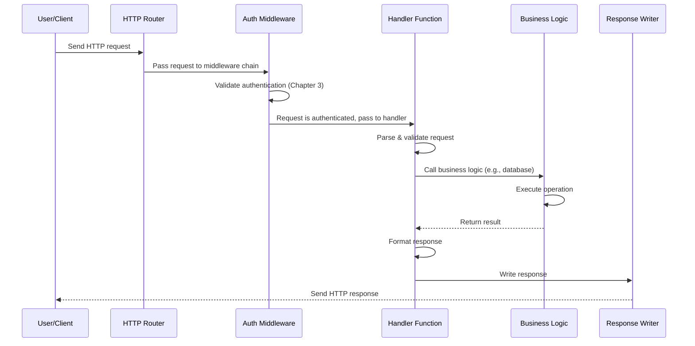

# Chapter 4: HTTP Handlers & API Layer

## Coming from Chapter 3

In [Chapter 3: Authentication & Authorization](03_authentication___authorization_.md), you learned how to secure your Agents by verifying who users are and what they're allowed to do. Now we face a new question: **How do requests from users actually reach your Agents and other resources?**

When a user wants to create an Agent, list sessions, or perform any action, they send an **HTTP request** to your system. Something needs to receive that request, understand what the user wants, validate it's correct, and then call the right business logic to handle it. That "something" is called **HTTP Handlers** — and they form the **API Layer** of kagent.

Think of HTTP Handlers as the **reception desk** of kagent:
- They receive incoming requests
- They understand what the user is asking for
- They validate the request
- They pass it to the right department (business logic)
- They format and return the response

## The Problem: Turning HTTP Requests Into Actions

Imagine you want to create a new Agent through an HTTP request:

```bash
curl -X POST http://kagent-api/api/agents \
  -H "Content-Type: application/json" \
  -d '{"name": "my-agent", "model": "gpt-4"}'
```

But here's the challenge:

**Without HTTP Handlers** (if kagent just had raw Kubernetes):
- ❌ You'd have to directly manipulate Kubernetes objects
- ❌ There's no standard REST interface
- ❌ Every client would need to know Kubernetes API details
- ❌ No validation or error handling for bad requests
- ❌ No way to handle different resource types (Agents, Sessions, ModelConfigs)

**With HTTP Handlers** (kagent's API Layer):
- ✅ Simple, intuitive REST endpoints
- ✅ Automatic request validation
- ✅ Clear, consistent responses
- ✅ Different handlers for different resources (Agents, Sessions, Tasks, etc.)
- ✅ Integration with authentication from Chapter 3
- ✅ Standard HTTP status codes and error messages

HTTP Handlers are like having a helpful receptionist who understands all your needs and knows exactly where to route each request.

## Key Concepts: Understanding HTTP Handlers

Let's break down what HTTP Handlers do:

### 1. **What is an HTTP Handler?**

An HTTP Handler is a function that:
- Receives an incoming HTTP request
- Parses what the user is asking for
- Validates the request is correct
- Calls business logic to do the work
- Formats the response in a standard way

Think of it like this:

```
HTTP Request
    ↓
[Handler Function]
    ├─ Validate: Is the request format correct?
    ├─ Check Auth: Does this user have permission? (from Chapter 3)
    ├─ Parse: What resources/data is the user asking for?
    ├─ Call Logic: Execute the business logic
    ├─ Handle Errors: Did something go wrong?
    └─ Format Response: Send back a clean JSON response
    ↓
HTTP Response
```

### 2. **REST Endpoints Structure**

HTTP Handlers are organized into REST endpoints. REST is a standard way to organize API endpoints around **resources**.

Here are examples of REST endpoints in kagent:

| Endpoint | Method | Action | Handler |
|----------|--------|--------|---------|
| `/api/agents` | GET | List all Agents | AgentsHandler.HandleListAgents |
| `/api/agents` | POST | Create a new Agent | AgentsHandler.HandleCreateAgent |
| `/api/agents/{namespace}/{name}` | GET | Get a specific Agent | AgentsHandler.HandleGetAgent |
| `/api/agents/{namespace}/{name}` | DELETE | Delete an Agent | AgentsHandler.HandleDeleteAgent |
| `/api/sessions` | GET | List all Sessions | SessionsHandler.HandleListSessions |
| `/api/sessions` | POST | Create a new Session | SessionsHandler.HandleCreateSession |

Notice the pattern: Same endpoint + different HTTP method = different action.

### 3. **Handler Organization: One Handler Per Domain**

Handlers are organized by **domain** (resource type). Each domain has its own handler class:

```
AgentsHandler
├─ HandleListAgents()
├─ HandleGetAgent()
├─ HandleCreateAgent()
└─ HandleDeleteAgent()

SessionsHandler
├─ HandleListSessions()
├─ HandleGetSession()
├─ HandleCreateSession()
└─ HandleDeleteSession()

ModelConfigHandler
├─ HandleListModelConfigs()
├─ HandleGetModelConfig()
├─ HandleCreateModelConfig()
└─ HandleDeleteModelConfig()
```

Each handler is like a **department** in a company:
- Sales department handles sales
- HR department handles employees
- Finance department handles money

### 4. **Request Validation**

Before processing a request, handlers validate it:

```
Is the request format valid?
├─ Is JSON? ✅ or ❌
├─ Are all required fields present? ✅ or ❌
└─ Are field types correct? ✅ or ❌

Is the user authorized? (from Chapter 3)
├─ Is user authenticated? ✅ or ❌
└─ Does user have permission? ✅ or ❌
```

If validation fails, the handler returns an error response (like a 400 Bad Request).

### 5. **Error Handling and Status Codes**

Handlers use standard HTTP status codes to communicate results:

| Status Code | Meaning | Example |
|-------------|---------|---------|
| `200 OK` | Success! | Agent retrieved successfully |
| `201 Created` | Resource created! | New Agent created successfully |
| `400 Bad Request` | Client sent invalid data | Missing required field |
| `401 Unauthorized` | User not authenticated | Invalid API key |
| `403 Forbidden` | User authenticated but not permitted | User can't delete this Agent |
| `404 Not Found` | Resource doesn't exist | Agent with that name not found |
| `500 Internal Server Error` | Server-side error | Database connection failed |

## How to Use HTTP Handlers: A Practical Example

Let's walk through a real example: **Creating a new Session**.

### Step 1: User Sends Request

```bash
curl -X POST http://kagent-api/api/sessions \
  -H "Authorization: Bearer sk-alice-12345" \
  -H "Content-Type: application/json" \
  -d '{
    "name": "customer-support-session",
    "agent_ref": "default/support-bot"
  }'
```

### Step 2: Handler Receives Request

The SessionsHandler receives this request and starts processing:

```go
// Simplified handler
func (h *SessionsHandler) HandleCreateSession(w ResponseWriter, r *http.Request) {
    // Step 2.1: Extract user identity (from Chapter 3)
    userID, err := GetUserID(r)
    
    // Step 2.2: Parse request body
    var req SessionRequest
    json.NewDecoder(r.Body).Decode(&req)
    
    // Step 2.3: Validate required fields
    if req.AgentRef == nil {
        // Return error: agent_ref is required
    }
}
```

The handler extracts the user ID from the authentication token we set up in Chapter 3!

### Step 3: Handler Validates and Creates

```go
// Create session object
session := &Session{
    ID:      generateID(),
    Name:    req.Name,
    UserID:  userID,
    AgentID: getAgentID(req.AgentRef),
}

// Store in database
h.DatabaseService.StoreSession(session)
```

The handler validates the agent exists, then stores the session.

### Step 4: Handler Returns Response

```go
// Format and return success response
response := map[string]interface{}{
    "data": session,
    "message": "Session created successfully",
}
RespondWithJSON(w, http.StatusCreated, response)
```

### Step 5: User Receives Response

```json
HTTP/1.1 201 Created
Content-Type: application/json

{
  "data": {
    "id": "session-123",
    "name": "customer-support-session",
    "agent_ref": "default/support-bot",
    "user_id": "alice@company.com"
  },
  "message": "Session created successfully"
}
```

The user now has their new Session! ✅

## Understanding the Internal Implementation

Now let's look at how the HTTP Handlers work behind the scenes.

### The Journey: Request to Response

Here's what happens when a request arrives at the HTTP server:



### Step-by-Step Walkthrough

**Step 1: Request Arrives at Router**

The HTTP server receives the request. The router looks at the HTTP method and path to decide which handler to call:

```go
// File: go/internal/httpserver/server.go
s.router.HandleFunc(
    APIPathSessions,  // "/api/sessions"
    adaptHandler(s.handlers.Sessions.HandleCreateSession),
).Methods(http.MethodPost)  // Only for POST requests
```

The router says: "POST /api/sessions? That's SessionsHandler.HandleCreateSession!"

**Step 2: Middleware Chain Executes**

Before the handler runs, middleware runs (like a security checkpoint):

```go
// Middleware processes request in order
s.router.Use(auth.AuthnMiddleware(s.authenticator))  // [1] Authenticate
s.router.Use(contentTypeMiddleware)                  // [2] Check content type
s.router.Use(loggingMiddleware)                      // [3] Log request
s.router.Use(errorHandlerMiddleware)                 // [4] Catch errors
```

This is the same middleware chain from Chapter 3! Each middleware either passes the request on or blocks it.

**Step 3: Handler Receives Request**

The handler now executes. First, it extracts the user ID:

```go
// File: go/internal/httpserver/handlers/sessions.go
func (h *SessionsHandler) HandleCreateSession(w ErrorResponseWriter, r *http.Request) {
    userID, err := getUserIDOrAgentUser(r)
    // userID is now the authenticated user (from Chapter 3)
}
```

**Step 4: Request is Parsed and Validated**

```go
// Parse JSON request body
var sessionRequest api.SessionRequest
DecodeJSONBody(r, &sessionRequest)

// Validate required fields
if sessionRequest.AgentRef == nil {
    w.RespondWithError(errors.NewBadRequestError("agent_ref is required", nil))
    return  // Stop here, send error to user
}
```

The handler checks: "Is agent_ref provided? Is it the right format?" If validation fails, it immediately returns an error response.

**Step 5: Resolve References**

Before creating the session, resolve the agent reference:

```go
// Get the actual Agent resource
agent, err := h.DatabaseService.GetAgent(
    utils.ConvertToPythonIdentifier(*sessionRequest.AgentRef),
)
if err != nil {
    // Agent doesn't exist, return 404
}
```

The handler checks: "Does this Agent actually exist?" If not, return a 404 (Not Found).

**Step 6: Create and Store**

```go
// Create the Session object
session := &database.Session{
    ID:      generateID(),
    Name:    sessionRequest.Name,
    UserID:  userID,
    AgentID: &agent.ID,
}

// Store in database
h.DatabaseService.StoreSession(session)
```

The handler creates the session and stores it.

**Step 7: Format and Return Response**

```go
// Format response
data := api.NewResponse(session, "Successfully created session", false)

// Write HTTP response with 201 status
RespondWithJSON(w, http.StatusCreated, data)
```

The handler sends back the session data with a 201 (Created) status code.

### Looking at the Code: Handler Structure

Let's look at how handlers are organized:

```go
// File: go/internal/httpserver/handlers/handlers.go
type Handlers struct {
    Sessions    *SessionsHandler
    Agents      *AgentsHandler
    ModelConfig *ModelConfigHandler
    // ... more handlers ...
}
```

This is the **handler registry** — a collection of all handlers. Each handler knows how to handle requests for its resource type.

```go
// File: go/internal/httpserver/handlers/sessions.go
type SessionsHandler struct {
    *Base
}

type Base struct {
    KubeClient      client.Client
    DatabaseService database.Client
    Authorizer      auth.Authorizer  // From Chapter 3
}
```

Each handler has access to:
- **KubeClient**: To interact with Kubernetes resources
- **DatabaseService**: To store/retrieve data
- **Authorizer**: To check permissions (from Chapter 3)

### Request-Response Adapter Pattern

There's a clever pattern used to make request handling consistent:

```go
// File: go/internal/httpserver/server.go
func adaptHandler(h func(ErrorResponseWriter, *http.Request)) http.HandlerFunc {
    return func(w http.ResponseWriter, r *http.Request) {
        h(w.(ErrorResponseWriter), r)  // Cast to ErrorResponseWriter
    }
}
```

This adapter wraps handlers so they have a special **ErrorResponseWriter** that knows how to format error responses. Instead of handlers manually writing errors, they call:

```go
w.RespondWithError(errors.NewBadRequestError("...", err))
// Automatically writes error JSON response with correct status code
```

### Error Handling

Errors are handled consistently across all handlers:

```go
// File: go/internal/httpserver/errors/errors.go (conceptual)
type BadRequestError struct { message string }
type NotFoundError struct { message string }
type ForbiddenError struct { message string }
type InternalServerError struct { message string }

// When handler encounters error:
w.RespondWithError(errors.NewNotFoundError("Agent not found", err))

// ErrorResponseWriter automatically:
// - Sets correct HTTP status (404)
// - Formats JSON response
// - Logs error details
// - Returns to user
```

## Connecting Handlers to Resources

Handlers aren't isolated — they work together with the resources from earlier chapters:

### Handlers + Agents (Chapter 1)

```go
// User creates Agent via HTTP
POST /api/agents
Body: {"name": "my-agent", "type": "Declarative", ...}
    ↓
[AgentsHandler.HandleCreateAgent]
    ├─ Validates Agent spec
    ├─ Checks permissions (Chapter 3)
    └─ Creates Agent in Kubernetes (Chapter 1)
    ↓
Returns: 201 Created with Agent details
```

### Handlers + ModelConfigs (Chapter 2)

```go
// User lists ModelConfigs via HTTP
GET /api/modelconfigs
    ↓
[ModelConfigHandler.HandleListModelConfigs]
    ├─ Retrieves all ModelConfigs from Kubernetes
    ├─ Filters by namespace and permissions
    └─ Formats response
    ↓
Returns: 200 OK with list of ModelConfigs
```

### Handlers + Sessions & Tasks (Chapter 5)

The SessionsHandler creates and manages Sessions (which we'll learn about in [Chapter 5: Session & Task Management](05_session___task_management_.md)). When a user wants to create a session:

```go
// User creates Session
POST /api/sessions
Body: {"name": "my-session", "agent_ref": "default/faq-bot"}
    ↓
[SessionsHandler.HandleCreateSession]
    ├─ Gets user from auth (Chapter 3)
    ├─ Gets Agent from Kubernetes (Chapter 1)
    ├─ Creates Session in database
    └─ Links Session to Agent
    ↓
Returns: 201 Created with Session details
```

## A Complete Example: Building the Handler

Let's build a simple handler from scratch to understand the full pattern:

### Example: List all Agents

```go
// File: go/internal/httpserver/handlers/agents.go
func (h *AgentsHandler) HandleListAgents(w ErrorResponseWriter, r *http.Request) {
    // [1] Check permission (from Chapter 3)
    if err := Check(h.Authorizer, r, auth.Resource{Type: "Agent"}); err != nil {
        w.RespondWithError(err)
        return
    }
```

Check: Is this user allowed to list Agents?

```go
    // [2] Get all Agents from Kubernetes (like Chapter 1)
    agentList := &v1alpha2.AgentList{}
    h.KubeClient.List(r.Context(), agentList)
```

Retrieve all Agent resources from Kubernetes.

```go
    // [3] Format response and return
    data := api.NewResponse(agentList.Items, "Successfully listed agents", false)
    RespondWithJSON(w, http.StatusOK, data)
}
```

Return the list as a JSON response.

That's it! The handler:
1. ✅ Checks authentication & authorization (Chapter 3)
2. ✅ Gets data (from Kubernetes, databases, etc.)
3. ✅ Formats and returns response

## Key Takeaways

**HTTP Handlers & API Layer** in Kagent:
- ✅ **Route incoming HTTP requests** to the right handler
- ✅ **Validate requests** for correctness and completeness
- ✅ **Integrate authentication** from Chapter 3
- ✅ **Call business logic** (Kubernetes operations, database queries, etc.)
- ✅ **Format responses** consistently as JSON
- ✅ **Handle errors** with appropriate HTTP status codes
- ✅ **Organized by domain** (Agents, Sessions, ModelConfigs, etc.)

Think of HTTP Handlers as a **hotel front desk**:
- Guests (users) arrive with requests
- Desk staff (handlers) understand what guests need
- Staff verifies guests are legitimate (authentication from Chapter 3)
- Staff verifies guests can access requested rooms (authorization from Chapter 3)
- Staff arranges everything (calls business logic)
- Staff gives guests a clear receipt (formatted response)

## What's Next?

Now that you understand how HTTP requests are received and processed by handlers, the next question is: **What do handlers do with Sessions and Tasks?**

The next chapter covers **[Chapter 5: Session & Task Management](05_session___task_management_.md)** — which teaches you how Sessions maintain conversation context and how Tasks represent work being done by Agents.

---

**Summary**: HTTP Handlers & API Layer form the HTTP interface to kagent. They receive requests from users and clients, validate them, check permissions (using authentication from Chapter 3), call the appropriate business logic, and return formatted responses. Each handler is responsible for a specific resource type (Agents, Sessions, ModelConfigs, etc.), making the API well-organized and easy to understand. Handlers abstract away the complexity of Kubernetes and databases, providing users with a clean, standard REST API!

---

Generated by [AI Codebase Knowledge Builder](https://github.com/The-Pocket/Tutorial-Codebase-Knowledge)