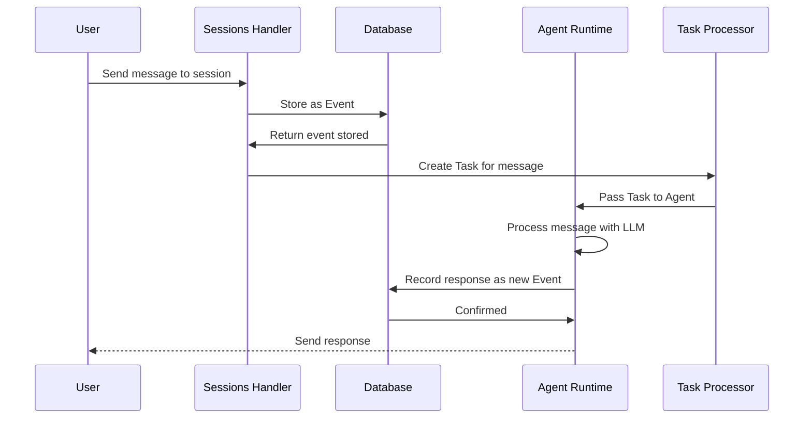

# Chapter 5: Session & Task Management

## Coming from Chapter 4

In [Chapter 4: HTTP Handlers & API Layer](04_http_handlers___api_layer_.md), you learned how HTTP requests arrive at kagent and get routed to handlers that process them. You now know how users can create Agents, retrieve data, and interact with the system through a clean REST API.

But here's a new challenge: **What if a user wants to have a multi-turn conversation with an Agent?** What if they ask a question, get an answer, then ask a follow-up question? How does the Agent remember the context of the conversation? How do we track what work the Agent is doing?

That's what this chapter is about — **Sessions and Tasks**. They're the glue that enables **stateful, persistent conversations** between users and Agents.

## The Problem: Managing Multi-Turn Conversations

Imagine you're building a **customer support chatbot**. Here's a realistic scenario:

```
Customer: "Hi, I need help with my order"
Agent: "Sure! What's your order number?"
Customer: "Order #12345"
Agent: "Found it! It ships tomorrow. Anything else?"
Customer: "What about the refund policy?"
Agent: "Our refund policy is..." (agent remembers the order context)
```

Notice something important: The Agent needs to **remember** what was said before. Without that memory:
- ❌ The Agent would forget previous messages
- ❌ Each message would be treated as a brand new conversation
- ❌ You couldn't track what work was being done
- ❌ There's no audit trail for debugging

With Sessions and Tasks:
- ✅ The Agent remembers the entire conversation
- ✅ You can retrieve old conversations later
- ✅ Work is broken into trackable units (Tasks)
- ✅ Full audit trail for debugging and analysis
- ✅ Conversations persist even if the system restarts

Think of it like a **file at a customer service desk**:
- **Session** = The file that holds all notes from this customer's interactions
- **Task** = Individual notes written during the conversation

## Key Concepts: Understanding Sessions and Tasks

Let's break down what Sessions and Tasks do:

### What is a Session?

A **Session** is a **persistent container for a multi-turn conversation** between a user and an Agent. It's like opening a chat window that stays open as long as you need it.

Think of it this way:

```
Session = {
  id: "session-123",
  user_id: "alice@company.com",
  agent_id: "support-bot",
  messages: [
    Message 1,
    Message 2,
    Message 3,
    ...
  ]
}
```

Key points about Sessions:
- **One per conversation**: Each user-Agent pair gets its own Session
- **Persistent**: Sessions survive system restarts (stored in database)
- **Unique ID**: Every Session has a unique identifier
- **Linked to a user and agent**: Tracks who's talking to whom

### What is a Task?

A **Task** is a **discrete unit of work** that the Agent performs. While a Session contains the entire conversation, a Task represents one specific piece of work within that conversation.

Think of it like this:

```
Session (entire conversation)
├─ Task 1: Process first user message
├─ Task 2: Call database to check order status
├─ Task 3: Call refund API
├─ Task 4: Generate response
└─ Task 5: Process follow-up question
```

Key points about Tasks:
- **One per operation**: Each piece of work gets its own Task
- **Trackable**: You can see what the Agent is doing, step by step
- **Auditable**: Full history of operations for debugging
- **Time-stamped**: Know exactly when each Task executed

### How Sessions and Tasks Work Together

Here's the relationship:

```
One Session contains Many Tasks

[Session: "customer-support-session"]
    ├─ [Task: "message-received"]
    ├─ [Task: "retrieve-order"]
    ├─ [Task: "call-inventory-api"]
    ├─ [Task: "generate-response"]
    └─ [Task: "send-message"]
```

**Sessions = Context** (what's being discussed)
**Tasks = Actions** (what's being done)

Together, they enable **stateful, auditable agent interactions**.

## How to Use Sessions and Tasks: A Practical Example

Let's walk through the customer support scenario step-by-step.

### Step 1: User Starts a Conversation — Create a Session

When a customer arrives at your support chatbot, they first create a Session:

```bash
curl -X POST http://kagent-api/api/sessions \
  -H "Authorization: Bearer sk-alice-12345" \
  -H "Content-Type: application/json" \
  -d '{
    "name": "support-session",
    "agent_ref": "default/support-bot"
  }'
```

The response:

```json
{
  "data": {
    "id": "session-abc123",
    "name": "support-session",
    "user_id": "alice@company.com",
    "agent_id": "default/support-bot",
    "created_at": "2024-01-15T10:00:00Z"
  }
}
```

The Session is now created! ✅ The customer can now send messages within this Session context.

### Step 2: User Sends a Message — A Task is Created

When the customer sends their first message:

```bash
curl -X POST http://kagent-api/api/sessions/session-abc123/events \
  -H "Authorization: Bearer sk-alice-12345" \
  -H "Content-Type: application/json" \
  -d '{
    "id": "event-1",
    "data": "{\"message\": \"Hi, I need help with my order\"}"
  }'
```

Behind the scenes:
1. The message is **added to the Session** as an Event
2. A new **Task** is created to process this message
3. The Agent retrieves the Task and processes it
4. The Agent records the response back to the Session

### Step 3: Retrieve Conversation History

Later, you want to see the entire conversation:

```bash
curl http://kagent-api/api/sessions/session-abc123 \
  -H "Authorization: Bearer sk-alice-12345"
```

Response:

```json
{
  "data": {
    "session": {
      "id": "session-abc123",
      "name": "support-session",
      "created_at": "2024-01-15T10:00:00Z"
    },
    "events": [
      {
        "id": "event-1",
        "data": "{\"message\": \"Hi, I need help...\"}"
      },
      {
        "id": "event-2",
        "data": "{\"message\": \"Sure! What's your order number?...\"}"
      }
    ]
  }
}
```

The entire conversation history is right there! ✅ The user can continue the conversation anytime by sending more events to this Session.

## Understanding the Internal Implementation

Now let's look at how Sessions and Tasks work behind the scenes.

### The Journey: Message to Task to Response

When a user sends a message to an Agent, here's the flow:



Let's walk through each step:

**Step 1: User Sends Message**

User sends an HTTP request to add an event to a Session. The SessionsHandler receives it (from Chapter 4):

```go
// File: go/internal/httpserver/handlers/sessions.go
func (h *SessionsHandler) HandleAddEventToSession(w ErrorResponseWriter, r *http.Request) {
    sessionID, _ := GetPathParam(r, "session_id")
    userID, _ := getUserID(r)
    // ... validate ...
```

The handler extracts the session ID and user ID.

**Step 2: Verify Session Exists**

```go
    session, err := h.DatabaseService.GetSession(sessionID, userID)
    if err != nil {
        w.RespondWithError(errors.NewNotFoundError("Session not found", nil))
        return
    }
```

The handler checks: "Does this Session exist for this user?" If not, reject it.

**Step 3: Create Event in Database**

```go
    event := &database.Event{
        ID:        eventID,
        SessionID: sessionID,
        UserID:    userID,
        Data:      eventData.Data,
    }
    h.DatabaseService.StoreEvents(event)
```

The message is stored as an **Event** in the database. Events are the building blocks of Sessions. Looking at the database model:

```go
// File: go/internal/database/models.go
type Event struct {
    ID        string    `gorm:"primaryKey" json:"id"`
    SessionID string    `gorm:"index" json:"session_id"`
    UserID    string    `gorm:"primaryKey" json:"user_id"`
    CreatedAt time.Time `gorm:"autoCreateTime" json:"created_at"`
    Data      string    `gorm:"type:text" json:"data"` // JSON message
}
```

Each Event belongs to a Session and has the message data stored as JSON.

**Step 4: Create Task**

```go
    task := &database.Task{
        ID:        protocol.GenerateTaskID(),
        SessionID: sessionID,
        Data:      messageData,
    }
    h.DatabaseService.StoreTask(task)
```

A new Task is created:

```go
// File: go/internal/database/models.go
type Task struct {
    ID        string    `gorm:"primaryKey" json:"id"`
    SessionID string    `gorm:"index" json:"session_id"`
    CreatedAt time.Time `gorm:"autoCreateTime" json:"created_at"`
    Data      string    `gorm:"type:text" json:"data"` // JSON task
}
```

The Task links back to the Session and contains the work to be done.

**Step 5: Agent Processes Task**

The Agent's runtime gets the Task from the database and processes it:

```go
    task, _ := h.DatabaseService.GetTask(taskID)
    taskData, _ := task.Parse()  // Convert from JSON
    // Agent processes the task
```

The Agent uses the Session context (from Steps 1-3) plus the Task details to generate a response.

**Step 6: Response Stored Back**

The Agent creates a response Event:

```go
    responseEvent := &database.Event{
        ID:        generateEventID(),
        SessionID: sessionID,
        Data:      agentResponse,
    }
    h.DatabaseService.StoreEvents(responseEvent)
```

Now the Session contains both the user's message AND the Agent's response. ✅

### Sessions and Database Persistence

One of the key benefits of Sessions is that they're **persistent** — stored in a database. Let's look at the Session model:

```go
// File: go/internal/database/models.go
type Session struct {
    ID        string    `gorm:"primaryKey" json:"id"`
    Name      *string   `gorm:"index" json:"name"`
    UserID    string    `gorm:"primaryKey" json:"user_id"`
    AgentID   *string   `gorm:"index" json:"agent_id"`
    CreatedAt time.Time `gorm:"autoCreateTime" json:"created_at"`
}
```

Key fields:
- **ID**: Unique session identifier
- **UserID**: Who started this session (from Chapter 3 auth)
- **AgentID**: Which Agent this session is connected to
- **CreatedAt**: When the session started

When you retrieve a Session later, the handler fetches it from the database:

```go
// File: go/internal/httpserver/handlers/sessions.go
func (h *SessionsHandler) HandleGetSession(w ErrorResponseWriter, r *http.Request) {
    sessionID, _ := GetPathParam(r, "session_id")
    userID, _ := getUserID(r)
    
    session, _ := h.DatabaseService.GetSession(sessionID, userID)
    // Session is now restored from database ✅
```

This is powerful: You can close your browser, come back a month later, and the entire conversation is still there!

### Tasks for Audit Trails

Tasks enable **audit trails** — you can see exactly what work was done. Imagine an Agent makes a mistake. You can examine the Tasks to understand what went wrong:

```go
// File: go/internal/httpserver/handlers/sessions.go
func (h *SessionsHandler) HandleListTasksForSession(w ErrorResponseWriter, r *http.Request) {
    sessionID, _ := GetPathParam(r, "session_id")
    
    tasks, _ := h.DatabaseService.ListTasksForSession(sessionID)
    // Returns all Tasks for debugging
```

For debugging, you'd see something like:

```json
{
  "tasks": [
    {
      "id": "task-1",
      "session_id": "session-abc123",
      "created_at": "2024-01-15T10:00:01Z",
      "data": "{\"action\": \"query_database\", \"query\": \"SELECT * FROM orders\"}"
    },
    {
      "id": "task-2",
      "session_id": "session-abc123",
      "created_at": "2024-01-15T10:00:02Z",
      "data": "{\"action\": \"call_llm\", \"prompt\": \"...\"}"
    }
  ]
}
```

Each Task shows exactly what operation was performed and when. Perfect for debugging! 🔍

## Real-World Example: Multi-Turn Support Conversation

Let's see Sessions and Tasks in action with a complete example:

### Scenario: Customer Support Chat

**Time 10:00** - Customer starts conversation:

```bash
# Create session
curl -X POST http://kagent-api/api/sessions \
  -d '{"agent_ref": "default/support-bot"}'
# Returns: session-123
```

**Time 10:01** - Customer sends first message:

```bash
# Add event to session
curl -X POST http://kagent-api/api/sessions/session-123/events \
  -d '{"data": "{\"message\": \"My order is broken\"}"}'
```

Behind scenes: Task created, Agent processes, response stored.

**Time 10:05** - Customer sends follow-up:

```bash
# Add another event (same session!)
curl -X POST http://kagent-api/api/sessions/session-123/events \
  -d '{"data": "{\"message\": \"Can you start a return?\"}"}'
```

Agent still has context from message 1! The Session holds everything.

**Time 14:00** - Support team reviews conversation:

```bash
# Retrieve entire conversation history
curl http://kagent-api/api/sessions/session-123
# Returns all events from 10:01, 10:05, plus Agent responses
```

All in one place! ✅

## Key Takeaways

**Session & Task Management** in Kagent:

- ✅ **Sessions** maintain conversation context across multiple user messages
- ✅ **Tasks** represent individual units of work within a Session
- ✅ **Persistent**: Stored in database so conversations survive restarts
- ✅ **Auditable**: Complete history for debugging and analysis
- ✅ **User-scoped**: Each user can have multiple Sessions, isolated by UserID (Chapter 3)
- ✅ **Agent-linked**: Sessions connect to specific Agents to provide context

Think of it like a **doctor's office filing system**:
- **Session** = Patient's medical file (contains all visit history)
- **Task** = Individual treatment notes (what was done at each visit)
- **Persistence** = Files are kept for years
- **Audit trail** = You can review past treatments

Sessions and Tasks transform Agents from **stateless request-response** systems into **stateful conversational partners** that remember context and maintain history.

## What's Next?

Now that you understand how Sessions and Tasks manage conversation state and track work, the next question is: **Where does all this data get stored? How does the database work?**

The next chapter covers **[Chapter 6: Database Client](06_database_client_.md)** — which teaches you how kagent connects to databases to persistently store Sessions, Tasks, Events, and other data, and how to query them efficiently.

---

**Summary**: Sessions and Tasks enable stateful, persistent agent interactions. Sessions are containers for multi-turn conversations that live in the database, and Tasks are discrete units of work performed within those Sessions. Together, they provide a complete audit trail of Agent-user interactions, allowing conversations to be resumed later and operations to be debugged and analyzed. Every message gets recorded as an Event, every operation as a Task, all organized within Sessions — creating a comprehensive history of everything that happens!

---

Generated by [AI Codebase Knowledge Builder](https://github.com/The-Pocket/Tutorial-Codebase-Knowledge)