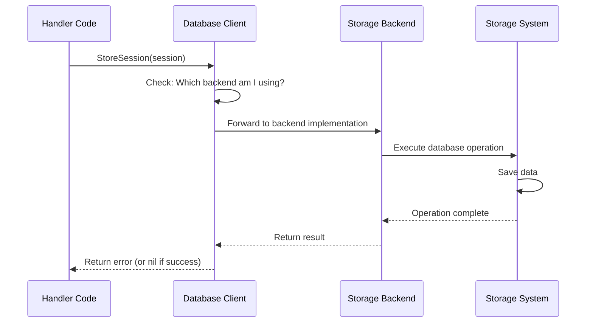

# Chapter 6: Database Client

## Coming from Chapter 5

In [Chapter 5: Session & Task Management](05_session___task_management_.md), you learned how Sessions maintain conversation context and Tasks track individual operations. You discovered that Sessions and Tasks are **stored in a database** to survive system restarts. But you may have wondered: **How exactly does the code interact with that database? How do we store and retrieve Sessions, Tasks, Events, and other data?**

That's what this chapter is about — the **Database Client**. It's the abstraction layer that handles all persistent data storage and retrieval for kagent.

## The Problem: Database Access Without Coupling

Imagine you're building kagent and need to store Sessions and Tasks. Here's a challenge:

**Without a Database Client** (if every handler directly used the database):
- ❌ Every handler would have SQL queries scattered everywhere
- ❌ If you change databases (SQLite to PostgreSQL), you'd rewrite code in many places
- ❌ Testing would be hard — you'd need a real database
- ❌ Difficult to ensure consistency (is it a transaction? Did it save correctly?)

**With a Database Client** (abstraction layer):
- ✅ Handlers don't know about the database — they just call "save this Session"
- ✅ Easy to swap databases — change one place, everything works
- ✅ Testing is simple — use a fake in-memory database instead of real one
- ✅ Consistent patterns for all operations

Think of the Database Client like a **mail room in a company**:
- **Without a mail room**: Every employee takes their own mail to the post office. Chaos!
- **With a mail room**: Employees just give mail to the mail room. The mail room handles delivery, tracking, sorting — employees don't care about the details.

## Key Concepts: Understanding Database Client

Let's break down how the Database Client works:

### 1. **What is the Database Client?**

The Database Client is an **interface** (a contract) that defines operations for storing and retrieving data. It's the "mail room API" that handlers use.

```go
// Simplified view of the Database Client interface
type Client interface {
    // Store operations
    StoreSession(session *Session) error
    StoreTask(task *Task) error
    StoreEvents(events ...*Event) error
    
    // Get operations
    GetSession(name string, userID string) (*Session, error)
    GetTask(id string) (*Task, error)
    
    // List operations
    ListSessions(userID string) ([]Session, error)
    ListTasksForSession(sessionID string) ([]*Task, error)
    
    // Delete operations
    DeleteSession(sessionID string, userID string) error
    DeleteTask(taskID string) error
}
```

This interface defines what operations are available. Notice:
- Every operation returns an error (something might go wrong)
- Get operations return data and an error
- No SQL! No database-specific details!

### 2. **Multiple Backends: Flexibility**

The Database Client can have **multiple implementations** — different ways to store data:

```
Database Client Interface
    ↓
    ├─ SQLite Implementation
    │  └─ Stores data in local SQLite database
    │
    ├─ PostgreSQL Implementation
    │  └─ Stores data in PostgreSQL server
    │
    └─ Fake In-Memory Implementation
       └─ Stores data in RAM (for testing)
```

All three implementations follow the same interface, so the code using them doesn't care which one it is!

### 3. **Repository Pattern: Separation of Concerns**

The Database Client implements the **Repository Pattern**. Think of it like this:

```
Handler Code
    ↓
    "I need to save a session"
    ↓
[Database Client]
    ↓
    "Where should I save it?"
    ↓
(Checks internal database config)
    ↓
    Saves to SQLite / PostgreSQL / Memory
```

The handler doesn't decide where to save — the Database Client decides. This separation makes code flexible and testable.

## How to Use the Database Client: Practical Examples

Let's see how handlers actually use the Database Client:

### Example 1: Saving a Session

When a user creates a new Session (from Chapter 5), the handler uses the Database Client:

```go
// In the SessionsHandler
session := &database.Session{
    ID:     "session-123",
    UserID: "alice@company.com",
}
err := dbClient.StoreSession(session)
```

That's it! The handler doesn't know where the Session is stored — SQLite? PostgreSQL? In-memory? Doesn't matter!

### Example 2: Retrieving a Session

Later, when you want to retrieve that Session:

```go
// Get the session
session, err := dbClient.GetSession("session-123", "alice@company.com")
if err != nil {
    // Session not found
    return err
}
// Use session data...
```

Again, the handler doesn't know where the Session came from — it just got it from the Database Client.

### Example 3: Storing Events (From Chapter 5)

Remember from Chapter 5 that every message is an Event? When a message arrives, it's stored as an Event:

```go
// Create an event from a message
event := &database.Event{
    ID:        "event-1",
    SessionID: "session-123",
    UserID:    "alice@company.com",
    Data:      messageJSON,
}
err := dbClient.StoreEvents(event)
```

Notice `StoreEvents` takes multiple events (notice the `...` which means "variable number of arguments"):

```go
// Store multiple events at once
err := dbClient.StoreEvents(event1, event2, event3)
```

This is useful for batch operations!

### Example 4: Listing with Filtering

You can retrieve filtered data:

```go
// Get all sessions for a user
sessions, err := dbClient.ListSessions("alice@company.com")

// Get all tasks for a specific session
tasks, err := dbClient.ListTasksForSession("session-123")
```

The Database Client handles the filtering logic — you just ask for what you want!

## Understanding the Internal Implementation

Now let's look at how the Database Client works behind the scenes.

### The Journey: Saving Data

When you call `dbClient.StoreSession(session)`, here's what happens:



The flow is simple: Handler → Database Client → Backend → Storage.

### Step-by-Step: How SQLite Backend Works

Let's look at the actual SQLite implementation:

```go
// File: go/internal/database/client.go
// When storing a session with SQLite backend
func (c *clientImpl) StoreSession(session *Session) error {
    // SQLite uses GORM (an ORM - Object Relational Mapper)
    // We just call save()
    return save(c.db, session)
}
```

The `save()` function is a helper:

```go
// Simplified save function
func save(db *gorm.DB, model interface{}) error {
    result := db.Save(model)  // GORM magic
    return result.Error       // Return any error
}
```

**What happens inside?**
- `db.Save(model)` tells GORM: "Save this object to the database"
- GORM automatically converts the Go object to SQL
- SQL is executed on SQLite
- Any errors are returned

The handler doesn't need to write SQL! 🎉

### Step-by-Step: How the Fake In-Memory Backend Works

For testing, kagent provides a fake in-memory Database Client:

```go
// File: go/internal/database/fake/client.go
type InMemoryFakeClient struct {
    mu       sync.RWMutex
    sessions map[string]*Session  // Stored in RAM!
    tasks    map[string]*Task
    events   map[string]*Event
    // ... more data structures ...
}
```

When you call `StoreSession` on the fake client:

```go
func (c *InMemoryFakeClient) StoreSession(session *Session) error {
    c.mu.Lock()                    // Thread-safe lock
    defer c.mu.Unlock()
    
    key := session.ID + "_" + session.UserID
    c.sessions[key] = session      // Just store in a map!
    return nil
}
```

Notice:
- **No database needed** — just a Go map
- **Extremely fast** — operations are in-memory
- **Perfect for testing** — no setup required

### Connecting Multiple Backends

How does kagent decide which backend to use? At startup, the manager configures it:

```go
// File: go/internal/database/manager.go
type Config struct {
    DatabaseType   DatabaseType
    SqliteConfig   *SqliteConfig    // For SQLite
    PostgresConfig *PostgresConfig  // For PostgreSQL
}

// Create the right backend based on config
switch config.DatabaseType {
case DatabaseTypeSqlite:
    // Create SQLite database client
case DatabaseTypePostgres:
    // Create PostgreSQL database client
}
```

Then handlers use the same interface regardless:

```go
// Handlers don't care which backend they got
handler.dbClient = dbManager.NewClient()
// Could be SQLite, PostgreSQL, or Fake — same interface!
```

## A Real Example: Complete Data Flow

Let's trace a complete example from [Chapter 5: Session & Task Management](05_session___task_management_.md):

### Scenario: User Creates a Session and Sends a Message

**Step 1: User creates Session via HTTP**

```bash
POST /api/sessions
Body: {"agent_ref": "default/support-bot"}
```

**Step 2: Handler receives request and creates Session**

```go
session := &database.Session{
    ID:     generateID(),
    UserID: "alice@company.com",
}
dbClient.StoreSession(session)  // ← Database Client
```

**Step 3: Database Client saves it**

If using SQLite:
- Converts Session struct to SQL INSERT statement
- Executes on SQLite database
- Returns to handler

If using Fake:
- Stores in memory map
- Returns to handler

**Step 4: User sends message**

```bash
POST /api/sessions/session-123/events
Body: {"data": "{\"message\": \"Hello\"}"}
```

**Step 5: Handler creates Event**

```go
event := &database.Event{
    ID:        "event-1",
    SessionID: "session-123",
    UserID:    "alice@company.com",
    Data:      messageData,
}
dbClient.StoreEvents(event)  // ← Database Client
```

**Step 6: Later, retrieve entire conversation**

```go
events, _ := dbClient.ListEventsForSession(
    "session-123", 
    "alice@company.com",
    QueryOptions{Limit: 50},
)
// Returns: [event-1, event-2, event-3, ...]
```

All the data persists! Even if the system restarts, everything is in the database. ✅

## Key Takeaways

**Database Client** in Kagent:

- ✅ **Abstraction layer** — handlers don't know about databases
- ✅ **Repository Pattern** — consistent interface for data operations
- ✅ **Multiple backends** — SQLite, PostgreSQL, or in-memory Fake
- ✅ **Easy testing** — swap in Fake backend for tests
- ✅ **Persistence** — data survives system restarts
- ✅ **Thread-safe** — uses locks to prevent race conditions
- ✅ **Flexible** — add new backends without changing handler code

Think of it like **ordering at a restaurant**:
- You don't care **where** the kitchen is or **how** they cook
- You just order from the menu (the interface)
- The kitchen (backend) handles the rest
- The experience is the same whether it's a small diner or a fancy restaurant

## What's Next?

Now that you understand how data is persisted and retrieved through the Database Client, you're ready to learn about **external tools and integrations**. 

The next chapter covers **[Chapter 7: MCP Server Management](07_mcp_server_management_.md)** — which teaches you how Agents can connect to external services and tools through MCP (Model Context Protocol) Servers to expand their capabilities beyond just conversation.

---

**Summary**: The Database Client is an abstraction layer that handles all persistent data storage for kagent. By implementing the Repository Pattern, it provides a consistent interface for storing and retrieving Sessions, Tasks, Events, and other data, while supporting multiple backends (SQLite, PostgreSQL, or in-memory Fake). This allows handlers and other code to remain independent of database implementation details, making the system flexible, testable, and easy to maintain. Think of it as the mail room that handles all delivery logistics while other departments just send mail!

---

Generated by [AI Codebase Knowledge Builder](https://github.com/The-Pocket/Tutorial-Codebase-Knowledge)