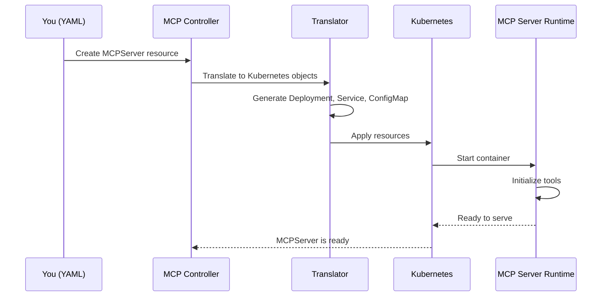

# Chapter 7: MCP Server Management

## Coming from Chapter 6

In [Chapter 6: Database Client](06_database_client_.md), you learned how kagent persistently stores Sessions, Tasks, Events, and other data. You now understand how conversations and work history survive system restarts.

But here's an important question: **What tools can your Agents actually use?** In previous chapters, we mentioned that Agents can "wield tools" and make function calls, but we never explained where those tools come from or how they work. That's what this chapter is about — **MCP Server Management**.

MCP stands for **Model Context Protocol**, and it's the system that gives Agents access to external tools and services. Let me explain with a concrete example.

## The Problem: Giving Agents Superpowers

Imagine you've built a support Agent using Agents. Right now, it can only talk — it can't actually *do* anything. The customer asks: "Can you check my order status?" and the Agent responds: "I don't have access to your order database, so I can't help."

That's not very useful! 😞

Here's what you want:
- The Agent should be able to **query your database** to look up orders
- The Agent should be able to **call your API** to process refunds
- The Agent should be able to **send emails** or **create tickets**
- The Agent should be able to **interact with external services**

**Without MCP Server Management:**
- ❌ Agents can only talk, they can't take action
- ❌ No standard way to expose tools to Agents
- ❌ Each tool requires custom integration code
- ❌ Difficult to manage which Agents have access to which tools
- ❌ Hard to scale — adding new tools means redeploying everything

**With MCP Server Management:**
- ✅ Tools are packaged as standalone **MCP Servers**
- ✅ Agents automatically discover available tools
- ✅ Agents can call tools to take real actions
- ✅ Easy to add, remove, or update tools without changing Agent code
- ✅ Tools are managed and scaled independently

Think of it like expanding an Agent's capabilities:

```
Without MCP:
Agent = AI Model + Conversation Memory
(Can only talk)

With MCP:
Agent = AI Model + Conversation Memory + Tools
(Can talk AND take action)
```

## Key Concepts: Understanding MCP Servers

Let's break down how MCP Server Management works:

### 1. **What is an MCP Server?**

An **MCP Server** is a **containerized service that exposes tools (functions) for Agents to use**. It's like hiring a specialist who knows how to do specific tasks.

Think of it this way:

```
MCP Server = {
  Name: "database-tools",
  Tools: [
    Function 1: query_orders(order_id)
    Function 2: check_inventory(product_id)
    Function 3: update_order(order_id, status)
  ]
}
```

The Agent can ask the MCP Server: "Hey, what tools do you have?" and the Server responds: "I have `query_orders`, `check_inventory`, and `update_order`."

### 2. **Tool Discovery**

When an MCP Server starts, it **advertises which tools it provides**. This is like a restaurant posting its menu. Agents automatically discover these tools and can use them.

```
MCP Server starts
    ↓
"I'm available! Here are my tools: query_orders, check_inventory"
    ↓
Agents discover these tools
    ↓
Agents can now call them!
```

### 3. **Tool Lifecycle Management**

MCP Servers run as **Kubernetes deployments**. Kagent automatically:
- ✅ Creates the deployment
- ✅ Starts the containers
- ✅ Manages scaling and restarts
- ✅ Provides networking so Agents can reach them
- ✅ Handles cleanup when you delete the MCP Server

This is like having a hiring manager who recruits specialists, handles their onboarding, and manages their workload.

### 4. **Two Transport Types: How Agents Talk to Tools**

MCP Servers support two ways of communicating:

#### **Stdio Transport**
The tool runs as a subprocess and communicates via standard input/output.

```
Agent ← → Tool (subprocess)
       stdio
```

**Use case:** Simple tools, lightweight, all in one container.

#### **HTTP Transport**
The tool runs as an HTTP service. The Agent calls it via HTTP requests.

```
Agent ← → Tool (HTTP service)
       HTTP
```

**Use case:** Complex tools, separate containers, want to scale independently.

## How to Use MCP Servers: A Practical Example

Let's walk through a complete scenario: creating an MCP Server with database tools and using it in an Agent.

### Step 1: Create an MCP Server

First, you define your MCP Server as a Kubernetes resource:

```yaml
apiVersion: kagent.dev/v1alpha1
kind: MCPServer
metadata:
  name: database-tools
spec:
  deployment:
    image: my-registry.com/db-tools:v1
    cmd: python
    args: ["-m", "database_tools"]
    port: 8080
```

This says: "I have an MCP Server called `database-tools` that runs a Python service on port 8080."

### Step 2: Define Tools in Your MCP Server

Inside your container image, you define what tools are available. For example, in Python:

```python
# Your MCP Server exposes these tools
tools = [
    {
        "name": "query_orders",
        "description": "Get order details by order ID",
        "inputSchema": {
            "type": "object",
            "properties": {"order_id": {"type": "string"}}
        }
    },
    # ... more tools ...
]
```

When the MCP Server starts, it advertises these tools to Agents.

### Step 3: Create an Agent That Uses These Tools

Now create an Agent that can use the tools from your MCP Server:

```yaml
apiVersion: kagent.dev/v1alpha2
kind: Agent
metadata:
  name: support-bot
spec:
  type: Declarative
  declarative:
    tools:
      - type: McpServer
        mcpServer:
          name: database-tools
          toolNames:
            - query_orders
```

This Agent says: "I want to use the `database-tools` MCP Server, specifically the `query_orders` tool."

### Step 4: Agent Uses the Tool

When a customer asks a question, the Agent can now call the tool:

```
Customer: "What's the status of order #12345?"
    ↓
Agent: "Let me check... I'll call query_orders"
    ↓
query_orders(order_id="12345") → "Order shipped tomorrow"
    ↓
Agent: "Your order ships tomorrow!"
```

The Agent went from only being able to talk to actually taking action! 🎉

## Understanding the Internal Implementation

Now let's look at how MCP Server Management works under the hood.

### The Journey: Creating and Managing an MCP Server

When you create an MCP Server, here's what happens:



Let's walk through each step:

**Step 1: You Define the MCPServer**

You create a YAML file describing your MCP Server (like in Step 1 above).

**Step 2: Controller Detects It**

The MCP Server Controller watches for new MCPServer resources:

```go
// File: go/internal/controller/mcp_server_controller.go
func (r *MCPServerController) Reconcile(ctx context.Context, req ctrl.Request) (ctrl.Result, error) {
    // Reconcile handles the MCPServer lifecycle
    shouldRequeue, err := r.Reconciler.ReconcileKagentMCPServerDeployment(ctx, req)
}
```

The controller says: "New MCPServer detected! I need to create Kubernetes resources for it."

**Step 3: Translator Creates Kubernetes Objects**

The translator converts your MCPServer into Kubernetes resources:

```go
// File: go/internal/controller/translator/mcp/translator_adapter.go
func (t *transportAdapterTranslator) TranslateTransportAdapterOutputs(
    ctx context.Context, server *v1alpha1.MCPServer,
) ([]client.Object, error) {
    deployment, _ := t.translateTransportAdapterDeployment(server)
    service, _ := t.translateTransportAdapterService(server)
    configMap, _ := t.translateTransportAdapterConfigMap(server)
    return []client.Object{deployment, service, configMap}, nil
}
```

The translator creates:
- **Deployment**: Runs your MCP Server container
- **Service**: Exposes it so other pods can reach it
- **ConfigMap**: Stores configuration

**Step 4: Kubernetes Applies Resources**

Kubernetes now has all the resources it needs. It creates them and starts your container.

**Step 5: MCP Server Starts**

Your container starts, initializes its tools, and is ready to serve Agents.

**Step 6: Tool Discovery**

When an Agent needs to use tools, it discovers what's available:

```go
// File: go/internal/controller/mcp_server_tool_controller.go
func (r *MCPServerToolController) Reconcile(ctx context.Context, req ctrl.Request) (ctrl.Result, error) {
    // This controller refreshes tool availability every 60 seconds
    return ctrl.Result{RequeueAfter: 60 * time.Second}, nil
}
```

This controller periodically checks: "What tools does this MCP Server have?" and updates the list.

### Deployment Creation: The Details

Let's look at how the Deployment is created for an MCP Server:

```go
// File: go/internal/controller/translator/mcp/translator_adapter.go
deployment := &appsv1.Deployment{
    ObjectMeta: metav1.ObjectMeta{
        Name:      server.Name,
        Namespace: server.Namespace,
    },
    Spec: appsv1.DeploymentSpec{
        Template: corev1.PodTemplateSpec{
            Spec: corev1.PodSpec{
                Containers: []corev1.Container{{
                    Image: server.Spec.Deployment.Image,
                    Args:  server.Spec.Deployment.Args,
                }},
            },
        },
    },
}
```

This creates a standard Kubernetes Deployment:
- Uses the image you specified
- Passes the arguments
- Runs in your namespace
- Automatically manages replicas and restarts

### Transport Adapter Layer

There's a clever abstraction called the **Transport Adapter** that sits between Agents and MCP Servers. It adapts different communication styles:

```
Agent
  ↓
Transport Adapter Layer
  ├─ If stdio transport: Convert HTTP to stdio
  └─ If HTTP transport: Pass through directly
  ↓
MCP Server
```

This adapter is run as a sidecar (another container in the same pod):

```go
// File: go/internal/controller/translator/mcp/translator_adapter.go
InitContainers: []corev1.Container{{
    Name:  "copy-binary",
    Image: transportAdapterContainerImage,
    // Copy the adapter binary into the pod
}},
Containers: []corev1.Container{{
    Name:  "mcp-server",
    Image: server.Spec.Deployment.Image,
    // Your actual tool container
}},
```

The adapter handles the protocol conversion so Agents always use HTTP, regardless of how the MCP Server communicates internally.

### Service Creation

The translator also creates a Kubernetes Service to expose the MCP Server:

```go
// File: go/internal/controller/translator/mcp/translator_adapter.go
service := &corev1.Service{
    Spec: corev1.ServiceSpec{
        Ports: []corev1.ServicePort{{
            Port:     int32(port),
            TargetPort: intstr.IntOrString{IntVal: int32(port)},
            AppProtocol: &mcpProtocol,  // Mark as MCP protocol
        }},
        Selector: map[string]string{
            "app": server.Name,
        },
    },
}
```

This Service:
- Exposes the MCP Server internally within Kubernetes
- Makes it reachable by Agents via DNS (e.g., `database-tools.default:8080`)
- Handles load balancing if there are multiple replicas

### Tool Availability and Caching

The system maintains a **tool cache** so Agents don't have to query the MCP Server every time they need to know what tools are available:

```go
// Conceptual: Tool cache is updated periodically
tools := []Tool{
    {Name: "query_orders", Description: "..."},
    {Name: "update_inventory", Description: "..."},
}
// Cache is refreshed every 60 seconds (from the reconcile loop above)
```

When an Agent starts, it reads this cache to learn what tools are available.

## Connecting MCP Servers to Other Concepts

MCP Servers integrate with the other systems we've learned about:

### MCP Servers + Agents (Chapter 1)

Agents declare which MCP Servers and tools they want to use:

```yaml
spec:
  declarative:
    tools:
      - type: McpServer
        mcpServer:
          name: database-tools
```

When the Agent's HTTP Handler (from Chapter 4) receives a request, the Agent can now call tools from the MCP Server.

### MCP Servers + Database Client (Chapter 6)

The database stores which tools are available for an Agent to use. When you query the database for an Agent's capabilities, it looks up associated MCP Servers.

## A Complete Example: Building a Support Agent with Tools

Let's create a complete support Agent that uses database tools:

### Step 1: Create MCP Server

```yaml
apiVersion: kagent.dev/v1alpha1
kind: MCPServer
metadata:
  name: support-tools
spec:
  deployment:
    image: my-tools:latest
    port: 8080
```

### Step 2: Create Agent Using Tools

```yaml
apiVersion: kagent.dev/v1alpha2
kind: Agent
metadata:
  name: support-agent
spec:
  type: Declarative
  declarative:
    modelConfig: openai-gpt4
    tools:
      - type: McpServer
        mcpServer:
          name: support-tools
```

### Step 3: Customer Interacts

```bash
curl -X POST http://support-agent:8080/query \
  -d '{"message": "Check order #123"}'

# Behind scenes:
# 1. Agent receives message
# 2. Agent checks: "What tools do I have?"
# 3. Agent finds: query_orders tool from support-tools
# 4. Agent calls: query_orders(order_id="123")
# 5. support-tools returns: {"status": "shipped"}
# 6. Agent responds: "Your order was shipped!"
```

The Agent went from being just a chatbot to being a **productive support agent**! 🚀

## Key Takeaways

**MCP Server Management** in Kagent:

- ✅ **Expands Agent capabilities** by exposing tools through MCP Servers
- ✅ **Manages MCP Server lifecycle** via Kubernetes deployments
- ✅ **Tool discovery** — Agents automatically discover available tools
- ✅ **Transport flexibility** — Supports both stdio and HTTP transports
- ✅ **Adapter layer** — Standardizes communication protocol
- ✅ **Independent scaling** — Tools and Agents scale separately
- ✅ **Configuration management** — ConfigMaps and Secrets for tool configuration

Think of MCP Servers like **hiring specialists**:
- Your Agent is the project manager (knows how to coordinate)
- MCP Servers are specialists (database expert, API expert, email expert)
- The Agent delegates work to specialists by calling their tools
- Each specialist can scale and update independently

## What's Next?

Now that you understand how Agents get their tools through MCP Servers, the next question is: **How does all this infrastructure get deployed and managed on Kubernetes?**

The next chapter covers **[Chapter 8: ADK Translator (Manifest Generation)](08_adk_translator__manifest_generation__.md)** — which teaches you how kagent translates your declarative configurations (Agents, ModelConfigs, MCPServers, etc.) into actual Kubernetes manifests that get deployed to your cluster.

---

**Summary**: MCP Server Management gives Agents access to external tools and services through standardized **MCP Servers**. These servers are containerized services that expose functions (like `query_orders`, `check_inventory`) that Agents can call. Kagent automatically manages the lifecycle of MCP Servers by creating Kubernetes Deployments and Services, discovering available tools, and handling communication protocols. This allows Agents to evolve from passive conversational systems into active, productive services that can take real actions in your infrastructure. Tools are managed independently from Agents, making the system flexible and scalable!

---

Generated by [AI Codebase Knowledge Builder](https://github.com/The-Pocket/Tutorial-Codebase-Knowledge)