# Chapter 8: ADK Translator (Manifest Generation)

## Coming from Chapter 7

In [Chapter 7: MCP Server Management](07_mcp_server_management_.md), you learned how Agents get access to external tools through MCP Servers. You discovered that kagent automatically manages the lifecycle of those servers by creating Kubernetes Deployments and Services.

But wait — how exactly does kagent know *what* Kubernetes resources to create? When you write a simple YAML file describing an Agent, how does the system transform that into actual Kubernetes Deployments, Services, Secrets, and ConfigMaps? That's what this chapter is about — the **ADK Translator**.

The ADK Translator is the **code generator** that bridges the gap between your high-level declarative configuration and the concrete Kubernetes manifests that actually run your Agents.

## The Problem: From Configuration to Infrastructure

Imagine you've defined an Agent like this (from Chapter 1):

```yaml
apiVersion: kagent.dev/v1alpha2
kind: Agent
metadata:
  name: support-bot
spec:
  type: Declarative
  declarative:
    modelConfig: openai-gpt4
    systemMessage: "You are a helpful support agent"
    tools:
      - type: McpServer
        mcpServer:
          name: database-tools
```

This is a simple, human-readable configuration. But **Kubernetes doesn't understand this!** Kubernetes only understands its native resource types: Deployments, Services, Secrets, etc.

**Without an ADK Translator** (if you had to manually create resources):
- ❌ You'd have to manually write multiple Kubernetes manifests
- ❌ You'd need to know Kubernetes details (Deployments, Services, Secrets, etc.)
- ❌ Configuration would be scattered across many files
- ❌ Hard to maintain consistency
- ❌ Easy to make mistakes

**With the ADK Translator** (automatic generation):
- ✅ Your simple Agent YAML is automatically converted
- ✅ All necessary Kubernetes resources are generated
- ✅ Model configs and tool integrations are resolved
- ✅ Credentials are properly injected
- ✅ Everything is consistent and correct

Think of the ADK Translator like a **blueprint factory**:
- You give it a blueprint saying "I want a support agent"
- It generates detailed construction plans (Kubernetes manifests)
- It gathers all the materials (API keys, tool configurations)
- It produces everything needed to build the agent

## Key Concepts: Understanding Manifest Generation

Let's break down what the ADK Translator does:

### 1. **What is the ADK Translator?**

The ADK Translator is a **code generator** that takes your Agent resource and outputs concrete Kubernetes manifests. It's like a compiler:

```
Input: Agent YAML (declarative configuration)
    ↓
[ADK Translator]
    ↓
Output: Kubernetes manifests (Deployments, Services, Secrets, etc.)
```

### 2. **What Manifests Does It Generate?**

For each Agent, the translator creates multiple Kubernetes resources:

| Resource | Purpose |
|----------|---------|
| **Deployment** | Runs your Agent container |
| **Service** | Exposes the Agent so others can reach it |
| **Secret** | Stores sensitive data (API keys, configs) |
| **ServiceAccount** | Provides permissions for the Agent |
| **ConfigMap** | Stores non-sensitive configuration |

Together, these resources tell Kubernetes how to deploy and run your Agent.

### 3. **What Does It Resolve?**

The translator doesn't just copy your YAML — it actually **resolves references** to other resources:

```
Agent says: "Use modelConfig: openai-gpt4"
    ↓
Translator looks up: What is openai-gpt4?
    ↓
Translator finds: It's an OpenAI model with API key in secret "my-secret"
    ↓
Translator injects: The API key into the Agent's environment
```

This is powerful because it connects all the pieces from previous chapters:
- **ModelConfig** (Chapter 2) → resolved to get model and credentials
- **MCP Servers** (Chapter 7) → resolved to get available tools
- **Secrets** → resolved to get API keys
- **Agent specifications** (Chapter 1) → all converted to working Kubernetes resources

### 4. **Two Types of Translation**

The translator handles two kinds of Agents differently:

**Declarative Agents:**
- You provide a configuration
- Translator generates everything from scratch
- Includes the model, tools, and system message

**BYO (Bring Your Own) Agents:**
- You provide a Docker image
- Translator mostly just wraps it in Kubernetes resources
- Less work to do — mostly just deploying your image

## How the Translator Works: A Practical Example

Let's trace through what happens when you create an Agent:

### Step 1: You Create an Agent

```yaml
apiVersion: kagent.dev/v1alpha2
kind: Agent
metadata:
  name: support-bot
spec:
  type: Declarative
  declarative:
    modelConfig: openai-gpt4
```

You apply this to Kubernetes: `kubectl apply -f agent.yaml`

### Step 2: Controller Triggers Translation

The Agent Controller (from Chapter 1) detects your Agent and calls the ADK Translator:

```go
outputs, err := translator.TranslateAgent(ctx, agent)
```

The translator now starts its work!

### Step 3: Translator Resolves ModelConfig

The translator looks up the ModelConfig (from Chapter 2):

```go
model, err := a.kube.Get(ctx, 
    types.NamespacedName{
        Namespace: namespace, 
        Name: "openai-gpt4"
    })
// Now we have: model type, API key secret, model params
```

The translator discovers: "This is OpenAI GPT-4, credentials are in secret `my-openai-key`"

### Step 4: Translator Resolves Tools

The translator looks up any MCP Servers (from Chapter 7):

```go
for _, tool := range agent.Spec.Declarative.Tools {
    // For each tool, resolve what it is
    // Is it an MCP Server? Where is it?
    // What tools does it provide?
}
```

### Step 5: Translator Generates Manifests

Now the translator creates the actual Kubernetes resources:

```go
secret := &corev1.Secret{...}        // Store config & API key
deployment := &appsv1.Deployment{...} // Run the Agent
service := &corev1.Service{...}       // Expose it
serviceAccount := &corev1.ServiceAccount{...}
```

Each resource is a complete Kubernetes object ready to be deployed.

### Step 6: Manifests Are Returned

The translator returns all the generated manifests:

```go
outputs := &AgentOutputs{
    Manifest: []client.Object{
        deployment,
        service,
        secret,
        serviceAccount,
    },
    Config: agentConfig,
    AgentCard: agentCard,
}
```

The controller then applies these manifests to Kubernetes. ✅

## Understanding the Internal Implementation

Let's look at how the ADK Translator works behind the scenes.

### The Journey: Agent to Kubernetes Resources

When you run `TranslateAgent`, here's what happens:

```mermaid
sequenceDiagram
    participant You as You (create Agent)
    participant Controller as Agent Controller
    participant Translator as ADK Translator
    participant KubeLookup as Kubernetes API
    participant Generator as Manifest Generator

    You->>Controller: Create Agent resource
    Controller->>Translator: TranslateAgent(agent)
    
    Translator->>KubeLookup: Look up ModelConfig
    KubeLookup-->>Translator: Return model details
    
    Translator->>KubeLookup: Look up MCP Servers
    KubeLookup-->>Translator: Return tool details
    
    Translator->>Generator: Generate Kubernetes manifests
    Generator->>Generator: Create Deployment, Service, Secret
    Generator-->>Translator: Return manifests
    
    Translator-->>Controller: Return AgentOutputs
    Controller->>KubeLookup: Apply manifests
    KubeLookup-->>Controller: Manifests applied ✅
```



Each step is critical — references are resolved, and Kubernetes objects are built.

### Step-by-Step: Inside the Translator

Let's look at the actual code. Here's the main translation function (simplified):

```go
// File: go/internal/controller/translator/agent/adk_api_translator.go
func (a *adkApiTranslator) TranslateAgent(
    ctx context.Context,
    agent *v1alpha2.Agent,
) (*AgentOutputs, error) {
    switch agent.Spec.Type {
    case v1alpha2.AgentType_Declarative:
        // For Declarative: resolve config, build manifests
        cfg, card, mdd, _ := a.translateInlineAgent(ctx, agent)
        dep, _ := a.resolveInlineDeployment(agent, mdd)
        return a.buildManifest(ctx, agent, dep, cfg, card)
    }
}
```

The flow is: 1) Translate the agent config, 2) Resolve deployment details, 3) Build all manifests.

### Resolving ModelConfig

When the translator resolves a ModelConfig, it doesn't just read the name — it actually fetches the resource:

```go
// File: go/internal/controller/translator/agent/adk_api_translator.go
model := &v1alpha2.ModelConfig{}
err := a.kube.Get(ctx, 
    types.NamespacedName{
        Namespace: namespace, 
        Name: modelConfigName,
    }, 
    model)
```

Once the ModelConfig is fetched, the translator can access:
- The model provider (OpenAI, Anthropic, etc.)
- The model name (gpt-4, claude-3, etc.)
- The API key secret name

Then it creates an environment variable that the Agent container will use:

```go
corev1.EnvVar{
    Name: "OPENAI_API_KEY",
    ValueFrom: &corev1.EnvVarSource{
        SecretKeyRef: &corev1.SecretKeySelector{
            Name: model.Spec.APIKeySecret,
            Key: model.Spec.APIKeySecretKey,
        },
    },
}
```

This tells Kubernetes: "When the Agent container starts, give it the environment variable `OPENAI_API_KEY` by reading from this Secret."

### Building the Deployment

The translator creates a Kubernetes Deployment with all the right settings:

```go
// Simplified: creating the deployment spec
deployment := &appsv1.Deployment{
    Spec: appsv1.DeploymentSpec{
        Replicas: &replicas,
        Template: corev1.PodTemplateSpec{
            Spec: corev1.PodSpec{
                Containers: []corev1.Container{{
                    Image: "cr.kagent.dev/kagent-dev/kagent/app:v1.0",
                    Env: envVars,  // Includes API keys!
                }},
            },
        },
    },
}
```

The deployment tells Kubernetes:
- What image to run (the kagent runtime)
- How many replicas (copies) to run
- What environment variables to inject
- What resources (CPU, memory) to allocate

### Building the Service

The translator also creates a Kubernetes Service to expose the Agent:

```go
service := &corev1.Service{
    Spec: corev1.ServiceSpec{
        Ports: []corev1.ServicePort{{
            Port: 8080,
            TargetPort: intstr.FromInt(8080),
        }},
        Selector: map[string]string{"kagent": agent.Name},
    },
}
```

This tells Kubernetes: "Route HTTP traffic to port 8080 to the pods with label `kagent=support-bot`."

Result: Your Agent is now accessible at `http://support-bot.default:8080`! ✅

### Storing Config in a Secret

The translator doesn't just pass environment variables — it also stores the entire Agent configuration as a Secret:

```go
secret := &corev1.Secret{
    StringData: map[string]string{
        "config.json": configJSON,      // Full agent config
        "agent-card.json": agentCardJSON, // Agent capabilities
    },
}
```

The Agent's runtime container mounts this Secret and reads the configuration from it. This way:
- All config is versioned with the Agent resource
- Easy to roll back to previous configs
- Secure — stored as Kubernetes Secrets

## How It All Connects: The Big Picture

Now you can see how the ADK Translator connects all the pieces from previous chapters:

```
Agent (Chapter 1)
    ↓ references
ModelConfig (Chapter 2)
    ↓ references
Secrets (API keys stored securely)
    ↓ references
MCP Servers (Chapter 7 - tools)
    ↓ all resolved by ↓
[ADK Translator]
    ↓ generates ↓
Kubernetes Deployment
Kubernetes Service
Kubernetes Secret
Kubernetes ServiceAccount
    ↓ deployed to ↓
Kubernetes Cluster
    ↓ results in ↓
Running Agent! 🎉
```

Each piece is independently defined and managed, but the translator brings them all together into a cohesive whole.

## Why This Matters for Beginners

The ADK Translator is the **hidden magic** that makes kagent user-friendly:

**Without a translator**, you'd need to understand:
- How to write Kubernetes Deployments
- How to create Services
- How to manage Secrets
- How to connect everything together

**With the translator**, you just write:
```yaml
apiVersion: kagent.dev/v1alpha2
kind: Agent
metadata:
  name: my-agent
spec:
  type: Declarative
  declarative:
    modelConfig: my-model
```

And everything else is generated automatically! 🚀

The translator abstracts away Kubernetes complexity while still using Kubernetes under the hood. It's the bridge between "easy to use" and "powerful infrastructure."

## Key Takeaways

**ADK Translator (Manifest Generation)** in Kagent:

- ✅ **Converts declarative Agent YAML** into concrete Kubernetes manifests
- ✅ **Resolves references** to ModelConfigs, MCP Servers, and Secrets
- ✅ **Generates multiple resources** (Deployment, Service, Secret, ServiceAccount)
- ✅ **Injects configuration** and credentials into the running container
- ✅ **Bridges the gap** between high-level declarations and low-level Kubernetes
- ✅ **Handles complexity** so you don't have to
- ✅ **Works for both types** of Agents (Declarative and BYO)

Think of it like a **restaurant menu**:
- You (the user) just say "I want pasta"
- The translator (chef) understands what that means
- The translator resolves: What kind of pasta? What sauce? What ingredients?
- The translator generates: A detailed recipe for the kitchen to follow
- The kitchen (Kubernetes) follows the recipe perfectly

## What's Next?

Now that you understand how high-level Agent specifications are translated into Kubernetes manifests, the next question is: **How does the system continuously monitor and update these resources as things change?**

The next chapter covers **[Chapter 9: Kubernetes Reconciler](09_kubernetes_reconciler_.md)** — which teaches you how kagent ensures your running resources always match your desired state, automatically handling updates, scaling, and failure recovery using Kubernetes' reconciliation pattern.

---

**Summary**: The ADK Translator is the code generator that transforms your simple, declarative Agent configurations into complete Kubernetes manifests ready to run. It resolves references to ModelConfigs, discovers tool configurations, resolves API credentials, and generates Deployments, Services, Secrets, and ServiceAccounts automatically. This is what makes kagent user-friendly — you declare what you want, and the translator handles all the Kubernetes complexity behind the scenes. The resulting manifests are then deployed to your Kubernetes cluster where they come to life as running Agents!

---

Generated by [AI Codebase Knowledge Builder](https://github.com/The-Pocket/Tutorial-Codebase-Knowledge)