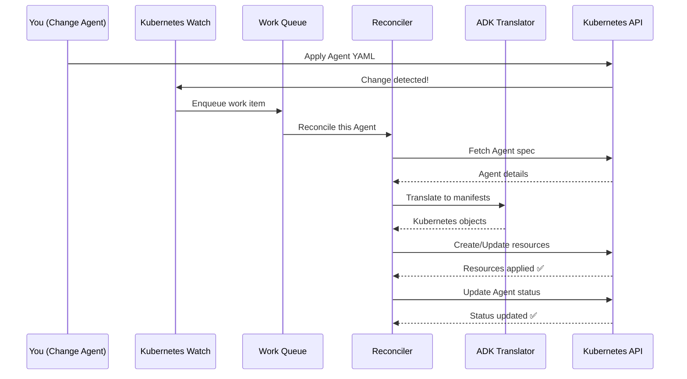

# Chapter 9: Kubernetes Reconciler

## Coming from Chapter 8

In [Chapter 8: ADK Translator (Manifest Generation)](08_adk_translator__manifest_generation__.md), you learned how kagent takes your declarative Agent configurations and generates the actual Kubernetes manifests (Deployments, Services, Secrets, etc.) that run your Agents.

But here's a critical question: **What happens after those manifests are created?** What if someone accidentally deletes your Agent's Deployment? What if you update your Agent configuration — how does the system automatically update the running Deployment? What if your Agent Pod crashes — how does the system detect and fix it?

That's what the **Kubernetes Reconciler** handles. It's the **continuous guardian** that ensures your running system always matches your desired configuration.

## The Problem: Keeping Reality in Sync With Desires

Imagine you have a running Agent. You've deployed it, it's working great. But then something bad happens:

**Scenario 1: Someone Deletes Something**
```
You created: Agent "support-bot" with 3 replicas
    ↓ (time passes)
    ↓ Someone runs: kubectl delete deployment support-bot
    ↓
Now: Agent exists, but Deployment is gone!
Your Agent is broken and nobody knows why.
```

**Scenario 2: You Update Configuration**
```
You had: Agent with modelConfig: "gpt-3.5"
    ↓ You change it to: "gpt-4"
    ↓
Expected: Deployment updates to use GPT-4 API key
Actual: Without reconciliation, the old Deployment keeps running with GPT-3.5!
```

**Scenario 3: Infrastructure Fails**
```
You deployed: Agent with 3 Pod replicas
    ↓ One node crashes
    ↓
Expected: System automatically recreates the missing Pod
Actual: Without reconciliation, you're stuck at 2 replicas forever!
```

**Without a Reconciler** (these problems would persist):
- ❌ Deleted resources stay deleted
- ❌ Configuration changes don't update running systems
- ❌ Failed Pods don't automatically recover
- ❌ No way to fix drift (when reality doesn't match desires)

**With a Reconciler** (the Kubernetes Reconciler):
- ✅ Deleted resources are automatically recreated
- ✅ Configuration changes trigger automatic updates
- ✅ Failed Pods are automatically restarted
- ✅ System constantly checks and fixes drift
- ✅ Everything stays synchronized automatically

Think of it like a **ship's autopilot**:
- **You set the course** (desired state) → Your Agent YAML
- **Autopilot continuously adjusts** (reconciliation) → The Kubernetes Reconciler
- **If wind pushes the ship off course** (drift occurs) → Reconciler detects and corrects it
- **If an engine fails** (a Pod crashes) → Reconciler detects and fixes it

Without the reconciler, you'd have to manually fix every problem. With it, everything repairs itself automatically!

## Key Concepts: Understanding Reconciliation

Let's break down how the Kubernetes Reconciler works:

### 1. **What is the Reconciler?**

The **Kubernetes Reconciler** is a background process (running inside Kubernetes) that:
- **Watches** for changes to your Agent resources and related objects
- **Detects** when something is different from what you specified
- **Compares** desired state (your YAML) vs actual state (running cluster)
- **Fixes** anything that doesn't match by creating, updating, or deleting resources
- **Repeats** continuously, forever, ensuring everything stays synchronized

Think of it as a **robot inspector** that continuously walks around your factory checking that everything matches the blueprint. If it finds something wrong, it fixes it immediately.

### 2. **The Reconciliation Loop**

The reconciler operates in a simple loop:

```
┌─────────────────────────────────────┐
│  1. Something Changed?              │
│     (Agent created/updated/deleted) │
└──────────┬──────────────────────────┘
           │
┌──────────▼──────────────────────────┐
│  2. Fetch Current State             │
│     Read Agent YAML from Kubernetes │
└──────────┬──────────────────────────┘
           │
┌──────────▼──────────────────────────┐
│  3. Compare to Desired State        │
│     Does Deployment match Agent?    │
│     Does Secret have right config?  │
└──────────┬──────────────────────────┘
           │
       YES or NO?
         │       │
     YES │       │ NO (drift detected!)
         │       │
         │   ┌───▼────────────────────┐
         │   │  4. Fix It             │
         │   │  Create/Update/Delete  │
         │   │  needed resources      │
         │   └───┬────────────────────┘
         │       │
         │   ┌───▼────────────────────┐
         │   │  5. Update Status      │
         │   │  Mark as Accepted✅    │
         │   └───┬────────────────────┘
         │       │
         └───────┴────────────────────┐
                 │                   │
                 └─── (repeat loop) ──┘
```

### 3. **Ownership: Who Owns What?**

The reconciler uses a concept called **ownership** to know which resources it should manage:

```
Agent "support-bot" owns:
├─ Deployment "support-bot"
├─ Service "support-bot"
├─ Secret "support-bot-config"
└─ ServiceAccount "support-bot"

If any of these owned resources get deleted:
Agent's reconciler will recreate them!
```

Each resource has an "owner reference" that says "I was created by Agent support-bot." If the owned resource is deleted, the reconciler sees it missing and recreates it.

### 4. **Status Conditions: Reporting Health**

The reconciler doesn't just fix things silently — it also reports the status back to you:

```yaml
status:
  conditions:
  - type: Accepted
    status: "True"           # ✅ Agent config is valid
    message: "Agent validated successfully"
  
  - type: Ready
    status: "True"           # ✅ Deployment is running
    message: "All 3 pods are ready"
```

You can check this status to understand what's happening:

```bash
kubectl get agent support-bot
# Shows: Ready=True (everything is good!)

kubectl describe agent support-bot
# Shows detailed conditions and messages
```

## How the Reconciler Works: A Practical Example

Let's walk through what happens when you create an Agent:

### Step 1: You Create an Agent

```bash
kubectl apply -f agent.yaml
# Agent "support-bot" is now in Kubernetes
```

### Step 2: Reconciler Detects the Agent

```
Agent Controller watches for new Agents
    ↓
Detects: New Agent "support-bot" created!
    ↓
Triggers: ReconcileKagentAgent() function
```

The reconciler springs into action! It's like an alarm going off.

### Step 3: Reconciler Fetches the Agent

```go
agent := &v1alpha2.Agent{}
kube.Get(ctx, req.NamespacedName, agent)
// agent now contains the full Agent specification
```

The reconciler reads your Agent YAML to understand what you want.

### Step 4: Reconciler Translates to Manifests

Remember the ADK Translator from Chapter 8? The reconciler calls it:

```go
agentOutputs := adkTranslator.TranslateAgent(ctx, agent)
// Returns: Deployment, Service, Secret, ServiceAccount manifests
```

The reconciler converts your Agent YAML into concrete Kubernetes resources.

### Step 5: Reconciler Finds Owned Objects

The reconciler checks: "Do these resources already exist?"

```go
ownedObjects := findOwnedObjects(agent.UID, agent.Namespace)
// Returns: List of resources owned by this Agent
```

### Step 6: Reconciler Creates/Updates Resources

For each desired resource:

```go
for _, desired := range agentOutputs.Manifest {
    existing := getExistingResource(desired)
    if existing == nil {
        // Doesn't exist → CREATE it
        kube.Create(ctx, desired)
    } else if !equals(existing, desired) {
        // Exists but different → UPDATE it
        kube.Update(ctx, desired)
    } else {
        // Exists and matches → DO NOTHING
    }
}
```

This logic is simple but powerful:
- **Missing?** Create it ✅
- **Different?** Update it ✅
- **Matches?** Leave it alone ✅

### Step 7: Reconciler Cleans Up Old Resources

If you removed a tool or changed the deployment config, the reconciler deletes old resources that shouldn't exist anymore:

```go
// Find resources we own but don't need anymore
unnecessaryResources := findOwnedButUnwantedResources()
for _, resource := range unnecessaryResources {
    kube.Delete(ctx, resource)  // Clean up!
}
```

### Step 8: Reconciler Updates Status

Finally, the reconciler reports what it did:

```yaml
agent.Status.Conditions = [
  {Type: "Accepted", Status: "True", Message: "Agent is valid"},
  {Type: "Ready", Status: "True", Message: "Deployment has 3/3 pods ready"}
]
kube.Status().Update(ctx, agent)
```

You can now see that your Agent is running! ✅

## Understanding the Internal Implementation

Now let's look at how the reconciler actually works in the code.

### The Journey: Agent Change to Reconciliation

When something changes (Agent created, updated, or deleted), here's what happens:



Each step is important. Let's dive deeper:

### Step-by-Step: Inside the Reconciler

The reconciler's main function is surprisingly simple:

```go
// File: go/internal/controller/reconciler/reconciler.go
func (a *kagentReconciler) ReconcileKagentAgent(
    ctx context.Context, 
    req ctrl.Request,
) error {
    // [1] Fetch the Agent from Kubernetes
    agent := &v1alpha2.Agent{}
    if err := a.kube.Get(ctx, req.NamespacedName, agent); err != nil {
        return a.handleAgentDeletion(req)  // Agent was deleted
    }
    
    // [2] Reconcile the Agent
    err := a.reconcileAgent(ctx, agent)
    
    // [3] Update Agent status
    return a.reconcileAgentStatus(ctx, agent, err)
}
```

Three steps: Fetch → Reconcile → Report status.

### The Real Reconciliation Work

The `reconcileAgent()` function does the heavy lifting:

```go
// File: go/internal/controller/reconciler/reconciler.go
func (a *kagentReconciler) reconcileAgent(
    ctx context.Context, 
    agent *v1alpha2.Agent,
) error {
    // [1] Translate Agent to Kubernetes manifests
    agentOutputs, err := a.adkTranslator.TranslateAgent(ctx, agent)
    if err != nil {
        return err  // Can't translate → stop here
    }
```

First, it translates the Agent (Chapter 8 at work again!).

```go
    // [2] Find already-owned resources
    ownedObjects, err := findOwnedObjects(
        ctx, 
        a.kube, 
        agent.UID, 
        agent.Namespace,
    )
```

Then it finds what resources already exist.

```go
    // [3] Reconcile desired vs existing
    err = a.reconcileDesiredObjects(
        ctx, 
        agent, 
        agentOutputs.Manifest,  // What we want
        ownedObjects,           // What exists
    )
```

Then it compares desired vs existing and fixes any differences.

### The Critical Function: Reconcile Desired Objects

This is where the magic happens:

```go
// File: go/internal/controller/reconciler/reconciler.go
func (a *kagentReconciler) reconcileDesiredObjects(
    ctx context.Context,
    owner metav1.Object,
    desiredObjects []client.Object,  // What we want
    ownedObjects map[types.UID]client.Object,  // What exists
) error {
    for _, desired := range desiredObjects {
        existing := copyAndFetchExisting(desired)
        
        // This is the KEY LOGIC: create or update
        createOrUpdate(ctx, a.kube, existing, MutateFuncFor(existing, desired))
        
        // Remove from "to delete" list
        delete(ownedObjects, existing.GetUID())
    }
```

For each desired resource: create it if missing, update it if different, otherwise leave it.

```go
    // Clean up resources we don't need anymore
    for _, unwanted := range ownedObjects {
        a.kube.Delete(ctx, unwanted)  // Goodbye!
    }
}
```

Any resources that were in `ownedObjects` but NOT in `desiredObjects` get deleted. Cleanup! 🧹

### The Watch System: Detecting Changes

How does the reconciler know when to run? Through Kubernetes **watches**:

```go
// File: go/internal/controller/agent_controller.go
func (r *AgentController) SetupWithManager(mgr ctrl.Manager) error {
    return ctrl.NewControllerManagedBy(mgr).
        For(&v1alpha2.Agent{}, ...).  // Watch Agents
        Owns(deployment, ...).         // Watch owned Deployments
        Owns(service, ...).            // Watch owned Services
        Watches(&v1alpha2.ModelConfig{}, ...).  // Watch ModelConfigs
        Complete(r)
}
```

The controller watches multiple resource types:
- **For**: The main resource (Agent)
- **Owns**: Resources created by this Agent
- **Watches**: Related resources (ModelConfig, MCPServer)

When ANY of these changes, the reconciler runs! This ensures:
- If you update an Agent → reconciler runs ✅
- If a Deployment gets deleted → reconciler recreates it ✅
- If a ModelConfig changes → reconciler recreates the Agent's Secret ✅

### The Status Update System

After reconciliation completes, the reconciler updates status conditions:

```go
// File: go/internal/controller/reconciler/reconciler.go
func (a *kagentReconciler) reconcileAgentStatus(
    ctx context.Context, 
    agent *v1alpha2.Agent,
    err error,
) error {
    condition := metav1.Condition{
        Type: v1alpha2.AgentConditionTypeAccepted,
        Status: metav1.ConditionTrue,  // Success!
        Message: "Agent validated and deployed",
    }
    
    meta.SetStatusCondition(&agent.Status.Conditions, condition)
    a.kube.Status().Update(ctx, agent)  // Write status back
}
```

If reconciliation failed, it sets Status to `False` with an error message. If successful, it sets to `True`. This is how you know if your Agent is healthy! 💚

## Connecting Everything Together

The Kubernetes Reconciler connects all the pieces you've learned:

```
Agent (Chapter 1)
    ↓ changes detected by
Kubernetes Watch
    ↓ triggers
Reconciler
    ↓ calls
ADK Translator (Chapter 8)
    ↓ which resolves
ModelConfig (Chapter 2)
  & MCP Servers (Chapter 7)
    ↓ produces
Kubernetes Manifests
    ↓ which get
Created/Updated/Deleted
    ↓ reconciler continuously checks
Everything matches ✅
```

When ANY piece changes, the whole system reacts automatically. That's the power of reconciliation!

## A Complete Example: From Creation to Running

Let's trace a complete example:

### Time 0: Create Agent

```yaml
kubectl apply -f support-bot.yaml
```

### Time 0 (immediately):
- Kubernetes controller detects new Agent
- Reconciler: "I need to create resources!"
- Translator: Generates Deployment, Service, Secret
- Resources created in Kubernetes
- Status updated: `Accepted=True, Ready=Pending`

### Time 5s:
- Pods are starting up
- Status updated: `Accepted=True, Ready=False (waiting for pods)`

### Time 15s:
- All 3 pods are now running
- Status updated: `Accepted=True, Ready=True ✅`

### Time 1min later:
- Someone accidentally runs: `kubectl delete deployment support-bot`
- Kubernetes watch detects deletion
- Reconciler wakes up: "Deployment is missing! I need to recreate it!"
- Deployment is recreated
- Pods come back to life
- Status remains: `Ready=True ✅`

The system **self-healed**! Without any intervention, it fixed itself. 🔧

### Time 1 hour later:
- You realize you need to use GPT-4 instead of GPT-3.5
- You update the Agent YAML to reference a new ModelConfig
- Kubernetes watch detects the change
- Reconciler wakes up: "Configuration changed!"
- Translator generates new Secret with GPT-4 API key
- Secret is updated
- Deployment is restarted with new config
- Pods come up with new environment variables
- Status: `Ready=True ✅`

The system **automatically updated** without manual intervention! 🚀

## Key Takeaways

**Kubernetes Reconciler** in Kagent:

- ✅ **Continuous loop** that constantly checks desired vs actual state
- ✅ **Automatic self-healing** — missing resources are recreated
- ✅ **Automatic updates** — configuration changes are deployed automatically
- ✅ **Ownership tracking** — knows which resources to manage
- ✅ **Status reporting** — tells you what's happening via conditions
- ✅ **Multi-watch system** — responds to changes in multiple resource types
- ✅ **Works forever** — runs continuously, maintaining synchronization 24/7

Think of it like a **thermostat**:
- You set your desired temperature (Agent configuration)
- The thermostat continuously checks actual temperature (actual running state)
- If there's a difference, it adjusts the heater/AC (creates/updates/deletes resources)
- If someone opens a window (deleted Deployment), the thermostat detects and compensates
- Temperature stays at your desired level, automatically, forever

## What's Next?

Now that you understand how kagent manages Agent lifecycle on Kubernetes through reconciliation, the final question is: **How can Agents talk to each other securely and reliably?**

The next chapter covers **[Chapter 10: A2A Protocol & Communication](10_a2a_protocol___communication_.md)** — which teaches you how Agent-to-Agent communication works, enabling complex workflows where multiple Agents collaborate to solve bigger problems.

---

**Summary**: The Kubernetes Reconciler is the continuous guardian that ensures your running Agent infrastructure always matches your desired configuration. It watches for changes, detects when reality drifts from desires, and automatically fixes problems by creating, updating, or deleting resources. This enables true self-healing infrastructure — your Agents stay running and updated automatically, without manual intervention. The reconciler is the backbone that keeps everything synchronized and healthy, working 24/7 in the background!

---

Generated by [AI Codebase Knowledge Builder](https://github.com/The-Pocket/Tutorial-Codebase-Knowledge)