# Chapter 10: A2A Protocol & Communication

## Coming from Chapter 9

In [Chapter 9: Kubernetes Reconciler](09_kubernetes_reconciler_.md), you learned how kagent continuously monitors and maintains your running Agents, ensuring everything stays synchronized and healthy. You now understand that Agents can run reliably on Kubernetes with automatic self-healing and updates.

But here's an exciting question: **What if you need multiple Agents working together?** What if Agent A needs to ask Agent B for information? What if Agent A wants to invoke Agent B as a tool? How do Agents talk to each other securely and reliably?

That's what this chapter is about — the **A2A Protocol (Agent-to-Agent Protocol)**, which enables Agents to communicate, collaborate, and work together to solve complex problems.

## The Problem: Agents Working Together

Imagine you're building a sophisticated support system with multiple specialized Agents:

**Scenario: A customer wants to process a refund**

```
Customer → [Support Bot]
             "I want a refund"
                ↓
          (needs to check eligibility)
                ↓
          [Support Bot] → ??? 
          "Can I ask Order Bot to check this customer?"
```

Right now, there's no way for Support Bot to ask Order Bot! Without A2A communication:
- ❌ Agents are isolated — they can't talk to each other
- ❌ You'd need a central coordinator — makes the system complicated
- ❌ No standardized way for Agents to invoke each other as tools
- ❌ Hard to build complex workflows with multiple Agents
- ❌ No way to stream large responses between Agents

With A2A Protocol:
- ✅ Agents can call other Agents directly
- ✅ One Agent can invoke another as a tool
- ✅ Bidirectional streaming for large data
- ✅ Task management and tracking
- ✅ Push notifications for async updates
- ✅ Secure, standardized communication
- ✅ Complex multi-Agent workflows become possible

Think of it like a **company structure**:

```
Without A2A:
Support Team ← only talks to customers
Order Team ← only talks to customers
(Teams can't help each other)

With A2A:
Support Team ← talks to customers & Order Team
Order Team ← talks to customers & Support Team
(Teams collaborate and work together!)
```

## Key Concepts: Understanding A2A Communication

Let's break down what A2A Protocol enables:

### 1. **What is A2A Protocol?**

The **A2A Protocol** is a **standardized communication framework that allows Agents to call each other directly**. Think of it as:

```
RPC (Remote Procedure Call) + Rich Features

Agent A sends request: "Hey Agent B, execute this function"
                            ↓
                      Agent B processes
                            ↓
                      Agent B sends response
                            ↓
Agent A receives response and continues
```

It's like one service calling another service's API, but designed specifically for Agent-to-Agent communication with special features.

### 2. **Key Features of A2A Protocol**

The A2A Protocol provides:

| Feature | What it means |
|---------|---------------|
| **Bidirectional Streaming** | Agents can send large responses without timing out |
| **Task Management** | Track ongoing work between Agents |
| **Push Notifications** | Agents can notify each other of updates |
| **Tool Invocation** | One Agent can use another Agent as a tool |
| **Message Protocol** | Standardized message format for communication |
| **Secure** | Uses authentication (from Chapter 3) |

### 3. **RPC-over-HTTP with Rich Semantics**

What does "RPC-over-HTTP with rich semantics" mean? Let's break it down:

- **RPC (Remote Procedure Call)**: Agent A calling a function in Agent B
- **over-HTTP**: Communication happens via HTTP (standard web protocol)
- **Rich Semantics**: Extra features like streaming, task tracking, notifications

Example:

```
Agent A: "Agent B, run your query_orders function with order_id=123"
                ↓ (HTTP call)
         Agent B's A2A endpoint receives this
                ↓
         Agent B runs query_orders(order_id=123)
                ↓
         Agent B streams response back via HTTP
                ↓
Agent A receives response and continues working
```

### 4. **Agent as a Tool**

One powerful capability: **An Agent can invoke another Agent as a tool** (just like MCP Servers from Chapter 7).

```
Agent A Configuration:
  tools:
    - type: Agent
      agent_ref: "default/order-lookup-bot"

Agent A in conversation:
  "I need to check the customer's order"
    ↓ (uses order-lookup-bot as a tool)
    ↓
  order-lookup-bot.query_order(customer_id=123)
    ↓
  Returns order information
    ↓
  Agent A: "The order is in transit"
```

Agent A treated Agent B like a tool, just like a database or API!

## How A2A Communication Works: A Practical Example

Let's walk through a complete scenario: **Support Agent asking Order Agent for help**.

### Step 1: Support Agent Receives Customer Request

```bash
curl -X POST http://support-agent:8080/query \
  -d '{"message": "Can I get a refund for order #123?"}'
```

Support Agent receives the request.

### Step 2: Support Agent Needs Information

Support Agent thinks: "I need to check if this customer is eligible for a refund. Let me ask Order Agent."

Behind the scenes, Support Agent invokes Order Agent:

```go
// Conceptually: Support Agent calls Order Agent as a tool
response := orderAgent.CheckOrderStatus(orderId: "123")
```

### Step 3: Order Agent Processes Request

Order Agent receives the request from Support Agent (through A2A Protocol):

```
A2A Request arrives at Order Agent:
  Message: "CheckOrderStatus"
  OrderId: "123"
    ↓
  Order Agent processes
    ↓
  Creates Task to track this work
    ↓
  Executes the query
```

### Step 4: Order Agent Sends Response

Order Agent sends the response back to Support Agent via A2A:

```
A2A Response from Order Agent:
  Status: "active"
  ShippingDate: "2024-01-20"
  PurchaseDate: "2024-01-15"
    ↓
Support Agent receives this
```

### Step 5: Support Agent Uses the Information

```
Support Agent now has the info:
  Order is active (less than 30 days old)
    ↓
  Support Agent: "I can process your refund!"
    ↓
Support Agent invokes refund Agent: "Process refund"
    ↓
Refund Agent does it
    ↓
Customer gets refund!
```

The whole workflow: **Customer → Support Agent → Order Agent → Support Agent → Refund Agent → Done!**

This is the power of A2A communication — Agents collaborate to solve complex problems! 🚀

## Understanding the Internal Implementation

Now let's look at how A2A communication works under the hood.

### The Journey: Agent Calling Another Agent

When Agent A calls Agent B, here's what happens:

```mermaid
sequenceDiagram
    participant AgentA as Support Agent
    participant A2AClient as A2A Client Library
    participant HTTPLayer as HTTP/Network
    participant A2AServer as A2A Server Layer
    participant AgentB as Order Agent

    AgentA->>A2AClient: SendMessage(task, content)
    A2AClient->>A2AClient: Create message with ID
    A2AClient->>HTTPLayer: POST to Order Agent's A2A endpoint
    HTTPLayer->>A2AServer: Request arrives
    A2AServer->>A2AServer: Validate authentication
    A2AServer->>A2AServer: Create Task
    A2AServer->>AgentB: Process message
    AgentB->>AgentB: Execute logic
    AgentB-->>A2AServer: Return response
    A2AServer->>HTTPLayer: Stream response back
    HTTPLayer-->>A2AClient: Response data
    A2AClient-->>AgentA: Message received ✅
```



Each step is important. Let's walk through them:

**Step 1: Agent A Initiates Communication**

```go
// In Support Agent's code
request := protocol.SendMessageParams{
    Message: protocol.Message{
        Content: "CheckOrderStatus",
        Data: orderData,
    },
}
response := a2aClient.SendMessage(ctx, request)
```

Agent A creates a message and sends it through the A2A Client.

**Step 2: A2A Client Prepares the Message**

The A2A Client Library (from the code: `trpc.group/trpc-go/trpc-a2a-go/client`) prepares the message:

```go
// File: go/internal/a2a/manager.go (conceptual)
if request.Message.MessageID == "" {
    request.Message.MessageID = protocol.GenerateMessageID()
}
if request.Message.Kind == "" {
    request.Message.Kind = protocol.KindMessage
}
```

It adds a unique ID and marks it as a Message type.

**Step 3: HTTP Request Sent**

The message is converted to HTTP and sent to Order Agent's A2A endpoint:

```
POST /api/a2a/default/order-agent/
Host: kagent-cluster
Authorization: Bearer <token>

Message data (JSON)
```

Notice the URL pattern: `/api/a2a/{namespace}/{agent-name}/`

**Step 4: A2A Server Receives Request**

Order Agent's A2A Server receives the incoming request:

```go
// File: go/internal/a2a/a2a_handler_mux.go
func (a *handlerMux) ServeHTTP(w http.ResponseWriter, r *http.Request) {
    agentNamespace := mux.Vars(r)["namespace"]
    agentName := mux.Vars(r)["name"]
    
    handler, ok := a.getHandler(agentNamespace + "/" + agentName)
    if !ok {
        http.Error(w, "Agent not found", http.StatusNotFound)
        return
    }
    handler.ServeHTTP(w, r)
}
```

The Server looks up: "Is there an Agent handler for this namespace and name?" If yes, route to it.

**Step 5: Authentication Check**

Before processing, the A2A Server verifies the caller is authenticated:

```go
// Authentication middleware (from Chapter 3)
session := auth.AuthSessionFrom(request.Context())
// Verify Support Agent has permission to call Order Agent
```

The system checks: "Is Support Agent allowed to call Order Agent?" Only if yes, continue.

**Step 6: Task Created**

The A2A Server creates a Task to track this work:

```go
task := &database.Task{
    ID: protocol.GenerateTaskID(),
    SessionID: sessionID,
    Type: "A2A_REQUEST",
    Data: messageData,
}
```

This Task is stored in the database (from Chapter 6) for tracking and auditing.

**Step 7: Agent B Processes**

Order Agent now processes the message and generates a response:

```go
response := orderAgent.Process(message)
```

**Step 8: Response Streamed Back**

If the response is large, A2A Protocol can stream it back to Agent A:

```go
// File: go/internal/a2a/manager.go
func (m *PassthroughManager) OnSendMessageStream(
    ctx context.Context, 
    request protocol.SendMessageParams,
) (<-chan protocol.StreamingMessageEvent, error) {
    return m.client.StreamMessage(ctx, request)
}
```

The response is sent back as a stream, allowing large responses to be handled efficiently.

**Step 9: Agent A Receives Response**

Support Agent receives the response and continues:

```go
orderInfo := response.Data // {"status": "active", ...}
// Support Agent now has order info and can continue
```

### The A2A Handler Mux System

There's a clever system called the **A2A Handler Mux** that routes A2A requests to the right Agent:

```go
// File: go/internal/a2a/a2a_handler_mux.go
type handlerMux struct {
    handlers map[string]http.Handler  // Maps agent name to handler
}

func (a *handlerMux) SetAgentHandler(
    agentRef string,
    client *client.A2AClient,
) error {
    srv := server.NewA2AServer(...)
    a.handlers[agentRef] = srv.Handler()  // Register handler
}
```

When an Agent is deployed (via the Reconciler from Chapter 9), an A2A Handler is registered:

```
Support Agent deployed → Register handler: "default/support-agent"
Order Agent deployed → Register handler: "default/order-agent"
Refund Agent deployed → Register handler: "default/refund-agent"

All three agents can now call each other!
```

### The Passthrough Manager

There's a component called the **PassthroughManager** that forwards A2A requests:

```go
// File: go/internal/a2a/manager.go
type PassthroughManager struct {
    client *client.A2AClient
}

func (m *PassthroughManager) OnSendMessage(
    ctx context.Context, 
    request protocol.SendMessageParams,
) (*protocol.MessageResult, error) {
    return m.client.SendMessage(ctx, request)
}
```

This manager receives A2A requests from other Agents and forwards them to the actual Agent's logic. It's like a **message router** that ensures requests reach the right place.

### Task Management in A2A

Every A2A communication creates Tasks that can be tracked:

```go
// File: go/internal/a2a/manager.go
func (m *PassthroughManager) OnGetTask(
    ctx context.Context, 
    params protocol.TaskQueryParams,
) (*protocol.Task, error) {
    return m.client.GetTasks(ctx, params)
}
```

You can query tasks to see what work is happening between Agents:

```bash
# Get all A2A tasks for a session
curl http://kagent-api/api/sessions/session-123/tasks
```

Response shows all the A2A calls that happened:

```json
{
  "tasks": [
    {"id": "task-1", "type": "A2A_REQUEST", "from": "support-agent", "to": "order-agent"},
    {"id": "task-2", "type": "A2A_RESPONSE", "from": "order-agent", "to": "support-agent"}
  ]
}
```

### The A2A Reconciler

The A2A Reconciler manages A2A connections for each Agent (similar to how other reconcilers work from Chapter 9):

```go
// File: go/internal/controller/a2a/a2a_reconciler.go
func (a *a2aReconciler) ReconcileAgent(
    ctx context.Context,
    agent *v1alpha2.Agent,
) error {
    client := a2aclient.NewA2AClient(
        agent.Status.URL,  // Agent's URL
        a2aclient.WithAuthentication(...),
    )
    return a.a2aHandler.SetAgentHandler(agentRef, client)
}
```

When an Agent is deployed, the A2A Reconciler creates an A2A connection for it. When an Agent is deleted, it cleans up:

```go
func (a *a2aReconciler) ReconcileAgentDeletion(
    agentRef string,
) {
    a.a2aHandler.RemoveAgentHandler(agentRef)
}
```

## Connecting A2A to Other Concepts

A2A communication integrates with everything you've learned:

### A2A + Authentication (Chapter 3)

```go
// A2A request includes authentication
request.Headers["Authorization"] = "Bearer " + agentToken

// A2A Server verifies authentication
session := auth.AuthSessionFrom(request.Context())
if session == nil {
    return errors.Unauthorized()
}
```

Only authenticated Agents can call other Agents. Secure by default! 🔒

### A2A + Sessions (Chapter 5)

```go
// A2A communication happens within a Session context
sessionID := "session-123"
task := Task{
    SessionID: sessionID,
    Type: "A2A_CALL",
}
```

All A2A calls are tracked in the Session where they happen.

### A2A + Database Client (Chapter 6)

```go
// All A2A Tasks are persisted in database
dbClient.StoreTask(task)

// Can query later for auditing
tasks := dbClient.ListTasksForSession(sessionID)
```

Complete audit trail of all Agent-to-Agent communication! 📋

### A2A + Agents as Tools (Chapter 7 concept)

An Agent can be configured as a tool:

```yaml
spec:
  declarative:
    tools:
      - type: Agent
        agent_ref: "default/order-agent"
```

Then in conversation:

```
User: "Check my order status"
Support Agent: "Let me ask Order Agent"
[calls order-agent via A2A]
Support Agent: "Your order ships tomorrow"
```

Seamless integration! ✨

## A Complete Example: Multi-Agent Workflow

Let's build a complete multi-Agent system:

### Setup: Three Agents

```yaml
# Agent 1: Support Bot
apiVersion: kagent.dev/v1alpha2
kind: Agent
metadata:
  name: support-bot
spec:
  declarative:
    tools:
      - type: Agent
        agent_ref: "default/order-bot"
---
# Agent 2: Order Bot
apiVersion: kagent.dev/v1alpha2
kind: Agent
metadata:
  name: order-bot
spec:
  declarative:
    tools: []
---
# Agent 3: Refund Bot
apiVersion: kagent.dev/v1alpha2
kind: Agent
metadata:
  name: refund-bot
spec:
  declarative:
    tools: []
```

### Workflow: Customer Refund Request

```
Customer: "I need a refund for order #123"
    ↓
Support Bot receives request
    ↓ [A2A call]
Support Bot → Order Bot: "Check order #123"
    ↓
Order Bot responds: {"status": "eligible", "reason": "within 30 days"}
    ↓ [A2A call]
Support Bot → Refund Bot: "Process refund for order #123"
    ↓
Refund Bot responds: {"status": "processed", "confirmation_id": "REF-456"}
    ↓
Support Bot → Customer: "Your refund is processed! Confirmation: REF-456"
```

Complete workflow using A2A communication! 🎯

## Key Takeaways

**A2A Protocol & Communication** in Kagent:

- ✅ **Agent-to-Agent calling** — Agents can invoke each other directly
- ✅ **Tool invocation** — Use one Agent as a tool in another Agent
- ✅ **Bidirectional streaming** — Handle large responses efficiently
- ✅ **Task management** — Track all A2A communication
- ✅ **Authentication integration** — Secure Agent-to-Agent calls (Chapter 3)
- ✅ **Session tracking** — All communication within Session context (Chapter 5)
- ✅ **Audit trail** — Complete history stored in database (Chapter 6)
- ✅ **Reconciliation** — A2A connections automatically maintained (Chapter 9)

Think of A2A Protocol like a **phone system for Agents**:
- Agents can call each other
- Calls are tracked and recorded (for auditing)
- Only authorized Agents can call each other (authentication)
- Calls happen within a session context
- If something goes wrong, the call is logged for debugging
- Agents collaborate to solve bigger problems

## Bringing It All Together: The Complete Picture

You've now learned all 10 chapters of kagent! Let's see how they all work together:

```
1. Agent (Chapter 1)
   ↓ configured by
2. ModelConfig (Chapter 2)
   ↓ secured by
3. Authentication & Authorization (Chapter 3)
   ↓ accessed through
4. HTTP Handlers (Chapter 4)
   ↓ maintaining state via
5. Sessions & Tasks (Chapter 5)
   ↓ stored in
6. Database (Chapter 6)
   ↓ calling tools from
7. MCP Servers (Chapter 7)
   ↓ deployed via
8. ADK Translator (Chapter 8)
   ↓ managed by
9. Kubernetes Reconciler (Chapter 9)
   ↓ communicating via
10. A2A Protocol (Chapter 10)
    ↓
Complete Agent Infrastructure ✨
```

Each layer builds on previous layers, creating a powerful, scalable system for running intelligent Agents!

## Your Journey Starts Here

You now understand:
- ✅ How Agents work (Chapter 1)
- ✅ How they choose their AI models (Chapter 2)
- ✅ How they're secured (Chapter 3)
- ✅ How they receive requests (Chapter 4)
- ✅ How conversations are managed (Chapter 5)
- ✅ How data persists (Chapter 6)
- ✅ How they use tools (Chapter 7)
- ✅ How they're deployed (Chapter 8)
- ✅ How they stay healthy (Chapter 9)
- ✅ How they collaborate (Chapter 10)

You're now ready to build sophisticated, collaborative Agent systems with kagent! 🚀

---

**Summary**: The A2A Protocol (Agent-to-Agent Protocol) enables Agents to communicate with each other securely and reliably. Using HTTP with rich semantics, it allows one Agent to invoke another Agent (or use it as a tool), stream large responses, manage tasks, and send notifications. All A2A communication is authenticated, tracked in Sessions, stored in the database, and automatically managed by the Reconciler. This transforms kagent from a single-Agent system into a multi-Agent collaboration platform where Agents work together to solve complex problems. Combined with all previous chapters, you now have a complete, production-ready infrastructure for building intelligent Agent systems!

---

Generated by [AI Codebase Knowledge Builder](https://github.com/The-Pocket/Tutorial-Codebase-Knowledge)