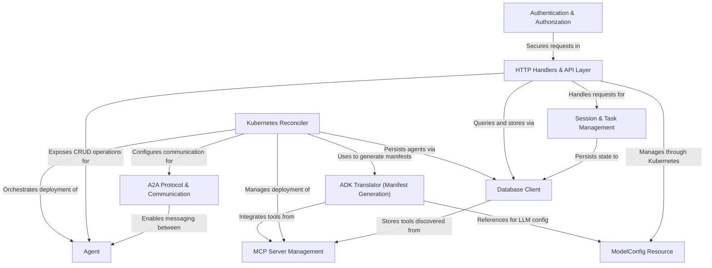

# Tutorial: kagent

**Kagent** is an enterprise **AI agent orchestration platform** built on Kubernetes that enables seamless **agent management, deployment, and communication**. It provides a declarative API for defining autonomous AI systems with configurable models, tool integrations, and inter-agent communication capabilities. The system combines **Kubernetes operators** for lifecycle management, **database persistence** for state tracking, and a **REST API** for user interaction, allowing organizations to build scalable, multi-agent AI applications with centralized session and task tracking.

**Source Repository:** [None](None)

## Chapters

1. [Agent
](01_agent_.md)
2. [ModelConfig Resource
](02_modelconfig_resource_.md)
3. [Authentication & Authorization
](03_authentication___authorization_.md)
4. [HTTP Handlers & API Layer
](04_http_handlers___api_layer_.md)
5. [Session & Task Management
](05_session___task_management_.md)
6. [Database Client
](06_database_client_.md)
7. [MCP Server Management
](07_mcp_server_management_.md)
8. [ADK Translator (Manifest Generation)
](08_adk_translator__manifest_generation__.md)
9. [Kubernetes Reconciler
](09_kubernetes_reconciler_.md)
10. [A2A Protocol & Communication
](10_a2a_protocol___communication_.md)

---

Generated by [AI Codebase Knowledge Builder](https://github.com/The-Pocket/Tutorial-Codebase-Knowledge)