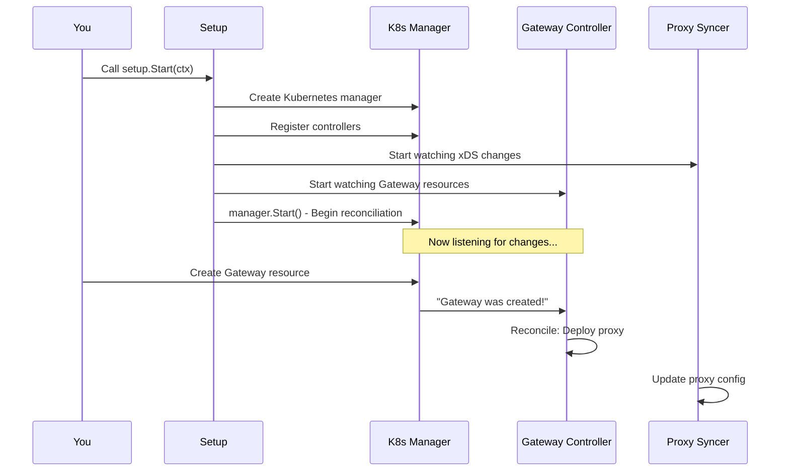

# Chapter 1: Gateway Controller & Setup

## What Problem Does This Solve?

Imagine you just deployed Kubernetes and want to expose your microservices to the internet. You need something that:

1. **Understands your intent** - You describe what gateway you want (via Kubernetes Gateway API resources)
2. **Translates that intent to reality** - Converts that description into actual proxy configurations
3. **Keeps things in sync** - Watches for changes and automatically updates when things change
4. **Orchestrates everything** - Manages multiple components working together seamlessly

This is exactly what the **Gateway Controller & Setup** does. It's the "conductor" that starts the orchestra and keeps all the instruments (components) playing in harmony.

## A Concrete Use Case

Let's say you create a Kubernetes Gateway resource:

```yaml
apiVersion: gateway.networking.k8s.io/v1
kind: Gateway
metadata:
  name: my-gateway
spec:
  gatewayClassName: kgateway
  listeners:
    - port: 80
      protocol: HTTP
```

The Gateway Controller & Setup is responsible for:
- Noticing this new Gateway was created
- Figuring out what proxy needs to be deployed
- Setting up a Deployment and Service to run the proxy
- Watching for any changes to update the proxy configuration
- Ensuring everything stays running and healthy

## Key Concepts

### 1. **The Setup Phase**
Before anything works, kgateway needs to initialize itself. Think of it like preparing a kitchen before cooking - you gather tools, set up workstations, arrange ingredients.

### 2. **The Control Plane**
The control plane is the "brain" that manages everything. It watches Kubernetes resources and decides what should happen.

### 3. **Resource Tracking (KRT Collections)**
As the system watches Kubernetes, it tracks many resources - Gateways, Services, Pods, Configs, etc. These need to be organized efficiently so lookups are fast.

### 4. **Reconciliation Loops**
The controller continuously asks: "What I *want* (from the Gateway resource) matches what I *have* (actual deployed proxies)?" If not, it fixes it.

### 5. **Graceful Lifecycle Management**
The controller handles startup smoothly, waits for caches to sync, and shuts down cleanly when stopped.

## How to Use It

### Starting kgateway

The simplest way to start kgateway is:

```bash
kgateway
```

Behind the scenes, this calls:

```go
s, err := setup.New()      // Initialize everything
s.Start(ctx)               // Start the controller
```

**What happens:** The Setup creates a Kubernetes manager, connects to your cluster, and starts watching Gateway resources.

### Customizing the Setup

If you need to customize behavior (like in tests), use option functions:

```go
s, err := setup.New(
    setup.WithGatewayClassName("my-gateway-class"),
    setup.WithLeaderElectionID("my-setup-leader"),
)
s.Start(ctx)
```

**What happens:** The setup is configured with your custom values before starting.

## How It Works Internally

### High-Level Flow

When you start kgateway, the Gateway Controller & Setup orchestrates this sequence:



### Detailed Implementation

Let's trace through what happens when you call `setup.New()` and `setup.Start()`:

#### Step 1: Initialization (`setup.New()`)

```go
func New(opts ...func(*setup)) (*setup, error) {
    s := &setup{
        gatewayControllerName: "kgateway",
        // ... other defaults
    }
    // Apply custom options
    for _, opt := range opts {
        opt(s)
    }
    return s, nil
}
```

**What this does:** Creates a setup instance with default configuration. If you passed options, they override the defaults. It's like filling in a form with your preferences.

#### Step 2: Starting (`setup.Start()`)

```go
func (s *setup) Start(ctx context.Context) error {
    // Step A: Initialize logging
    SetupLogging(s.globalSettings.LogLevel)
    
    // Step B: Create Kubernetes manager
    mgr, err := ctrl.NewManager(s.restConfig, mgrOpts)
    if err != nil {
        return err
    }
    
    // Step C: Start components
    slog.Info("starting manager")
    return mgr.Start(ctx)
}
```

**What this does:** 
- Configures logging so errors/info are visible
- Creates a connection to your Kubernetes cluster
- Starts the manager, which begins watching Kubernetes resources

#### Step 3: Building the Gateway Controller

Inside `start.go`, the setup calls `BuildKgatewayWithConfig()` which:

```go
// Create shared collections that track Kubernetes resources
commoncol, err := collections.NewCommonCollections(
    ctx, krtOpts, istioClient, cli, mgr.GetClient(),
    s.gatewayControllerName, *s.globalSettings,
)
if err != nil {
    return err
}
```

**What this does:** Creates "collections" - efficient tracking structures for Kubernetes resources like Gateways, Services, ConfigMaps, etc.

Then it initializes the actual Gateway controller:

```go
c, err := controller.NewControllerBuilder(ctx, 
    controller.StartConfig{
        Manager:           mgr,
        ControllerName:    gatewayControllerName,
        CommonCollections: commonCollections,
        // ... other config
    },
)
```

**What this does:** Creates the controller that watches Gateway resources and decides what to deploy.

#### Step 4: Watching Resources

The controller sets up "watches" on Kubernetes resources:

```go
buildr.For(&apiv1.Gateway{})  // Watch for Gateway changes
    .Owns(deployment, ...)      // Watch Deployments we created
    .Owns(service, ...)         // Watch Services we created
```

**What this does:** Tells the controller "notify me when ANY Gateway changes, or when our Deployments/Services change." It's like subscribing to notifications.

#### Step 5: Reconciliation

When something changes, the `Reconcile()` function is called:

```go
func (r *gatewayReconciler) Reconcile(
    ctx context.Context, 
    req ctrl.Request,
) (ctrl.Result, error) {
    // Get the Gateway that changed
    var gw api.Gateway
    r.cli.Get(ctx, req.NamespacedName, &gw)
    
    // Ask: "What deployment should exist for this gateway?"
    objs, err := r.deployer.GetObjsToDeploy(ctx, &gw)
    
    // Deploy/update those objects
    r.deployer.DeployObjsWithSource(ctx, objs, &gw)
    
    return ctrl.Result{}, nil
}
```

**What this does:** 
1. Gets the Gateway that changed
2. Figures out what Kubernetes objects (Deployments, Services, etc.) should exist
3. Creates or updates those objects
4. Updates the Gateway's status to report success/failure

### Putting It Together: Full Startup Sequence

Here's what happens when you run `kgateway`:

```go
func main() {
    probes.StartLivenessProbeServer(cmd.Context())  // Health check
    s, err := setup.New()                           // Create setup
    s.Start(cmd.Context())                          // Start everything
}
```

**Full flow:**

1. **Probe Server starts** - Kubernetes can check if the controller is alive
2. **Setup initializes** - Default configuration is prepared
3. **Kubernetes Manager created** - Connection to your cluster established
4. **Collections built** - Efficient tracking of Kubernetes resources starts
5. **Controllers registered** - Gateway Controller, Agent Gateway Controller, etc.
6. **Manager starts** - The system begins listening for changes
7. **Ready!** - Any new Gateway resources will be picked up and processed

## Understanding the Code Structure

The key files involved:

- **`cmd/kgateway/main.go`** - Entry point, calls `setup.New()` and `setup.Start()`
- **`internal/kgateway/setup/setup.go`** - The Setup struct that orchestrates everything
- **`internal/kgateway/controller/controller.go`** - The base controller setup
- **`internal/kgateway/controller/gw_controller.go`** - Gateway-specific reconciliation logic

Each file has a specific responsibility:
- `setup.go` = "Who" orchestrates
- `controller.go` = "What" to watch and how
- `gw_controller.go` = "How" to deploy gateways

## Common Use Cases

### Use Case 1: I want to change the log level

```go
s, err := setup.New()  // Default log level
// vs
s, err := setup.New(
    setup.WithGlobalSettings(&apisettings.Settings{
        LogLevel: "debug",
    }),
)
```

### Use Case 2: I'm writing tests and need a custom controller name

```go
s, err := setup.New(
    setup.WithGatewayControllerName("test-controller"),
)
```

### Use Case 3: I need to inject custom plugins

```go
s, err := setup.New(
    setup.WithExtraPlugins(func(ctx context.Context, col *collections) []sdk.Plugin {
        return []sdk.Plugin{ /* my custom plugins */ }
    }),
)
```

## Conclusion

The **Gateway Controller & Setup** is the orchestrator that brings kgateway to life. It:

- **Initializes** the system with sensible defaults and custom options
- **Connects** to Kubernetes and starts tracking resources
- **Coordinates** multiple components working together
- **Reconciles** Gateway resources by deploying/updating actual proxies
- **Maintains** the system in the desired state

Think of it like a conductor with a score (your Gateway resources) who ensures all the musicians (components) play in harmony to create beautiful music (working proxies).

Now that you understand how the controller starts and orchestrates components, you're ready to dive deeper into how it actually tracks resources efficiently. In the next chapter, we'll explore **[KRT Collections & Resource Tracking](02_krt_collections___resource_tracking_.md)**, which explains how kgateway efficiently watches and indexes Kubernetes resources to make decisions quickly.

---

Generated by [AI Codebase Knowledge Builder](https://github.com/The-Pocket/Tutorial-Codebase-Knowledge)