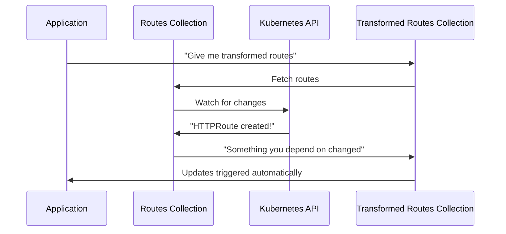
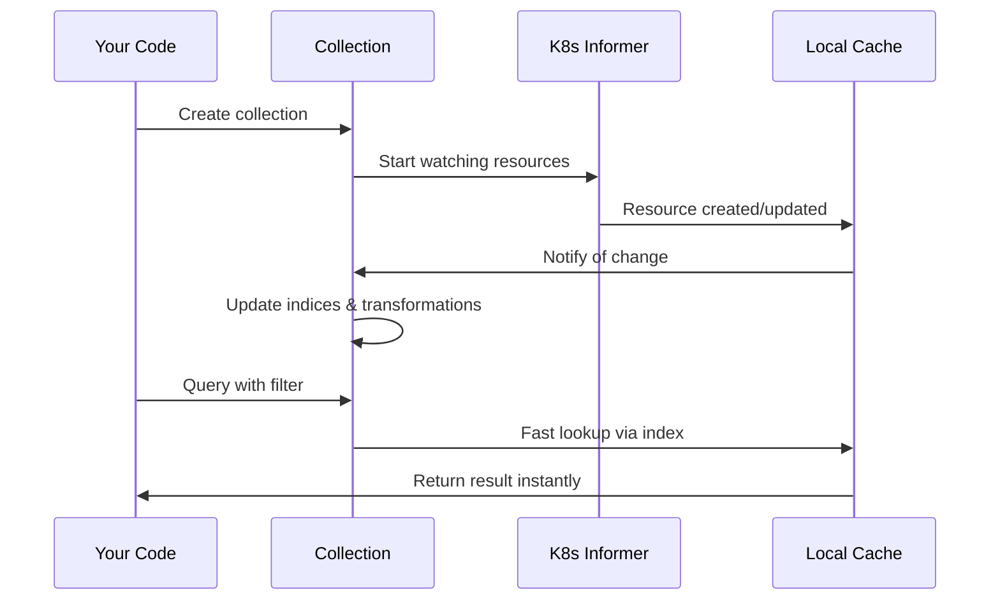

# Chapter 2: KRT Collections & Resource Tracking

## Transition from Previous Chapter

In [Chapter 1: Gateway Controller & Setup](01_gateway_controller___setup_.md), you learned how the gateway controller starts up and begins watching Kubernetes resources. But once it starts watching, there's a critical problem: **how does it efficiently track, index, and query all these resources in real-time?**

This is exactly what **KRT Collections** solve. Think of them as the "database layer" that sits between the Kubernetes API and your application logic.

## What Problem Does This Solve?

Imagine your gateway controller needs to answer these questions **constantly** and **efficiently**:

- "Which routes point to this backend?"
- "What policies apply to this gateway?"
- "Is there a ReferenceGrant allowing this cross-namespace traffic?"
- "Which endpoints are ready for this service?"

If you had to search through all Kubernetes resources manually every time, it would be **slow and wasteful**. Collections solve this by:

1. **Watching** - Continuously monitoring for resource changes
2. **Indexing** - Organizing resources so lookups are fast
3. **Caching** - Storing results so you don't recompute
4. **Merging** - Combining multiple resources intelligently
5. **Notifying** - Triggering updates when something changes

### A Concrete Use Case

Let's say a user creates an HTTPRoute that references a backend:

```yaml
apiVersion: gateway.networking.k8s.io/v1
kind: HTTPRoute
metadata:
  name: my-route
spec:
  rules:
    - backendRefs:
        - name: my-service
          port: 8080
```

Without collections, your controller would need to:
1. Manually search for this route
2. Find the referenced service
3. Get endpoints for that service
4. Check for policies that apply
5. Repeat all of this on every change

**With collections**, all this data is already organized and ready!

## Key Concepts

### 1. What is a Collection?

A **collection** is like a smart, live database table that:

- **Watches** a type of Kubernetes resource (like `Service` or `HTTPRoute`)
- **Automatically updates** when resources are created, modified, or deleted
- **Provides fast lookups** through indices
- **Transforms data** from one form to another

Think of it like having a librarian who watches all new books arriving, organizes them, and keeps an index. When you ask for a book, the librarian instantly knows where it is.

### 2. Types of Collections

Collections come in three main flavors:

**Type 1: Raw Collections**
These directly watch Kubernetes resources with minimal changes.

```go
httpRoutes := krt.WrapClient(
    kclient.NewFiltered[*gwv1.HTTPRoute](istioClient, filter),
    krtopts.ToOptions("HTTPRoute")...,
)
```

**What happens:** This creates a collection that watches all `HTTPRoute` resources in your cluster. Any time an HTTPRoute is created, updated, or deleted, this collection automatically reflects that change.

**Type 2: Transformed Collections**
These take one collection and transform each item into a different form.

```go
backends := krt.NewCollection(routes, func(kctx krt.HandlerContext, route *gwv1.HTTPRoute) *ir.RouteIR {
    // Transform HTTPRoute into internal representation (IR)
    return transformToIR(route)
})
```

**What happens:** For every HTTPRoute in the `routes` collection, this transformation function is called, creating a new collection of transformed items. If a route changes, the transformation automatically runs again.

**Type 3: Indexed Collections**
These organize data so you can quickly query by specific fields.

```go
endpointsByService := krtutil.UnnamedIndex(
    endpointSlices,
    func(es *discoveryv1.EndpointSlice) []types.NamespacedName {
        return []types.NamespacedName{{
            Namespace: es.Namespace,
            Name:      serviceName,
        }}
    },
)
```

**What happens:** This creates an index that groups endpoint slices by service name and namespace. Instead of searching all endpoint slices, you can instantly find ones for a specific service.

### 3. How Collections Trigger Updates

Collections use a **dependency tracking** system. When you ask for data from a collection, it notes that you depend on it. If that data changes, everything depending on it automatically updates.



## How to Use Collections: Solving Our Use Case

Let's solve the concrete use case from earlier: finding and transforming HTTPRoutes.

### Step 1: Create a Raw Collection

```go
httpRoutes := krt.WrapClient(
    kclient.NewFiltered[*gwv1.HTTPRoute](istioClient, filter),
    krtopts.ToOptions("HTTPRoute")...,
)
```

**This does:** Starts watching all HTTPRoute resources in the cluster.

### Step 2: Transform the Collection

```go
routeIRs := krt.NewCollection(httpRoutes, func(kctx krt.HandlerContext, route *gwv1.HTTPRoute) *ir.RouteIR {
    // Convert HTTPRoute to internal representation
    return &ir.RouteIR{Name: route.Name, Port: 8080}
})
```

**This does:** For each HTTPRoute, creates an internal representation (IR). If the HTTPRoute changes, this transformation runs again automatically.

### Step 3: Query the Collection

```go
route := krt.FetchOne(ctx, routeIRs, krt.FilterObjectName(
    types.NamespacedName{Namespace: "default", Name: "my-route"},
))
```

**This does:** Finds the route with name `my-route` in namespace `default` from the transformed collection. This lookup is fast because collections are indexed.

## Internal Implementation

### High-Level Flow

When you create and query a collection, here's what happens behind the scenes:



### Creating Collections: Step by Step

Let's look at how a simple collection is created in `setup.go`:

```go
httpRoutes := krt.WrapClient(
    kclient.NewFiltered[*gwv1.HTTPRoute](istioClient, filter),
    krtopts.ToOptions("HTTPRoute")...,
)
```

**Step 1:** `kclient.NewFiltered[*gwv1.HTTPRoute](...)` creates a Kubernetes client that watches HTTPRoute resources.

**Step 2:** `krt.WrapClient(...)` wraps that client with KRT tracking logic, so the framework knows about updates.

**Step 3:** `krtopts.ToOptions(...)` adds logging and metrics options for observability.

**Result:** You now have a live, indexed collection of all HTTPRoutes!

### Transforming Collections: Digging Deeper

Look at `endpoints.go` to see transformation in action:

```go
func transformK8sEndpoints(inputs EndpointsInputs,
) func(kctx krt.HandlerContext, backend ir.BackendObjectIR) *ir.EndpointsForBackend {
    return func(kctx krt.HandlerContext, backend ir.BackendObjectIR) *ir.EndpointsForBackend {
        // Find endpoint slices for this service
        endpointSlices := krt.Fetch(kctx, inputs.EndpointSlices, 
            krt.FilterIndex(inputs.EndpointSlicesByService, key))
        
        // Transform into IR representation
        ret := ir.NewEndpointsForBackend(backend)
        // ... add endpoints to ret ...
        return ret
    }
}
```

**What happens:**

1. **Input:** A `Backend` object (like a Kubernetes Service)
2. **Processing:** Find all endpoint slices for that service
3. **Output:** An `EndpointsForBackend` IR object with all ready endpoints

If a new endpoint becomes ready, the collection automatically re-runs this transformation and notifies anything depending on it!

### Indexing for Fast Queries

From `endpoints.go`:

```go
endpointSlicesByService := krtutil.UnnamedIndex(
    endpointSlices,
    func(es *discoveryv1.EndpointSlice) []types.NamespacedName {
        svcName, ok := es.Labels[discoveryv1.LabelServiceName]
        if !ok { return nil }
        return []types.NamespacedName{{
            Namespace: es.Namespace,
            Name:      svcName,
        }}
    },
)
```

**What this does:**

1. Takes the `endpointSlices` collection
2. For each endpoint slice, extracts its service name
3. Groups endpoint slices by service

**Why?** Instead of searching all 10,000 endpoint slices to find ones for "my-service", you can instantly jump to the 3 that match!

### Policy Attachment: Collections Working Together

From `policy_test.go`, see how multiple collections work together:

```go
policies := NewPolicyIndex(krtopts, plugins.ContributesPolicies, globalSettings)
refgrants := NewRefGrantIndex(krttest.GetMockCollection[*gwv1beta1.ReferenceGrant](mock))
upstreams := NewBackendIndex(krtopts, policies, refgrants)
rtidx := NewRoutesIndex(krtopts, httpRoutes, grpcRoutes, tcproutes, tlsRoutes, 
    policies, upstreams, refgrants, globalSettings)
```

**This shows:**
- Routes collection depends on policies
- Routes collection depends on backends (upstreams)
- Backends collection depends on reference grants for cross-namespace access

When a policy changes, routes automatically re-evaluate which policies apply!

## Real-World Example: Backend Resolution

Let's see how the test `TestGetBackendSameNamespace` uses collections:

```go
inputs := []any{svc("foo")} // Service named "foo"
inputs = append(inputs, httpRoute(...)) // Route pointing to "foo"
ir := translateRoute(t, inputs)
backends := getBackends(ir)
// backends[0].Name == "foo" ✓
```

**What happens inside:**

1. Service collection tracks the `foo` service
2. HTTPRoute collection tracks the route
3. Backend resolution looks up: "What service is referenced?"
4. Collections instantly find the `foo` service
5. Returns the backend in the IR

All of this is fast because collections are indexed and cached!

## Conclusion

**KRT Collections** are the intelligent database layer that powers kgateway. They:

- **Watch** Kubernetes resources efficiently
- **Index** data for fast lookups
- **Transform** resources into internal representations
- **Merge** multiple sources intelligently
- **Notify** about changes automatically

Understanding collections is crucial because everything in kgateway depends on them—policies, routes, backends, endpoints. They're the foundation that makes real-time gateway management possible without constant, expensive queries to Kubernetes.

Now that you understand how resources are tracked and organized, you're ready to learn how these collections are used in the **[Translation Pipeline (IR & xDS)](03_translation_pipeline__ir___xds__.md)**. This next chapter explains how collections feed data into the translation system that converts Kubernetes resources into actual proxy configurations.

---

Generated by [AI Codebase Knowledge Builder](https://github.com/The-Pocket/Tutorial-Codebase-Knowledge)