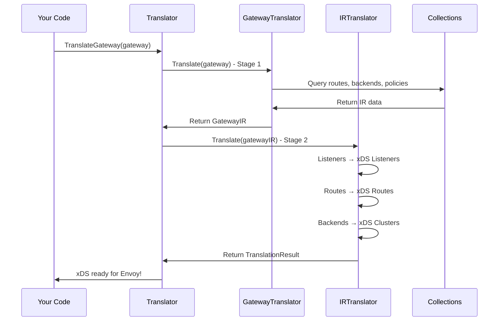

# Chapter 3: Translation Pipeline (IR & xDS)

## Transition from Previous Chapter

In [Chapter 2: KRT Collections & Resource Tracking](02_krt_collections___resource_tracking_.md), you learned how kgateway efficiently tracks and indexes Kubernetes resources through collections. But once you have all these resources organized and ready, the next critical question is: **How do you convert them into actual proxy configurations that Envoy understands?**

This is where the **Translation Pipeline** comes in—it's the bridge between "what you want" (Kubernetes Gateway API resources) and "what the proxy needs" (Envoy xDS configurations).

## What Problem Does This Solve?

Imagine you create a Kubernetes Gateway and HTTPRoute:

```yaml
apiVersion: gateway.networking.k8s.io/v1
kind: Gateway
metadata:
  name: my-gateway
spec:
  listeners:
    - port: 80
      protocol: HTTP
---
apiVersion: gateway.networking.k8s.io/v1
kind: HTTPRoute
metadata:
  name: my-route
spec:
  parentRefs:
    - name: my-gateway
  rules:
    - matches:
        - path: /api
      backendRefs:
        - name: api-service
          port: 8080
```

The problem: **Envoy doesn't understand Kubernetes Gateway API resources.** Envoy speaks a different language—xDS (Envoy's configuration protocol). It expects you to tell it things like:

- "Create a listener on port 80"
- "For domains matching example.com, route traffic to the `api-backend` cluster"
- "The `api-backend` cluster has endpoints at 10.0.0.1:8080 and 10.0.0.2:8080"

The Translation Pipeline solves this by:

1. **Reading** - Gathering Gateway API resources from collections
2. **Understanding** - Converting them to an Intermediate Representation (IR)
3. **Translating** - Converting the IR to xDS (Listener, Route, Cluster configs)
4. **Sending** - Delivering these configs to Envoy via xDS

Think of it like a **compiler**: your Gateway API resources are high-level source code, the IR is assembly code, and xDS is machine code that proxies execute.

## Key Concepts

### 1. **What is the Intermediate Representation (IR)?**

The **IR** is kgateway's internal language that represents your Gateway configuration in a format optimized for translation to xDS.

Why have an IR at all? Why not translate directly from Gateway API to xDS?

**Three big reasons:**

1. **Decoupling** - Separates "understanding Kubernetes" from "understanding Envoy"
2. **Flexibility** - Plugins can contribute policies/backends that modify the IR
3. **Reusability** - The same IR can theoretically translate to different proxy types (not just Envoy)

An IR Gateway looks something like:

```go
type GatewayIR struct {
    SourceObject *Gateway          // Original K8s Gateway
    Listeners []ListenerIR         // HTTP, TCP listeners
    AttachedPolicies AttachedPolicies // What policies apply
}
```

It's a simplified, normalized view of your Gateway—all the essential info without Kubernetes-specific details.

### 2. **What is xDS?**

**xDS** stands for "Everything Delivery Service." It's Envoy's configuration protocol with different "resources":

- **Listeners (LDS)** - Network sockets Envoy listens on (e.g., port 80)
- **Routes (RDS)** - How to route traffic (e.g., "/api" → api-backend)
- **Clusters (CDS)** - Backend services to connect to (e.g., api-service:8080)
- **Endpoints (EDS)** - Individual IPs/ports in clusters (e.g., 10.0.0.1:8080)

Think of it as a blueprint: Listeners are the front door, Routes are the hallways, Clusters are the destinations, and Endpoints are the actual office locations.

### 3. **The Three-Stage Pipeline**

```
Gateway API Resources → [Stage 1] → IR → [Stage 2] → xDS → [Stage 3] → Envoy
                       (Gateway Translation)  (IR Translation)  (Send)
```

**Stage 1: Gateway Translation** (Collections → IR)
- Takes Kubernetes resources (Gateway, HTTPRoute, Services, etc.)
- Combines them into a cohesive IR Gateway

**Stage 2: IR Translation** (IR → xDS)
- Converts IR Listeners → Envoy Listeners
- Converts IR Routes → Envoy Route Configurations
- Converts IR Backends → Envoy Clusters

**Stage 3: xDS Distribution** (xDS → Envoy)
- Sends configs to Envoy proxies via xDS protocol

This chapter focuses on **Stages 1 & 2**. For Stage 3, see [Chapter 7: xDS Distribution & Proxy Syncer](07_xds_distribution___proxy_syncer_.md).

## How to Use It: From Gateway to xDS

Let's trace through our use case—converting that HTTPRoute to an Envoy route config.

### Step 1: The Translation Starts

When a Gateway changes, the controller calls the translator:

```go
translator := NewCombinedTranslator(ctx, extensions, commonCols, validator)
xdsSnap, reports := translator.TranslateGateway(kctx, ctx, gateway)
```

**What happens:** This kicks off the entire translation pipeline. It returns:
- `xdsSnap` - The complete xDS configuration (listeners, routes, clusters)
- `reports` - Status information (which routes attached, any errors)

### Step 2: Build the Gateway IR

Inside `TranslateGateway`, the first stage happens:

```go
gwir := s.buildProxy(kctx, ctx, gw, r)
// Result: gwir contains Listeners, Routes, Backends all organized
```

**What happens:** The Gateway Translator:
1. Queries collections to find all routes attached to this gateway
2. Finds backends (services) those routes point to
3. Applies policies (e.g., rate limiting)
4. Creates a GatewayIR with everything organized

### Step 3: Translate IR to xDS

Then stage 2 happens:

```go
xdsSnap := s.irtranslator.Translate(ctx, *gwir, r)
// Result: xdsSnap.Listeners, xdsSnap.Routes, xdsSnap.ExtraClusters
```

**What happens:** 
- Listeners in IR become Envoy Listener protobuf messages
- Routes in IR become Envoy RouteConfiguration protobuf messages
- Backends in IR become Envoy Cluster protobuf messages

### Step 4: Result

You now have xDS configs that Envoy understands:

```
Listeners: [{Name: "listener-http", Address: "0.0.0.0:80", ...}]
Routes: [{Name: "route-my-route", VirtualHosts: [...]}]
Clusters: [{Name: "api-backend", Endpoints: [...]}]
```

Envoy can consume these and start forwarding traffic!

## Internal Implementation

### High-Level Translation Flow

Here's what happens step-by-step when `TranslateGateway` is called:



### Stage 1 Deep Dive: Gateway Translation

Let's look at the Gateway Translator code from `gateway/gateway_translator.go`:

```go
func (t *translator) Translate(kctx krt.HandlerContext, 
    ctx context.Context, gateway *ir.Gateway, 
    reporter reports.Reporter) *ir.GatewayIR {
    
    // Step 1: Find routes attached to this gateway
    routesForGw, err := t.queries.GetRoutesForGateway(kctx, ctx, gateway)
```

**What this does:** Uses the collections from [Chapter 2](02_krt_collections___resource_tracking_.md) to query: "Which HTTPRoutes/TCPRoutes/etc. are attached to this gateway?" Collections make this lookup fast!

Then it continues:

```go
    // Step 2: Build listener IR objects
    listeners := listener.TranslateListeners(kctx, ctx, t.queries, 
        gateway, routesForGw, reporter, settings)
    
    // Step 3: Return the IR
    return &ir.GatewayIR{
        SourceObject: gateway,
        Listeners: listeners,
        AttachedPolicies: gateway.AttachedListenerPolicies,
    }
```

**What this does:**
1. Translates each listener on the Gateway (e.g., HTTP on port 80)
2. For each listener, translates its routes
3. Returns a complete GatewayIR object

Key insight: The GatewayIR **mirrors the structure** of the original Gateway but with normalized, processed data.

### Stage 2 Deep Dive: IR Translation

Now look at `irtranslator/gateway.go`:

```go
func (t *Translator) Translate(ctx context.Context, 
    gw ir.GatewayIR, reporter sdkreporter.Reporter) TranslationResult {
    
    pass := t.newPass(reporter)
    var res TranslationResult
    
    // For each listener in the IR:
    for _, l := range gw.Listeners {
        outListener, routes := t.ComputeListener(ctx, pass, gw, l, reporter)
        res.Listeners = append(res.Listeners, outListener)
        res.Routes = append(res.Routes, routes...)
    }
```

**What this does:**
1. Creates a "translation pass" (a plugin mechanism for extending translation)
2. For each listener in the IR, translates it to an Envoy Listener
3. Returns all Envoy listeners and route configurations

### The Plugin System Integration

Notice the `pass` object? This is how plugins extend the translation:

```go
func (t *Translator) newPass(reporter sdkreporter.Reporter) TranslationPassPlugins {
    ret := TranslationPassPlugins{}
    for k, v := range t.ContributedPolicies {
        if v.NewGatewayTranslationPass == nil {
            continue
        }
        tp := v.NewGatewayTranslationPass(ir.GwTranslationCtx{}, reporter)
        ret[k] = &TranslationPass{ ProxyTranslationPass: tp }
    }
    return ret
}
```

**What this does:** Gives plugins a chance to hook into the translation process. If a policy plugin contributed special behavior (like circuit breaking), it gets invoked during translation.

For more details on plugins, see [Chapter 6: Plugin Architecture & Extensions](06_plugin_architecture___extensions_.md).

### Concrete Example: Route Translation

Let's trace through how an HTTPRoute becomes an xDS RouteConfiguration:

**Input HTTPRoute:**
```yaml
apiVersion: gateway.networking.k8s.io/v1
kind: HTTPRoute
metadata:
  name: my-route
spec:
  rules:
    - matches:
        - path: /api
      backendRefs:
        - name: api-service
          port: 8080
```

**Stage 1 Output (GatewayIR):**
```go
ListenerIR{
    HttpFilterChain: []HttpFilterChain{{
        Vhosts: []VirtualHostIR{{
            Domains: []string{"*"},
            Routes: []RouteIR{{
                Name: "my-route",
                Matchers: []RouteMatcher{{PathPrefix: "/api"}},
                BackendRef: BackendObjectIR{Name: "api-service", Port: 8080},
            }},
        }},
    }},
}
```

**Stage 2 Output (xDS RouteConfiguration):**
```protobuf
RouteConfiguration {
    name: "route-listener-http"
    virtual_hosts {
        name: "vhost-default"
        domains: "*"
        routes {
            name: "my-route"
            match { prefix: "/api" }
            route { cluster: "default_api-service_8080" }
        }
    }
}
```

See how it transformed? The IR was just an intermediate step—it wasn't Kubernetes-specific, but it wasn't Envoy-specific either. Stage 2 converted it to actual protobuf that Envoy understands.

### How Policies Get Applied

Policies (like rate limiting or traffic policies) are also part of translation. They modify the IR:

```go
// Inside listener translation:
for _, gk := range attachedPolicies.ApplyOrderedGroupKinds() {
    policies, mergeOrigins := mergePolicies(pass, pols)
    for _, pol := range policies {
        pass.ApplyListenerPlugin(pctx, out)  // Apply policy!
    }
}
```

**What this does:** After building the base listener/route/cluster configs, applies policies that modify them. For example, a CircuitBreakerPolicy might add connection limits to the cluster.

For deep details on policies, see [Chapter 4: Policy System (Traffic, Backend, Listener)](04_policy_system__traffic__backend__listener__.md).

### Why Two Stages?

You might wonder: why not translate directly from Gateway API to xDS?

**Three benefits of the two-stage approach:**

1. **Separation of Concerns** - Gateway Translation focuses on "what did the user describe?" while IR Translation focuses on "what does Envoy need?"

2. **Testability** - You can test the IR independently of xDS, making debugging easier

3. **Extensibility** - Plugins can contribute to IR (new backends, policies), and the IR Translation stage uses them automatically

## Real-World Trace: Full Example

Let's trace one complete example from start to finish.

**You create:**
```yaml
apiVersion: gateway.networking.k8s.io/v1
kind: Gateway
metadata:
  name: api-gateway
spec:
  listeners:
    - port: 80
---
apiVersion: gateway.networking.k8s.io/v1
kind: HTTPRoute
metadata:
  name: api-route
spec:
  parentRefs:
    - name: api-gateway
  rules:
    - backendRefs:
        - name: api-server
          port: 3000
```

**Controller detects this and calls:**
```go
translator.TranslateGateway(ctx, gateway)
```

**Stage 1 (GatewayTranslator.Translate):**
- Queries: "What routes attach to api-gateway?"
- Finds: api-route
- Creates IR:
  ```
  GatewayIR {
      Listeners: [ListenerIR{
          Port: 80,
          Vhosts: [VirtualHostIR{
              Routes: [RouteIR{
                  Backend: "api-server:3000"
              }]
          }]
      }]
  }
  ```

**Stage 2 (IRTranslator.Translate):**
- Converts IR to xDS:
  ```
  Listener(name: "listener-http", port: 80)
  RouteConfiguration(vhosts: [{"*" → "api-server_3000_cluster"}])
  Cluster(name: "api-server_3000_cluster", endpoints: [...])
  ```

**Stage 3 (xDS Distribution - Chapter 7):**
- Sends to Envoy proxies
- Envoy starts listening on port 80 and routing to api-server!

## Conclusion

The **Translation Pipeline** is the heart of kgateway. It:

1. **Converts** Kubernetes Gateway API resources into an Intermediate Representation
2. **Translates** that IR into xDS configuration that Envoy understands
3. **Enables** plugins to extend behavior at both stages
4. **Keeps** translation logic clean and separated from Kubernetes/Envoy specifics

Think of it as a **"language translator at a conference"**—the speaker (you) describes things in Kubernetes terms, the translator (pipeline) converts to an intermediate language (IR), and then translates to Envoy's language (xDS) so Envoy can act on it.

Now that you understand how Gateway resources become xDS configs, you're ready to learn about **[Chapter 4: Policy System (Traffic, Backend, Listener)](04_policy_system__traffic__backend__listener__.md)**, which explains how policies hook into this pipeline to modify behavior—adding things like rate limiting, retries, and traffic management on top of the base translation.

---

Generated by [AI Codebase Knowledge Builder](https://github.com/The-Pocket/Tutorial-Codebase-Knowledge)