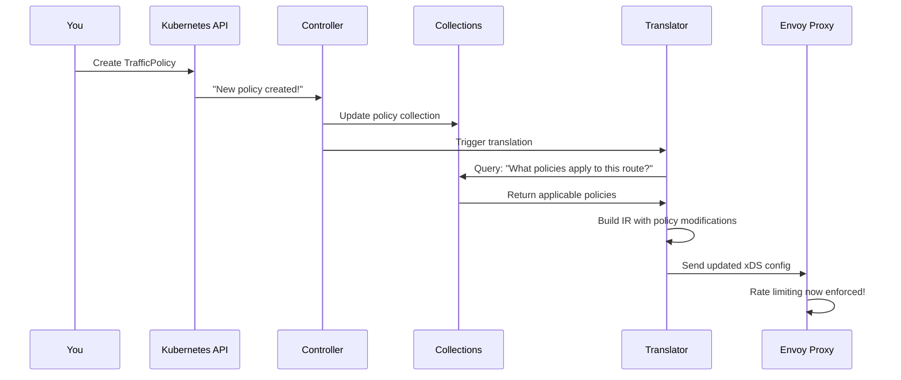

# Chapter 4: Policy System (Traffic, Backend, Listener)

## Transition from Previous Chapter

In [Chapter 3: Translation Pipeline (IR & xDS)](03_translation_pipeline__ir___xds__.md), you learned how kgateway converts Kubernetes Gateway API resources into an Intermediate Representation (IR) and then translates that IR into xDS configurations that Envoy understands. But here's the thing: **what if you want to customize that translation?** What if you want to add rate limiting to a specific route, or require authentication at the gateway level, or add custom request headers? This is where the **Policy System** comes in—it's the mechanism that lets you attach behavior modifiers to your gateways, listeners, and routes.

## What Problem Does This Solve?

Imagine you've deployed a gateway with several routes:

```yaml
apiVersion: gateway.networking.k8s.io/v1
kind: Gateway
metadata:
  name: api-gateway
spec:
  listeners:
    - port: 80
      protocol: HTTP
    - port: 443
      protocol: HTTPS
---
apiVersion: gateway.networking.k8s.io/v1
kind: HTTPRoute
metadata:
  name: public-api
spec:
  parentRefs:
    - name: api-gateway
  rules:
    - backendRefs:
        - name: public-api-service
---
apiVersion: gateway.networking.k8s.io/v1
kind: HTTPRoute
metadata:
  name: admin-api
spec:
  parentRefs:
    - name: api-gateway
      sectionName: https  # Only on HTTPS listener
  rules:
    - backendRefs:
        - name: admin-api-service
```

Now you realize you need to:

- ✅ Rate limit the `public-api` route to 100 requests per second
- ✅ Require authentication for the `admin-api` route
- ✅ Add custom headers to all traffic through port 80
- ✅ Set retry policies for specific routes
- ✅ Add CORS headers

Without the Policy System, you'd have to modify the gateway and route definitions directly, which gets messy fast. **The Policy System lets you define these behaviors separately and attach them to the parts of your gateway you want to affect.**

Think of it like **"decorators on your configuration"**—you define *what* traffic behavior you want, then you decide *where* to apply it. Apply the same rate limit policy to multiple routes, or have different policies at different levels.

## Key Concepts

### 1. **What is a Policy?**

A **policy** is a Kubernetes resource that defines a specific behavior you want to apply to your gateway configuration. It's separate from your Gateway and HTTPRoute definitions.

Examples of policies include:

- **TrafficPolicy** - Rate limiting, retries, timeouts, transformations, authentication
- **BackendConfigPolicy** - Configuration for backend services
- **HTTPListenerPolicy** - Configuration for specific listeners

Each policy type modifies the translation process differently. For example, a TrafficPolicy with rate limiting will modify the IR to add rate limit configuration, which then gets translated to Envoy rate limit filters.

### 2. **The Hierarchy: Gateway → Listener → Route**

Policies work like inheritance in object-oriented programming. You can attach policies at different levels:

```
Gateway Level (Most General)
├── Applies to ALL routes through this gateway
│
├── Listener Level (More Specific)
│   ├── Applies to routes on THIS port/protocol
│   │
│   └── Route Level (Most Specific)
│       └── Applies to THIS route only
```

**Key rule:** More specific policies override more general ones. A policy on a route wins over a policy on a listener, which wins over a policy on the gateway.

### 3. **Policy Attachment: How Policies Know Where to Apply**

Policies don't automatically apply—you have to tell them *what* to attach to. A policy specifies its targets using `targetRefs` or `targetSelectors`:

```yaml
apiVersion: gateway.kgateway.dev/v1alpha1
kind: TrafficPolicy
metadata:
  name: rate-limit-public-api
spec:
  targetRefs:
    - kind: HTTPRoute
      name: public-api
      namespace: default
  rateLimit:
    local:
      tokenBucket:
        maxTokens: 100
        fillInterval: 1s
```

**What this means:**
- "I'm a TrafficPolicy"
- "I apply to the HTTPRoute named 'public-api' in namespace 'default'"
- "I define local rate limiting with a token bucket of 100 tokens per second"

The translation system will see this policy and modify the IR for the `public-api` route to include rate limiting configuration.

### 4. **Policy Types**

Here are the main policy types in kgateway:

**TrafficPolicy** - The most flexible policy type
- Rate limiting (local or global)
- Retries and timeouts
- CORS, CSRF protection
- Request/response transformation
- Authentication (external auth)
- RBAC (role-based access control)
- Custom headers

**BackendConfigPolicy** - Configuration specific to backends
- Pool settings, connection parameters
- Backend-specific behavior

**HTTPListenerPolicy** - HTTP listener configuration
- Port 80 or 443 specific settings

## How to Use It: Solving Our Use Case

Let's solve the concrete use case: rate limiting the public API while requiring auth on the admin API.

### Step 1: Create a Rate Limit Policy for the Public API

```yaml
apiVersion: gateway.kgateway.dev/v1alpha1
kind: TrafficPolicy
metadata:
  name: public-api-rate-limit
spec:
  targetRefs:
    - kind: HTTPRoute
      name: public-api
  rateLimit:
    local:
      tokenBucket:
        maxTokens: 100
        fillInterval: 1s
```

**What happens:** kgateway sees this policy and stores it. When translating the `public-api` route, it will include rate limiting configuration.

### Step 2: Create an Authentication Policy for the Admin API

```yaml
apiVersion: gateway.kgateway.dev/v1alpha1
kind: TrafficPolicy
metadata:
  name: admin-api-auth
spec:
  targetRefs:
    - kind: HTTPRoute
      name: admin-api
  extAuth:
    extensionRef:
      name: auth-service
```

**What happens:** This policy says "when translating admin-api, add external authentication that calls the auth-service extension."

### Step 3: What the Controller Does

The controller automatically applies these policies:

```go
// Simplified - when translating a route
policies := findApplicablePolicies(route)
// Returns: [admin-api-auth]

ir := buildRouteIR(route)
for _, policy := range policies {
  applyPolicy(policy, ir)  // Modifies IR with auth config
}
// Result: IR now has auth configuration
```

**Result:** When Envoy receives the config, the `admin-api` route will enforce authentication!

## Internal Implementation

### High-Level Flow: From Policy to Proxy

Here's what happens when you create a policy and apply it:



### Stage 1: Collections Track Policies

First, policies are tracked in collections (just like routes and services from [Chapter 2](02_krt_collections___resource_tracking_.md)):

```go
trafficPolicies := krt.WrapClient(
    kclient.NewFiltered[*TrafficPolicy](client),
    krtopts.ToOptions("TrafficPolicy")...,
)
```

**What happens:** A collection starts watching all TrafficPolicy resources. When a policy is created, updated, or deleted, this collection updates automatically.

### Stage 2: Finding Applicable Policies

When translating a route, the translator needs to find all policies that apply to it:

```go
applicablePolicies := findPoliciesForRoute(kctx, route)
// Returns: Policies that target this route,
// AND policies that target the parent listener/gateway
```

**How it works:** For a specific route, this function queries:
1. Policies directly targeting this route (most specific)
2. Policies targeting the listener this route is on
3. Policies targeting the gateway (most general)

Then it merges them, with more specific ones winning.

### Stage 3: Applying Policies to the IR

Once you have applicable policies, they modify the IR:

```go
ir := buildRouteIR(route)
for _, policy := range policies {
  ir.RateLimit = policy.Spec.RateLimit
  ir.HeaderModifiers = policy.Spec.HeaderModifiers
  // ... apply other policy fields
}
```

**What happens:** The IR object gets populated with settings from the policies. The more specific policies override earlier ones.

### Stage 4: IR Translation Applies Policy Config

In [Chapter 3](03_translation_pipeline__ir___xds__.md), we saw how the IR translator converts IR to xDS. Now it also processes policies:

```go
irTranslator.translateRoute(ctx, routeIR)
// If routeIR has rate limiting settings:
//   → Create Envoy rate limit filter
// If routeIR has auth settings:
//   → Create Envoy ext auth filter
```

**Result:** The xDS configuration now includes Envoy filters for rate limiting, auth, etc.

### Deep Dive: How Policies Get Applied During Translation

Let's trace through the actual code. In `policy_translator.go`, policies are applied:

```go
func applyPolicies(route *RouteIR, 
    policies []TrafficPolicy) {
  
  for _, p := range policies {
    if p.Spec.RateLimit != nil {
      route.RateLimitConfig = p.Spec.RateLimit
    }
  }
}
```

**What this does:** For each policy, if it has a rate limit spec, we add it to the route's IR.

Then during IR→xDS translation:

```go
if routeIR.RateLimitConfig != nil {
  filter := createRateLimitFilter(
    routeIR.RateLimitConfig)
  xdsRoute.Filters = append(xdsRoute.Filters, filter)
}
```

**What this does:** If the IR has rate limit config, add an Envoy rate limit filter to the xDS route. Simple!

### Policy Attachment: More Details

Policies target resources using `targetRefs`:

```yaml
targetRefs:
  - kind: HTTPRoute
    name: my-route
    namespace: default
  - kind: Gateway
    name: my-gateway
    sectionName: https  # Optional: specific listener
```

The translator uses this to query: "Find all policies targeting me."

**With TargetSelectors (label-based):**

```yaml
targetSelectors:
  - kind: HTTPRoute
    selector:
      matchLabels:
        tier: premium
```

**What this means:** Apply this policy to all HTTPRoutes with label `tier=premium`. This is more flexible than targeting by name!

### Real-World Example: Complete Flow

Let's trace a complete example end-to-end.

**Setup:**
```yaml
# 1. Route definition
apiVersion: gateway.networking.k8s.io/v1
kind: HTTPRoute
metadata:
  name: api-route
  labels:
    tier: premium
---
# 2. Policy targeting by label selector
apiVersion: gateway.kgateway.dev/v1alpha1
kind: TrafficPolicy
metadata:
  name: premium-rate-limit
spec:
  targetSelectors:
    - kind: HTTPRoute
      matchLabels:
        tier: premium
  rateLimit:
    local:
      tokenBucket:
        maxTokens: 1000
        fillInterval: 1s
```

**Translation process:**

1. **Controller detects:** New policy `premium-rate-limit` created
2. **Collections update:** Policy collection includes this policy
3. **Translation triggered:** Need to translate routes
4. **Find policies:** Query "What policies target `api-route`?"
5. **Query returns:** `[premium-rate-limit]` (matches label selector)
6. **Apply to IR:** `route.RateLimit = {maxTokens: 1000, ...}`
7. **IR→xDS:** Create Envoy rate limit filter in route config
8. **Result:** `api-route` now rate-limits to 1000 req/sec!

### Policy Merging: When Multiple Policies Apply

What happens if a route has both a gateway-level policy AND a route-level policy?

```go
policies := append(
  gatewayPolicies,    // General
  routePolicies,      // Specific
)

// Merge: more specific wins
merged := mergeWithPriority(policies)
```

**Rule:** More specific policies override earlier ones. A route-level policy's rate limit replaces a gateway-level rate limit.

## Common Use Cases

### Use Case 1: Rate Limit All Routes

Apply a policy at the gateway level:

```yaml
apiVersion: gateway.kgateway.dev/v1alpha1
kind: TrafficPolicy
metadata:
  name: global-rate-limit
spec:
  targetRefs:
    - kind: Gateway
      name: api-gateway
  rateLimit:
    local:
      tokenBucket:
        maxTokens: 5000
        fillInterval: 1s
```

**Result:** All routes in this gateway get the same rate limit (unless overridden by specific route policies).

### Use Case 2: Add Headers to Specific Route

```yaml
apiVersion: gateway.kgateway.dev/v1alpha1
kind: TrafficPolicy
metadata:
  name: add-tracking-headers
spec:
  targetRefs:
    - kind: HTTPRoute
      name: api-route
  headerModifiers:
    request:
      add:
        - name: X-Tracking-ID
          value: "12345"
```

**Result:** All requests through this route get the tracking header added.

### Use Case 3: Transformation Policy

Transform request bodies on a specific route:

```yaml
apiVersion: gateway.kgateway.dev/v1alpha1
kind: TrafficPolicy
metadata:
  name: json-transform
spec:
  targetRefs:
    - kind: HTTPRoute
      name: api-route
  transformation:
    request:
      add:
        - name: X-Request-ID
          value: "generated-id"
```

**Result:** Requests are transformed before being sent to the backend.

## Conclusion

The **Policy System** is how you customize and extend traffic behavior in kgateway. It:

1. **Decouples** behavior from configuration - policies are separate from routes
2. **Hierarchies** from general to specific - gateway → listener → route
3. **Enables reuse** - apply the same policy to multiple routes via selectors
4. **Integrates** seamlessly with translation - policies modify the IR during translation
5. **Supports rich behaviors** - rate limiting, auth, transformations, CORS, and more

Think of it like **"policy layers"** on your gateway—each layer adds capabilities without cluttering your route definitions.

Now that you understand how policies customize traffic behavior, you're ready to learn about **[Chapter 5: Backend System (Multi-Provider)](05_backend_system__multi_provider__.md)**, which explains how kgateway manages different types of backend services (Kubernetes services, external endpoints, DNS, etc.) and integrates them with the policy and translation systems.

---

Generated by [AI Codebase Knowledge Builder](https://github.com/The-Pocket/Tutorial-Codebase-Knowledge)