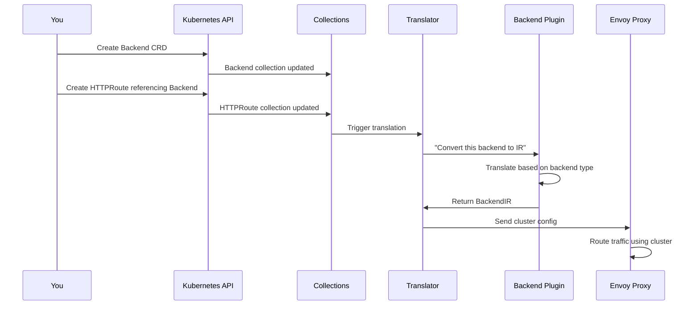
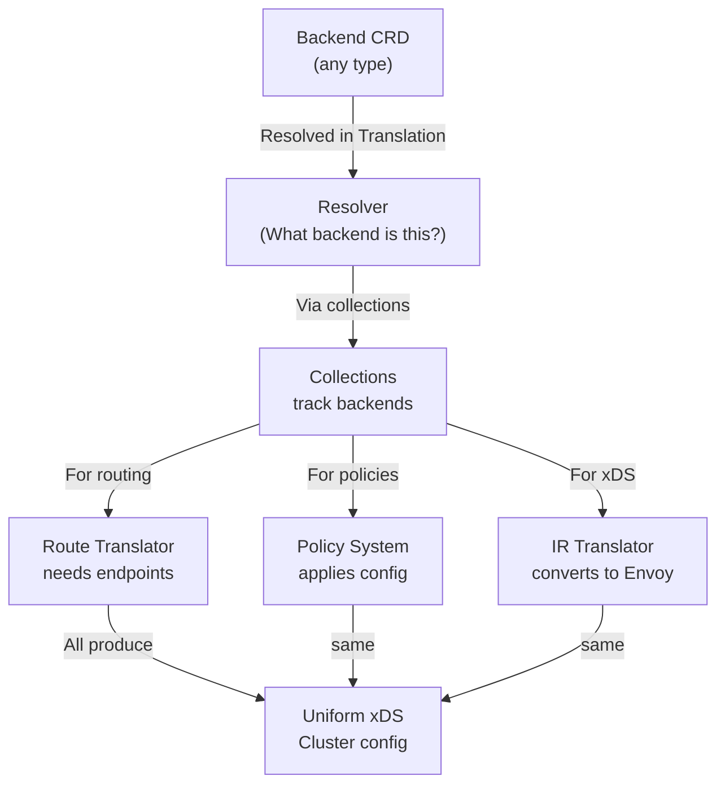

# Chapter 5: Backend System (Multi-Provider)

## Transition from Previous Chapter

In [Chapter 4: Policy System (Traffic, Backend, Listener)](04_policy_system__traffic__backend__listener__.md), you learned how policies customize traffic behavior and can be attached at different levels of your gateway. But here's a fundamental question: **what exactly is a "backend" that policies and routes point to?** 

The answer isn't simple—a backend could be a Kubernetes Service, a static IP address, an AWS Lambda function, or even an AI model API. The **Backend System** is the abstraction layer that makes all these different backend types work seamlessly together, as if they were all the same thing.

## What Problem Does This Solve?

Imagine you're building an API gateway and you need to handle traffic to multiple types of services:

```yaml
# Route 1: Points to Kubernetes Service
apiVersion: gateway.networking.k8s.io/v1
kind: HTTPRoute
metadata:
  name: internal-api-route
spec:
  rules:
    - backendRefs:
        - kind: Service
          name: my-api-service  # Kubernetes Service
          port: 8080

---
# Route 2: Points to external static IP
apiVersion: gateway.networking.k8s.io/v1
kind: HTTPRoute
metadata:
  name: external-api-route
spec:
  rules:
    - backendRefs:
        - kind: Backend
          name: external-api  # External static IP (via Backend CRD)

---
# Route 3: Points to AWS Lambda
apiVersion: gateway.networking.k8s.io/v1
kind: HTTPRoute
metadata:
  name: lambda-route
spec:
  rules:
    - backendRefs:
        - kind: Backend
          name: my-lambda  # AWS Lambda (via Backend CRD)

---
# Route 4: Points to AI Model
apiVersion: gateway.networking.k8s.io/v1
kind: HTTPRoute
metadata:
  name: ai-route
spec:
  rules:
    - backendRefs:
        - kind: Backend
          name: openai-api  # AI Model (via Backend CRD)
```

**The problem:** Each backend type is fundamentally different:
- Kubernetes Services have endpoints that change dynamically
- Static IPs are fixed
- Lambda functions need special AWS request signing
- AI models need custom request/response transformation

**Without the Backend System**, the translation layer would need special cases for every type. With it, the system treats all backends uniformly—each type just implements the same interface differently.

Think of it like a **"universal adapter for different power outlets"**—all outlets provide electricity, but they look different. The adapter lets any device work with any outlet by implementing the same interface differently for each type.

## Key Concepts

### 1. **What is a Backend?**

A **backend** is any service or resource that can receive traffic routed through your gateway. It's an abstraction representing "where should this traffic go?"

Backends come in many types, each with different characteristics:

| Type | Example | Use Case |
|------|---------|----------|
| **Kubernetes Service** | `my-api-service:8080` | Internal microservices |
| **Static IPs** | `192.168.1.100:3000` | External APIs with fixed addresses |
| **AWS Lambda** | `my-function:us-east-1` | Serverless functions |
| **AI Models** | `openai-api:gpt-4` | LLM endpoints (OpenAI, Bedrock, etc.) |
| **DynamicForwardProxy** | DNS name | Dynamic endpoint resolution |
| **ServiceEntry** | `external-service` | Istio service discovery |

Each type represents the same concept (a destination) but with different mechanics underneath.

### 2. **The Backend Abstraction Layer**

The Backend System uses a **plugin architecture** where each backend type implements the same interface:

```
┌─────────────────────────────────────────────────────┐
│          Translation Pipeline (from Ch. 3)          │
└─────────────────────────────┬───────────────────────┘
                              │
                    ┌─────────▼──────────┐
                    │  Backend Abstraction│  
                    │  Interface Layer    │
                    └────────┬────────────┘
                             │
        ┌────────┬───────┬──┴──┬────────┬─────────┐
        │        │       │     │        │         │
        ▼        ▼       ▼     ▼        ▼         ▼
     K8s Svc  Static  Lambda   AI   DynamicFwd ServiceEntry
```

**Key insight:** The translation pipeline doesn't care which backend type is used—it just calls the abstraction interface. Each backend type plugs in with its own implementation.

### 3. **Backend Discovery vs. Backend Definition**

There are two distinct things to understand:

**Backend Discovery** (static/dynamic lookup):
- How do we find all available backends?
- For Kubernetes: Scan `Service` resources
- For Static: User specifies in Backend CRD
- For Lambda: AWS credentials + function name

**Backend Endpoints** (actual IPs/addresses):
- What are the actual destination addresses?
- For Kubernetes: Query Service Endpoints (10.0.0.1:8080, 10.0.0.2:8080)
- For Static: Use the configured IP/port directly
- For Lambda: Create an Envoy cluster pointing to Lambda endpoint

### 4. **Backend CRDs: Explicit Backend Definition**

For backend types that aren't Kubernetes Services, kgateway provides a **Backend CRD** (Custom Resource Definition). This lets you define non-Kubernetes backends:

```yaml
apiVersion: gateway.kgateway.dev/v1alpha1
kind: Backend
metadata:
  name: external-api
spec:
  type: Static
  static:
    hosts:
      - host: api.external.com
        port: 443
```

**What this does:** Defines a static backend that routes to `api.external.com:443`. Routes can reference this just like a Kubernetes Service.

## How to Use It: Solving Our Use Case

Let's solve the concrete use case: supporting all four backend types in a single gateway.

### Step 1: Create Backends for Non-Kubernetes Services

```yaml
# Static IP backend
apiVersion: gateway.kgateway.dev/v1alpha1
kind: Backend
metadata:
  name: external-api
spec:
  type: Static
  static:
    hosts:
      - host: partner-api.com
        port: 443
---
# AWS Lambda backend
apiVersion: gateway.kgateway.dev/v1alpha1
kind: Backend
metadata:
  name: my-lambda
spec:
  type: AWS
  aws:
    accountId: "123456789012"
    region: us-east-1
    lambda:
      functionName: my-handler
---
# AI model backend
apiVersion: gateway.kgateway.dev/v1alpha1
kind: Backend
metadata:
  name: openai-api
spec:
  type: AI
  ai:
    llm:
      openAI:
        model: gpt-4
        authToken:
          secretRef:
            name: openai-secret
```

**What happens:** Each Backend CRD is stored as a Kubernetes resource. The kgateway controller watches these.

### Step 2: Create Routes Referencing Different Backend Types

```yaml
# Kubernetes Service backend (standard Gateway API)
apiVersion: gateway.networking.k8s.io/v1
kind: HTTPRoute
metadata:
  name: internal-api
spec:
  parentRefs:
    - name: my-gateway
  rules:
    - matches:
        - path: /internal
      backendRefs:
        - kind: Service
          name: internal-service
          port: 8080
---
# Backend CRD backend
apiVersion: gateway.networking.k8s.io/v1
kind: HTTPRoute
metadata:
  name: external-api
spec:
  parentRefs:
    - name: my-gateway
  rules:
    - matches:
        - path: /external
      backendRefs:
        - kind: Backend  # Reference our Backend CRD
          name: external-api
```

**What happens:** Routes can now reference either `Service` (Kubernetes) or `Backend` (custom types) interchangeably.

### Step 3: Translation Handles All Types Uniformly

```go
// During translation (simplified)
for _, backendRef := range route.BackendRefs {
  backend := resolver.ResolveBackend(backendRef)
  // backend could be Service, AI, Lambda, Static, etc.
  
  envoyCluster := convertToEnvoyCluster(backend)
  // Each backend type knows how to convert itself
}
```

**What happens:** The translator iterates through backend references. For each one, it:
1. Resolves what type of backend it is
2. Gets the backend's configuration
3. Converts to Envoy cluster format
4. Returns the same type of Envoy cluster (all look the same to Envoy)

**Result:** Envoy receives cluster configurations for all four types and routes traffic appropriately!

## Internal Implementation

### High-Level Flow: From Backend Definition to Envoy

Here's what happens when you create a Backend CRD and reference it in a route:



### Stage 1: Collections Track Backends

Just like routes and policies (from [Chapter 2: KRT Collections & Resource Tracking](02_krt_collections___resource_tracking_.md)), backends are tracked in collections:

```go
backends := krt.WrapClient(
  kclient.NewFiltered[*v1alpha1.Backend](client),
  krtopts.ToOptions("Backend")...,
)
```

**What happens:** This collection automatically watches all Backend CRDs. When a Backend is created, updated, or deleted, the collection reflects that change.

### Stage 2: Backend Plugin System

The Backend System uses a **plugin architecture**. Each backend type is implemented as a plugin that can be extended independently:

```go
type BackendPlugin struct {
  Backends krt.Collection[*ir.BackendObjectIR]
  Endpoints krt.Collection[*ir.EndpointsForBackend]
  BackendInit ir.BackendInit
}
```

**What this means:**
- `Backends` = the backends themselves
- `Endpoints` = the actual IP addresses to route to
- `BackendInit` = how to initialize/convert to Envoy format

Each backend type (AI, Lambda, Static, etc.) provides these three components.

### Stage 3: Backend Translation to IR

Let's look at how a Static backend gets translated. In the plugin code:

```go
func buildTranslateFunc(...) func(...) *backendIr {
  return func(krtctx krt.HandlerContext, b *v1alpha1.Backend) *backendIr {
    switch b.Spec.Type {
    case v1alpha1.BackendTypeStatic:
      return translateStaticBackend(b.Spec.Static)
    case v1alpha1.BackendTypeAWS:
      return translateAwsBackend(b.Spec.AWS)
    // ... other types
    }
  }
}
```

**What this does:**
1. Takes a Backend CRD as input
2. Checks its type
3. Calls the appropriate translation function
4. Returns a backend IR object

Each type translator knows how to extract relevant configuration from its spec.

### Stage 4: Converting Backend IR to Envoy Clusters

```go
func processBackendForEnvoy(backend ir.BackendObjectIR, 
    out *envoyCluster.Cluster) {
  
  switch backend.Obj.(*v1alpha1.Backend).Spec.Type {
  case v1alpha1.BackendTypeStatic:
    processStaticBackendForEnvoy(backend, out)
  case v1alpha1.BackendTypeAWS:
    processAwsBackendForEnvoy(backend, out)
  }
}
```

**What this does:** Takes a backend IR and populates an Envoy Cluster proto. For example:
- Static: Adds static addresses to the cluster
- Lambda: Adds AWS signing filters
- AI: Adds transformation filters

The key insight: **All of these produce the same output type** (Envoy Cluster), but with different content based on backend type.

### Deep Dive: How Each Backend Type Works

#### **Type 1: Static Backends**

Static backends are the simplest:

```yaml
apiVersion: gateway.kgateway.dev/v1alpha1
kind: Backend
metadata:
  name: example-external
spec:
  type: Static
  static:
    hosts:
      - host: api.example.com
        port: 443
```

**In Envoy:** Creates a simple cluster pointing to that host and port. Envoy handles DNS resolution.

#### **Type 2: AWS Lambda Backends**

Lambda backends are complex—they need AWS request signing:

```yaml
apiVersion: gateway.kgateway.dev/v1alpha1
kind: Backend
metadata:
  name: my-lambda
spec:
  type: AWS
  aws:
    accountId: "123456789012"
    region: us-east-1
    lambda:
      functionName: my-handler
    auth:
      type: Secret
      secretRef:
        name: aws-credentials
```

**In Envoy:** Creates a cluster pointing to the Lambda endpoint, with special filters that:
1. Sign requests with AWS credentials
2. Transform HTTP to Lambda's expected format
3. Transform Lambda's response back to HTTP

See `internal/kgateway/extensions2/plugins/backend/plugin.go` for the implementation.

#### **Type 3: AI Model Backends**

AI backends transform requests/responses for LLM APIs:

```yaml
apiVersion: gateway.kgateway.dev/v1alpha1
kind: Backend
metadata:
  name: openai-backend
spec:
  type: AI
  ai:
    llm:
      openAI:
        model: gpt-4
        authToken:
          secretRef:
            name: openai-api-key
```

**In Envoy:** Creates a cluster with filters that:
1. Transform HTTP requests to OpenAI's API format
2. Call the AI service
3. Transform responses back to your application's format

See `internal/kgateway/extensions2/plugins/backend/ai/ai_backend.go` for details.

#### **Type 4: DynamicForwardProxy Backends**

Dynamic forward proxy backends resolve DNS at runtime:

```yaml
apiVersion: gateway.kgateway.dev/v1alpha1
kind: Backend
metadata:
  name: dynamic-proxy
spec:
  type: DynamicForwardProxy
  dynamicForwardProxy:
    enableTls: true
```

**In Envoy:** Creates a cluster that resolves DNS names dynamically instead of at configuration time. Useful when targets change frequently.

### How Endpoints Work: The Key to Load Balancing

For Kubernetes Services, endpoints (the actual IPs) need to be discovered dynamically. The Backend System handles this:

```go
endpoints := krt.NewCollection(backends, 
  func(kctx krt.HandlerContext, backend *v1alpha1.Backend) 
      *ir.EndpointsForBackend {
    return processEndpoints(backend)
  })
```

**What happens:**
1. For each backend, find its endpoints
2. For Kubernetes Services: query the endpoints API
3. For Static backends: use the configured hosts
4. For Lambda/AI: typically just one "endpoint" (the service)

When endpoints change (a pod crashes, new pod starts), the collection automatically updates and triggers re-translation!

### Real-World Example: Complete Flow

Let's trace one complete example from creation to traffic routing.

**You create:**
```yaml
apiVersion: gateway.kgateway.dev/v1alpha1
kind: Backend
metadata:
  name: chat-api
spec:
  type: AI
  ai:
    llm:
      openAI:
        model: gpt-4
        authToken:
          secretRef:
            name: openai-key
---
apiVersion: gateway.networking.k8s.io/v1
kind: HTTPRoute
metadata:
  name: chat-route
spec:
  parentRefs:
    - name: my-gateway
  rules:
    - matches:
        - path: /chat
      backendRefs:
        - kind: Backend
          name: chat-api
```

**Controller detects changes and translates:**

1. Collections see: new Backend CRD and new HTTPRoute
2. Translator queries: "What backend does this route use?"
3. Finds: Backend named "chat-api" of type AI
4. Backend plugin processes: `PreprocessAIBackend()` extracts model, auth config
5. Translator builds IR: `RouteIR` with `BackendIR` pointing to OpenAI
6. IR translator converts: Creates Envoy cluster + route configuration
7. Result: xDS config with:
   - Cluster pointing to `api.openai.com`
   - Route that transforms requests/responses
   - HTTP filters for auth and transformation

**Envoy receives this and:**
- Listens for `/chat` requests
- Transforms them to OpenAI format
- Calls OpenAI's API
- Transforms response back to your format
- Sends to client

Everything works because each backend type implemented the same abstraction interface!

## Comparison: Same Backend Used in Different Ways

Here's how the same backend abstraction serves different purposes:



## Conclusion

The **Backend System (Multi-Provider)** solves the fundamental problem of "where should traffic go?" by providing a pluggable abstraction layer that:

1. **Unifies** different backend types (Kubernetes, Static, Lambda, AI, etc.) under one interface
2. **Enables** each type to be implemented independently as a plugin
3. **Maintains** efficiency through collections that track and index backends
4. **Translates** backends to Envoy clusters while preserving their special requirements (auth, transformation, etc.)
5. **Scales** from simple static IPs to complex AI models without special-casing in the core logic

Think of it as the **"Swiss Army knife" of backends**—one tool that adapts to fit whatever type of service you're routing to.

Now that you understand how backends are abstracted and supported, you're ready to learn about **[Chapter 6: Plugin Architecture & Extensions](06_plugin_architecture___extensions_.md)**, which explains how to build and contribute new backend types, policies, and other extensions to kgateway.

---

Generated by [AI Codebase Knowledge Builder](https://github.com/The-Pocket/Tutorial-Codebase-Knowledge)