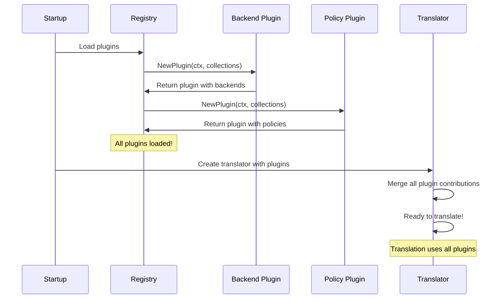

# Chapter 6: Plugin Architecture & Extensions

## Transition from Previous Chapter

In [Chapter 5: Backend System (Multi-Provider)](05_backend_system__multi_provider__.md), you learned how kgateway supports different types of backends (Kubernetes Services, static IPs, Lambda, AI models) through a pluggable abstraction layer. But here's a fundamental limitation: **what if you have a custom backend type that kgateway doesn't natively support?** What if you need a special policy that only your organization uses, or a custom filter that transforms traffic in a unique way? 

Without a way to extend kgateway, you'd be stuck modifying the core code every time you wanted new functionality. The **Plugin Architecture & Extensions** system solves this by providing a standardized way for anyone to add new capabilities to kgateway without touching the core.

## What Problem Does This Solve?

Imagine you work for a company with unique requirements:

1. **Custom Backend Type** - You need to route traffic to your proprietary "MicroVM" service type
2. **Custom Policy** - You need a "CompliancePolicy" that enforces HIPAA requirements on specific routes
3. **Custom Filter** - You need a special filter that adds your internal tracing headers
4. **Custom Transformer** - You need to transform requests to match your internal API standard

**The problem:** Without the plugin system, you'd have four options, all bad:
- ❌ Fork kgateway and maintain your own version (maintenance nightmare)
- ❌ Modify kgateway's core code (conflicts with upstream)
- ❌ Wait for kgateway maintainers to add your features (slow)
- ❌ Add special cases throughout the code (unclean, unmaintainable)

**The Plugin Architecture solves this by providing "sockets"** where you can plug in your custom code. Just like how USB sockets let you plug in any USB device without the computer needing to know about it, kgateway's plugin sockets let you plug in your custom backends, policies, and filters without modifying the core.

Think of it like a **"LEGO brick system"**—kgateway provides the base structure and standard connection points, and you can create custom bricks that snap into those connection points.

## Key Concepts

### 1. **What is a Plugin?**

A **plugin** is a package of code that extends kgateway's functionality by implementing one or more "interfaces" (standardized contracts). Each plugin can contribute:

- **New backend types** (like your custom MicroVM)
- **New policy types** (like CompliancePolicy)
- **Custom filters** (like your tracing header filter)
- **Custom translation logic** (to modify how gateways are translated to xDS)

A plugin is like a **"specialized module that speaks kgateway's language"**—kgateway knows how to talk to it because it implements the right interfaces.

### 2. **Extension Points: Where Plugins Hook In**

kgateway has several places where plugins can hook in:

```
Translation Pipeline (from Chapter 3)
    ↓
    ├─ Policy Contribution Hook
    │  └─ Your custom policies here
    ├─ Backend Contribution Hook
    │  └─ Your custom backends here
    ├─ Gateway Translation Hook
    │  └─ Custom translation logic here
    └─ Route/Cluster/Listener Hook
       └─ Custom xDS generation here
```

Each hook is an **extension point**—a place in the code where plugins are invited to contribute functionality.

### 3. **The Plugin Interface: The Contract**

Every plugin must implement a standard interface so kgateway knows how to call it:

```go
type Plugin struct {
    // Policies this plugin contributes
    ContributesPolicies map[schema.GroupKind]PolicyPlugin
    
    // Backends this plugin contributes
    ContributesBackends map[schema.GroupKind]BackendPlugin
    
    // Custom gateway translation (optional)
    ContributesGwTranslator GwTranslatorFactory
    
    // Called on leader election (optional)
    ContributesLeaderAction map[schema.GroupKind]func()
}
```

**What this means:** When kgateway loads a plugin, it expects this exact structure. Each field tells kgateway what the plugin can do.

### 4. **The Plugin Registry: The Hub**

The **Plugin Registry** is the central place where all plugins are registered. It's like a **"phonebook" for extensions**—kgateway looks up which plugins exist and what they contribute.

From the code in `registry.go`:

```go
func Plugins(ctx context.Context, 
    commoncol *pluginsdkcol.CommonCollections,
) []sdk.Plugin {
    return []sdk.Plugin{
        backend.NewPlugin(ctx, commoncol),
        trafficpolicy.NewPlugin(ctx, commoncol, ...),
        // ... more plugins ...
    }
}
```

**What this means:** This function lists all plugins that should be loaded. It's the registry!

## How to Use It: Creating a Custom Backend Plugin

Let's solve one of the concrete use cases: adding support for your company's custom "MicroVM" backend type.

### Step 1: Create Your Backend Plugin Package

Create a new directory: `internal/kgateway/extensions2/plugins/microvm/`

### Step 2: Implement the Backend Interface

```go
package microvm

import (
    "context"
    sdk "github.com/kgateway-dev/kgateway/v2/pkg/pluginsdk"
    col "github.com/kgateway-dev/kgateway/v2/pkg/pluginsdk/collections"
)

func NewPlugin(ctx context.Context, 
    commoncol *col.CommonCollections) sdk.Plugin {
    // Your plugin implementation
    return sdk.Plugin{
        ContributesBackends: map[schema.GroupKind]sdk.BackendPlugin{
            // Your backend type here
        },
    }
}
```

**What this does:** Creates a basic plugin structure. When kgateway calls `NewPlugin`, it gets back a plugin that can contribute backend types.

### Step 3: Define Your Backend Type

```go
type MicroVMBackendIR struct {
    VMName     string
    Region     string
    Port       int32
    Credentials *Credentials
}

// Implement the required interface methods
func (m *MicroVMBackendIR) CreationTime() time.Time {
    return m.CreatedAt
}
```

**What this does:** Defines what information your MicroVM backend needs (name, region, port, credentials).

### Step 4: Register It with the Plugin

```go
return sdk.Plugin{
    ContributesBackends: map[schema.GroupKind]sdk.BackendPlugin{
        v1alpha1.MicroVMBackendGVK.GroupKind(): {
            Backends: microVMCollection,
            // Endpoints resolver, etc.
        },
    },
}
```

**What this does:** Tells kgateway "I'm contributing a backend type. Here's the collection of all MicroVM backends, and here's how to find their endpoints."

### Step 5: Register Your Plugin in the Registry

Edit `registry.go`:

```go
func Plugins(ctx context.Context, 
    commoncol *pluginsdkcol.CommonCollections,
) []sdk.Plugin {
    return []sdk.Plugin{
        backend.NewPlugin(ctx, commoncol),
        microvm.NewPlugin(ctx, commoncol),  // Add this!
        trafficpolicy.NewPlugin(ctx, commoncol),
        // ...
    }
}
```

**What this does:** Tells kgateway to load your plugin on startup.

### Step 6: Use It in Your Gateway!

Now users can reference your backend:

```yaml
apiVersion: gateway.kgateway.dev/v1alpha1
kind: Backend
metadata:
  name: my-microvm
spec:
  type: MicroVM
  microvm:
    vmName: compute-node-1
    region: us-west-2
    port: 8080
---
apiVersion: gateway.networking.k8s.io/v1
kind: HTTPRoute
metadata:
  name: my-route
spec:
  rules:
    - backendRefs:
        - kind: Backend
          name: my-microvm
```

**What happens:** Routes now route traffic to your MicroVM!

## Creating a Custom Policy Plugin

Let's solve another use case: adding a custom "CompliancePolicy" for HIPAA requirements.

### Step 1: Define Your Policy Type

```go
package compliancepolicy

type CompliancePolicyIR struct {
    HIPAAMode bool
    EncryptionRequired bool
    AuditLogging bool
}
```

**What this does:** Defines what your policy stores.

### Step 2: Implement the Translation Hook

```go
func (cp *CompliancePolicyIR) ApplyForRoute(
    pCtx *ir.RouteContext,
    route *envoyroutev3.Route,
) error {
    if cp.AuditLogging {
        // Add audit logging filter
        pCtx.TypedFilterConfig.AddTypedConfig(
            "audit-log", auditLogFilter)
    }
    return nil
}
```

**What this does:** When translating a route with your policy, add audit logging to it.

### Step 3: Register as Plugin

```go
func NewPlugin(ctx context.Context, 
    commoncol *col.CommonCollections) sdk.Plugin {
    policyCol := krt.NewCollection(
        rawPolicies, translatePolicy)
    
    return sdk.Plugin{
        ContributesPolicies: map[schema.GroupKind]sdk.PolicyPlugin{
            gvk.CompliancePolicyGVK.GroupKind(): {
                Policies: policyCol,
                // ... other fields
            },
        },
    }
}
```

**What this does:** Registers your policy with kgateway so it knows about CompliancePolicies.

## Internal Implementation

### High-Level Plugin Loading and Execution Flow

Here's what happens when kgateway starts with plugins:



### Stage 1: Plugin Discovery and Loading

When kgateway starts, it calls the registry to get all plugins:

```go
plugins := registry.Plugins(ctx, commoncol)
// Returns: [backend.Plugin, trafficpolicy.Plugin, 
//           microvm.Plugin, compliancepolicy.Plugin, ...]
```

**What happens:** The registry calls `NewPlugin()` for each plugin, collecting all their contributions.

### Stage 2: Plugin Merging

All plugins' contributions are merged into one combined interface:

```go
func MergePlugins(plug ...sdk.Plugin) sdk.Plugin {
    ret := sdk.Plugin{
        ContributesPolicies: make(map[...]),
        ContributesBackends: make(map[...]),
    }
    for _, p := range plug {
        maps.Copy(ret.ContributesPolicies, 
            p.ContributesPolicies)
        maps.Copy(ret.ContributesBackends, 
            p.ContributesBackends)
    }
    return ret
}
```

**What this does:** Takes all the separate plugins and combines them into one unified set of contributions. Now kgateway has a single interface to all backends, policies, and translators from all plugins.

### Stage 3: Translation Uses Plugins

During translation (from [Chapter 3](03_translation_pipeline__ir___xds__.md)), the translator calls plugin hooks:

```go
// When translating a route:
for _, plugin := range mergedPlugins {
    if plugin.ApplyForRoute != nil {
        plugin.ApplyForRoute(routeCtx, route)
        // Plugin can modify the route!
    }
}
```

**What this does:** For each route, call every plugin's `ApplyForRoute` hook. Each plugin gets a chance to modify the route.

### Deep Dive: How a Backend Plugin Works

Let's trace through how your custom MicroVM backend gets used. Look at `internal/kgateway/extensions2/plugins/backend/plugin.go`:

```go
func NewPlugin(ctx context.Context, 
    commoncol *collections.CommonCollections) sdk.Plugin {
    
    // Watch all Backend CRDs
    backends := krt.WrapClient(
        kclient.NewFiltered[*v1alpha1.Backend](
            commoncol.Client))
    
    return sdk.Plugin{
        ContributesBackends: map[schema.GroupKind]sdk.BackendPlugin{
            // Your MicroVM backend here
        },
    }
}
```

**What this does:**
1. Creates a collection that watches all Backend CRDs
2. For each backend type (including MicroVM), has a translator function
3. Returns the plugin

### Deep Dive: How a Policy Plugin Works

Look at `internal/kgateway/extensions2/plugins/trafficpolicy/traffic_policy_plugin.go`:

```go
func NewPlugin(ctx context.Context, 
    commoncol *collections.CommonCollections, 
    mergeSettings string, v validator.Validator) sdk.Plugin {
    
    // Watch all TrafficPolicy CRDs
    col := krt.WrapClient(
        kclient.NewFiltered[*v1alpha1.TrafficPolicy](
            commoncol.Client))
    
    policyCol := krt.NewCollection(col, 
        func(krtctx krt.HandlerContext, 
             policyCR *v1alpha1.TrafficPolicy) *ir.PolicyWrapper {
            // Translate each policy to IR
            return constructor.ConstructIR(krtctx, policyCR)
        })
    
    return sdk.Plugin{
        ContributesPolicies: map[schema.GroupKind]sdk.PolicyPlugin{
            wellknown.TrafficPolicyGVK.GroupKind(): {
                Policies: policyCol,
                // ... hooks like ApplyForRoute
            },
        },
    }
}
```

**What this does:**
1. Creates a collection watching TrafficPolicy CRDs
2. For each policy, translates it to an IR object
3. Registers translation hooks (`ApplyForRoute`, `ApplyForListener`, etc.)
4. Returns the plugin

### The Backend Plugin Registry Pattern

Look at `internal/kgateway/extensions2/registry/registry.go` to see all plugins:

```go
func Plugins(ctx context.Context,
    commoncol *pluginsdkcol.CommonCollections,
    // ... other params
) []sdk.Plugin {
    return []sdk.Plugin{
        backend.NewPlugin(ctx, commoncol),
        trafficpolicy.NewPlugin(ctx, commoncol, ...),
        directresponse.NewPlugin(ctx, commoncol),
        kubernetes.NewPlugin(ctx, commoncol),
        // ... more plugins ...
    }
}
```

**What this shows:** Each plugin is instantiated here. To add your plugin, just add it to this list!

### How Plugins Interact with Collections

Plugins heavily use [KRT Collections from Chapter 2](02_krt_collections___resource_tracking_.md):

```go
// Inside a backend plugin
backends := krt.WrapClient(
    kclient.NewFiltered[*v1alpha1.Backend](
        commoncol.Client))

// When backend is referenced in a route,
// this collection automatically finds it!
```

**Key insight:** Plugins don't create collections from scratch—they use the shared collections system. This ensures that when a backend CRD is created, all plugins see the update automatically.

### How Plugins Hook into Translation

Plugins have multiple hooks they can implement to influence translation (from [Chapter 3](03_translation_pipeline__ir___xds__.md)):

```go
type ProxyTranslationPass interface {
    HttpFilters(fc FilterChainCommon) []StagedHttpFilter
    ApplyForRoute(pCtx *RouteContext, 
        route *envoyroutev3.Route) error
    ApplyForCluster(pCtx *ClusterContext, 
        cluster *envoyclusterv3.Cluster) error
    ApplyForListener(pCtx *ListenerContext, 
        listener *envoyconfiglistenerv3.Listener) error
    // ... more hooks
}
```

**What this means:** A plugin can hook into:
- **Listener translation** - Modify how listeners are created
- **Route translation** - Modify how routes are created
- **Cluster translation** - Modify how backends become clusters
- **Filter creation** - Add new HTTP filters

## Real-World Example: Custom Tracing Policy

Let's trace through a complete example: adding a custom tracing policy that adds distributed tracing headers.

**Step 1: Create policy type**
```go
type TracingPolicyIR struct {
    SampleRate float32
    HeaderName string
}
```

**Step 2: Implement hook**
```go
func (tp *TracingPolicyIR) ApplyForRoute(
    pCtx *ir.RouteContext,
    route *envoyroutev3.Route,
) error {
    // Add distributed tracing to route
    pCtx.TypedFilterConfig.AddTypedConfig(
        "tracing", createTracingFilter(tp.SampleRate))
    return nil
}
```

**Step 3: Register plugin**
```go
return sdk.Plugin{
    ContributesPolicies: map[schema.GroupKind]sdk.PolicyPlugin{
        tracingPolicyGVK.GroupKind(): {
            Policies: policyCol,
            NewGatewayTranslationPass: 
                func(ctx, reporter) ProxyTranslationPass {
                    return &myTracingPass{}
                },
        },
    },
}
```

**Step 4: Use in gateway**
```yaml
apiVersion: gateway.kgateway.dev/v1alpha1
kind: TracingPolicy
metadata:
  name: enable-tracing
spec:
  targetRefs:
    - kind: HTTPRoute
      name: my-route
  sampleRate: 0.1
  headerName: X-Trace-ID
```

**Result:** The route now has distributed tracing enabled!

## Common Plugin Patterns

### Pattern 1: Validation Plugin
Validates custom resources before they're used:

```go
// In your plugin's ConstructIR:
if err := validateCompliancePolicy(policyCR); err != nil {
    errors = append(errors, err)
}
```

### Pattern 2: Transformation Plugin
Transforms requests/responses using custom logic:

```go
// In ApplyForRoute hook:
pCtx.TypedFilterConfig.AddTypedConfig(
    "transformation", transformationFilter)
```

### Pattern 3: Backend Provider Plugin
Discovers backends from an external source:

```go
// Your backend plugin can query external APIs:
endpoints := queryExternalServiceRegistry(
    backend.ExternalServiceRef)
```

### Pattern 4: Leader-Only Plugin
Runs special logic only when this controller is the leader:

```go
return sdk.Plugin{
    ContributesLeaderAction: map[schema.GroupKind]func(){
        myResourceGVK: func() {
            // Only runs on leader
            syncWithExternalSystem()
        },
    },
}
```

## Why Use Plugins? A Comparison

**Without plugins:**
- Every new feature requires core changes
- Features from different teams conflict
- Testing is complex (everything is interdependent)

**With plugins:**
- ✅ Each team owns their plugin
- ✅ Plugins are loosely coupled
- ✅ Easier to test (test plugin in isolation)
- ✅ Easy to enable/disable (just add/remove from registry)

Think of it like **modular architecture**—instead of one monolithic system, you have a core + independent modules.

## Conclusion

The **Plugin Architecture & Extensions** system enables kgateway to be extended without modifying the core. It:

1. **Standardizes** how extensions are built through interfaces
2. **Enables** custom backends, policies, and translation logic
3. **Decouples** extensions from each other through the registry
4. **Hooks** plugins into the translation pipeline at strategic points
5. **Scales** from simple to complex extensions

Think of it as **"kgateway's LEGO brick system"**—the core provides the standard connection points, and plugins are custom bricks that snap in without breaking existing functionality.

Now that you understand how to extend kgateway with custom functionality, you're ready to learn about **[Chapter 7: xDS Distribution & Proxy Syncer](07_xds_distribution___proxy_syncer_.md)**, which explains how the xDS configurations generated by the translation pipeline actually get delivered to Envoy proxies, keeping them in sync as your gateway configuration changes.

---

Generated by [AI Codebase Knowledge Builder](https://github.com/The-Pocket/Tutorial-Codebase-Knowledge)