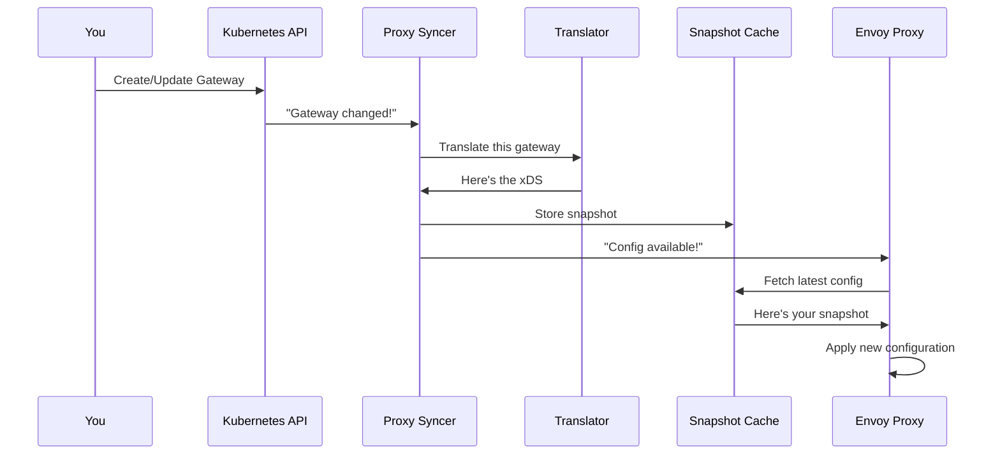

# Chapter 7: xDS Distribution & Proxy Syncer

## Transition from Previous Chapter

In [Chapter 6: Plugin Architecture & Extensions](06_plugin_architecture___extensions_.md), you learned how plugins extend kgateway with custom backends, policies, and translation logic. But here's a critical question: **once you've translated all your Gateway resources into xDS configurations, how do those configurations actually reach the Envoy proxies?** And what happens when a configuration changes—how do all connected proxies get the updates instantly?

This is where the **xDS Distribution & Proxy Syncer** comes in. It's the final piece that connects the translation pipeline to the actual proxies running in your cluster.

## What Problem Does This Solve?

Imagine you've deployed kgateway and several Envoy proxies as pods in your cluster. You create a Gateway with some routes:

```yaml
apiVersion: gateway.networking.k8s.io/v1
kind: Gateway
metadata:
  name: my-gateway
spec:
  listeners:
    - port: 80
      protocol: HTTP
---
apiVersion: gateway.networking.k8s.io/v1
kind: HTTPRoute
metadata:
  name: api-route
spec:
  parentRefs:
    - name: my-gateway
  rules:
    - matches:
        - path: /api
      backendRefs:
        - name: api-service
          port: 8080
```

**The problem:** Your Envoy proxies don't automatically know about this configuration. You need to:

1. ✅ **Detect** the new Gateway and route
2. ✅ **Translate** them to xDS (done in [Chapter 3](03_translation_pipeline__ir___xds__.md))
3. ✅ **Find all connected proxies** - Which Envoy proxies should receive this config?
4. ✅ **Send** the xDS config to each proxy
5. ✅ **Track versioning** - If the config changes, proxies need the new version
6. ✅ **Maintain consistency** - All proxies for the same gateway must have the same config
7. ✅ **Handle disconnections** - When a proxy disconnects and reconnects, it needs the latest config

**Without the Proxy Syncer**, you'd have to manually manage all of this. With it, everything is automatic—configurations flow seamlessly from your Kubernetes definitions to Envoy proxies.

Think of it like a **"broadcast system for proxy configuration"**—whenever your gateway definition changes, the system automatically pushes the new configuration to all connected proxies, just like a TV station broadcasts to all connected TVs.

## Key Concepts

### 1. **What is xDS Distribution?**

**xDS Distribution** is the mechanism for pushing configuration from the control plane (kgateway) to data planes (Envoy proxies). Think of it as a **"message delivery system"**:

- **Control Plane** = kgateway (the "post office")
- **Data Planes** = Envoy proxies (the "customers")
- **Messages** = xDS configurations (Listeners, Routes, Clusters)

Every connected Envoy proxy asks the control plane: "What should my configuration be?" The control plane responds with the latest xDS snapshot.

### 2. **What is a Proxy Syncer?**

The **Proxy Syncer** is the component that:

1. **Watches** for Gateway resource changes
2. **Translates** them to xDS (using the pipeline from [Chapter 3](03_translation_pipeline__ir___xds__.md))
3. **Stores** the xDS in a **snapshot cache** (a fast in-memory database)
4. **Tracks** which proxies are connected
5. **Serves** configurations to proxies that request them

It's like a **"librarian"**—it watches for new books (Gateway changes), organizes them (translates to xDS), and serves them (stores in cache). When a reader (proxy) asks for a book, the librarian instantly retrieves it.

### 3. **Snapshots: Versioned Configuration Packages**

A **snapshot** is a complete, versioned package of xDS configurations for a specific Gateway at a specific moment in time.

```
Snapshot Version 1 (when Gateway created):
├─ Listeners: [HTTP on port 80]
├─ Routes: [Route to api-service]
└─ Clusters: [api-service:8080]

Snapshot Version 2 (after adding new route):
├─ Listeners: [HTTP on port 80]
├─ Routes: [Route to api-service, NEW Route to another-service]
└─ Clusters: [api-service:8080, another-service:3000]
```

Each snapshot has a unique version number. When Envoy proxies fetch the config, they ask: "Give me everything since version X." The Proxy Syncer responds with the changes.

### 4. **Client-Specific Customizations**

Different Envoy proxies might need **slightly different** configurations. For example:

- Proxy A (in namespace A): Only routes for services in namespace A
- Proxy B (in namespace B): Only routes for services in namespace B

The Proxy Syncer ensures each proxy gets a customized snapshot based on its identity and location.

## How to Use It: End-to-End Flow

Let's trace how your gateway definition flows all the way to Envoy proxies.

### Step 1: Controller Detects Change

You create the Gateway (from our example above). The controller detects it:

```go
// Controller sees new Gateway resource
gateway := fetchGateway("my-gateway", "default")
logger.Info("Gateway created", "name", gateway.Name)
```

**What happens:** The controller recognizes a new Gateway and knows it needs to trigger translation.

### Step 2: Proxy Syncer Translates

The Proxy Syncer is watching gateway changes. When it sees the new gateway:

```go
xdsSnap, reports := translator.TranslateGateway(
    ctx, gateway)
// Result: xdsSnap contains Listeners, Routes, Clusters
```

**What happens:** The translation pipeline (from [Chapter 3](03_translation_pipeline__ir___xds__.md)) converts the Gateway to xDS. Policies and backends from [Chapters 4-5](04_policy_system__traffic__backend__listener__.md) are applied. Plugins from [Chapter 6](06_plugin_architecture___extensions_.md) contribute their customizations.

### Step 3: Store in Snapshot Cache

The xDS snapshot is stored in a fast cache:

```go
cache.SetSnapshot(ctx, "default/my-gateway", xdsSnap)
// Snapshot stored and ready to serve!
```

**What happens:** The snapshot is saved with a key identifying which gateway it belongs to. When proxies request configs, they'll get this.

### Step 4: Proxies Connect and Fetch

An Envoy proxy (Pod running Envoy) connects to kgateway's xDS server and requests configuration:

```
Envoy Proxy: "Hello! I'm proxy-1 for gateway my-gateway.
            What configuration should I have?"

kgateway: "Looking in cache for my-gateway..."
          "Found it! Here's your configuration."

Envoy: "Got it! I'll start routing traffic."
```

**What happens:** The proxy establishes a long-lived connection (like a WebSocket). It requests the configuration, and the Proxy Syncer responds with the latest snapshot.

### Step 5: Configuration Updates Flow Automatically

Now you update the HTTPRoute to add a new backend:

```yaml
apiVersion: gateway.networking.k8s.io/v1
kind: HTTPRoute
metadata:
  name: api-route
spec:
  parentRefs:
    - name: my-gateway
  rules:
    - matches:
        - path: /api
      backendRefs:
        - name: api-service
          port: 8080
    # NEW:
    - matches:
        - path: /other
      backendRefs:
        - name: other-service
          port: 9000
```

**Automatically, the Proxy Syncer:**

1. Detects the HTTPRoute change
2. Re-translates the gateway's configuration
3. Creates a new snapshot (version 2)
4. Stores it in the cache
5. Notifies connected proxies: "Configuration updated!"

**Envoy proxies automatically:**
- Receive notification of the update
- Fetch the new configuration
- Apply it without dropping connections

## Internal Implementation

### High-Level Flow: From Gateway to Proxies

Here's what happens step-by-step when you create/update a Gateway:



### Stage 1: Collection Watches Gateways

The Proxy Syncer uses collections (from [Chapter 2](02_krt_collections___resource_tracking_.md)) to watch gateways:

```go
gateways := krt.WrapClient(
    kclient.NewFiltered[*gwv1.Gateway](client))
// Collection now watches all Gateways
```

**What happens:** A KRT collection automatically notifies the Proxy Syncer whenever a Gateway changes.

### Stage 2: Trigger Translation

When a gateway changes, the Proxy Syncer translates it:

```go
gatewayXdsResources := krt.NewCollection(
    gateways,  // Input: gateways
    func(kctx, gw) *GatewayXdsResources {
        snap := translator.TranslateGateway(kctx, gw)
        return snap  // Output: xDS snapshot
    })
```

**What happens:** For each gateway, this transformation runs. If a gateway changes, the transformation automatically re-runs, creating a new snapshot.

### Stage 3: Store in Cache

The snapshot is stored in an xDS cache that Envoy proxies can query:

```go
cache.SetSnapshot(ctx, "default/my-gateway", snap)
// Now Envoy can fetch from this cache
```

**What happens:** The cache maintains versioned snapshots. When a proxy requests config, it gets instant access.

### Stage 4: Client-Specific Snapshots

The Proxy Syncer can customize snapshots per client (proxy):

```go
perClientSnapshots := krt.NewCollection(
    allSnapshots,  // For each snapshot
    func(kctx, snap) *PerClientSnapshot {
        return customizeFor(snap, clientIdentity)
        // Different clients get different views
    })
```

**What happens:** If needed, the snapshot is customized based on the proxy's identity (namespace, labels, etc.). But typically, all proxies for the same gateway get identical configs.

## Looking at the Code: ProxySyncer Structure

From the provided `proxy_syncer.go` file, here's the Proxy Syncer's main structure:

```go
type ProxySyncer struct {
    commonCols *collections.CommonCollections
    translator *translator.CombinedTranslator
    mostXdsSnapshots krt.Collection[GatewayXdsResources]
    perclientSnapCollection krt.Collection[XdsSnapWrapper]
    xdsCache envoycache.SnapshotCache
}
```

**What this means:**
- `commonCols` = shared collections tracking all Kubernetes resources
- `translator` = the translation pipeline that converts Gateway to xDS
- `mostXdsSnapshots` = all xDS snapshots for all gateways
- `perclientSnapCollection` = per-proxy customized snapshots
- `xdsCache` = the cache Envoy proxies query

### Initialization: Setting Up Collections

When the Proxy Syncer starts, it initializes collections:

```go
s.mostXdsSnapshots = krt.NewCollection(
    s.commonCols.GatewayIndex.Gateways,
    func(kctx, gw) *GatewayXdsResources {
        xdsSnap, rm := s.translator.TranslateGateway(
            kctx, ctx, gw)
        return toResources(gw, *xdsSnap, rm)
    })
```

**What happens:**
1. Watches all gateways (from collections)
2. For each gateway, translates to xDS
3. Creates a `GatewayXdsResources` object with Listeners, Routes, Clusters
4. When a gateway changes, re-translation happens automatically

### Syncing to Cache: The Core Loop

The most critical part is pushing snapshots to the cache:

```go
s.perclientSnapCollection.RegisterBatch(
    func(snapshots []krt.Event[XdsSnapWrapper]) {
        for _, event := range snapshots {
            if event.Event != controllers.EventDelete {
                s.proxyTranslator.syncXds(ctx, 
                    event.Latest())
            }
        }
    })
```

**What this does:**
1. When per-client snapshots change
2. Take each one and sync it to the xDS cache
3. This makes it available to Envoy proxies

### The syncXds Method

Looking at `kube_gw_translator_syncer.go`:

```go
func (s *ProxyTranslator) syncXds(
    ctx context.Context,
    snapWrap XdsSnapWrapper,
) {
    logger.Debug("syncing xds snapshot", 
        "proxy_key", snapWrap.proxyKey)
    s.xdsCache.SetSnapshot(ctx, 
        snapWrap.proxyKey, snapWrap.snap)
}
```

**What happens:** The snapshot is stored in the cache with a key (e.g., "default/my-gateway"). When Envoy proxies request it, the cache retrieves it instantly.

## How Versioning Ensures Consistency

Snapshots have versions. Here's why that matters:

```go
type GatewayXdsResources struct {
    Listeners    envoycache.Resources  // Version: "hash-v1"
    Routes       envoycache.Resources  // Version: "hash-v2"
    Clusters     []ClusterWithTTL      // Version: "hash-v3"
}
```

**What happens:**

1. **First time**: Proxy connects, asks for config
2. **Proxy receives**: Listeners v1, Routes v1, Clusters v1
3. **Gateway updated**: New HTTPRoute added
4. **Translation creates**: Listeners v2, Routes v2, Clusters v2
5. **Proxy notices**: Versions changed!
6. **Proxy fetches**: Only the changed resources
7. **Efficiently updated**: No wasted bandwidth

This is the xDS protocol's smart versioning—proxies only fetch what changed.

## Status Reporting: Tracking What Worked

After translation, the Proxy Syncer tracks status (what worked, what failed):

```go
s.statusReport = krt.NewSingleton(
    func(kctx) *report {
        proxies := krt.Fetch(kctx, 
            s.mostXdsSnapshots)
        merged := mergeProxyReports(proxies)
        return &report{merged}
    })
```

**What happens:** For each gateway, collects status information:
- Which routes attached successfully?
- Were there any errors?
- What policies were applied?

This status is later synced back to the Gateway's `.status` field so users can see if their config is working.

From `proxy_syncer.go`:

```go
func mergeProxyReports(proxies []GatewayXdsResources
) reports.ReportMap {
    merged := reports.NewReportMap()
    for _, p := range proxies {
        maps.Copy(merged.Gateways, p.reports.Gateways)
        // ... merge route reports, policy reports ...
    }
    return merged
}
```

**What this does:** Takes reports from all gateways and merges them into one unified report about the entire system's health.

## Real-World Trace: Complete Example

Let's trace the full journey of one configuration from creation to proxy.

**You create:**
```yaml
apiVersion: gateway.networking.k8s.io/v1
kind: Gateway
metadata:
  name: web-gateway
  namespace: default
spec:
  listeners:
    - port: 80
```

**Step 1: Detection**
- Collections see: new Gateway resource
- Collections notify Proxy Syncer

**Step 2: Translation**
- Translator runs: "What routes attach to web-gateway?"
- Finds: HTTPRoutes, TCPRoutes, etc.
- Finds backends and applies policies
- Creates xDS snapshot with 1 listener

**Step 3: Snapshot Created**
```
GatewayXdsResources {
  Namespace: "default"
  Name: "web-gateway"
  Listeners: [{Name: "listener-http", Port: 80}]
  Routes: []
  Clusters: []
}
```

**Step 4: Store in Cache**
```
cache["default/web-gateway"] = snapshot
```

**Step 5: Envoy Proxy Connects**
```
Envoy Pod: "I'm the proxy for web-gateway"
kgateway: "Let me look that up..."
kgateway: "Found it! Here's your config"
```

**Step 6: Proxy Applies Config**
- Envoy listens on port 80
- Waits for traffic

**Step 7: You Add a Route**
```yaml
apiVersion: gateway.networking.k8s.io/v1
kind: HTTPRoute
metadata:
  name: web-route
spec:
  parentRefs:
    - name: web-gateway
  rules:
    - backendRefs:
        - name: web-service
```

**Automatically:**
- Collections see: new HTTPRoute
- Translation runs again
- New snapshot created (version 2)
- Cached
- Envoy notified: "New config available"
- Envoy fetches and applies

**Result:** Without any manual intervention, the route is instantly live!

## Why Run on All Pods, Not Just Leader?

You might notice in the code:

```go
func (r *ProxySyncer) NeedLeaderElection() bool {
    return false  // Runs on ALL pods!
}
```

**Why?** Because Envoy proxies can connect to ANY kgateway pod. If the Proxy Syncer only ran on the leader:

1. Proxy connects to follower pod
2. Follower doesn't have the cache
3. Proxy gets no config
4. ❌ Configuration doesn't work

**With all pods running it:**
1. Proxy connects to any pod
2. Any pod can serve cached configurations
3. ✅ Always works, no single point of failure

It's like having **"multiple service desks that all have the same catalog"**.

## Conclusion

The **xDS Distribution & Proxy Syncer** completes the journey from Kubernetes configuration to live proxy behavior. It:

1. **Watches** for Gateway and route changes (via collections)
2. **Translates** them to xDS (using the pipeline from [Chapter 3](03_translation_pipeline__ir___xds__.md))
3. **Versions** configurations for efficient updates
4. **Serves** snapshots to connected Envoy proxies
5. **Tracks** status and reports back to Kubernetes
6. **Customizes** per-proxy configurations when needed

Think of it as the **"final mile"** of configuration delivery—everything before it prepares the configuration, and this component makes sure it reaches the proxies reliably and efficiently.

Now that you understand how configurations are distributed to running proxies, you're ready to learn about **[Chapter 8: Agent Gateway Translation (Non-Gateway-API)](08_agent_gateway_translation__non_gateway_api__.md)**, which explains how kgateway supports gateway definitions that don't use the Kubernetes Gateway API—useful for legacy systems and non-Kubernetes deployments.

---

Generated by [AI Codebase Knowledge Builder](https://github.com/The-Pocket/Tutorial-Codebase-Knowledge)