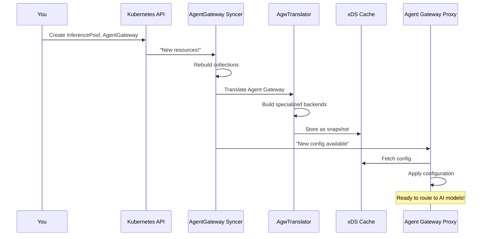

# Chapter 8: Agent Gateway Translation (Non-Gateway-API)

## Transition from Previous Chapter

In [Chapter 7: xDS Distribution & Proxy Syncer](07_xds_distribution___proxy_syncer_.md), you learned how xDS configurations are distributed to Envoy proxies once they're generated. But here's a practical limitation: **what if you want to deploy kgateway for non-traditional use cases like AI model serving or MCP (Model Context Protocol) integration, where the standard Kubernetes Gateway API doesn't quite fit?**

The **Agent Gateway Translation (Non-Gateway-API)** system solves this by providing a completely separate translation pipeline that operates independently from the main Kubernetes Gateway API stack, enabling specialized gateway deployments with custom backends like LLM providers and MCP servers.

## What Problem Does This Solve?

Imagine you're building an AI-powered gateway system. You need to:

1. **Route requests to LLM providers** (OpenAI, Anthropic, local models)
2. **Manage MCP servers** (Model Context Protocol for AI assistants)
3. **Handle custom workload addressing** (finding ML inference endpoints)
4. **Track AI-specific resources** (inference pools, model configurations)
5. **Apply specialized policies** (token-based rate limiting, model-specific transforms)

**The problem:** The standard Kubernetes Gateway API was designed for traditional microservices. It assumes:
- Backend services have stable Kubernetes Service IPs
- Traffic follows HTTP request/response patterns
- Policies focus on traffic management

But AI workloads are different:
- ❌ Inference endpoints are often external APIs (OpenAI, Anthropic)
- ❌ The "backend" might be a model, not a service
- ❌ You need AI-specific routing (by model type, provider, cost optimization)
- ❌ Request/response patterns include streaming, token counting, caching

**The Agent Gateway Translation system solves this** by:
1. **Creating a parallel pipeline** - Separate from the main Gateway API, runs independently
2. **Supporting specialized resources** - Custom CRDs for AI workloads, inference pools, MCP binds
3. **Enabling custom backends** - AI models, MCP servers, not just Kubernetes Services
4. **Maintaining isolation** - Changes to Agent Gateway don't affect traditional Gateways

Think of it like having **"two separate but connected systems"** running side-by-side. One handles traditional microservices (Gateway API), and one handles AI workloads (Agent Gateway).

## Key Concepts

### 1. **What is the Agent Gateway System?**

The **Agent Gateway** is a complete, independent translation pipeline specifically designed for AI and specialized workloads. It's like a **"specialized department"** in kgateway that focuses exclusively on non-traditional gateway needs.

```
Traditional Gateway API Pipeline (Chapter 7)
├─ Watches: Gateway, HTTPRoute, Service resources
├─ Creates: Envoy clusters for Kubernetes Services
└─ Result: Standard microservice routing

SEPARATE PIPELINE ─────────────────────────

Agent Gateway Pipeline (This Chapter)
├─ Watches: AgentGateway, InferencePool, MCP Bind resources  
├─ Creates: Custom backends (AI models, MCP servers)
└─ Result: Specialized AI/MCP routing
```

**Key difference:** Agent Gateway has its own collections, translators, and xDS distribution—it doesn't share code with the main pipeline. This isolation means:
- ✅ You can update Agent Gateway without affecting Gateways
- ✅ AI-specific features don't clutter the main code
- ✅ Completely different resource models can coexist

### 2. **Specialized Resources: What's Different?**

Agent Gateway works with different resource types than traditional Gateways:

```yaml
# Traditional Gateway API
apiVersion: gateway.networking.k8s.io/v1
kind: Gateway
spec:
  listeners:
    - port: 80
---
# Agent Gateway (Different!)
apiVersion: gateway.kgateway.dev/v1alpha1
kind: AgentGateway
spec:
  binds:
    - port: 8888
---
# Specialized: Inference Pool (AI-specific)
apiVersion: gateway.kgateway.dev/v1alpha1
kind: InferencePool
metadata:
  name: models
spec:
  models:
    - name: gpt-4
      provider: openai
---
# Specialized: MCP Bind (MCP-specific)
apiVersion: gateway.kgateway.dev/v1alpha1
kind: MCPBind
metadata:
  name: tools-server
spec:
  protocol: MCP
  target: tool-service:5000
```

**What's happening:** Instead of traditional Gateways and HTTPRoutes, Agent Gateway uses:
- **AgentGateway** - Defines listening ports and basic configuration
- **InferencePool** - Lists available AI models and their providers
- **MCPBind** - Registers MCP (Model Context Protocol) servers
- **DirectResponse** - Returns responses without routing

Each type is designed specifically for AI/specialized workloads, not microservices.

### 3. **Parallel but Connected**

The two systems run in parallel **but can interact**:

```
Kubernetes Cluster
├─ Traditional Gateway API Pipeline
│  ├─ Gateways → Kubernetes Services
│  └─ Outputs: xDS for Envoy proxies
│
├─ Agent Gateway Pipeline
│  ├─ AgentGateways → InferencePools, MCPBinds
│  └─ Outputs: xDS for Agent Gateway proxies
│
└─ Both output to the same xDS cache
   (Different resource types, different snapshots)
```

**Why parallel?** Because they serve completely different purposes:
- **Gateway API** = Route HTTP to microservices
- **Agent Gateway** = Route requests to AI models, MCP servers, etc.

You might have both running—some gateways for traditional services, others for AI workloads.

### 4. **Collections: The Foundation**

Just like the main pipeline (from [Chapter 2: KRT Collections & Resource Tracking](02_krt_collections___resource_tracking_.md)), Agent Gateway uses collections to track resources efficiently:

```go
// Agent Gateway collections
type AgwCollections struct {
    Gateways krt.Collection[*gwv1.Gateway]
    HTTPRoutes krt.Collection[*gwv1.HTTPRoute]
    Services krt.Collection[*corev1.Service]
    InferencePools krt.Collection[*v1alpha1.InferencePool]
    MCPBinds krt.Collection[*v1alpha1.MCPBind]
    // ... more collections
}
```

**What this means:** Agent Gateway watches all these resources simultaneously. When any changes, the collection updates automatically, triggering re-translation.

## How to Use It: End-to-End Example

Let's create an AI-powered gateway that routes to language models.

### Step 1: Create an Inference Pool (Available Models)

```yaml
apiVersion: gateway.kgateway.dev/v1alpha1
kind: InferencePool
metadata:
  name: ai-models
spec:
  models:
    - name: gpt-4
      provider: openai
      config:
        apiKeyRef:
          name: openai-key
```

**What happens:** This defines which AI models are available. Agent Gateway now knows about the `gpt-4` model from OpenAI.

### Step 2: Create an Agent Gateway (Listening Port)

```yaml
apiVersion: gateway.kgateway.dev/v1alpha1
kind: AgentGateway
metadata:
  name: ai-gateway
spec:
  class: agentgateway
  binds:
    - port: 8888
      protocol: HTTP
```

**What happens:** Agent Gateway starts listening on port 8888. This is where requests enter the system.

### Step 3: Create Routes to Models

```yaml
apiVersion: gateway.networking.k8s.io/v1
kind: HTTPRoute
metadata:
  name: chat-route
spec:
  parentRefs:
    - name: ai-gateway  # References Agent Gateway!
  rules:
    - matches:
        - path: /chat
      backendRefs:
        - kind: Backend
          name: gpt-4-backend
          port: 443
```

**What happens:** Requests to `/chat` are routed to the `gpt-4-backend`. Agent Gateway handles this routing.

### Step 4: Define the Backend (AI Model)

```yaml
apiVersion: gateway.kgateway.dev/v1alpha1
kind: Backend
metadata:
  name: gpt-4-backend
spec:
  type: AI
  ai:
    llm:
      openAI:
        model: gpt-4
        authToken:
          secretRef:
            name: openai-key
```

**What happens:** The backend points to OpenAI's GPT-4 model. Agent Gateway knows how to communicate with it (request signing, transformation, etc.).

**Result:** Traffic to `localhost:8888/chat` now flows through the Agent Gateway and routes to OpenAI's GPT-4 model!

## Internal Implementation

### High-Level Architecture: How Agent Gateway Works

Here's what happens when you deploy Agent Gateway resources:



### Stage 1: Collections and Initialization

When the Syncer starts, it initializes all collections (from `syncer.go`):

```go
func (s *Syncer) Init(krtopts krtutil.KrtOptions) {
    s.buildResourceCollections(krtopts)
    // All collections now watching resources
}
```

**What happens:** Agent Gateway creates collections that watch:
- Gateways (standard K8s resources)
- HTTPRoutes (standard K8s resources, but interpreted differently)
- Custom resources (InferencePools, MCPBinds, etc.)

### Stage 2: Building Gateway Resources

Looking at `syncer.go`, when a Gateway changes:

```go
gateways := s.buildGatewayCollection(
    gatewayClasses, refGrants, krtopts)
// Returns: Collection of gateways with translations
```

**What happens:** For each Gateway, Agent Gateway builds a "GatewayListener" object containing:
- Port binding information
- Protocol (HTTP, HTTPS, TLS, TCP)
- TLS certificates (if needed)

This is similar to the main pipeline but simpler—Agent Gateway has different needs.

### Stage 3: Building Agent Gateway Resources

The key part is converting Gateway API routes to Agent Gateway resources:

```go
agwRoutes := translator.AgwRouteCollection(
    httpRoutes, grpcRoutes, tcpRoutes, tlsRoutes,
    routeInputs, krtopts)
// Returns: Routes translated for Agent Gateway
```

**What happens:** HTTPRoutes are translated to Agent Gateway-specific route representations. This is where AI-specific logic kicks in—resolving inference pools, connecting to MCP servers, etc.

### Stage 4: Building Backends

From `syncer.go`, Agent Gateway builds specialized backends:

```go
_, agwBackends := s.newAgwBackendCollection(
    backends, krtopts)
// Returns: AI backends (LLM providers, MCP servers)
```

**What this does:** Each Backend CRD is translated to an Agent Gateway backend. For AI backends, this includes:
- Model configuration
- Authentication details
- Request/response transformation rules

See `ai_backend.go`:

```go
func ProcessAIBackendForAgw(be *AgwBackendIr) (
    []*api.Backend, []*api.Policy, error) {
    return []*api.Backend{be.AIIr.Backend}, 
        be.AIIr.Policies, nil
}
```

**What this does:** Converts an AI backend IR into Agent Gateway's format (`api.Backend`). The result includes the backend itself and any associated policies.

### Stage 5: Building XDS Snapshot

All resources are combined into an xDS snapshot:

```go
s.buildXDSCollection(
    agwResources, agwBackends, addresses, krtopts)
// Snapshot created and stored in xDS cache
```

**What happens:** Agent Gateway creates a complete xDS snapshot containing:
- **Resources** - Binds (ports), listeners, routes, backends
- **Addresses** - Service addresses, workload endpoints
- **Version hash** - For efficient updates

The snapshot is stored in the xDS cache so Agent Gateway proxies can fetch it.

### Stage 6: Distribution to Proxies

From `syncer.go`:

```go
s.xDS.RegisterBatch(func(events []krt.Event[...]) {
    for _, e := range events {
        snapshot := createSnapshot(e.Latest())
        s.xdsCache.SetSnapshot(ctx, 
            snap.ResourceName(), snapshot)
    }
})
```

**What happens:** Whenever the xDS collection changes, the snapshot is stored in the cache. Agent Gateway proxies connected to the xDS server are notified and fetch the new configuration.

### Deep Dive: Route Translation for Agent Gateway

Let's look at how routes are translated. From `translator/agw.go`:

```go
func CreateAgwPathMatch(match gwv1.HTTPRouteMatch) (
    *api.PathMatch, error) {
    // Convert Kubernetes path matching to Agent Gateway format
    if match.Path.Type == gwv1.PathMatchPathPrefix {
        return &api.PathMatch{
            Kind: &api.PathMatch_PathPrefix{
                PathPrefix: dest,
            },
        }, nil
    }
}
```

**What this does:** Converts a standard Kubernetes HTTPRoute path match to Agent Gateway's internal format. The result is an `api.PathMatch` protobuf message that Agent Gateway proxies understand.

Similar functions exist for headers, query parameters, methods—each converting from Kubernetes Gateway API format to Agent Gateway format.

### Deep Dive: Destination Resolution

When a route points to a backend, Agent Gateway resolves it differently than the main pipeline. From `translator/agw.go`:

```go
func buildAgwDestination(ctx RouteContext,
    ref gwv1.HTTPBackendRef, ns string,
) (*api.RouteBackend, error) {
    // Resolve backend reference
    backend := ctx.Backends.GetBackend(ref.Name)
    if backend == nil {
        return nil, fmt.Errorf("backend not found")
    }
    // Create Agent Gateway destination
    return &api.RouteBackend{
        Backend: backend,
        Filters: filters,
    }, nil
}
```

**What this does:**
1. Looks up the backend by name
2. Checks if it exists (error if not)
3. Creates an `api.RouteBackend` for Agent Gateway

For AI backends, the backend's configuration (model name, API key, etc.) is included, so the proxy knows how to communicate with the AI provider.

### Status Reporting

Agent Gateway has its own status reporting system (separate from the main pipeline). From `syncer.go`:

```go
gatewayReports := krt.NewSingleton(func(kctx ...) {
    proxies := krt.Fetch(kctx, s.xDS)
    merged := make(map[types.NamespacedName]*reports.GatewayReport)
    for _, p := range proxies {
        merged[p.NamespacedName] = p.Reports.Gateways[...]
    }
    return &translator.GatewayReports{Reports: merged}
})
```

**What happens:** Agent Gateway collects status from all proxies and merges it into one report. This report is used to update the Agent Gateway's `.status` field so users can see if their configuration is working.

## Real-World Example: AI Gateway in Action

Let's trace a complete example from creation to request routing.

**You deploy:**
```yaml
apiVersion: gateway.kgateway.dev/v1alpha1
kind: InferencePool
metadata:
  name: models
spec:
  models:
    - name: claude-3
      provider: anthropic
---
apiVersion: gateway.kgateway.dev/v1alpha1
kind: AgentGateway
metadata:
  name: ai-gw
spec:
  class: agentgateway
  binds:
    - port: 8888
---
apiVersion: gateway.networking.k8s.io/v1
kind: HTTPRoute
metadata:
  name: ai-route
spec:
  parentRefs:
    - name: ai-gw
  rules:
    - matches:
        - path: /ask
      backendRefs:
        - name: claude-backend
```

**Agent Gateway Syncer detects changes:**

1. **Collections updated:** InferencePool, AgentGateway, HTTPRoute all added
2. **Syncer triggered:** Collections notify syncer of changes
3. **Translation begins:** For each gateway, translate to Agent Gateway format

**Translation process:**

1. **Build Gateway:** Port 8888, HTTP protocol
2. **Build Route:** Path match for `/ask`
3. **Resolve Backend:** Look up `claude-backend` → Finds Anthropic configuration
4. **Build Backend:** Create Agent Gateway backend with:
   - Provider: `anthropic`
   - Model: `claude-3`
   - Auth: API key (from secret)

**XDS Snapshot created:**
```
Resources:
  - Bind: port 8888
  - Listener: name=default, bindKey=8888/default/ai-gw
  - Route: path=/ask, backend=claude_backend
  - Backend: type=AI, provider=anthropic, model=claude-3
```

**Proxy receives config:**
1. Agent Gateway proxy connects to xDS server
2. Fetches resource snapshot
3. Applies configuration

**User makes request:**
```bash
curl http://localhost:8888/ask -d "What is AI?"
```

**What happens:**
1. Request arrives at proxy on port 8888
2. Matches route rule: path `/ask`
3. Routes to backend: `claude_backend`
4. Proxy transforms request to Anthropic's API format
5. Calls `api.anthropic.com/messages`
6. Receives response
7. Transforms back to HTTP response
8. Returns to user

Everything works seamlessly!

## Comparison: Agent Gateway vs. Traditional Gateway

| Aspect | Traditional Gateway API | Agent Gateway |
|--------|------------------------|----|
| **Backend types** | Kubernetes Services only | AI models, MCP servers, Services |
| **Resource types** | Gateway, HTTPRoute, TCPRoute | AgentGateway, InferencePool, MCPBind |
| **Use case** | Microservice routing | AI/specialized workloads |
| **Pipeline** | Main pipeline | Separate, parallel pipeline |
| **Request pattern** | Request/response | Streaming, token counting, etc. |
| **Status reporting** | Via GatewayStatus | Via separate collectors |

**Key insight:** Both can run simultaneously on the same kgateway instance. They don't interfere with each other because they use completely separate translation pipelines.

## Why Parallel Instead of Integrated?

You might ask: why not just extend the main Gateway API pipeline?

**Reasons for parallel:**
1. **Isolation** - Changes to one don't affect the other
2. **Simplicity** - AI-specific logic stays in AI code
3. **Different models** - Gateways think in terms of "services," Agent Gateways think in terms of "models" and "inference"
4. **Easier testing** - Each pipeline can be tested independently
5. **Future flexibility** - New protocol types (MQTT, gRPC streaming) can be added to Agent Gateway without touching Gateway API code

## Conclusion

The **Agent Gateway Translation (Non-Gateway-API)** system extends kgateway to support specialized use cases like AI model serving and MCP integration. It:

1. **Operates independently** - Completely separate from the traditional Gateway API pipeline
2. **Supports specialized resources** - InferencePools, MCPBinds, custom backends
3. **Translates efficiently** - Converts these resources to Agent Gateway's internal format
4. **Maintains isolation** - AI-specific logic doesn't clutter the main codebase
5. **Integrates seamlessly** - Uses the same xDS distribution system as traditional gateways

Think of it as **"kgateway's specialized division"**—while the main department handles traditional microservices, this division specializes exclusively in AI and custom workloads.

Now that you understand how kgateway handles both traditional microservices and specialized AI workloads, you're ready to learn about **[Chapter 9: Gateway Deployer & Provisioning](09_gateway_deployer___provisioning_.md)**, which explains how kgateway actually provisions and manages the infrastructure needed to run gateways—creating deployments, services, and other Kubernetes objects that enable your gateway configurations to work in practice.

---

Generated by [AI Codebase Knowledge Builder](https://github.com/The-Pocket/Tutorial-Codebase-Knowledge)