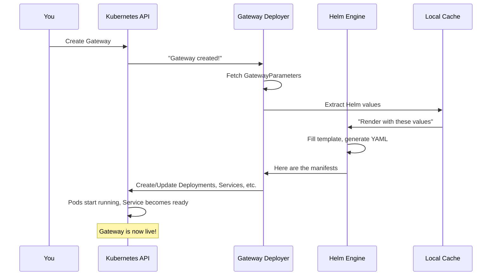

# Chapter 9: Gateway Deployer & Provisioning

## Transition from Previous Chapter

In [Chapter 8: Agent Gateway Translation (Non-Gateway-API)](08_agent_gateway_translation__non_gateway_api__.md), you learned how kgateway translates non-traditional gateway resources (like `AgentGateway`, `InferencePool`, `MCPBind`) into xDS configurations for specialized workloads. But here's a critical gap: **once you've defined your Gateway resource in Kubernetes, who actually creates and manages the Deployment, Service, ConfigMap, and other infrastructure objects needed to run the gateway proxy?**

The **Gateway Deployer & Provisioning** system solves this by automatically creating and maintaining all the Kubernetes infrastructure needed to deploy your gateway proxies—think of it as a "factory that builds the factory."

## What Problem Does This Solve?

Imagine you've created a Gateway resource:

```yaml
apiVersion: gateway.networking.k8s.io/v1
kind: Gateway
metadata:
  name: my-api-gateway
  namespace: production
spec:
  gatewayClassName: kgateway
  listeners:
    - port: 80
      protocol: HTTP
    - port: 443
      protocol: HTTPS
```

**The question:** Who creates the actual Envoy proxy that listens on these ports? Without the Gateway Deployer & Provisioning system, you'd have to manually create:

- ❌ A `Deployment` running Envoy pods
- ❌ A `Service` exposing the proxy on ports 80 and 443
- ❌ A `ConfigMap` with Envoy bootstrap configuration
- ❌ A `ServiceAccount` with proper permissions (RBAC)
- ❌ Security contexts and resource limits
- ❌ Volume mounts for TLS certificates
- ❌ Health check probes

**This is tedious, error-prone, and hard to maintain.** The Gateway Deployer & Provisioning system automates all of this by:

1. **Watching** for new Gateway resources
2. **Generating** complete Kubernetes manifests via Helm templates
3. **Applying** those manifests to create Deployments, Services, etc.
4. **Maintaining** them as your Gateway configuration changes
5. **Cleaning up** when you delete the Gateway

Think of it like a **"automated construction company"**—you describe what building you want (Gateway), and the construction company automatically builds it with all the proper electrical, plumbing, HVAC systems included.

## Key Concepts

### 1. **What is Provisioning?**

**Provisioning** means "automatically creating and configuring infrastructure." In kgateway's case, it means:

- **Detecting** when a new Gateway is created
- **Figuring out** what Kubernetes objects need to exist
- **Creating** those objects with proper configuration
- **Updating** them when the Gateway changes
- **Deleting** them when the Gateway is deleted

It's like having an automated system that says: "New Gateway detected! I'll now create a Deployment with 2 replicas, a Service with type LoadBalancer, and a ConfigMap with TLS certificates."

### 2. **What is GatewayParameters?**

**GatewayParameters** is a Kubernetes CRD (Custom Resource Definition) that lets you customize how your gateways are provisioned. It's like a **"configuration template"** that describes:

```yaml
apiVersion: gateway.kgateway.dev/v1alpha1
kind: GatewayParameters
metadata:
  name: prod-gateway-config
spec:
  kube:
    deployment:
      replicas: 3
    podTemplate:
      nodeSelector:
        workload-type: gateway
    envoyContainer:
      resources:
        limits:
          memory: "512Mi"
          cpu: "500m"
```

**What this means:** "When provisioning gateways, use 3 replicas, schedule pods on nodes with label `workload-type: gateway`, and limit resources to 512Mi memory."

### 3. **How Provisioning Works: Helm Charts**

The Deployer uses **Helm charts** (Kubernetes package templates) to generate manifests. A Helm chart is like a **"recipe with customizable ingredients"**:

```
Helm Chart (Recipe):
├─ Deployment template (how many pods?)
├─ Service template (what ports?)
├─ ConfigMap template (what configuration?)
├─ RBAC templates (what permissions?)
└─ Volume templates (what storage?)

+ Helm Values (Ingredients):
├─ replicas: 3
├─ port: 80
├─ image: envoy:v1.28
└─ resources: {memory: 512Mi}

= Rendered Manifests:
├─ Deployment: 3 replicas, port 80, image envoy:v1.28
├─ Service: Exposes port 80
├─ ConfigMap: Envoy configuration
└─ ... more objects ...
```

The Deployer fills in the template with values from GatewayParameters to create complete, ready-to-deploy Kubernetes manifests.

### 4. **Infrastructure-as-Code Principle**

The Deployer follows the **Infrastructure-as-Code (IaC)** principle: your infrastructure (Deployments, Services, etc.) is defined declaratively in code, not created manually. Benefits:

- ✅ **Reproducible** - Same Gateway always produces same infrastructure
- ✅ **Version-controlled** - You can track changes to infrastructure
- ✅ **Auditable** - See exactly what was deployed and why
- ✅ **Automatable** - Create/update/delete without manual steps

## How to Use It: Solving Our Use Case

Let's solve the concrete use case: provisioning a complete, production-ready gateway.

### Step 1: Create Default GatewayParameters (Optional)

Set system-wide defaults:

```yaml
apiVersion: gateway.kgateway.dev/v1alpha1
kind: GatewayParameters
metadata:
  name: default-gateway-params
spec:
  kube:
    deployment:
      replicas: 2
    podTemplate:
      resources:
        limits:
          memory: "256Mi"
```

**What happens:** This defines defaults for all gateways that don't override these settings.

### Step 2: Create Your Gateway

```yaml
apiVersion: gateway.networking.k8s.io/v1
kind: Gateway
metadata:
  name: my-api-gateway
spec:
  gatewayClassName: kgateway
  listeners:
    - port: 80
      protocol: HTTP
```

**What happens:** The Gateway Deployer detects this new Gateway.

### Step 3: Deployer Automatically Creates Infrastructure

Behind the scenes, the Deployer:

```go
// Simplified flow
gateway := getGateway("my-api-gateway")
parameters := getGatewayParameters(gateway)
helmValues := generateHelmValues(gateway, parameters)
manifests := renderHelmChart(helmValues)
deploy(manifests)
```

**What this does:**
1. Gets the Gateway
2. Fetches GatewayParameters
3. Generates Helm values combining both
4. Renders the Helm chart into Kubernetes manifests
5. Deploys them (creates Deployment, Service, etc.)

### Step 4: Result

Your infrastructure is now live:

```bash
$ kubectl get pods -n default
NAME                                  READY   STATUS
my-api-gateway-envoy-xxxxx           1/1     Running
my-api-gateway-envoy-yyyyy           1/1     Running

$ kubectl get svc -n default
NAME              TYPE      CLUSTER-IP
my-api-gateway    LoadBalancer  10.0.0.5

$ kubectl get cm -n default
NAME                           DATA
my-api-gateway-bootstrap       1
```

**What happened:** The Deployer created a Deployment (2 replicas of Envoy), a Service (exposed as LoadBalancer), and a ConfigMap (with bootstrap config).

### Step 5: Update Gateway, Automatically Updates Infrastructure

Update the Gateway's port:

```yaml
spec:
  listeners:
    - port: 8080  # Changed from 80!
      protocol: HTTP
```

**Automatically:**
- Deployer detects the change
- Re-renders Helm chart with new port
- Updates the Service to expose 8080 instead of 80
- No manual intervention needed!

## Internal Implementation

### High-Level Flow: From Gateway to Deployed Infrastructure

Here's what happens when you create a Gateway:



### Stage 1: Watch Gateway Resources

The Deployer uses collections (from [Chapter 2: KRT Collections & Resource Tracking](02_krt_collections___resource_tracking_.md)) to watch Gateways:

```go
gateways := krt.WrapClient(
    kclient.NewFiltered[*gwv1.Gateway](client))
// Now watching all Gateway resources
```

**What happens:** A KRT collection automatically notifies the Deployer whenever a Gateway is created, updated, or deleted.

### Stage 2: Get GatewayParameters

When a Gateway changes, the Deployer looks up its GatewayParameters:

```go
gwParams, err := getGatewayParametersForGateway(ctx, gw)
// Returns: The GatewayParameters object (or defaults)
```

**What happens:** From `gateway_parameters.go`:
- Checks if Gateway references specific GatewayParameters
- If not, uses default GatewayParameters for the GatewayClass
- Merges them together

### Stage 3: Generate Helm Values

The Deployer converts a Gateway to Helm values:

```go
values, err := generateHelmValues(gw, gwParams)
// Returns: map[string]any with all values for the chart
```

**What happens:** From `gateway_parameters.go`, the `GetValues` method:
- Extracts port information from the Gateway
- Combines with resource limits from GatewayParameters
- Adds xDS server address (for proxy to connect to control plane)
- Returns a complete values map

### Stage 4: Render Helm Chart

The Deployer uses Helm to render the template:

```go
manifest, err := deployer.RenderManifest(ns, name, values)
// Returns: Complete YAML with all Kubernetes objects
```

**What happens:** From `deployer.go`:
- Helm fills in the chart template with values
- Generates complete Kubernetes manifests (Deployment, Service, RBAC, etc.)
- Returns as YAML string

### Stage 5: Convert to Kubernetes Objects

The rendered YAML is converted to Go objects:

```go
objs, err := ConvertYAMLToObjects(scheme, manifest)
// Returns: []client.Object with all Kubernetes objects
```

**What happens:** From `deployer.go`:
- Parses YAML into Go structs
- Each one is a proper Kubernetes object (Deployment, Service, etc.)
- Ready to deploy!

### Stage 6: Deploy Objects

Finally, all objects are deployed:

```go
for _, obj := range objs {
    cli.Patch(ctx, obj, client.Apply, ...)
    // Creates or updates the object
}
```

**What happens:** For each object (Deployment, Service, etc.):
- If it doesn't exist: creates it
- If it exists: updates it to match the new manifest
- Uses server-side apply for safety

## Deep Dive: How GatewayParameters Work

Let's look at the key function from `gateway_parameters.go`:

```go
func (gp *GatewayParameters) GetValues(
    ctx context.Context, obj client.Object,
) (map[string]any, error) {
    gw := obj.(*api.Gateway)
    gwParams := gp.getGatewayParametersForGateway(ctx, gw)
    // gwParams has user customizations
    // Now merge with defaults...
    return gp.getValues(gw, gwParams), nil
}
```

**What this does:**
1. Casts the object to a Gateway
2. Finds its GatewayParameters
3. Merges user customizations with defaults
4. Returns a complete values map

### How Ports Are Handled

From `gateway_parameters.go`:

```go
ports := deployer.GetPortsValues(
    deployer.NewGatewayIRForDeployer(irGW), gwParam)
// Returns: List of ports to expose
```

**What this does:** Extracts listening ports from the Gateway:
- Port 80 (HTTP)
- Port 443 (HTTPS)
- Port 8080 (gRPC)
- Creates Helm values for each port

### How Resources Are Configured

From the GatewayParameters structure:

```go
gateway.Resources = envoyContainerConfig.GetResources()
// Sets CPU/Memory limits from GatewayParameters
```

**What this does:** If GatewayParameters specifies resource limits, they're passed to Helm. The chart uses these to configure the Deployment's resource requests/limits.

## Real-World Example: Complete Provisioning Journey

Let's trace one complete example from creation to running proxy.

**You deploy:**
```yaml
apiVersion: gateway.networking.k8s.io/v1
kind: Gateway
metadata:
  name: api-gateway
  namespace: production
spec:
  gatewayClassName: kgateway
  listeners:
    - port: 443
      protocol: HTTPS
      tls:
        certificateRefs:
          - name: api-cert
```

**Step 1: Deployer detects Gateway**
- Collections see: new Gateway resource
- Deployer triggered

**Step 2: Get GatewayParameters**
- Look up: Is there a GatewayParameters for this Gateway?
- Find: None specified → Use default for GatewayClass
- Result: Default parameters (2 replicas, standard resources, etc.)

**Step 3: Generate Helm values**
- Extract: Port 443 (HTTPS)
- Extract: TLS certificate from secret `api-cert`
- Extract: xDS server address (kgateway control plane)
- Result: Complete values map

**Step 4: Render Helm Chart**
- Template says: "Create Deployment with {{.replicas}} replicas"
- Values say: replicas = 2
- Result: Deployment with 2 replicas

**Step 5: Create Manifests**
```
Generated:
- Deployment: api-gateway with 2 Envoy pods
- Service: Exposes port 443
- ConfigMap: Envoy bootstrap config
- ServiceAccount: For RBAC
- ClusterRoleBinding: Permissions to read Gateway resources
- Secret Volume Mount: TLS certificate
```

**Step 6: Deploy to Kubernetes**
- Apply all manifests
- Kubernetes creates pods
- Service gets external IP

**Step 7: Result**
```bash
$ kubectl get pods -n production
NAME                       READY   STATUS
api-gateway-envoy-xyz     1/1     Running
api-gateway-envoy-abc     1/1     Running

$ kubectl get svc -n production
NAME              TYPE      CLUSTER-IP   EXTERNAL-IP
api-gateway       LoadBalancer  10.0.0.10   203.0.113.50

# Traffic on 203.0.113.50:443 now routes through api-gateway!
```

## Why Helm Charts?

You might wonder: why use Helm instead of just templating?

**Reasons:**
1. **Mature** - Helm is battle-tested in production
2. **Flexible** - Built-in loops, conditionals, functions
3. **Composable** - Helm values are just JSON—easy to combine
4. **Reusable** - Helm charts can be used outside kgateway too
5. **Safety** - Server-side apply prevents accidental deletions

## Common Customizations

### Customization 1: More Replicas

```yaml
apiVersion: gateway.kgateway.dev/v1alpha1
kind: GatewayParameters
spec:
  kube:
    deployment:
      replicas: 5  # Scale up!
```

**Result:** Any Gateway using these parameters deploys with 5 replicas instead of default 2.

### Customization 2: Add Affinity

```yaml
spec:
  kube:
    podTemplate:
      affinity:
        podAntiAffinity:
          requiredDuringSchedulingIgnoredDuringExecution:
            - labelSelector:
                matchExpressions:
                  - key: app
                    operator: In
                    values: [gateway]
```

**Result:** Deployed pods spread across different nodes.

### Customization 3: Custom Image

```yaml
spec:
  kube:
    envoyContainer:
      image:
        repository: my-registry.com/envoy
        tag: v1.28-custom
```

**Result:** Uses your custom Envoy image instead of default.

## Conclusion

The **Gateway Deployer & Provisioning** system completes the journey from configuration to infrastructure. It:

1. **Watches** for Gateway resources
2. **Resolves** GatewayParameters (user customizations + defaults)
3. **Generates** complete Kubernetes manifests using Helm
4. **Deploys** those manifests to create Deployments, Services, RBAC, and more
5. **Maintains** the infrastructure as Gateways change
6. **Scales** from simple deployments to complex, production-ready setups

Think of it as the **"construction automation system"**—you describe what you want (via Gateway + GatewayParameters), and it automatically builds the complete infrastructure with all the proper electrical, plumbing, and HVAC systems included.

Now that you understand how gateways are provisioned and deployed, you're ready to learn about **[Chapter 10: E2E Test Framework & Test Utilities](10_e2e_test_framework___test_utilities_.md)**, which explains how kgateway's comprehensive testing framework ensures all these complex systems work together correctly in real-world scenarios.

---

Generated by [AI Codebase Knowledge Builder](https://github.com/The-Pocket/Tutorial-Codebase-Knowledge)