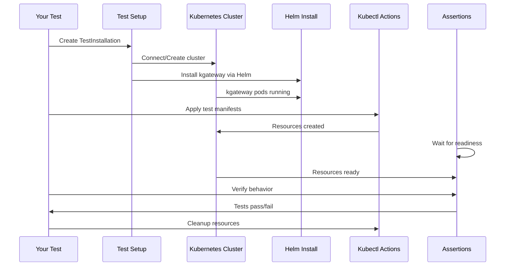

# Chapter 10: E2E Test Framework & Test Utilities

## Transition from Previous Chapter

In [Chapter 9: Gateway Deployer & Provisioning](09_gateway_deployer___provisioning_.md), you learned how kgateway automatically creates and maintains the Kubernetes infrastructure (Deployments, Services, ConfigMaps) needed to run gateway proxies. But here's a critical question: **how do you verify that all this complex machinery actually works in real-world scenarios?** How do you test that when you deploy a Gateway, the correct configuration actually flows through the entire system—from your Kubernetes manifests, through the translation pipeline, to the Envoy proxies, and finally results in traffic being routed correctly?

This is where the **E2E Test Framework & Test Utilities** comes in—it's the comprehensive testing infrastructure that ensures all these systems work together correctly in realistic environments.

## What Problem Does This Solve?

Imagine you've built a gateway with complex policies and backends:

```yaml
apiVersion: gateway.networking.k8s.io/v1
kind: Gateway
metadata:
  name: complex-gateway
spec:
  listeners:
    - port: 80
      protocol: HTTP
---
apiVersion: gateway.networking.k8s.io/v1
kind: HTTPRoute
metadata:
  name: complex-route
spec:
  rules:
    - matches:
        - path: /api
      backendRefs:
        - name: backend-service
          port: 8080
---
apiVersion: gateway.kgateway.dev/v1alpha1
kind: TrafficPolicy
metadata:
  name: rate-limit
spec:
  targetRefs:
    - kind: HTTPRoute
      name: complex-route
  rateLimit:
    local:
      tokenBucket:
        maxTokens: 100
```

**The problem:** You need to verify:
- ❌ Does the Gateway Deployer correctly create a Deployment?
- ❌ Does the translation pipeline properly apply the rate limiting policy?
- ❌ Do Envoy proxies receive the correct xDS configuration?
- ❌ Do requests actually route correctly with rate limiting enforced?
- ❌ Does status reporting accurately reflect whether things are working?

**Without comprehensive testing infrastructure**, you'd have to:
- Manually create a Kubernetes cluster
- Deploy kgateway by hand
- Create test resources
- Manually curl endpoints to verify behavior
- Check logs to see if things worked
- Repeat this for every change (tedious!)

**The E2E Test Framework solves this** by:
1. **Automating cluster setup** - Spin up test Kubernetes clusters automatically
2. **Deploying manifests** - Apply test resources automatically
3. **Waiting for readiness** - Ensure resources are actually created before testing
4. **Validating responses** - Automatically check if traffic behaves correctly
5. **Asserting on status** - Verify that status conditions are accurate
6. **Comparing golden files** - Ensure xDS output matches expected translations
7. **Cleaning up automatically** - Remove resources after tests

Think of it like a **"comprehensive test harness"** that handles all the tedious infrastructure setup so you can focus on verifying behavior.

## Key Concepts

### 1. **What is E2E Testing?**

**E2E (End-to-End) Testing** means testing the entire system from start to finish, not just individual pieces. It's like testing a restaurant by ordering food and eating it, rather than just testing that individual kitchen appliances work.

```
Unit Testing:
├─ Test: Does translator.TranslateRoute() work?
└─ Scope: Single function

E2E Testing:
├─ Test: Does a complete gateway work?
├─ Scope: User creates Gateway → Deployer creates infrastructure → 
│         Translation creates xDS → Proxies receive config → 
│         Traffic routes correctly
└─ Verification: Everything works together!
```

### 2. **Test Suites: Organized Testing**

A **test suite** is a collection of related tests grouped together. kgateway uses suites to organize tests by functionality:

```go
type BaseTestingSuite struct {
    Ctx              context.Context
    TestInstallation *TestInstallation
    Setup            TestCase    // Setup before all tests
    TestCases        map[string]*TestCase  // Individual tests
}
```

**What this means:** Each test suite can define:
- **Setup** - Common resources created once for all tests
- **Individual tests** - Specific test cases with unique resources
- **Teardown** - Cleanup after tests complete

### 3. **Test Installation: The Full Environment**

A **TestInstallation** represents a complete, deployed kgateway environment:

```go
type TestInstallation struct {
    RuntimeContext testruntime.Context  // Test runtime config
    ClusterContext *cluster.Context     // Kubernetes cluster
    Metadata       *install.Context     // Installation config
    Actions        *actions.Provider    // Do things (kubectl, helm)
    Assertions     *assertions.Provider // Check results
}
```

**What this means:** A TestInstallation is like a **"complete test environment"** with:
- A real Kubernetes cluster
- kgateway installed
- Tools to deploy resources and verify behavior

### 4. **Test Cases: Manifests and Expectations**

A **TestCase** defines what resources to create and what should happen:

```go
type TestCase struct {
    Manifests []string  // YAML files to apply
    ManifestsWithTransform map[string]func(string) string
    manifestResources []client.Object  // Parsed resources
    dynamicResources []client.Object   // Auto-created resources
}
```

**What this means:** For each test:
- Define which manifest files to apply
- Optionally transform manifests before applying
- Automatically track what resources were created
- Wait for them to be ready

### 5. **Three Types of Testing**

kgateway uses three complementary testing approaches:

**Type 1: Translation Tests** (Fastest)
- Test the translation pipeline in isolation
- Input: Kubernetes manifests
- Output: xDS configuration (compared to golden files)
- No actual cluster needed

**Type 2: Unit Tests** (Fast)
- Test individual components (collections, policies, backends)
- Verify business logic
- Mocked dependencies

**Type 3: E2E Tests** (Slowest but most realistic)
- Test complete system with real cluster
- Deploy real Envoy proxies
- Verify actual traffic routing
- Catch integration issues

## How to Use It: Solving Our Use Case

Let's solve the concrete use case: testing that the complex gateway works end-to-end.

### Step 1: Create a Test Case with Your Manifests

```go
setupCase := base.TestCase{
    Manifests: []string{
        "test-fixtures/complex-gateway.yaml",
        "test-fixtures/complex-route.yaml",
        "test-fixtures/rate-limit-policy.yaml",
    },
}
```

**What happens:** This defines a test case that will deploy three manifests.

### Step 2: Create a Test Suite

```go
type ComplexGatewayTestSuite struct {
    *base.BaseTestingSuite
}

testCases := map[string]*base.TestCase{
    "TestGatewayDeploys": &setupCase,
    "TestRateLimitingWorks": &setupCase,
}

suite := base.NewBaseTestingSuite(
    ctx, testInstallation, setupCase, testCases)
```

**What happens:** This creates a suite that will:
1. Deploy setup manifests (gateway, routes, policies)
2. Run individual tests with those resources

### Step 3: Write a Test Function

```go
func (s *ComplexGatewayTestSuite) TestRateLimitingWorks() {
    // Resources are already deployed!
    // Verify that rate limiting is working
    s.TestInstallation.Assertions.EventuallyHttpResponse(
        ctx,
        "http://gateway-service/api",
        "should enforce rate limit",
    )
}
```

**What happens:**
- Setup manifests are automatically applied
- Test runs
- Framework waits for resources to be ready
- Test makes assertions
- Cleanup happens automatically

### Step 4: Run the Suite

```bash
go test -run TestComplexGatewayTestSuite ./test/kubernetes/e2e/tests/...
```

**What happens:**
1. Test framework creates a Kubernetes cluster (or uses existing)
2. Deploys kgateway via Helm
3. Applies test manifests
4. Waits for all resources to be ready
5. Runs tests
6. Validates assertions
7. Cleans up

**Result:** Complete end-to-end verification!

## Internal Implementation

### High-Level Flow: How E2E Tests Work

Here's what happens when you run an E2E test:



### Stage 1: Initialize Test Environment

When a test starts, the framework initializes everything. From `test.go`:

```go
testInst := CreateTestInstallation(t, installContext)
testInst.InstallKgatewayFromLocalChart(ctx)
```

**What happens:**
1. Creates a TestInstallation (connects to cluster)
2. Installs kgateway via Helm chart
3. Waits for installation to succeed

### Stage 2: Parse Manifests and Track Resources

When you call `ApplyManifests`, the suite parses YAML files. From `base_suite.go`:

```go
s.loadManifestResources(testCase)
s.TestInstallation.Assertions.EventuallyObjectsExist(
    s.Ctx, testCase.manifestResources...)
```

**What this does:**
1. Reads YAML files specified in TestCase
2. Parses them into Kubernetes objects
3. Applies them via kubectl
4. Waits until they exist in the cluster

### Stage 3: Handle Dynamic Resources

For Gateways, the Deployer creates infrastructure automatically. The framework tracks this:

```go
s.loadDynamicResources(testCase)
if !selfManaged {
    proxyResources := []client.Object{
        &appsv1.Deployment{...},
        &corev1.Service{...},
    }
}
```

**What this does:**
- Detects which Gateways are self-managed vs. auto-provisioned
- If auto-provisioned, adds expected Deployment and Service to "things to wait for"
- Later waits for these dynamic resources to be ready

### Stage 4: Wait for Pods Ready

Critical step: wait for pods to actually start before running tests.

```go
s.TestInstallation.Assertions.EventuallyPodsRunning(
    s.Ctx, ns, metav1.ListOptions{
        LabelSelector: fmt.Sprintf("%s=%s", 
            defaults.WellKnownAppLabel, name),
    }, time.Second*60, time.Second*2)
```

**What this does:**
- Queries for pods with specific labels
- Waits up to 60 seconds for them to reach "Running" state
- Checks every 2 seconds
- If pods don't become ready, test fails (timeout)

### Stage 5: Run Test

Now that everything is ready, your test runs:

```go
func (s *Suite) TestMyGateway() {
    // All resources from Setup + TestCase are deployed!
    // Write your test logic here
}
```

**What happens:**
- Setup manifests are deployed
- Dynamic resources created by Deployer are ready
- Pods are running
- You can now verify behavior

### Stage 6: Cleanup

After test completes, cleanup happens automatically. From `base_suite.go`:

```go
func (s *BaseTestingSuite) AfterTest(...) {
    s.DeleteManifests(testCase)
}
```

**What this does:**
1. Deletes all test-specific manifests
2. Waits for resources to be deleted
3. Ensures no leftover state

## Deep Dive: Translation Testing with Golden Files

For testing just the translation pipeline (without a full cluster), kgateway uses **golden file testing**. From `translator/test.go`:

```go
func TestTranslation(t *testing.T, ctx context.Context,
    inputFiles []string,
    outputFile string,  // Expected xDS
    gwNN types.NamespacedName,
) {
    // Translate gateways from input files
    results, err := tc.Run(t, ctx, scheme, ...)
    result := results[gwNN]
    
    // Compare actual xDS to golden file
    gotProxy, err := compareProxy(outputFile, result.Proxy)
}
```

**What this does:**
1. Loads YAML manifests (Gateways, Routes, Policies, etc.)
2. Runs translation pipeline
3. Gets xDS output
4. Compares to golden file (expected output)
5. If different: test fails with diff

This is **much faster** than E2E tests because there's no cluster involved:

```bash
Translation Test:  10ms ✅ Fast!
E2E Test:         30 seconds ⏱️ Slower but more realistic
```

### Golden Files: The Expected Output

A golden file is just the expected xDS output saved as YAML:

```yaml
Listeners:
  - Name: listener-http
    Address: 0.0.0.0:80
Routes:
  - Name: route-my-route
    VirtualHosts:
      - Domains: "*"
        Routes:
          - Match:
              Prefix: /api
            Route:
              Cluster: default_api-service_8080
Clusters:
  - Name: default_api-service_8080
    Endpoints:
      - Address: 10.0.0.1
        Port: 8080
```

When you run the translation test:
1. Generates actual xDS
2. Compares to this golden file
3. If they match: ✅ Test passes
4. If they differ: ❌ Test fails with diff

**Updating golden files:** Use `REFRESH_GOLDEN=true` to regenerate:

```bash
REFRESH_GOLDEN=true go test ./test/translator/...
```

## Real-World Example: Complete E2E Test

Let's trace one complete E2E test from start to finish.

**Test Setup:**
```go
type GatewayRoutingTestSuite struct {
    *base.BaseTestingSuite
}

func (s *GatewayRoutingTestSuite) TestHTTPRouting() {
    // Test that HTTP traffic routes correctly
}
```

**What happens step-by-step:**

1. **Initialize:**
   - Create TestInstallation
   - Deploy kgateway

2. **Setup Phase (BeforeSuite):**
   - Apply setup manifests (gateway, basic routes)
   - Wait for Deployment created by Deployer
   - Wait for pods to be Running

3. **Test Specific Phase (BeforeTest):**
   - Apply test-specific manifests
   - Wait for test resources

4. **Test Runs:**
   - Make HTTP request to gateway service
   - Verify response comes from backend
   - Verify status conditions are correct

5. **Cleanup Phase (AfterTest):**
   - Delete test manifests
   - Wait for deletion

6. **Final Cleanup (AfterSuite):**
   - Delete setup manifests

**Result:** Complete verification that routing works!

## Common Test Utilities

### Utility 1: Waiting for Objects

```go
s.TestInstallation.Assertions.EventuallyObjectsExist(
    ctx, deployments, services)
```

**What this does:** Waits for objects to exist with timeout.

### Utility 2: Checking Pod Status

```go
s.TestInstallation.Assertions.EventuallyPodsRunning(
    ctx, namespace, labelSelector, 60*time.Second, 2*time.Second)
```

**What this does:** Waits for pods matching labels to be Running.

### Utility 3: HTTP Response Validation

```go
s.TestInstallation.Assertions.EventuallyHttpResponse(
    ctx, url, expectedStatus)
```

**What this does:** Makes HTTP request and verifies response.

### Utility 4: Status Condition Checking

```go
status := reportsMap.BuildGWStatus(ctx, gw, nil)
for _, c := range status.Conditions {
    if c.Status != metav1.ConditionTrue {
        return fmt.Errorf("condition not true: %v", c)
    }
}
```

**What this does:** Verifies that status conditions are accurate.

## Testing Strategy: When to Use Which

**Use Translation Tests when:**
- ✅ Testing translation logic (IR → xDS)
- ✅ Testing policies application
- ✅ Fast iteration needed
- ✅ No cluster interaction needed

**Use Unit Tests when:**
- ✅ Testing individual components
- ✅ Testing business logic
- ✅ Need to mock dependencies

**Use E2E Tests when:**
- ✅ Need to verify end-to-end behavior
- ✅ Testing infrastructure provisioning
- ✅ Testing actual traffic routing
- ✅ Need realistic environment

**Testing Pyramid (ideally):**
```
      ↑ (Slow)
      │
      ├─ E2E Tests (few, comprehensive)
      │
      ├─ Integration Tests (some)
      │
      └─ Unit Tests (many, fast)
      ↓ (Fast)
```

## Conclusion

The **E2E Test Framework & Test Utilities** completes the kgateway story by providing comprehensive testing infrastructure that ensures all the complex systems work together correctly. It:

1. **Automates** cluster setup and Helm installations
2. **Manages** test manifests and resource lifecycles
3. **Validates** that resources are created and ready
4. **Asserts** on behavior and status conditions
5. **Compares** xDS output against golden files for regression testing
6. **Cleans up** automatically to prevent test pollution

Think of it as the **"quality assurance department"** that ensures every piece of kgateway machinery works correctly both individually (translation tests) and together (E2E tests).

---

## Congratulations! 🎉

You've completed the full kgateway tutorial! You now understand:

1. **Gateway Controller & Setup** - How kgateway initializes and orchestrates all components
2. **KRT Collections & Resource Tracking** - How resources are tracked and indexed efficiently
3. **Translation Pipeline (IR & xDS)** - How Kubernetes resources become Envoy configurations
4. **Policy System** - How policies customize traffic behavior
5. **Backend System (Multi-Provider)** - How different backend types are abstracted uniformly
6. **Plugin Architecture** - How to extend kgateway with custom functionality
7. **xDS Distribution & Proxy Syncer** - How configurations reach Envoy proxies
8. **Agent Gateway Translation** - How specialized workloads like AI are handled
9. **Gateway Deployer & Provisioning** - How infrastructure is automatically created
10. **E2E Test Framework** - How everything is tested comprehensively

You now have a complete mental model of how kgateway works from top to bottom. Whether you're deploying gateways, writing policies, contributing plugins, or testing changes, you understand the full system! 🚀

---

Generated by [AI Codebase Knowledge Builder](https://github.com/The-Pocket/Tutorial-Codebase-Knowledge)