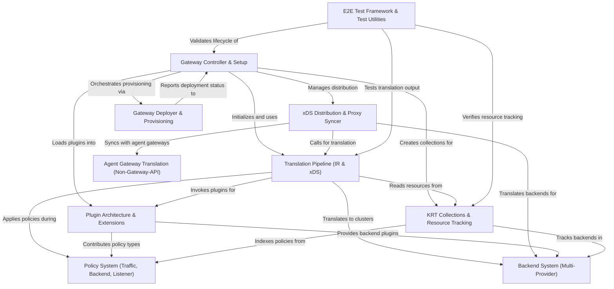

# Tutorial: kgateway

**kgateway** is a Kubernetes-native gateway control plane that translates **Gateway API resources** (like Gateways, HTTPRoutes, and Policies) into **Envoy xDS configurations** for proxy deployment and management. It operates as a comprehensive orchestration system that monitors Kubernetes resources, applies traffic policies, manages multiple backend types (Kubernetes Services, AWS Lambda, AI models, etc.), and distributes dynamic configurations to proxy instances in real-time. The system supports both traditional Envoy-based gateways and AI-powered agent gateways, with a pluggable architecture enabling custom extensions and policies at various stages of translation and execution.

**Source Repository:** [None](None)

## Chapters

1. [Gateway Controller & Setup
](01_gateway_controller___setup_.md)
2. [KRT Collections & Resource Tracking
](02_krt_collections___resource_tracking_.md)
3. [Translation Pipeline (IR & xDS)
](03_translation_pipeline__ir___xds__.md)
4. [Policy System (Traffic, Backend, Listener)
](04_policy_system__traffic__backend__listener__.md)
5. [Backend System (Multi-Provider)
](05_backend_system__multi_provider__.md)
6. [Plugin Architecture & Extensions
](06_plugin_architecture___extensions_.md)
7. [xDS Distribution & Proxy Syncer
](07_xds_distribution___proxy_syncer_.md)
8. [Agent Gateway Translation (Non-Gateway-API)
](08_agent_gateway_translation__non_gateway_api__.md)
9. [Gateway Deployer & Provisioning
](09_gateway_deployer___provisioning_.md)
10. [E2E Test Framework & Test Utilities
](10_e2e_test_framework___test_utilities_.md)

---

Generated by [AI Codebase Knowledge Builder](https://github.com/The-Pocket/Tutorial-Codebase-Knowledge)