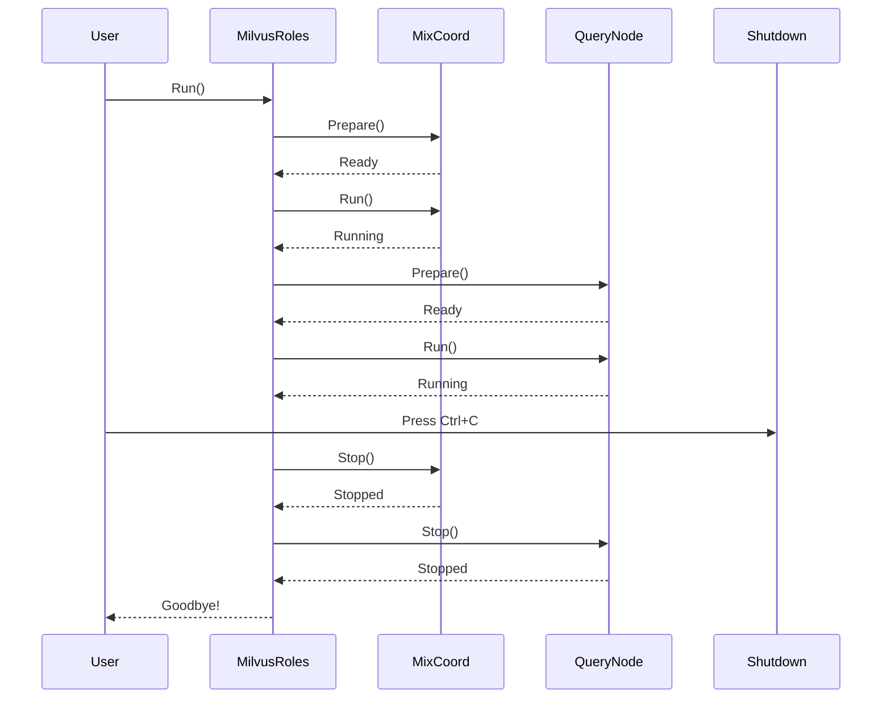

# Chapter 1: Component Architecture & Lifecycle Management

## The Problem: Managing a Complex Distributed System

Imagine you're running a large restaurant chain. Each location (kitchen, cashier, delivery) operates independently, but they all need to coordinate. When you open for the day, you need to:

1. **Start everything in the right order** (turn on ovens before taking orders)
2. **Keep track of what's running** (know if the kitchen is busy or broken)
3. **Stop everything gracefully** (don't lose orders when closing)
4. **Handle emergencies** (if the kitchen breaks, inform customers)

Milvus faces the exact same challenges! It's a distributed database with many independent components (Proxy for handling requests, DataNode for storing data, QueryNode for searching, etc.) that need careful orchestration. This chapter teaches you how Milvus manages this complexity through its **Component Architecture & Lifecycle Management** system.

## Key Concept: What is a Component?

A **component** in Milvus is any major service that handles a specific responsibility:

- **Proxy**: The "front desk" that receives client requests
- **MixCoord**: The "manager" that orchestrates everything
- **QueryNode**: The "search specialist" that finds data
- **DataNode**: The "warehouse" that stores data
- **StreamingNode**: The "message broker" for events

Each component has the same lifecycle: **Prepare → Run → Stop**.

## Understanding the Lifecycle

Think of starting a car:

```
PREPARE: Check fuel, oil, battery (setup phase)
   ↓
RUN: Engine starts, car drives (operational phase)
   ↓
STOP: Engine stops, car parks (shutdown phase)
```

In Milvus, each component follows this pattern:

```go
// Prepare: Initialize resources, check configuration
err := component.Prepare()

// Run: Start the service and keep it running
err := component.Run()

// Stop: Clean up gracefully
err := component.Stop()
```

Each step must complete successfully before the next one begins.

## Your First Use Case: Starting Milvus

Let's say you want to start Milvus with both a Proxy and QueryNode for searching data. Here's what you need to do:

**Goal**: Start the system, ensure all components are healthy, then gracefully shut down when you press Ctrl+C.

### Step 1: Define Which Components to Enable

```go
roles := &MilvusRoles{
    EnableProxy:     true,
    EnableQueryNode: true,
    EnableMixCoord:  true,
    Local:           false,
}
```

This tells Milvus: "I want to run Proxy, QueryNode, and MixCoord components."

### Step 2: Run the Components

```go
roles.Run()  // This starts everything!
```

That's it! Internally, Milvus handles all the complexity. Let's see what happens inside.

## How It Works Internally

When you call `roles.Run()`, Milvus orchestrates a complex dance of startup and shutdown procedures. Here's the sequence:



**What happens step-by-step:**

1. **Signal Handler Setup**: Listen for Ctrl+C (SIGTERM)
2. **Prepare Phase**: Each component initializes (creates connections, allocates memory)
3. **Run Phase**: Each component starts its main loop (listens for requests)
4. **Healthy Check**: System verifies all components are responding correctly
5. **Signal Reception**: User presses Ctrl+C
6. **Graceful Shutdown**: Stop coordinators first, then nodes, then proxy
7. **Cleanup**: Close database connections, release resources

## Code Deep Dive: Let's See How It Works

### Looking at MilvusRoles - The Orchestrator

```go
// From cmd/roles/roles.go
type MilvusRoles struct {
    EnableProxy     bool
    EnableMixCoord  bool
    EnableQueryNode bool
    // ... other components
    closed chan struct{}
}
```

This struct tracks which components should be enabled. The `closed` channel is used for shutdown signaling (like a bell that rings when it's time to stop).

### The Component Interface - A Standard Contract

Every component must follow the same pattern:

```go
type component interface {
    Prepare() error  // Initialize resources
    Run() error      // Start service
    Stop() error     // Shutdown gracefully
    Health(ctx context.Context) StateCode  // Check if healthy
}
```

It's like a contract: "If you want to be a Milvus component, you MUST implement these 4 methods."

### Preparing a Component - Let's Look at Proxy

```go
// From cmd/components/proxy.go
func (n *Proxy) Prepare() error {
    indexparamcheck.ValidateParamTable()
    return n.svr.Prepare()
}
```

The Proxy's `Prepare()` does two things:
1. Validates that index parameters are correct
2. Calls the internal server's prepare method

This happens BEFORE accepting any client requests.

### Running a Component

```go
// From cmd/components/query_node.go
func (q *QueryNode) Run() error {
    if err := q.svr.Run(); err != nil {
        log.Ctx(q.ctx).Error("QueryNode starts error", zap.Error(err))
        return err
    }
    log.Ctx(q.ctx).Info("QueryNode successfully started")
    return nil
}
```

Once `Run()` is called, the component:
1. Starts listening for incoming requests
2. Begins its main event loop
3. This blocks until `Stop()` is called

### Stopping a Component - Graceful Shutdown

```go
// From cmd/components/data_node.go
func (d *DataNode) Stop() error {
    timeout := paramtable.Get().DataNodeCfg.GracefulStopTimeout.GetAsDuration(time.Second)
    return exitWhenStopTimeout(d.svr.Stop, timeout)
}
```

Notice the `timeout`? This is important:
- Try to stop gracefully and wait for resources to clean up
- If stopping takes too long, force stop anyway
- This prevents the system from hanging forever

Think of it like turning off a server that's processing a request: give it a few seconds to finish, but don't wait forever.

### Health Checks - Is Everything OK?

```go
// From cmd/components/mix_coord.go
func (rc *MixCoord) Health(ctx context.Context) commonpb.StateCode {
    resp, err := rc.svr.GetComponentStates(ctx, &milvuspb.GetComponentStatesRequest{})
    if err != nil {
        return commonpb.StateCode_Abnormal
    }
    return resp.State.GetStateCode()
}
```

This asks the component: "Are you healthy?" Components can respond with:
- `Healthy`: Everything is working perfectly
- `StandBy`: Component is active but in standby mode (useful for coordinators)
- `Abnormal`: Something is wrong

## Signal Handling - Listening for Shutdown Requests

Here's how Milvus listens for Ctrl+C:

```go
// From cmd/roles/roles.go
func (mr *MilvusRoles) handleSignals() func() {
    sc := make(chan os.Signal, 1)
    signal.Notify(sc, syscall.SIGINT, syscall.SIGTERM)
    
    go func() {
        sig := <-sc
        log.Warn("Get signal to exit", zap.String("signal", sig.String()))
        mr.once.Do(func() {
            close(mr.closed)  // Ring the bell!
        })
    }()
    return func() { /* cleanup */ }
}
```

When Ctrl+C is pressed:
1. The operating system sends a signal (SIGINT)
2. Go's signal package receives it
3. The channel `sc` gets the signal
4. We close the `mr.closed` channel (waking up any goroutines waiting for it)
5. The shutdown sequence begins

### The Shutdown Sequence - Order Matters!

```go
// Coordinators stop first (they tell nodes what to do)
coordinators := []component{mixCoord}
for _, coord := range coordinators {
    coord.Stop()  // Gracefully shut down
}

// Then nodes stop (they clean up their work)
nodes := []component{streamingNode, queryNode, dataNode}
for _, node := range nodes {
    node.Stop()
}

// Finally, the proxy stops (no more requests accepted)
if proxy != nil {
    proxy.Stop()
}
```

**Why this order?**
- **Coordinators first**: They need to tell nodes to stop accepting work
- **Nodes second**: They stop processing but finish current work
- **Proxy last**: Already no clients can reach it once coordinators are gone

It's like shutting down a restaurant: tell the kitchen to stop accepting orders, let them finish current dishes, then close the front desk.

## Understanding Component States

Each component has a state that changes over time:

```
┌─────────────────────────────────────┐
│     Component Lifecycle States      │
├─────────────────────────────────────┤
│ Created → Prepared → Running        │
│                        ↓            │
│                  ↑ ← ─ Stopped      │
│                                     │
└─────────────────────────────────────┘
```

- **Created**: Component object exists, but not initialized
- **Prepared**: Resources allocated, ready to start
- **Running**: Actively handling requests
- **Stopped**: Shut down, resources released

The `Health()` method returns the **current state** so other parts of Milvus know what's happening.

## Practical Example: The Complete Startup

Let's trace what happens when you run:

```bash
./milvus run standalone
```

1. **Entry Point** (`cmd/main.go`): Decides to run Milvus or as subprocess
2. **Role Selection**: Determines which components to enable
3. **MilvusRoles.Run()** starts:
   - Sets up signal handlers (listening for Ctrl+C)
   - Creates MixCoord, calls `Prepare()` then `Run()`
   - Creates QueryNode, calls `Prepare()` then `Run()`
   - Creates Proxy, calls `Prepare()` then `Run()`
4. **All components are now running**: They listen for requests
5. **User presses Ctrl+C**: Signal received
6. **Graceful shutdown**: Coordinators → Nodes → Proxy
7. **Program exits**

## Key Takeaways

| Concept | Meaning |
|---------|---------|
| **Component** | A major service in Milvus (Proxy, QueryNode, etc.) |
| **Lifecycle** | Prepare → Run → Stop phases |
| **Health Check** | Verifies components are working correctly |
| **Graceful Shutdown** | Stop in the right order, wait for cleanup |
| **Signal Handling** | Respond to OS signals (Ctrl+C) properly |

## Summary

The Component Architecture & Lifecycle Management system is Milvus's answer to a fundamental problem: **How do you start, monitor, and stop a complex distributed system reliably?**

By standardizing how components behave (same Prepare/Run/Stop pattern), Milvus makes it easy to add new components without breaking the system. Each component can focus on its own job (being a QueryNode, storing data, etc.) while the lifecycle manager handles orchestration.

You've learned:
- ✅ Why component lifecycle management is needed
- ✅ The four phases every component goes through
- ✅ How components report their health
- ✅ How Milvus shuts down gracefully
- ✅ Why shutdown order matters

Next, components need to be **configured** before they start. Learn how Milvus handles configuration in [Configuration Management System](02_configuration_management_system_.md), where we'll explore how parameters are loaded, validated, and watched for changes!

---

Generated by [AI Codebase Knowledge Builder](https://github.com/The-Pocket/Tutorial-Codebase-Knowledge)