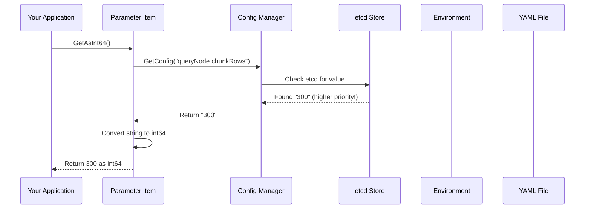
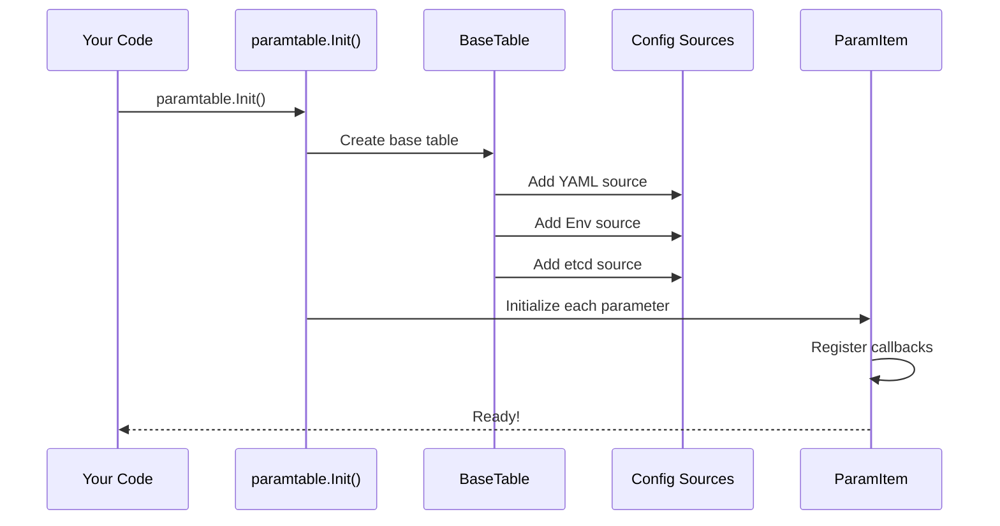

# Chapter 2: Configuration Management System

In [Chapter 1: Component Architecture & Lifecycle Management](01_component_architecture___lifecycle_management_.md), we learned how Milvus orchestrates its components through a standardized lifecycle (Prepare → Run → Stop). But before any component can start, it needs to know **how** to behave. Should it use 100 threads or 1000? Store data locally or on a remote server? These questions are answered by **configuration**.

## The Problem: Managing Hundreds of Settings

Imagine you're running the Milvus restaurant chain again. Every day, the manager gets a stack of papers with instructions:

- How many kitchen workers to hire today?
- Which supplier should we use for ingredients?
- What's the maximum temperature for the oven?
- Should we enable the backup freezer?

These instructions come from different sources:
- **Corporate handbook** (YAML file with defaults)
- **Daily memo** (environment variables for today's override)
- **Real-time text messages** (etcd for live updates during the day)

The manager needs to:
1. **Read** from all sources in the right priority
2. **Validate** the settings (can't have 0 workers or 10,000°C oven)
3. **Track changes** so workers get updated when settings change
4. **Start components** with the right settings
5. **Update running components** if settings change

This is exactly what **Milvus Configuration Management System** does for the database!

## Key Concept: What is a Parameter?

A **parameter** (or configuration item) is a single setting that controls behavior. Think of it as:

```
Parameter Name: "queryNode.chunkRows"
Default Value: "128"
Current Value: "256"  (overridden by user)
Type: Integer
```

Each parameter has:
- **Key**: Its unique name (like `queryNode.chunkRows`)
- **Default Value**: What we use if nothing else is specified
- **Current Value**: The actual value being used right now
- **Type**: How to interpret it (string, number, boolean, etc.)

## The Configuration Hierarchy: Which Source Wins?

When a parameter is requested, Milvus checks multiple sources in order of priority:

```
Priority (Highest to Lowest):
1. Temporary Override (for testing)
2. etcd (distributed config store - live updates!)
3. Environment Variables (set when starting the process)
4. YAML File (persistent configuration file)
5. Default Value (built-in fallback)
```

Think of it like a restaurant chain's decision hierarchy:

```
"What's today's special?"
  ↓
Check if manager sent a text message (etcd) → Use that
  ↓
Check if district manager set an env variable → Use that
  ↓
Check the handbook (YAML) → Use that
  ↓
Use the standard (Default) → Use that
```

Whichever source comes first is what wins!

## Your First Use Case: Loading and Using Configuration

**Goal**: Start Milvus with custom parameters from a YAML file, then update them at runtime without restarting.

### Step 1: Create a Configuration File

```yaml
# milvus.yaml
queryNode:
  chunkRows: 256
  gracefulStopTimeout: 100
proxy:
  maxNameLength: 256
```

This is like the corporate handbook - defaults for the entire company.

### Step 2: Load Configuration in Your Application

```go
import "github.com/milvus-io/milvus/pkg/v2/util/paramtable"

// Initialize the configuration system
paramtable.Init()

// Get the parameter manager
params := paramtable.Get()
```

Now the system has loaded all your settings from YAML, environment variables, and etcd.

### Step 3: Access a Parameter

```go
// Get the value of queryNode.chunkRows
chunkRows := params.QueryNodeCfg.ChunkRows.GetAsInt64()
// Result: 256 (from YAML file)

fmt.Println(chunkRows)  // Prints: 256
```

### Step 4: Watch for Changes

If someone updates the config in etcd (the live config store), Milvus can react automatically:

```go
// Register a callback when queryNode.chunkRows changes
params.QueryNodeCfg.ChunkRows.RegisterCallback(func(
    ctx context.Context, key, oldValue, newValue string,
) error {
    log.Info("Chunk rows changed", 
        zap.String("old", oldValue),
        zap.String("new", newValue))
    return nil  // Handle the change
})
```

When someone changes this parameter in etcd, Milvus automatically calls this function!

## How It Works Internally

Let's trace what happens when you call `params.QueryNodeCfg.ChunkRows.GetAsInt64()`:



**The priority check happens automatically:**
1. Manager checks etcd first
2. If not found, checks environment variables
3. If not found, checks YAML file
4. If not found, uses default value
5. Returns the first match

This is transparent to your code - you just call `GetAsInt64()` and it handles all the complexity!

## Understanding the Parameter Types

Milvus has three main parameter structures:

### 1. Single Parameters (ParamItem)

A single configuration value:

```go
type ParamItem struct {
    Key          string  // "queryNode.chunkRows"
    DefaultValue string  // "128"
    Doc          string  // "Rows per chunk for search"
}

// Usage:
value := param.GetAsInt64()    // Get as integer
```

### 2. Parameter Groups (ParamGroup)

A collection of related parameters with a prefix:

```go
type ParamGroup struct {
    KeyPrefix string  // "credentials.apikey."
    GetFunc   func() map[string]string
}

// If you have multiple credentials in etcd:
// credentials.apikey.key1 = "value1"
// credentials.apikey.key2 = "value2"
// GetFunc returns them all as a map
```

### 3. Component Parameters (ComponentParam)

All parameters organized by component:

```go
type ComponentParam struct {
    CommonCfg    CommonConfig
    ProxyCfg     ProxyConfig
    QueryNodeCfg QueryNodeConfig
    DataNodeCfg  DataNodeConfig
    // ... more components
}
```

It's like organizing the restaurant handbook by department: kitchen section, cashier section, delivery section, etc.

## The Parameter Initialization Flow

When you call `paramtable.Init()`, here's what happens behind the scenes:



**Step-by-step:**
1. Create a base configuration manager
2. Add all configuration sources (YAML, env vars, etcd)
3. For each parameter, set up event handlers for changes
4. Ready to serve configuration values

## Code Deep Dive: How Parameters Work

### Reading a Parameter Value

```go
// From pkg/util/paramtable/param_item.go
func (pi *ParamItem) GetAsInt64() int64 {
    val := pi.GetValue()  // Get string value
    intVal := getAsInt64(val)  // Convert to int64
    return intVal
}
```

Simple! Get the string, convert it, return it. The "getting string value" part handles all the priority logic.

### What GetValue() Actually Does

```go
// Simplified version
func (pi *ParamItem) GetValue() string {
    // 1. Check if there's a temporary override (for testing)
    if temp := pi.tempValue.Load(); temp != nil {
        return *temp
    }
    
    // 2. Ask the config manager for the value
    // (It checks etcd → env → YAML → default)
    val, _ := pi.manager.GetConfig(pi.Key)
    return val
}
```

The `manager` handles all the priority logic. It automatically checks sources in order!

### Handling Configuration Changes from etcd

```go
// From pkg/util/paramtable/param_item.go
func (pi *ParamItem) handleConfigChange(event *config.Event) {
    if pi.callback == nil {
        return  // No one is listening
    }
    
    oldValue := pi.lastValue.Load()
    newValue := event.Value
    
    // Call the registered callback
    err := pi.callback(context.Background(), pi.Key, oldValue, newValue)
    if err == nil {
        pi.lastValue.Store(&newValue)  // Remember the new value
    }
}
```

When etcd sends an update event, Milvus:
1. Loads the old value from memory
2. Gets the new value from the event
3. Calls all registered callbacks
4. Updates the cached "last value"

This allows components to react in real-time to configuration changes!

## The ConfigManager: Behind the Scenes

The core of the system is the `Manager` in `pkg/config/config.go`:

```go
// Simplified
type Manager struct {
    sources []ConfigSource  // YAML, env, etcd
    cache   map[string]string  // Performance optimization
}

func (m *Manager) GetConfig(key string) (string, error) {
    // Check each source in priority order
    for _, source := range m.sources {
        val, err := source.GetConfig(key)
        if err == nil {
            return val, nil  // Found! Return immediately
        }
    }
    return "", ErrKeyNotFound  // Not found anywhere
}
```

It's like checking the sources in order: "Is the answer in the memo? No? Check the handbook. Still no? Use the default."

## Multiple Configuration Sources in Action

Let's say you want to use both YAML and environment variables:

```go
// Start program with:
// MILVUS_QUERYNODE_CHUNKROWS=512

// milvus.yaml has:
// queryNode:
//   chunkRows: 256

params := paramtable.Get()
value := params.QueryNodeCfg.ChunkRows.GetAsInt64()
// Returns: 512 (from environment variable, higher priority!)
```

**Why the environment variable wins:**
- Environment variable source is checked before YAML source
- Both have the value, but env var comes first in priority

This is useful for overriding settings in specific environments (development, staging, production).

## Parameter Validation: Catching Bad Values

When you read a parameter, conversion happens automatically:

```go
params.Save("queryNode.chunkRows", "not_a_number")
value := params.QueryNodeCfg.ChunkRows.GetAsInt64()
// Conversion fails, returns default: 128
```

If the string can't be converted to the expected type, Milvus:
1. Tries the conversion
2. If it fails, returns the default value
3. Logs a warning

**Some parameters panic if empty:**

```go
type ParamItem struct {
    PanicIfEmpty bool  // If true, GetValue() panics if empty
}

// For critical parameters like IP addresses, 
// this forces an error before the component starts
```

## Practical Example: Updating Configuration at Runtime

Here's how to change a setting without restarting:

**Before:**
```
etcd has: queryNode.maxReceiveChanSize = 10240
The running QueryNode uses 10240
```

**Change it:**
```bash
# Update etcd directly (administrator does this)
etcd put queryNode.maxReceiveChanSize 20480
```

**Automatically happens:**
1. etcd sends an event to all connected Milvus components
2. The ParamItem's callback fires with (old: "10240", new: "20480")
3. QueryNode receives the notification and adjusts its buffer size
4. No restart needed!

This is one of the most powerful features - you can tune a production system while it's running.

## Configuration File Example: Full Structure

```yaml
# YAML provides hierarchical structure
etcd:
  endpoints: 
    - "localhost:2379"

queryNode:
  chunkRows: 128
  gracefulStopTimeout: 100
  
  segcore:
    interimIndex:
      enableIndex: true
      nlist: 128
      nprobe: 16

dataNode:
  maxParallelSyncTaskNum: 10
```

When flattened for lookups:
```
etcd.endpoints = ["localhost:2379"]
queryNode.chunkRows = 128
queryNode.gracefulStopTimeout = 100
queryNode.segcore.interimIndex.enableIndex = true
queryNode.segcore.interimIndex.nlist = 128
```

Each nested level becomes part of the key with dots!

## Common Parameter Types and How to Read Them

```go
// String
maxName := params.ProxyCfg.MaxNameLength.GetValue()

// Integer
maxFieldNum := params.ProxyCfg.MaxFieldNum.GetAsInt()

// Float (for ratios/percentages)
factor := params.QueryCoordCfg.GlobalRowCountFactor.GetAsFloat()

// Boolean
enabled := params.ProxyCfg.MustUsePartitionKey.GetAsBool()

// List (comma-separated)
servers := params.ProxyCfg.SomeField.GetAsStrings()

// Time Duration
timeout := params.ProxyCfg.HealthCheckTimeout.GetAsDuration(time.Second)
```

Each `Get*` method handles the conversion and validation automatically!

## Summary: Configuration Flow

When Milvus starts:

```
1. Load YAML file → Create base configuration
2. Override with environment variables → User can customize per environment
3. Connect to etcd → Enable live updates
4. Each component reads its parameters → Services start with correct settings
5. Parameters can be updated in etcd → Running components react automatically
```

It's like a restaurant that:
- Has a handbook (YAML)
- Lets managers override via messages (env vars)
- Can receive real-time updates via phone (etcd)
- All staff automatically know about changes

## Key Takeaways

| Concept | Meaning |
|---------|---------|
| **Parameter** | A single configuration setting with a key, default, and current value |
| **ParamItem** | Represents one parameter in code |
| **Priority** | etcd > env > YAML > default (first match wins) |
| **Callback** | Function called when a parameter changes |
| **Type Conversion** | Automatic conversion from string to int/bool/float/etc. |
| **ParamGroup** | Collection of related parameters with a common prefix |

---

## Conclusion

The Configuration Management System solves a fundamental challenge: **How do you manage hundreds of settings across a complex distributed system while keeping flexibility and supporting live updates?**

By supporting multiple configuration sources with clear priorities, validating parameters, and enabling reactive updates through callbacks, Milvus can:
- ✅ Load settings from flexible sources
- ✅ Override per environment
- ✅ Update at runtime without restart
- ✅ React to configuration changes automatically
- ✅ Fail fast with invalid values

Now that we understand how to configure individual components, the next step is understanding how these components **communicate**. Learn about message queues and streaming in [Message Queue & Streaming Infrastructure](03_message_queue___streaming_infrastructure_.md)!

---

Generated by [AI Codebase Knowledge Builder](https://github.com/The-Pocket/Tutorial-Codebase-Knowledge)